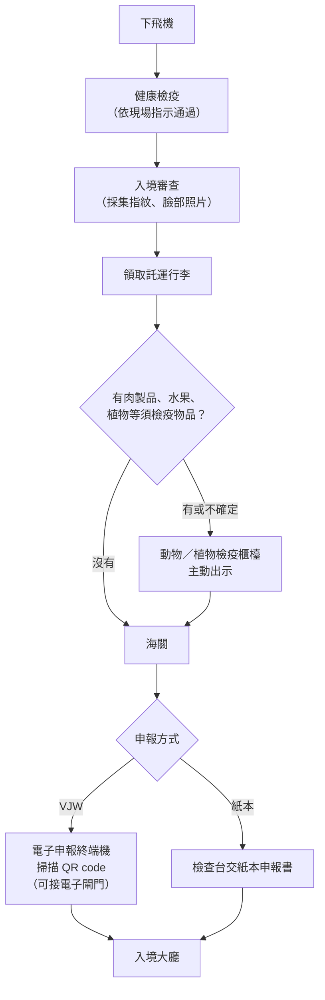

# 07 Visit Japan Web 與機場入境

出發前一週，小林在社群上看到一則廣告：「代辦 Visit Japan Web，30 秒拿到入境 QR code，只要 500 元」。付款頁面還要輸入信用卡號。她想起同事說過 Visit Japan Web 是免費的，於是先停下來，打算查清楚：官方網站在哪裡？不填會怎樣？手機沒電的話又該怎麼辦？

!!! info "本章適用"
    **何時會用到**：出發前 1–2 週準備入境資料，以及飛機落地到走出入境大廳這一段。

    **適用誰**：持台灣護照、以短期停留身分入境日本的旅客，含同行家人。

    **不適用誰**：還不確定自己能不能免簽入境，請先讀 [02 護照、免簽與入境資格](02-passport-visa.md)。行李裡的食品、藥品、現金要不要申報，判斷方法在 [05 藥品與醫療準備](05-medicines.md) 與 [06 食品、植物、現金與其他攜帶品](06-food-cash-goods.md)。本章只處理「怎麼申報、在哪裡辦」。

## Visit Japan Web 是什麼，不是什麼

Visit Japan Web（以下簡稱 VJW）是日本**數位廳**提供的網頁服務，用來事先登錄入境審查與海關申報所需資料，抵達時出示畫面上的 QR code 通關。外國旅客在日本免稅購物時也可以使用。

先把三件事分清楚：

- **【法規】申報是義務，VJW 只是其中一種方式。** 日本海關規定所有入境旅客都要申報隨身攜帶品。海關推薦用 VJW 做電子申報，但機上、船上與海關檢查台仍備有紙本申報書。
- **【法規】VJW 免費。** 海關在仿冒網站警告中寫明 VJW 免費使用，入境時的海關手續也不必付錢給海關。數位廳也聲明不會向 VJW 使用者收取任何申請費。
- **【建議】VJW 非強制，但值得先填。** 日本駐外館處的 FAQ 說明 VJW 不是強制使用，但建議事先登錄。先在家裡慢慢填，比落地後站在檢查台前寫紙本從容。

| 項目 | 官方說明 | 本書提醒 |
|---|---|---|
| 主管機關 | 日本數位廳 | 入口只認下一節列出的網址 |
| 費用 | 免費；海關手續不必付費給海關 | 「申報不收費」不等於「攜帶品都免稅」，超過免稅範圍仍要繳稅 |
| 是否強制 | 非強制，紙本申報書仍可使用 | 不用 VJW 也要申報 |
| 登錄需要什麼 | 機票（航班資訊）、護照、電子郵件地址 | 同行家人也要逐人填寫資料 |
| 出示方式 | 可在電腦登錄，但抵達時要用手機或平板出示 QR code | 出發前確認手機電量與畫面能正常開啟 |
| QR code | 2024-01-25 起，入境審查與海關申報合併為同一個 QR code | 系統更新前產生的舊 QR code 不能使用 |

## 出發前的登錄步驟

數位廳的使用說明把流程分成 5 步，出發前完成前 4 步：

1. **建立帳號並登入**：需要電子郵件地址。
2. **登錄使用者資料**：選擇入境類別，登錄護照資料。護照可以用手機鏡頭掃描，也可以手動輸入；掃描失敗時改用手動輸入。其他基本資料可填可不填，填了之後可以帶入後續表單。
3. **登錄入境行程**：填寫航班、抵達日期與在日聯絡資訊（住宿地址），可以沿用已登錄的行程。
4. **填寫入境手續**：在行程頁面點進「入境審查與海關申報」（Immigration clearance and Customs Declaration）填寫。頁面另有「檢疫（健康狀態確認）」問答，會依你的回答提供指引。
5. **抵達時出示 QR code**：詳見下一節的機場流程。

兩個常見疑問：

- **護照效期警告**：VJW 登錄護照時，如果剩餘效期不到六個月，畫面會依剩餘期間跳出警告訊息。**這是系統提醒，不是日本的入境條件。** 日本並沒有「護照須剩六個月」的一般規定，只要求停留期間有效；航空公司與轉機地的要求另外查。完整判斷方法見 [02 護照、免簽與入境資格](02-passport-visa.md)。
- **同行家人**：VJW 可以登錄同行家人，但每個人要各自填寫手續資料。可登錄人數上限、「家人」的範圍，以及非親屬同伴能否登錄，本書查閱時未能以數位廳原文核實，請以 VJW 登入後的畫面或官方聊天機器人（chatbot）回答為準。

!!! warning "申報內容要真實"
    **【法規】** 申報書（不論電子或紙本）要如實填寫攜帶品。VJW 只是把紙本表格搬到網路上，不會替你判斷肉乾、藥品或現金能不能帶。判斷步驟請回到 [06 食品、植物、現金與其他攜帶品](06-food-cash-goods.md)。

## 防仿冒：只從官方入口進入

日本海關與數位廳都發布過仿冒警告，常見手法有三種：

- **假網站收「申請手續費」**：數位廳 2025-06-05 公告，發現要求 VJW 使用者支付申請費的網站，並聲明數位廳從不向使用者收費。
- **代辦 QR code 收費**：日本海關警告，有旅客付錢給號稱能代製 VJW QR code 的網站，或被導向非官方網站並被要求付款、提供個人資料。
- **假 App 要信用卡**：數位廳 2023 年警告，冒充 VJW 的可疑 App（例如名為「Visit Japan Web Info」者）會要求輸入信用卡資料；**VJW 不會要求輸入信用卡資料**。VJW 官方說明也寫明這項服務**不提供任何 App**，下載了可疑 App 應立即刪除。

**【建議】** 用下列方式確認入口：

| 用途 | 官方網址 |
|---|---|
| 服務說明與使用教學（數位廳） | `https://services.digital.go.jp/en/visit-japan-web/` |
| 登入頁面 | `https://www.vjw.digital.go.jp/` |
| 數位廳政策頁（可從這裡點進上述入口） | `https://www.digital.go.jp/policies/visit_japan_web` |

判斷口訣：**要付錢、要信用卡、要你下載 App，就不是官方 VJW。** 搜尋引擎的廣告欄位可能出現仿冒網站，建議把官方網址存成書籤，不要從廣告或陌生訊息的連結進入。如果已經在可疑網站輸入信用卡資料，請立即聯絡發卡銀行。

## 抵達機場：先檢疫、再海關

下飛機後的順序如下。重點是**動植物檢疫在海關之前**：日本海關的旅客通關說明寫明，植物與動物要在海關檢查之前，先交給植物或動物檢疫官員檢查；海關的入境手續概要也把流程列為「到達 → 檢疫 → 入境審查 → 動物檢疫 → 植物檢疫 → 海關檢查 → 入境」。第一站的「檢疫」是健康方面的檢疫，請依現場指示辦理；VJW 的「檢疫（健康狀態確認）」問答對應的就是這一站。

各站要注意的事：

1. **入境審查**：**【法規】** 依入管法第 6 條，申請入境的外國人要以電子方式提供指紋、照片等個人識別資訊；未滿 16 歲者等依法免除。出示護照，並在審查櫃檯出示 VJW 的 QR code（或交紙本入境記錄）。審查官可能詢問旅行目的、停留天數與住宿地點，照實回答即可。
2. **領行李**：確認自己的每一件託運行李。依 VJW 使用說明，**羽田、福岡、那霸機場**可以在等行李時，先用電子申報終端機完成海關電子申報。其他機場的設備請以現場標示為準。
3. **動植物檢疫**：**【法規】** 攜帶肉類、肉製品、水果、植物等，須在海關前到檢疫櫃檯受檢。「真空包裝」「自用」「免稅店買的」都不會自動免除檢疫。不確定時，主動拿去櫃檯問，比藏在行李裡安全。
4. **海關**：用 VJW 的 QR code 在電子申報終端機或檢查台申報；在電子申報終端機完成申報後，可以走電子申報閘門。**【法規】** 攜帶現金等支付工具合計超過等值 100 萬日圓，必須向海關申報。菸酒與其他物品的免稅範圍見 [06 食品、植物、現金與其他攜帶品](06-food-cash-goods.md)。

**【法規】護照要隨身帶。** 走出機場後，短期停留的外國人依法須隨身攜帶護照，入住飯店時也要出示。細節見 [08 住宿與交通的證件和條款](08-stay-transport.md) 與 [09 當地法律、設施規則與禮貌](09-local-rules.md)。

## 沒手機、沒網路、手機沒電：紙本備案

VJW 是網頁服務，入境時要用手機或平板出示 QR code。遇到下列情況，改走紙本流程：

| 狀況 | 怎麼做 | 依據 |
|---|---|---|
| 沒有智慧型手機，或手機沒電 | 海關申報：向空服員索取紙本「攜帶品・別送品申告書」，或在海關檢查台拿取填寫 | **【法規】** 海關說明紙本申報書在機上、船上與海關檢查台提供 |
| 入境記錄沒有用 VJW 登錄 | 向空服員或入境審查區職員索取紙本入境記錄卡填寫 | 本書查閱時未能以入管廳原文核實紙本取得地點，請向航空公司或現場職員詢問 |
| 落地後沒有網路 | 能否離線開啟 QR code，本書查閱時未能以數位廳原文核實；**【建議】** 出發前在有網路時先開啟一次畫面確認，同時準備紙本備案 | 官方離線使用說明頁於查閱日無法開啟 |
| 已登錄 VJW 但手機故障 | 直接改填紙本；VJW 不是強制使用 | 駐外館處 FAQ、海關說明 |
| 小孩或長輩沒有自己的手機 | 以 VJW 的同行家人功能登錄，或每人各填紙本 | 同行家人細節以 VJW 畫面為準 |

**【建議】** 不論有沒有用 VJW，出發前都準備一張紙，寫下住宿名稱、日文地址與電話，以及回程航班。紙本申報書與入境審查都可能用到這些資料，手機沒電時也不會卡住。

!!! tip "截圖能不能用？"
    VJW 使用說明明文寫著，**免稅購物用的 QR code 不能用截圖**（見 [11 日本免稅購物到離境查驗](11-tax-free.md)）。入境審查與海關申報用的 QR code 能否以截圖代替，本書查閱時未能以官方原文核實；請以 VJW 畫面上的說明為準，不要只依賴截圖。

## 無法確定時找誰

| 問題 | 窗口 |
|---|---|
| VJW 操作、帳號、同行家人 | VJW 官方聊天機器人：`https://chatbot.vjw.digital.go.jp/qadialog_webchat/`（由官方服務頁連入） |
| 攜帶品要不要申報、免稅範圍 | 日本海關旅客通關說明，或抵達時直接問海關職員 |
| 肉製品、動物產品 | 農林水產省動物檢疫所 |
| 水果、植物、種子 | 農林水產省植物防疫所 |
| 入境資格、入境記錄 | 出入國在留管理廳 |
| 紙本表格、機上協助 | 搭乘的航空公司 |
| 懷疑遇到仿冒網站並已付款 | 發卡銀行；在日本可撥 JNTO 旅客熱線 050-3816-2787 詢問求助管道 |

## 出發前勾選

- ☐ 只從數位廳官方網址進入 VJW；沒有付任何費用、沒有輸入信用卡號、沒有下載任何「VJW App」。
- ☐ 已完成「入境審查與海關申報」填寫，並確認畫面上顯示的是 2024-01-25 系統更新後的單一 QR code；同行家人每人都有資料。
- ☐ 行李中若有肉製品、水果、植物，已決定落地後先到檢疫櫃檯主動出示。
- ☐ 手機充飽電，並準備寫有住宿日文地址、電話與回程航班的紙本備案。
- ☐ 現金與支付工具合計若超過等值 100 萬日圓，已準備向海關申報。

## 來源與查閱日

| 來源 | 機關 | 本章用途 |
|---|---|---|
| [Visit Japan Web（政策頁）](https://www.digital.go.jp/policies/visit_japan_web) | 日本數位廳 | 服務定位、使用者範圍 |
| [Visit Japan Web 服務說明](https://services.digital.go.jp/en/visit-japan-web/) | 日本數位廳 | 登錄所需資料；電腦登錄、手機出示 |
| [How to use（使用教學）](https://services.digital.go.jp/en/visit-japan-web/guide/) | 日本數位廳 | 登錄步驟、護照效期警告、電子申報終端機、羽田／福岡／那霸等候行李時申報、免稅 QR code 不可截圖 |
| [Unified 2D codes for immigration clearance and customs declarations](https://services.digital.go.jp/en/visit-japan-web/news/20240125-01/) | 日本數位廳 | 2024-01-25 起 QR code 合一、舊 QR code 不可用 |
| [Announcement Concerning Use of Visit Japan Web](https://services.digital.go.jp/en/visit-japan-web/news/20250605-01/) | 日本數位廳 | 2025-06-05 假網站收申請費警告 |
| [Suspicious apps such as "Visit Japan Web Info" were found](https://services.digital.go.jp/en/visit-japan-web/news/20231214-01/) | 日本數位廳 | 服務不提供 App、可疑 App 應刪除 |
| [Alert Regarding Suspicious Information](https://www.digital.go.jp/en/news/6ca8eac4-c6e9-4daf-abec-76cef9fb638b) | 日本數位廳 | VJW 不要求信用卡資料；官方網址 |
| [Beware of Fake Websites Related to Customs Procedures](https://www.customs.go.jp/english/news/20260528e.html) | 日本海關 | 仿冒網站與代製 QR code 收費；VJW 免費 |
| [7101 入国時の税関手続の概要](https://www.customs.go.jp/tetsuzuki/c-answer/keitaibetsuso/7101_jr.htm) | 日本海關 | 入境各站順序；所有入境者提交申報書 |
| [出入国管理及び難民認定法](https://laws.e-gov.go.jp/law/326CO0000000319) | 日本法務省（e-Gov 法令檢索） | 第 6 條個人識別資訊提供義務與未滿 16 歲等例外 |
| [Procedures of Passenger Clearance](https://www.customs.go.jp/english/summary/passenger.htm) | 日本海關 | 所有旅客須申報；紙本申報書取得處；檢疫在海關前；100 萬日圓支付工具申報 |
| [VISA Frequently Asked Questions (FAQ)](https://www.sydney.au.emb-japan.go.jp/document/english/visa_info/FAQ2024.pdf) | 日本駐雪梨總領事館 | VJW 非強制；護照無一律六個月要求 |
| [Bringing animal products into Japan](https://www.maff.go.jp/aqs/english/product/import.html) | 農林水產省動物檢疫所 | 肉製品不因真空、自用而免檢疫 |
| [Regulations when Bringing Plants into Japan](https://www.maff.go.jp/pps/j/introduction/english.html) | 農林水產省植物防疫所 | 植物須在海關前受檢 |
| [日本遊客熱線](https://www.japan.travel/tw/plan/hotline/) | 日本政府觀光局 | 旅客熱線號碼 |

查閱日：2026-09-19。規定可能變動，出發前請回官方頁重查。
