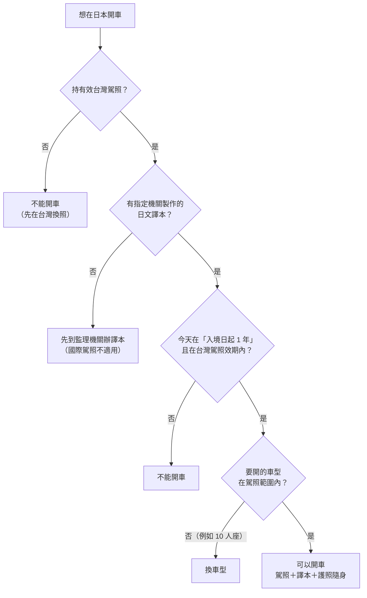

# 10 自駕選讀：台灣駕照與日本道路

阿哲一家四口打算到北海道自駕，小女兒 5 歲。他本來想去監理站辦國際駕照，朋友提醒：「日本不認台灣的國際駕照，要辦日文譯本。」租車網站上還有一台 10 人座廂型車特價，看起來很划算。阿哲開始懷疑：到底要帶哪些文件？10 人座能不能租？萬一出事故又該怎麼辦？

!!! info "本章適用"
    **何時會用到**：決定在日本租車自駕之前，至少出發前 2 週開始準備。

    **適用誰**：持有效台灣駕照、以短期停留身分入境日本、想在日本開車的旅客。本章以小客車為主。

    **不適用誰**：不開車的旅客可跳過本章。持日本駕照或已在日本登錄住民資料的人，適用條件不同，請直接查日本警察廳頁面。騎機車、開大型車或營業用車，本書未展開，請查警察廳與日本台灣交流協會的說明。

## 三件文件，一件都不能少

**【法規】** 台灣駕照持有人在日本短期停留期間開車，須隨身攜帶：

| 文件 | 說明 | 常見錯誤 |
|---|---|---|
| **有效的台灣駕照（正本）** | 在效期內 | 駕照已過期、只帶影本 |
| **該駕照的日文譯本** | 須由日本法令指定的機關製作；台灣方面由「台灣日本關係協會」，實際窗口是交通部公路局各監理機關 | 自行翻譯、找一般翻譯社翻譯 |
| **護照** | 用來證明最近一次入境日本的日期 | 護照放在飯店沒帶 |

**【法規】台灣的國際駕照在日本不能用。** 日本台灣交流協會明確說明，日本不承認台灣核發的國際駕照；日本警察廳也把國際駕照與「外國駕照＋日文譯本」列為兩套不同制度。台灣旅客走的是後者，請不要花時間辦國際駕照來日本用。

## 在台灣辦日文譯本

**【法規】** 辦理窗口是交通部公路局所屬的監理機關：

- **臨櫃**：帶身分證正本、駕照正本到監理所或監理站申請，規費新台幣 **100 元**。
- **線上**：用自然人憑證加入監理服務網會員後線上申請，譯本寄送到府；除規費外**另加郵資**。
- **駕照已過期**：要先換照（交通部 168 交通安全入口網的說明為規費 200 元、需 1 吋照片 2 張），才能申請譯本。

譯本要不要每次重辦？日本台灣交流協會說明，**只要駕照記載內容沒有變更，不需要每次入境日本都重新取得譯本**；但台灣駕照換發後，需要對應新駕照的譯本。

在日本當地也可以申請譯本。日本台灣交流協會列出的日本窗口包括臺北駐日經濟文化代表處、日本汽車聯盟（JAF）等機構；各窗口的費用、時程與所需文件，本書查閱時未逐一核實，請直接查各機構官網。**【建議】** 在台灣辦好最省事，避免落地後才發現來不及。

## 能開多久、能開什麼車

**【法規】可開車期間**：從**入境日本那天起算 1 年**，或**台灣駕照的有效期間**，兩者取較短者。所以要帶護照，讓警察能核對最近一次入境日。台灣駕照若在旅途中到期，到期後就不能開。

舉兩個例子：

- 阿哲 2026-10-01 入境，台灣駕照效期到 2030 年：這趟旅程從入境日起 1 年內都可以開，短期旅遊不會碰到上限。
- 小林 2026-10-01 入境，台灣駕照 2026-10-05 到期：10-05 以後就不能開，即使還在「入境日起 1 年」內也一樣。出發前換好新駕照，並記得新駕照要搭配新的日文譯本。

日本警察廳另說明，在日本登錄住民資料的人若出境未滿 3 個月又回來，回來那天不重新起算 1 年；一般短期觀光旅客不適用這條，但在日本有住所的讀者要另外確認。

**【法規】可開的車型**：以譯本上記載的駕照種類為準。最容易出錯的是廂型車：

- 台灣「小客車」駕照在日本**只能開乘車定員 9 人以下的乘用車**。
- 日本「普通」駕照可以開到 10 人座，但**台灣小客車駕照不能開 10 人座**。租車時看到標示「10 人乗り」的廂型車，就不要訂；訂車前一律確認乘車定員。

**【業者】** 租車公司可能另有自己的條件，例如年齡、持照年資、只接受特定證件或要求信用卡，這些不是法律規定，但租不到車一樣走不了。訂車前把「台灣駕照＋日文譯本」這個組合寫進詢問，請租車公司書面確認可以受理。

## 日本道路的幾條硬規則

以下都是**【法規】**，出自日本《道路交通法》與警察機關說明：

| 規則 | 內容 | 依據 |
|---|---|---|
| 左側通行 | 車輛行駛道路中央以左的部分 | 道路交通法第 17 條 |
| 平交道 | 通過平交道前，要在平交道前（或停止線前）**停車確認安全**，信號機指示可通行時除外 | 第 33 條 |
| 兒童座椅 | 駕駛人不得讓**未滿 6 歲的幼兒**不使用兒童安全座椅（幼兒用補助裝置）乘車 | 第 71 條之 3 第 3 項；幼兒定義見第 14 條 |
| 攜帶文件 | 開車時隨身攜帶台灣駕照、日文譯本與護照 | 日本台灣交流協會說明 |
| 酒駕 | 禁止酒後駕駛；也禁止提供車輛或酒類給可能酒駕的人，以及要求酒駕者載自己而同乘 | 第 65 條 |
| 事故 | 立即停車、救護傷者、防止道路危險，並向警察報告 | 第 72 條 |

酒駕罰則特別重，而且**同行的人也會被罰**。東京警視廳整理如下：

| 對象 | 酒醉駕駛時 | 酒氣駕駛時 |
|---|---|---|
| 駕駛人 | 5 年以下拘禁刑或 100 萬日圓以下罰金 | 3 年以下拘禁刑或 50 萬日圓以下罰金 |
| 提供車輛的人 | 5 年以下拘禁刑或 100 萬日圓以下罰金 | 3 年以下拘禁刑或 50 萬日圓以下罰金 |
| 提供酒類的人、同乘者 | 3 年以下拘禁刑或 50 萬日圓以下罰金 | 2 年以下拘禁刑或 30 萬日圓以下罰金 |

**【建議】** 自駕行程中，駕駛人一滴酒都不喝；前一晚喝酒，隔天早上也可能還有酒氣。兒童座椅在訂車時一併預約，並確認尺寸適合孩子的年齡與體型。

## 租車條款、保險與事故

**【業者】** 日本租車的保險與補償方案名稱各家不同，常見的有「免責補償」、營業損失賠償（NOC）與加值保障方案。**各方案保什麼、自付額多少、NOC 要不要付，全看該租車公司的條款**；本書查閱時未能以主管機關或業界團體原文核實共通標準，不列金額。訂車時請逐項問清楚：

1. 基本保險包含哪些：對人、對物、車損？
2. 自付額是多少？加購免責補償後還剩多少？
3. 車輛送修期間的營業損失（NOC）怎麼算？加購方案能否免除？
4. 道路救援、爆胎、沒油、鑰匙鎖在車內是否收費？
5. 事故時要先打給誰？有沒有中文或英文客服？

**發生事故時的順序**：

1. **【法規】停車**：立即停止駕駛。
2. **【法規】救人**：有人受傷，撥 **119** 叫救護車，並在能力範圍內救護。
3. **【法規】防止危險**：移開散落物、引導後方來車，避免二次事故。
4. **【法規】報警**：撥 **110**，向警察報告事故時間地點、傷亡、損壞情形與已採取的措施。**即使是小擦撞、沒人受傷也要報警**；日本法律把報警列為駕駛人義務。
5. **【業者】通知租車公司**：依條款聯絡，並取得事故相關證明。沒有報警，保險或補償可能無法適用，請以租車條款為準。
6. **【建議】留紀錄**：拍照、記下對方車號與聯絡方式；需要翻譯協助可撥 JNTO 旅客熱線 050-3816-2787。

## 無法確定時找誰

| 問題 | 窗口 |
|---|---|
| 日文譯本申請、駕照換發 | 交通部公路局各監理所、監理站；監理服務網 |
| 台灣駕照在日本能開多久、能開什麼車 | 日本警察廳「外國駕照」說明頁；日本台灣交流協會 |
| 在日本申請譯本 | 臺北駐日經濟文化代表處、JAF 等日本台灣交流協會列出的窗口 |
| 租車資格、保險、兒童座椅 | 租車公司 |
| 交通事故 | 110（警察）、119（救護、消防）、租車公司 |
| 語言協助 | JNTO 旅客熱線 050-3816-2787（24 小時，中英韓） |

## 出發前勾選

- ☐ 台灣駕照在整個行程期間都有效，並已辦好日文譯本；沒有辦國際駕照來日本用。
- ☐ 預約的車型乘車定員在 9 人以下。
- ☐ 已向租車公司書面確認接受「台灣駕照＋日文譯本」，並問清楚保險、自付額與 NOC。
- ☐ 同行有未滿 6 歲的孩子時，已預約適合的兒童座椅。
- ☐ 駕照、譯本、護照三件放在一起隨身攜帶；手機存好 110、119 與租車公司緊急電話。

## 來源與查閱日

| 來源 | 機關 | 本章用途 |
|---|---|---|
| [外国の運転免許をお持ちの方](https://www.npa.go.jp/policies/application/license_renewal/have_DL_issed_another_country.html) | 日本警察廳 | 台灣駕照＋指定機關譯本、可開車期間、國際駕照另屬他制 |
| [台湾の運転免許保有者が日本において車両を運転するための制度](https://www.koryu.or.jp/consul/drivers/detail3/) | 日本台灣交流協會 | 三件文件、台灣國際駕照不適用、9 人座、譯本不須每次重辦、日本側窗口 |
| [連假日本自駕遊 線上申請日文譯本真便利](https://168.motc.gov.tw/theme/news/post/1906121101188) | 交通部 168 交通安全入口網 | 臨櫃規費 100 元、線上申請需自然人憑證、逾期須先換照 |
| [監理服務網](https://www.mvdis.gov.tw/) | 交通部公路局 | 線上申請入口 |
| [道路交通法](https://laws.e-gov.go.jp/law/335AC0000000105) | e-Gov 法令檢索 | 第 14、17、33、65、71 條之 3、72 條 |
| [飲酒運転の罰則](https://www.keishicho.metro.tokyo.lg.jp/kotsu/torishimari/inshu_info/inshu_bassoku.html) | 東京警視廳 | 酒駕及周邊者罰則 |
| [日本遊客熱線](https://www.japan.travel/tw/plan/hotline/) | 日本政府觀光局 | 110、119、旅客熱線 |

查閱日：2026-09-19。規定可能變動，出發前請回官方頁重查。
