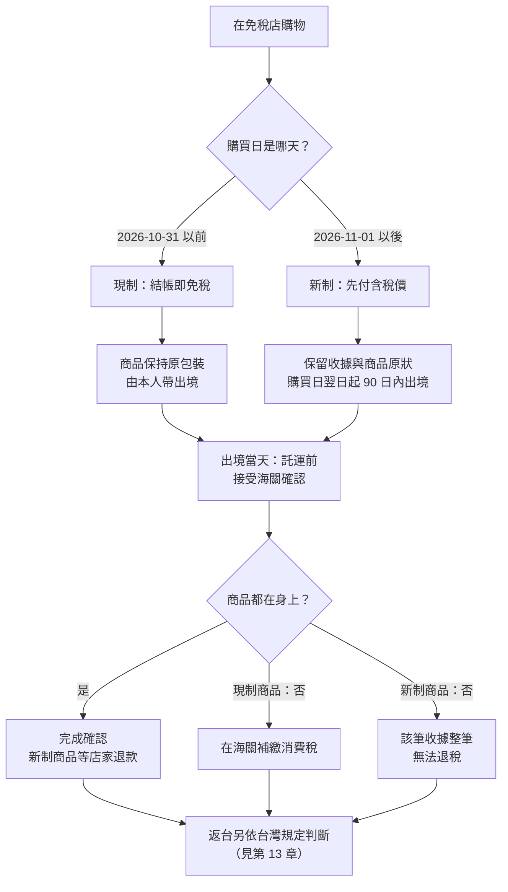

# 11 日本免稅購物到離境查驗

小林 10 月 28 日飛東京，11 月 3 日回台灣。她在 10 月 30 日的藥妝店買了一袋化妝品，店員直接以未稅價結帳，還把商品封在透明袋裡；11 月 2 日在電器行買相機，這次卻要先付含稅價，店員說「出境時過海關後才會退稅」。同一趟旅行，為什麼兩家店的做法不一樣？出境那天又要先做什麼？

!!! info "本章適用"
    **何時會用到**：在日本免稅店購物時，以及離開日本當天到機場後、託運行李之前。

    **適用誰**：以短期停留身分入境日本的台灣旅客（屬「免稅購入對象者」），在日本的免稅店（輸出物品販賣場）購物。

    **不適用誰**：機場管制區內的免稅商店（duty-free）不在本章範圍。買回來的東西進台灣要不要繳稅、能不能帶，是**台灣海關另外判斷**，請看 [13 返台海關、食品檢疫與申報](13-return-customs.md)。入境日本時帶了多少菸酒可以免稅，請看 [06 食品、植物、現金與其他攜帶品](06-food-cash-goods.md)。

## 先看購買日：免稅制度日期分流表

日本的免稅購物制度在 **2026-11-01** 從「購買時直接免稅」改為「先付稅、出境確認後退款」（退款方式，リファンド方式）。**【法規】** 國稅廳的 Q&A 明確說明：新制**依「在免稅店的購買（交付商品）日」適用，不是依出境日**；而且新舊制**沒有可以並用的過渡期**。

所以一趟跨 10 月、11 月的旅程，可能同時手上有兩種制度的商品，要分開處理：

| 項目 | 2026-10-31 以前購買（現制） | 2026-11-01 起購買（新制） |
|---|---|---|
| 判斷依據 | **購買日**（不看出境日） | **購買日**（不看出境日） |
| 結帳時 | 店家確認護照後，以**免稅價**結帳 | 先付**含稅價** |
| 金額門檻（同一人、同一店、同一天、未稅） | 一般物品 5,000 日圓以上；消耗品 5,000–500,000 日圓 | 5,000 日圓以上；取消一般／消耗品分類與 50 萬上限 |
| 消耗品包裝 | 須依規定方式特殊包裝 | 取消特殊包裝要求 |
| 出境時 | 出示護照與商品，接受海關確認 | 購買日翌日起 **90 日內**出境時，接受海關確認 |
| 沒帶著商品出境 | 在海關補繳消費稅 | 拿不到退稅；同一張收據有一件不在，**整筆**都無法確認 |
| 錢怎麼回來 | 購買時已免稅 | 海關確認後由**店家**退款；方式與手續費由店家決定 |

回到開頭的例子：小林 10 月 30 日買的化妝品走**現制**，11 月 2 日買的相機走**新制**。即使兩者都在 11 月 3 日出境，也不會因為出境日在 11 月就把化妝品改成新制。

## 現制：2026-10-31 以前購買

**【法規】誰可以買**：在日本以「短期停留」等身分停留的外國人屬於免稅購入對象者；台灣觀光旅客一般屬此類。**為了營業、轉售，或受他人（例如透過社群）委託代購而購買，不能免稅。**

**【法規】門檻**（同一購買者、同一店、同一天、未稅合計）：

- 一般物品（消耗品以外的物品）：**5,000 日圓以上**。
- 消耗品（食品、飲料、藥品、化妝品等）：**5,000 日圓以上、500,000 日圓以下**，並須依規定方式**特殊包裝**。
- 一般物品與消耗品合計達 5,000 日圓時，可以把一般物品也比照消耗品方式包裝後免稅購買。

**【法規】離境前的責任**（國稅廳與日本海關聯合說明）：

1. **本人帶出境**：免稅品必須由本人攜出日本，不能在日本轉讓或消費。
2. **出境時接受海關確認**：在機場或港口出示護照等與商品。**若把免稅品放進託運行李，要在交給航空公司託運之前先完成海關確認。**
3. **沒帶著就補稅**：出境時若已把免稅品轉讓或消費掉，要在海關繳納消費稅；在出境前轉讓免稅品，可能處 1 年以下拘禁刑或 50 萬日圓以下罰金。
4. **不能先寄走**：出境時出示郵寄證明代替攜帶的「別送」處理，已於 2025-03-31 廢止；2025-04-01 以後購買的免稅品，出境時必須帶在身上。國稅廳 Q&A 另說明，2026-10-31 以前購買後另行寄出的免稅品，出境時會在海關被即時徵收消費稅。

**【建議】** 消耗品的特殊包裝在離開日本前不要拆。帶了大量免稅品時，海關檢查會花時間，官方說明也建議提早辦理登機手續。

## 新制：2026-11-01 起購買

**【法規】流程**：

1. **結帳**：出示護照，以**含稅價**付款。
2. **出境**：自購買日**翌日**起算 **90 日內**出境時，在出境的機場或港口接受海關確認。國稅廳的例子：11 月 1 日購買，確認期限是隔年 1 月 30 日。
3. **確認方式**：在出境機場的**免稅手續專用終端機**讀取護照。畫面顯示：
    - **綠色判定**（不需檢查）：海關確認即完成。
    - **紅色判定**（需檢查）：到海關檢查處出示免稅品，接受持出確認。
4. **退款**：店家取得海關確認資訊後，把相當於消費稅的金額退給你。

**【法規】新制最容易踩雷的幾點**：

- **託運前完成。** 讀取護照時，免稅店手續購買的免稅品必須**全部在身上**；在機場託運行李之後，就**不能**再用終端機辦理。登機手續截止前沒辦完、或因自己的因素中途放棄檢查，都不算完成確認。
- **一件不在，整張收據作廢。** 海關以「購買紀錄」（大致等於一張收據、一次交易）為單位確認。同一張收據上三件商品，只要有一件不在身上，**整筆三件都無法確認、都不能退稅**。
- **吃掉、用掉就申報。** 食品、化妝品等消耗品在出境前吃掉或用掉一部分，就不能通過確認；此時**不要用終端機**，直接向海關窗口說明。非消耗品在日本使用過，只要最後帶出境仍可確認。
- **包裝盒不要丟。** 國稅廳提醒，把商品和外盒分開或丟掉印有型號的包裝，海關可能無法辨認是哪件免稅品；出境前盡量維持購買時的樣子。
- **確認後要馬上帶走。** 經海關確認的免稅品若沒有隨即出口，會被追徵消費稅並可能受罰。
- **只買自己帶得走的量。** 新制下免稅品必須由本人全部帶出；店家現場代辦國際運送的「直送」屬另一套出口免稅程序，細節請問店家。
- **轉機要在出境機場辦。** 從日本國內線轉國際線出境時，要在最後出境的機場辦理海關確認。
- **護照遺失重辦。** 購物後護照遺失、補發新護照並用新護照繼續購物時，出境時用新護照操作終端機，並主動告知海關職員舊護照也辦過免稅購物。
- **金條、金幣等不在免稅範圍內。** 單價 100 萬日圓（未稅）以上的商品，店家要登錄型號、序號等明細。

**【業者】退款怎麼拿**：消費稅法沒有規定退款方式。國稅廳舉例可能有銀行匯款、信用卡、App 轉帳，或在出境港內領現金；**要用哪一種、多久入帳、要不要扣手續費，都由各店或受託業者決定**。結帳時請問清楚並保存說明。國稅廳 Q&A 也提到，因旅客自己的原因（例如退款帳號填錯）無法退款時，依雙方約定可能不再退款；填寫退款資料時請仔細核對。

## 用 VJW 的免稅 QR code

Visit Japan Web（VJW，見 [07 Visit Japan Web 與機場入境](07-vjw-arrival.md)）也提供免稅購物用的 QR code，可在接受這項服務的店家出示。依數位廳的使用說明：

- 限持外國國籍，且在留身分為「短期停留」、外交或公用者使用。
- 要先在 VJW 掃描護照，並掃描護照上的**上陸許可貼紙**，才能產生免稅 QR code。
- **不能使用截圖**，要現場開啟畫面出示。

國稅廳 Q&A 另提到，成田、羽田、關西、中部、新千歲、福岡、那霸等機場，正研議讓旅客在出境大廳用手機透過 VJW 辦理海關確認。**這項機制在本書查閱時仍屬「研議中」**，請以國稅廳與機場公告為準，不要預設一定能用。

## 出境當天的順序

**【建議】** 把免稅確認排在託運之前：

1. 提早到機場。免稅品多、或可能被判定需要檢查時，要預留更多時間。
2. **在託運櫃檯之前**，找到出境大廳的免稅手續終端機或海關窗口，辦完確認。現制商品與新制商品都要帶在身上。
3. 綠色判定或檢查完成後，再去託運行李。
4. 過安檢、出境審查。**【法規】** 國際觀光旅客稅自 **2026-07-01 起原則每次出境 3,000 日圓**，由航空公司隨機票代收（此前締結的特定運送契約可適用 1,000 日圓，未滿 2 歲等免課）。
5. 返台入境時，**日本免稅不等於台灣免稅**：菸酒、其他物品的台灣免稅額與檢疫規定另外判斷，見 [13 返台海關、食品檢疫與申報](13-return-customs.md)。

**現制商品在 11 月以後出境**時，要在哪一台終端機或哪個窗口辦確認，本書查閱時未能以官方原文核實；**【建議】** 當天直接問機場的海關職員，並同樣在託運前辦理。

## 無法確定時找誰

| 問題 | 窗口 |
|---|---|
| 某筆購買適用哪個制度、門檻怎麼算 | 購買的免稅店；國稅廳「リファンド方式」專頁 |
| 退款方式、入帳時間、手續費 | 購買的免稅店或其委託的退款業者 |
| 出境時的海關確認、紅色判定 | 出境機場的日本海關窗口 |
| VJW 免稅 QR code 操作 | VJW 官方聊天機器人 |
| 國際觀光旅客稅是否適用舊稅額 | 開票的航空公司或旅行社 |
| 帶回台灣要不要申報、繳稅 | 財政部關務署（見第 13 章） |

## 出發前勾選

- ☐ 知道 2026-10-31 以前與 2026-11-01 以後購買的商品分屬兩套制度，**以購買日判斷**。
- ☐ 每一筆免稅購物的收據都保存好，新制商品已問清楚退款方式與手續費。
- ☐ 免稅品不在日本拆封、吃掉、轉送他人；吃掉或用掉的，出境時直接向海關窗口說明。
- ☐ 出境當天先到免稅手續終端機或海關窗口完成確認，**再**託運行李。
- ☐ 新制商品在購買日翌日起 90 日內出境。

## 來源與查閱日

| 來源 | 機關 | 本章用途 |
|---|---|---|
| [No.6559 外国人旅行者等の免税購入対象者](https://www.nta.go.jp/taxes/shiraberu/taxanswer/shohi/6559.htm) | 國稅廳 | 現制資格、5,000／500,000 日圓門檻、特殊包裝、營業用轉售不適用（2026-04-01 現行法令） |
| [Notice to Foreign Travelers Who Purchase Tax-Free Goods](https://www.nta.go.jp/publication/pamph/shohi/menzei/201805/pdf/explanation_eng.pdf) | 國稅廳、日本海關 | 現制本人攜出、託運前確認、補稅與罰則、別送廢止（2025-04 修訂） |
| [輸出物品販売場制度のリファンド方式への見直し](https://www.nta.go.jp/publication/pamph/shohi/menzei/201805/format/002.htm) | 國稅廳 | 新制施行日、退款方式、Q&A 與多語傳單入口 |
| [Tax-Free Shopping System will be shifted to the Refund Method from November 2026](https://www.nta.go.jp/publication/pamph/shohi/menzei/202506/pdf/0025006-106.pdf) | 國稅廳 | 新制流程、90 日計算例、整筆無法確認、取消分類與上限、除外品、依銷售日適用 |
| [輸出物品販売場制度に関するＱ＆Ａ（リファンド方式・概要編）](https://www.nta.go.jp/publication/pamph/shohi/menzei/201805/pdf/0025012-025_02.pdf) | 國稅廳 | 依購買日適用、無並用期（問 8）；終端機綠／紅判定、託運前（問 18）；護照補發（問 18-2）；90 日（問 19）；購買紀錄單位（問 20）；消耗品處理與包裝（問 21-2）；別送（問 23）；退款方式（問 29、30） |
| [Notice to Foreign Travelers Who Purchase Tax-Free Goods (From November 2026)](https://www.nta.go.jp/publication/pamph/shohi/menzei/201805/pdf/caution_all.pdf) | 國稅廳、日本海關、觀光廳 | 新制多語傳單：未確認不退稅、託運前確認、確認後須出口 |
| [How to use（Visit Japan Web）](https://services.digital.go.jp/en/visit-japan-web/guide/) | 日本數位廳 | 免稅 QR code 使用資格、掃描上陸許可、不可截圖 |
| [No.7195 国際観光旅客税のあらまし](https://www.nta.go.jp/taxes/shiraberu/taxanswer/inshi/7195.htm) | 國稅廳 | 出國稅 3,000 日圓、過渡適用、免課對象 |

查閱日：2026-09-19。規定可能變動，出發前請回官方頁重查。2026-11-01 新制施行前後，請再回國稅廳頁面確認一次。
