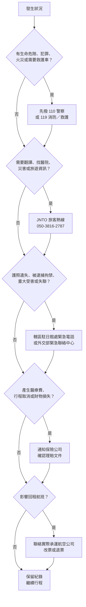

# 12 生病、遺失、停飛與災害

小林在京都的第三天，發現放護照的小包不見了；同一天晚上，氣象預報說颱風後天會經過關西，回程班機可能取消。他一時不知道該先打給誰：警察、飯店、航空公司，還是台灣的駐日機構？這一章把「現場先找誰、證明要留什麼」排成固定順序。

!!! info "本章適用"
    **何時用到**：在日本遇到急病、受傷、遺失證件、天災警報或班機停飛時；以及出發前準備緊急聯絡資料時。
    **適用誰**：持台灣護照短期赴日的旅客與同行家人。
    **不處理**：出發前的藥品準備與攜帶規定，見[05 藥品與醫療準備](05-medicines.md)；自駕事故的法定程序，見[10 自駕選讀](10-driving.md)；可列印的電話卡片，見[附錄 B 離線求助卡](appendix-b-emergency-card.md)。

## 先分清楚：緊急派遣、旅客協助、台灣援助

在日本求助的電話有好幾支，用途不同。最常見的誤解是把 JNTO 旅客熱線當成報警或叫救護車的電話；熱線可以協助翻譯與提供資訊，但**不會派警察或救護車**。有人受傷、遭遇犯罪或火災時，先撥 110 或 119，其他單位排在後面。

| 順位 | 單位 | 電話 | 什麼時候打 |
|---|---|---|---|
| 1 | 日本警察 | 110 | 犯罪、事故、失竊、需要報警時 |
| 1 | 日本消防／救護 | 119 | 火災、急病、重傷，需要救護車時 |
| 2 | JNTO 旅客熱線（Japan Visitor Hotline） | 050-3816-2787；海外撥打 +81-50-3816-2787 | 全年 24 小時；英語、中文、韓語；事故、疾病、災害時的協助與一般旅遊資訊 |
| 3 | 轄區駐日館處緊急電話 | 見下一節表格 | 被逮捕或拘禁、重大犯罪受害、緊急就醫等危及生命安全的事件 |
| 3 | 外交部緊急聯絡中心 | 0800-085-095（台灣境內）；海外付費 +886-800-085-095 | 聯絡不到駐外館處時的急難協助，全年 24 小時 |
| 4 | 保險公司 | 依保單所載 | 產生醫療費、行程變更或財物損失時 |
| 5 | 實際承運航空公司 | 依訂位紀錄 | 班機取消、延誤或需要改票時 |

**【法規】**以上電話來自各機關官方頁面。外交部另設「旅外國人急難救助全球免付費專線」800-0885-0885，日本在適用地區內，但**要加撥冠碼**：外交部頁面列出 KDDI 為 001-010-800-0885-0885、SoftBank 為 0061-010-800-0885-0885（頁面另註可只撥 010），可用在日本申辦的行動電話或市內電話免費撥打，**公用電話無法撥接**；用台灣門號漫遊撥打要自付漫遊費。外交部與館處都提醒，非急難事項（例如一般護照、簽證問題）請在上班時間打辦公室電話，不要占用急難專線。

## 駐日館處：依所在地找轄區

台灣在日本設有六個館處，各自負責不同的都道府縣。下表電話已於查閱日在各館處官方頁核對；緊急聯絡電話專供國人急難使用，通話可能錄音。

| 館處 | 轄區 | 辦公室電話（日本境內） | 緊急聯絡電話（日本境內） |
|---|---|---|---|
| 台北駐日經濟文化代表處（東京） | 東京都、青森、岩手、宮城、秋田、福島、茨城、栃木、群馬、埼玉、千葉、新潟、山形、山梨、長野 | 03-3280-7811 | 080-1009-7179、080-1009-7436；夜間警衛室 03-3280-7917 |
| 橫濱分處 | 神奈川、靜岡 | 045-641-7736～8 | 090-3211-7576 |
| 台北駐大阪經濟文化辦事處 | 京都、大阪、兵庫、滋賀、奈良、和歌山、鳥取、島根、岡山、廣島、德島、香川、愛媛、高知、富山、石川、福井、岐阜、愛知、三重 | 06-6227-8623 | 090-8794-4568 |
| 大阪辦事處福岡分處 | 福岡、佐賀、長崎、熊本、大分、宮崎、鹿兒島、山口 | 092-734-2810 | 090-1922-9740 |
| 那霸分處 | 沖繩 | 098-862-7008 | 080-8056-0122 |
| 札幌分處 | 北海道 | 011-222-2930 | 080-1460-2568 |

用台灣手機漫遊撥打時，去掉開頭的 0，改加 +81，例如 080-1460-2568 變成 +81-80-1460-2568。電話可能異動，**【建議】**出發前一週回各館處首頁再核對一次，把所在地轄區的號碼抄進[離線求助卡](appendix-b-emergency-card.md)。

## 護照遺失：報警、補發或入國證明書

護照是國籍證明，也是你在日本合法停留的依據。**【法規】**日本入管法第 23 條要求短期停留的外國人隨身攜帶護照（細節見[09 當地法律](09-local-rules.md)），所以遺失後要盡快處理。

**步驟一：向日本警察報遺失。**到最近的警察署或派出所（交番）申報遺失；東京警視廳說明，申報可以在任何警察署、派出所辦理，不限遺失地點，但在日本國外遺失的物品不受理。請取得「遺失届出証明書」或記下受理番號，後面補發護照要用。

**步驟二：向轄區館處申請。**台北駐日經濟文化代表處（東京）的「護照遺失申請補發」頁列出的應備文件是：

1. 普通護照申請書。
2. 警察署出具的護照遺失報案證明 1 份。
3. 在留卡影本（非定居日本者可免附，短期觀光旅客通常屬此類）。
4. 國籍證件：遺失者附遺失報案單及附照片的台灣證件影本，例如國民身分證或戶籍謄本。
5. 彩色照片（4.5 × 3.5 公分）2 張，六個月內白底脫帽。
6. 未成年人另附父母（或監護人）護照影本與親子關係證明，並由其在申請書簽名。

東京本處規定補發須親自到館辦理，不能郵寄；現場櫃台週一至週四排隊、週五網路預約。晶片護照要寄回國內製作，**申請到完成約需 3 至 6 週**；有效期內遺失 2 次以上者，審核最長可延長至 6 個月。其他館處的收件時間不同，以各館處首頁為準。

**步驟三：趕著回台灣，改申請入國證明書。**無法等待補發的人，可以申請「入國證明書」持憑返國；但**要前往其他國家、或經由他國轉機回台者不適用**。所以回程若是經第三地轉機，要先告訴館處並改訂直飛航班，或等護照補發。

入國證明書的規費、有效期間，以及從日本離境時出入國在留管理廳需要看哪些文件，本書查閱時未能在主管機關原文中核實，**請直接向辦理的館處詢問**，並同時通知航空公司你將以何種文件報到。

| 你的狀況 | 建議走的路 |
|---|---|
| 離回程還有一個月以上 | 報警 → 館處申請補發護照 |
| 幾天內要直飛回台灣 | 報警 → 館處申請入國證明書 → 通知航空公司 |
| 回程要經第三地轉機，或接著去別國 | 入國證明書不適用；洽館處討論補發時程與改票 |

**【建議】**出發前把護照資料頁影本與電子檔分開保存，另備 2 張護照規格照片。影本不能代替護照入境或住宿登記，但能加快報案與申請。

## 生病或受傷：就醫與費用自付

**先判斷要不要叫救護車。**危急時直接撥 119。拿不定主意時，部分地區有 #7119「救急安心センター」，由醫師、護理師或救護人員以電話建議該叫救護車還是自行就醫；總務省消防廳說明這項服務**並非全國都有**，有些地區使用其他號碼，語言支援也依地區而異。不確定時，撥 JNTO 旅客熱線請對方協助。

**找醫院。**JNTO 的「身體不適之時應急指南」提供醫療機構搜尋，可依地區、外語與科別篩選。官方頁建議盡量先聯絡醫療機構，掛號時先詢問大概費用。一般流程是：掛號 → 填寫問診單 → 醫師診察與處方 → 付款 → 到藥局領藥。

**費用要先有自付的準備。**JNTO 頁面提醒，沒有投保海外旅行保險的旅客，可能需要全額支付醫療費。頁面同時寫明：

- 只有大型醫院能刷卡，**診所一般收現金**。
- 若投保附「無現金醫療服務」的海外旅行保險，可能不必在現場付款；條件依保險而異，要先問保險公司。
- 高額案例：外傷住院並移送回國達 750 萬日圓；急性心肌梗塞手術住院 45 天並移送達 1,000 萬日圓。
- **有未繳醫療費紀錄的訪日旅客，日後可能無法入境日本。**

**【建議】**保險是否理賠、賠多少，取決於你的保單條款、除外責任與申請文件，本書無法替任何保單承諾結果。就醫後請保留診斷書、收據、處方與付款紀錄，當天拍照備份，並依保單規定的期限通知保險公司。回台後能否向台灣健保申請核退海外自墊醫療費、需要哪些文件與期限，本書未查核，請向衛生福利部中央健康保險署查詢。

## 地震、海嘯、颱風與熱中症

日本觀光廳監修的「Safety tips」App 可推播緊急地震速報、海嘯警報、氣象特別警報、避難資訊與熱中症資訊，支援繁體中文等 15 種語言，免費下載。這是官方推薦工具，不是義務，也不能保證一定收得到推播；**現場廣播與工作人員的指示優先**。以下動作整理自 JNTO「Safety tips for travelers」網站的應對流程。

| 狀況 | 當下做什麼 | 平靜後做什麼 |
|---|---|---|
| 地震（在飯店） | 保護頭部，躲在結實的桌子下；不要慌張衝出戶外 | 打開房門確保出口，依住宿處指示行動；平時先確認安全出口 |
| 地震（在電梯） | 按下所有樓層按鈕，在停下的樓層離開 | 受困時按緊急呼叫鈕，等待救援 |
| 地震（在電車、地鐵） | 抓緊扶手保護頭部，可能緊急煞車 | 聽從站務人員指示，**不要自行下到軌道** |
| 地震（在海邊、河邊） | 可能發生海嘯，海嘯會沿河岸上溯 | 往高台或海嘯避難大樓避難，警報解除前不要接近水邊 |
| 海嘯警報、大海嘯警報 | 立刻離開海岸，往高台或海嘯避難大樓 | 海嘯會反覆來襲，解除前不返回水邊 |
| 避難指示（警戒等級 4） | 所有人從危險地點避難 | 不要等到等級 5；等級 5 代表災害已發生或逼近 |
| 颱風、大雨警報 | 注意地方政府發布的避難資訊；確認住宿周邊狀況 | 連同航班狀態一起確認，見下一節 |
| 熱中症警戒資訊 | 避開酷暑，到陰涼處，戴帽子並休息 | 感到口渴前就補充水分與鹽分 |

環境省的熱中症警戒資訊有季節性：2026 年度的暑熱指數與熱中症警戒アラート提供期間為 4 月 22 日至 10 月 21 日。日本氣象廳提供多語言地震資訊頁面，可確認震度與海嘯資訊。

**【建議】**入住時看一眼房門背後的避難路線圖；在海邊或河口住宿時，記下最近的高台或海嘯避難大樓。外交部的旅遊警示與日本各地的災害狀況會變動，出發前與旅途中都可以查外交部領事事務局「旅遊警示」頁。

## 班機停飛或大幅延誤

颱風、大雪或火山灰都可能讓班機取消。處理順序是：**先確認實際承運航空公司的公告，再談改票或退票，最後才是保險。**

**【業者】**改搭哪一班、能否免費改票或退款、是否提供住宿，主要依航空公司的運送條款與當次公告。聯營或共用班號的機票，以實際執飛的航空公司為準；透過旅行社或訂票網站買的票，可能要回原購票管道處理。

**【法規】**交通部民用航空局「旅客須知」說明：班機延誤時，航空公司應視實際情況並斟酌乘客需要，提供必要的通訊、飲食或膳宿、禦寒或醫藥急救物品，以及必要的轉機或其他交通工具；遇天候等不可抗力因素時，航空公司的責任以乘客因延誤而增加支出的必要費用為限（另有交易習慣者除外）。這是台灣主管機關的說明，從日本出發的班機實際上仍以承運人條款為準；有爭議時可循民航局頁面所列申訴管道。

**【建議】**停飛時請保留：登機證或電子機票、航空公司發出的取消或延誤通知（截圖含日期時間）、額外住宿與交通的收據。旅遊不便險或信用卡附帶保險的理賠條件各不相同，是否符合「延誤幾小時」「不可抗力」等條款，請先讀保單，本書不代為判斷。

若停飛或住院讓你在日本的停留時間逼近 90 日上限，請立即洽詢出入國在留管理廳的外國人在留總合資訊中心，不要自行延後離境。**【法規】**入管廳說明，「短期滯在」的在留期間更新原則上只在人道上確實不得已等特別情形下准許，例如需要治療疾病，並須提出申請文件。

## 出發前先做的準備

- **【建議】**到外交部領事事務局「出國登錄」填寫行程、住宿與緊急聯絡人。發生天災或急難時，館處可依登錄資料聯繫；資料在旅程結束後 3 個月自動刪除或去識別化。登錄不是保險，也不保證救援。
- **【建議】**安裝 Safety tips App，把語言設成繁體中文，並允許推播。
- **【建議】**填好[附錄 B 離線求助卡](appendix-b-emergency-card.md)，紙本放錢包、照片存手機相簿。
- **【建議】**把保險公司的海外急難協助電話與保單號碼寫在同一張卡上，並確認保單是否含醫療費、醫療轉送與旅程不便保障。

## 無法確定時找誰

| 問題 | 窗口 |
|---|---|
| 要不要叫救護車 | 119；所在地若有 #7119 可先諮詢（見總務省消防廳頁） |
| 找會說中文或英文的醫院 | JNTO 旅客熱線、JNTO 醫療機構搜尋 |
| 護照遺失、入國證明書 | 所在地轄區駐日館處（辦公時間打辦公室電話） |
| 被逮捕、重大受害、聯絡不到館處 | 館處緊急電話；外交部緊急聯絡中心 |
| 停留期限、離境文件 | 出入國在留管理廳 外國人在留總合資訊中心 |
| 班機取消、改票 | 實際承運航空公司；原購票管道 |
| 醫療費、延誤、財物損失理賠 | 你的保險公司或發卡銀行 |

## 出發前勾選

- ☐ 已查出住宿地的轄區駐日館處，並把辦公室與緊急電話抄進離線求助卡。
- ☐ 手機已存 110、119、JNTO 旅客熱線與外交部緊急聯絡中心。
- ☐ 已完成外交部「出國登錄」，並安裝 Safety tips App。
- ☐ 護照資料頁影本、2 張規格照片與正本分開放。
- ☐ 已讀過保單的醫療、急難協助與旅程不便條款，知道理賠要哪些文件。

## 來源與查閱日

| 來源 | 機關 | 本章用途 |
|---|---|---|
| [日本遊客熱線](https://www.japan.travel/tw/plan/hotline/) | 日本政府觀光局（JNTO） | 旅客熱線電話、時段、語言；110／119 |
| [讓您的日本之旅更加安心－身體不適之時應急指南](https://www.jnto.go.jp/emergency/chc/mi_guide.html) | JNTO | 醫療機構搜尋、付款方式、費用案例、未繳醫療費影響入境 |
| [外交部緊急聯絡中心](https://www.boca.gov.tw/cp-53-378-353fb-1.html) | 外交部領事事務局 | 0800-085-095、+886-800-085-095 |
| [旅外國人急難救助全球免付費專線](https://www.boca.gov.tw/cp-87-2121-7a5da-1.html) | 外交部領事事務局 | 800-0885-0885 在日本的撥號方式、公用電話不可撥 |
| [台北駐日經濟文化代表處](https://www.roc-taiwan.org/jp/index.html) | 台北駐日經濟文化代表處 | 東京轄區、辦公室與緊急電話 |
| [台北駐日經濟文化代表處橫濱分處](https://www.taiwanembassy.org/jpyok/index.html) | 橫濱分處 | 轄區、辦公室與緊急電話 |
| [各駐日代表處轄區及聯絡方式](https://www.taiwanembassy.org/jpyok/post/9412.html) | 橫濱分處 | 六館處轄區與辦公室電話對照 |
| [台北駐大阪經濟文化辦事處](https://www.taiwanembassy.org/jposa/index.html) | 大阪辦事處 | 轄區、辦公室與緊急電話 |
| [台北駐大阪經濟文化辦事處福岡分處](https://www.roc-taiwan.org/jpfuk/index.html) | 福岡分處 | 轄區、辦公室與緊急電話 |
| [台北駐日經濟文化代表處那霸分處](https://www.roc-taiwan.org/jpna/index.html) | 那霸分處 | 轄區、辦公室與緊急電話 |
| [台北駐日經濟文化代表處札幌分處](https://www.roc-taiwan.org/jpokd/index.html) | 札幌分處 | 轄區、辦公室與緊急電話 |
| [護照遺失申請補發](https://www.roc-taiwan.org/jp/post/375.html) | 台北駐日經濟文化代表處 | 應備文件、3–6 週、入國證明書適用範圍 |
| [落とし物をした方](https://www.keishicho.metro.tokyo.lg.jp/sodan/otoshimono/lost_found.html) | 東京都警視廳 | 遺失申報地點 |
| [救急安心センター事業（♯7119）ってナニ？](https://www.fdma.go.jp/mission/enrichment/appropriate/appropriate007.html) | 總務省消防廳 | #7119 用途與非全國實施 |
| [在發生緊急狀況時（Safety tips for travelers）](https://www.jnto.go.jp/safety-tips/chc/emergency/index.html) | 日本觀光廳／JNTO | 地震、海嘯、避難資訊、氣象警報、熱中症應對 |
| [應用程式「Safety tips」](https://www.jnto.go.jp/safety-tips/chc/app.html) | 日本觀光廳／JNTO | App 功能與支援語言 |
| [訪日外国人旅行者用災害時に役立つツール](https://www.mlit.go.jp/kankocho/seisaku_seido/kihonkeikaku/jizoku_kankochi/anzenkakuho/inbound/tool.html) | 日本觀光廳 | Safety tips 由觀光廳監修、15 種語言 |
| [熱中症予防情報サイト](https://www.wbgt.env.go.jp/) | 環境省 | 2026 年度熱中症警戒資訊提供期間 |
| [氣象廳多語言地震資訊](https://www.data.jma.go.jp/multi/quake/quake_advisory.html?lang=cn_zt) | 日本氣象廳 | 地震與海嘯資訊入口 |
| [旅客須知](https://www.caa.gov.tw/article.aspx?a=271&lang=1) | 交通部民用航空局 | 延誤時航空公司應提供的服務、不可抗力責任範圍 |
| [出國登錄](https://www.boca.gov.tw/sp-abre-main-1.html) | 外交部領事事務局 | 登錄用途與資料保存期間 |
| [旅遊警示](https://www.boca.gov.tw/np-52-1.html) | 外交部領事事務局 | 查詢入口 |
| [外國人在留總合資訊中心](https://www.moj.go.jp/isa/consultation/center/index.html) | 出入國在留管理廳 | 停留期限與離境文件查詢入口 |
| [在留資格「短期滞在」](https://www.moj.go.jp/isa/applications/status/temporaryvisitor.html) | 出入國在留管理廳 | 短期滯在期間更新的限定條件 |

查閱日：2026-09-19。規定可能變動，出發前請回官方頁重查。
