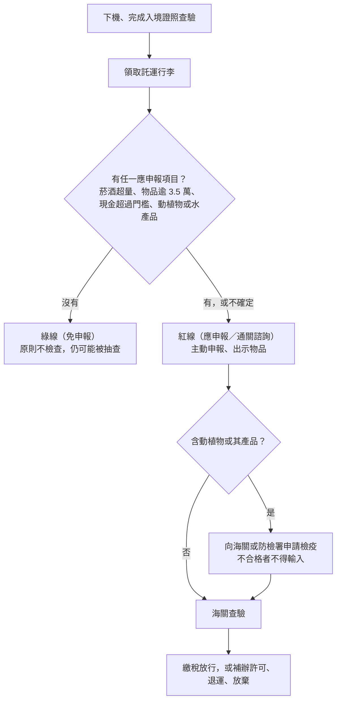

# 13 返台海關、食品檢疫與申報

阿哲在大阪的藥妝店和百貨公司辦了免稅，行李箱裡還有兩瓶清酒、一盒和牛肉乾、一條給朋友代買的加熱菸。他以為「在日本辦過免稅」就代表回台灣不用申報。落地桃園，他在紅線和綠線之間猶豫了很久。這一章把返台時要自己檢查的東西，照品項一次排完。

!!! info "本章適用"
    **何時用到**：日本離境前一天整理行李時，以及在台灣機場領完行李、走向海關之前。
    **適用誰**：從日本搭機返台、以中華民國護照入境的旅客，包含同行的未成年人。
    **不處理**：日本免稅購物資格與離境查驗，見[11 日本免稅購物到離境查驗](11-tax-free.md)；搭機的行動電源與液體規定，見[04 行李、液體與行動電源](04-baggage-batteries.md)；出發時從台灣帶去日本的東西，見[06 食品、植物、現金與其他攜帶品](06-food-cash-goods.md)。

## 先記住一件事：日本免稅不等於台灣免稅

日本的「免稅」退的是日本消費稅，是日本政府給外國旅客的優惠；回到台灣，同一件商品要重新接受台灣的三套規則：

1. **關稅與免稅額**（財政部關務署）：菸酒、一般物品是否超過免稅額，現金是否超過申報門檻。
2. **動植物檢疫**（農業部動植物防疫檢疫署）：肉品、水果、植物、水產品等。
3. **藥品、食品與菸品管制**（衛生福利部、食藥署、國健署）：自用藥品數量、管制成分、電子煙與加熱菸。

三套規則各自獨立：數量在免稅額內，不代表能通過檢疫；包裝完整、有日本收據，也不代表可以輸入。

## 紅線或綠線：通關流程

**【法規】**台灣機場的入境行李實施紅綠線通關，旅客自己選擇走哪一邊。關務署說明：走綠線的旅客原則上不檢查，但電腦資料顯示不得走綠線、形跡可疑或有其他情形時，會被改到紅線或由綠線關員檢查。走綠線而被查到應稅、管制或未申報物品，依海關緝私條例等規定處理。

有下列**任一項**，就**不能走綠線**，要到紅線（應申報／通關諮詢）檯主動申報：

- 菸、酒超過免稅數量。
- 其他物品總值超過新台幣 3.5 萬元（菸酒除外）。
- 外幣現金超過等值 1 萬美元；新台幣超過 10 萬元；人民幣超過 2 萬元；黃金價值超過 2 萬美元；有價證券總面額超過等值 1 萬美元。
- **攜帶水產品或動植物類產品**。
- 有後送（不隨身）行李。
- 攜帶總價值超過等值新台幣 50 萬元、且有被利用洗錢之虞的物品。
- 攜帶管制或限制輸入的物品，或其他不符免稅規定的情形。

**【建議】**「不確定」本身就是走紅線的理由。紅線檯也叫「通關諮詢」檯，主動問不會因此受罰；被查到未申報才會。

## 菸酒：數量、年齡與版本差異

**【法規】**依 2025 年修正的「入境旅客攜帶行李物品報驗稅放辦法」，及臺北關 2026-02-01 發布的菸酒說明：

| 類別 | 免稅數量（免申報） | 年齡 | 超過免稅、在限量內 | 限量上限 |
|---|---|---|---|---|
| 酒 | 1.5 公升，不限瓶數 | 年滿 18 歲 | 走紅線申報，扣除免稅量後繳稅放行 | 總量 5 公升（未開放進口之大陸地區酒類限 1 公升） |
| 菸（擇一） | 捲菸 200 支，或雪茄 25 支，或菸絲 1 磅 | 年滿 20 歲 | 走紅線申報，繳稅放行 | 捲菸 1,000 支、雪茄 125 支、菸絲 5 磅 |

數量包含隨身與不隨身行李內的所有菸酒。超過免稅數量卻沒有申報，超過部分由海關**沒入**，並依每條捲菸、每磅菸絲、每 25 支雪茄或每公升酒處新台幣 500 元以上 5,000 元以下罰鍰（臺北關頁面另附各品項裁罰基準表）。超過限量上限，即使申報也要以進口商名義報關或退運。

**版本差異註記**：關務署網站仍留有較早的說明頁（例如基隆關 2021-08-20 更新的「旅客入境通關須知」），寫免稅酒 1 公升、菸酒均限年滿 20 歲。那是 2025 年修法前的舊內容，該頁自己也註明應以最新法令為準。本書採用 2025 年修正條文與 2026 年關務署宣導的 1.5 公升、酒 18 歲、菸 20 歲；若你讀到不同數字，先看頁面日期，再以修正條文為準。

## 電子煙與加熱菸：不要帶

**【法規】**菸害防制法修正條文自 2023-03-22 施行後：

- **電子煙**：禁止任何人輸入，旅客少量自用也一樣，海關不會因為「自己要用」而放行。
- **加熱菸**：屬「指定菸品」，須經衛福部健康風險評估審查核定通過，才可輸入。臺北關頁面明寫：**國外購買、未經核定的加熱菸，屬旅客不得攜帶入境的菸品**；國健署說明違者不論數量，處新台幣 5 萬元至 500 萬元罰鍰，並銷毀或退運。代購與自用同罰。

臺北關 2026-02-01 的菸酒說明，把「經衛福部核定通過之指定菸品（加熱菸）200 支」列為菸品免稅的擇一選項之一。但你在日本便利商店買到的產品是否屬於台灣核定品項，現場無法判斷，而且頁面已把國外購買未經核定者列為禁止。**【建議】**從日本返台，一律不要帶加熱菸、加熱菸的菸彈或主機組合元件。

## 一般物品與現金

**【法規】**菸酒以外的自用、家用物品，完稅價格合計在新台幣 3.5 萬元以下免稅；管制品與菸酒不適用這個免稅額。在日本辦過退稅的精品、電器，回台灣一樣要算進這 3.5 萬元。超過免稅範圍就走紅線；超過免稅範圍或數量的物品，臺北關說明可能要補辦輸入許可、退運或放棄。

**【法規】**現金與財物的申報門檻：

| 項目 | 門檻 | 超過時 |
|---|---|---|
| 新台幣 | 超過 10 萬元 | 須申報，超額部分退運 |
| 人民幣 | 超過 2 萬元 | 須申報，超額部分封存，出境時再帶出 |
| 外幣現金（含日圓） | 超過等值 1 萬美元 | 須申報，申報後可攜入 |
| 有價證券（無記名） | 總面額超過等值 1 萬美元 | 須申報 |
| 黃金 | 價值超過 2 萬美元 | 須申報 |

未申報或申報不實，超過部分可能被沒入或處相當金額的罰鍰。現金申報可在關港貿單一窗口線上預先申報，入境時仍要走紅線。日圓換算美元的匯率以入境當時為準，接近門檻時**【建議】**直接申報。

## 食品與動植物檢疫

**【法規】**防檢署規定旅客（含託運行李）**不得攜帶**：新鮮水果（含瓜果）、土壤與附著土壤的植物或物品、活昆蟲等有害生物（包含獨角仙、鍬形蟲），以及列屬禁止輸入疫區的動植物產品。防檢署的原則是：出國前先查檢疫規定，入境時誠實申報。

**肉類與含肉食品**，是旅客最常被罰的項目：

- 肉類或加工肉類（含真空包裝）入境時須向防檢署申報檢疫；**沒有輸出國動物檢疫證明書或檢疫不合格者不得輸入**。旅客在商店買的伴手禮，幾乎都沒有這份證明。
- 臺北關列出的常見應檢疫加工肉品包括：肉乾、肉鬆、香腸、火腿、培根、熱狗、肉包、水餃、含肉月餅、三明治、漢堡、含肉湯品等。
- 供人食用的**高溫滅菌罐頭**（馬口鐵罐頭或軟式罐頭）無須申報動物檢疫；含肉泡麵的調理包若屬高溫滅菌的軟式罐頭也同樣處理。是否屬於軟式罐頭，要洽防檢署認定，不能自己憑外觀判斷。
- 違規攜帶肉製品處新台幣 1 萬元以上 100 萬元以下罰鍰；自非洲豬瘟疫區違規攜帶豬肉製品，初犯 20 萬元、再犯 100 萬元。

**植物與其產品**：新鮮水果、帶土植物禁止；其他植物產品（種子、球根、切花、生鮮蔬菜等）須依規定申請檢疫。旅客未依規定申請檢疫，依植物防疫檢疫法處新台幣 3,000 元以上 15,000 元以下罰鍰。

**水產品**：關務署把「攜帶水產品或動、植物類產品」列為不得走綠線的情形，海鮮乾貨等請走紅線申報。

**一般食品**：食藥署說明，個人自用的一般食品價值須在 1,000 美元以下、總重 6 公斤以內，限自用，不得轉賣。

日本產的乳製品、蛋製品、茶葉、乾香菇、海鮮乾貨等個別品項，現行條件會隨疫情與產地公告變動，本書不提供放行清單，**請在購買前查防檢署「入境旅客專區」或致電詢問**。

## 藥品、保健食品與化粧品

**【法規】**食藥署的入境旅客自用藥物限量：

| 類別 | 限量 |
|---|---|
| 非處方藥 | 每種至多 12 瓶（盒、罐、條、支），合計不超過 36 瓶（盒、罐、條、支） |
| 處方藥，未帶處方箋 | 2 個月用量 |
| 處方藥，有醫師處方箋或證明文件 | 不超過處方合理用量，至多 6 個月用量 |
| 錠狀、膠囊狀食品（保健食品） | 每種至多 12 瓶（盒、罐、包、袋），合計不超過 36 瓶（盒、罐、包、袋） |
| 化粧品 | 依海關規定；以玻璃安瓿為容器者須先向食藥署申請核准 |

食藥署特別提醒：**在國外買的藥，要注意是否含我國管制藥品成分**；各國管制規定不同，日本藥妝店可自由購買的感冒藥或止痛藥，不代表在台灣也屬一般藥品。攜入的藥品與食品僅限自用，轉賣可能違反藥事法、食品安全衛生管理法等規定。超過限量或含管制成分時，請先查食藥署「個人輸入自用藥品規範專區」或線上申請系統。

## 日本購買→日本離境→台灣入境核對表

同一件東西，要依序通過三個關口。下表只列判斷方向，數字與細節以各章為準。

| 品項 | 在日本購買時 | 日本離境時 | 台灣入境時 |
|---|---|---|---|
| 酒 | 是否辦免稅依購買日期適用現制或新制（[11 章](11-tax-free.md)） | 超過 100ml 的液體不能手提過安檢，放託運；免稅品先依規定給海關確認再託運 | 1.5 公升、年滿 18 歲；超過走紅線，上限 5 公升 |
| 紙菸、雪茄 | 同上 | 依航空公司規定 | 捲菸 200 支或雪茄 25 支或菸絲 1 磅擇一，年滿 20 歲 |
| 加熱菸、電子煙 | 日本可買到 | — | **不要帶**：電子煙禁止；未經核定加熱菸罰 5 萬至 500 萬元 |
| 藥品、藥妝 | 看成分表，留收據 | 液狀、噴霧類注意 100ml 手提限制 | 非處方藥每種 12、合計 36；含管制成分先查食藥署 |
| 保健食品（錠、膠囊） | 留意包裝數量 | — | 每種 12、合計 36 |
| 肉乾、含肉零食、含肉泡麵 | 買前想清楚 | — | 須檢疫證明，幾乎無法帶；高溫滅菌罐頭另論；違規 1 萬至 100 萬元 |
| 新鮮水果、帶土植物、昆蟲 | 不要買來帶回 | — | 禁止攜帶 |
| 海鮮乾貨等水產品 | 保留包裝與成分標示 | — | 走紅線申報 |
| 餅乾、糖果等一般食品 | — | 布丁、果醬等凝膠類算液體 | 自用，1,000 美元以下、6 公斤以內 |
| 電器、精品 | 辦免稅要本人護照 | 免稅品依規定接受海關確認 | 與其他物品合計超過 3.5 萬元走紅線 |
| 行動電源 | — | 每人最多 2 個，只能手提，機上不得用行動電源充電（[04 章](04-baggage-batteries.md)） | — |
| 日圓現金 | — | 攜帶大額現金出境的規定請查日本海關 | 外幣超過等值 1 萬美元申報 |

## 無法確定時找誰

| 問題 | 窗口 |
|---|---|
| 菸酒、免稅額、紅綠線、現金申報 | 財政部關務署；入境機場所屬關區（例如臺北關） |
| 肉品、水果、植物、水產品能否帶 | 農業部動植物防疫檢疫署「入境旅客專區」 |
| 藥品、保健食品、化粧品限量與申請 | 衛生福利部食品藥物管理署「個人輸入自用藥品規範專區」 |
| 加熱菸、電子煙 | 衛生福利部國民健康署；關務署 |
| 在機場當下不確定 | 走紅線（通關諮詢）檯直接詢問 |

## 出發前勾選

- ☐ 返台前一天把行李中的菸、酒數量與家人年齡核對過一次。
- ☐ 行李裡沒有肉製品、新鮮水果、帶土植物、電子煙與加熱菸。
- ☐ 藥品與保健食品每種不超過 12 件、合計不超過 36 件，並確認沒有台灣管制成分。
- ☐ 已把在日本買的物品金額加總，確認是否超過新台幣 3.5 萬元。
- ☐ 現金（含日圓換算）是否超過申報門檻；超過或接近就走紅線。

## 來源與查閱日

| 來源 | 機關 | 本章用途 |
|---|---|---|
| [修正「入境旅客攜帶行李物品報驗稅放辦法」第11條條文及第4條附表](https://web.customs.gov.tw/singlehtml/40?cntId=e96cee016fad413b85078d2e5d2cca11) | 財政部關務署 | 酒 1.5 公升／18 歲、菸 200 支等／20 歲、3.5 萬元免稅 |
| [何謂入境旅客紅綠線通關？](https://web.customs.gov.tw/singlehtml/2597?cntId=cus1_114543_2597) | 財政部關務署 | 紅綠線規則、不得走綠線的 11 種情形 |
| [菸酒－臺北關](https://web.customs.gov.tw/taipei/singlehtml/3392?cntId=cus2_3392_3392_1344) | 財政部關務署臺北關 | 菸酒免稅與限量、未申報罰鍰、加熱菸規定 |
| [旅客入境通關須知（基隆關）](https://web.customs.gov.tw/keelung/singlehtml/243?cntId=cus3_98483_243) | 財政部關務署基隆關 | 舊版 1 公升／20 歲的版本比對 |
| [入境旅客攜帶隨身及不隨身行李物品，如已超過免稅範圍或數量應如何處理？](https://web.customs.gov.tw/taipei/singlehtml/3130?cntId=cus2_156932) | 財政部關務署臺北關 | 超額處理：補辦許可、退運、放棄 |
| [洗錢防制－臺北關](https://web.customs.gov.tw/taipei/singlehtml/3392?cntId=cus2_3392_3392_1345) | 財政部關務署臺北關 | 新台幣、人民幣、外幣、有價證券申報 |
| [年假出入境要安心，相關規定要注意](https://web.customs.gov.tw/%20/singlehtml/2222?cntId=3a3cba6e37bf4c0f8b89030b0a788f5d) | 財政部關務署 | 2026 年宣導：菸酒、現金、黃金門檻交叉核對 |
| [出入境常見問題](https://web.customs.gov.tw/singlehtml/2881?cntId=cus1_128145_2881) | 財政部關務署 | 現金未申報後果、線上預先申報 |
| [旅客可以攜帶真空包裝肉製品或含肉的速食麵(泡麵)入境嗎？](https://web.customs.gov.tw/taipei/singlehtml/3130?cntId=cus2_177199_3130) | 財政部關務署臺北關 | 肉品檢疫、高溫滅菌罐頭、罰鍰 |
| [旅客可以攜帶電子煙入境嗎？](https://web.customs.gov.tw/taipei/singlehtml/3130?cntId=cus2_168120_3130) | 財政部關務署臺北關 | 電子煙禁止輸入 |
| [出國旅遊人數增加 目前攜帶「加熱菸」入境違法並開罰](https://www.mohw.gov.tw/cp-6564-74675-1.html) | 衛生福利部 | 加熱菸 5 萬至 500 萬元罰鍰 |
| [指定菸品健康風險評估審查進度說明](https://www.hpa.gov.tw/Pages/Detail.aspx?nodeid=4878&pid=19284) | 衛生福利部國民健康署 | 指定菸品須經審查核定才可輸入 |
| [入境旅客專區（出國必看不買清單）](https://www.aphia.gov.tw/ws.php?id=4502) | 農業部動植物防疫檢疫署 | 禁止攜帶項目、誠實申報原則 |
| [植物防疫檢疫法](https://law.moj.gov.tw/LawClass/LawAll.aspx?pcode=M0140001) | 法務部全國法規資料庫 | 未申請檢疫罰 3,000 至 15,000 元 |
| [出遊常備用藥及攜帶藥品出入境規定](https://www.fda.gov.tw/tc/newsContent.aspx?cid=4&id=t622952) | 衛生福利部食品藥物管理署 | 藥品限量、管制成分提醒 |
| [入境攜帶食藥醫粧限自用，返國轉賣恐觸法！](https://www.fda.gov.tw/tc/newsContent.aspx?cid=4&id=t623657) | 衛生福利部食品藥物管理署 | 一般食品、保健食品、安瓿化粧品 |
| [個人輸入自用藥品規範專區](https://www.fda.gov.tw/tc/site.aspx?sid=3928) | 衛生福利部食品藥物管理署 | 限量表與線上申請入口 |

查閱日：2026-09-19。規定可能變動，出發前請回官方頁重查。
