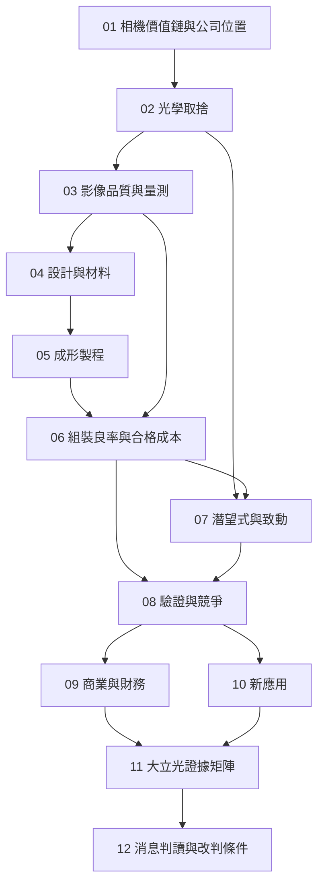

# 全書地圖：把一顆鏡頭追到一筆可解釋的收入

全書沿著一條主線前進：**拍攝需求 → 成像系統與鏡頭規格 → 設計及製程取捨 → 品質與合格成本 → 客戶採用及財務結果 → 公司證據**。中間不要跳過「合格」這一段：鏡片做得出來、鏡頭組得起來、客戶願意採用、能認列收入，是四件不同的事，各自需要不同證據。

*圖 00-1：實線是閱讀與推理依賴，不是製造流程的加工順序。10 是拓展閱讀，09 的算例不依賴新應用是否成功。*

| 章 | 讀完要能交出的東西 | 下一步用在哪裡 |
|---|---|---|
| [01](01-camera-value-chain.md) | 一張分清鏡片、鏡頭、馬達、感測器、模組與 ISP 責任的表 | 避免把「相機好」直接算在鏡頭廠頭上 |
| [02](02-optical-tradeoffs.md) | 薄度、焦距、光圈與感測器尺寸的取捨關係 | 解釋規格升級為什麼會變難做 |
| [03](03-image-quality.md) | 帶條件的影像品質判讀（MTF 要附場點、頻率、波長） | 定義什麼叫「通過」 |
| [04](04-lens-design-materials.md) | 片數、材料與表面形狀各自負責什麼 | 拆解 6P/7P/8P 這類規格語言 |
| [05](05-molding-process.md) | 從模仁到成品鏡片的誤差來源清單 | 知道良率會壞在哪 |
| [06](06-assembly-yield-cost.md) | 可重算的良率流量與合格單位成本模型 | 連結規格升級與獲利方向 |
| [07](07-telephoto-actuation.md) | 折疊光路、變焦與致動的責任邊界 | 讀懂潛望式相關消息 |
| [08](08-qualification-competition.md) | 設計→送樣→驗證→出貨的證據階梯 | 限定「拿到訂單」這類說法的強度 |
| [09](09-business-economics.md) | 出貨、價格、產品組合到毛利與現金流的因子鏈 | 解讀財報變化 |
| [10](10-new-applications.md) | 原有能力／新要求／證據缺口矩陣 | 防止把題材當成收入 |
| [11](11-largan-evidence-map.md) | 法人、產品、商業階段與來源的證據矩陣 | 限定公司主張範圍 |
| [12](12-reading-news.md) | 事實／推論／未知／改判條件四欄 | 自己更新未來消息 |

## 選一條路線

| 你的問題 | 路線 |
|---|---|
| 從基礎完整理解 | [01](01-camera-value-chain.md) 起依序讀到 12 |
| 想快速讀懂公司消息 | 01 → 02 → 03 → [06](06-assembly-yield-cost.md) → 09 → 11 → 12 |
| 想理解製造與良率 | 01 → 03 → 04 → 05 → [06](06-assembly-yield-cost.md) → 08 |
| 想理解競爭與新應用 | 01 → 06 → [08](08-qualification-competition.md) → 10 → 11 |

第 06 章是全書的示範章，內含必要的 04–05 先備摘要，走快速路線也能讀懂。

## 和既有書系接在哪裡

[MIT 計算攝影](../../mas531-computational-photography/html/index.html)處理光學與演算法的共同設計，適合讀完 03 之後延伸。[均豪書](../../gpm/html/14-yield-capacity-capex.html)提供瓶頸與有效產能的通則，本書第 06、09 章把問題換成光學元件特有的成本：成形、配對、光學判定與產品切換。[東捷](../../contrel/html/index.html)與[昇陽](../../psi/html/index.html)沿用同一套事實／推論／未知閱讀方法，但**數字不互相移用**。

跨書連結指向同一書庫的建置輸出；本書概念自足，其他書未建置也可以獨立讀完。
