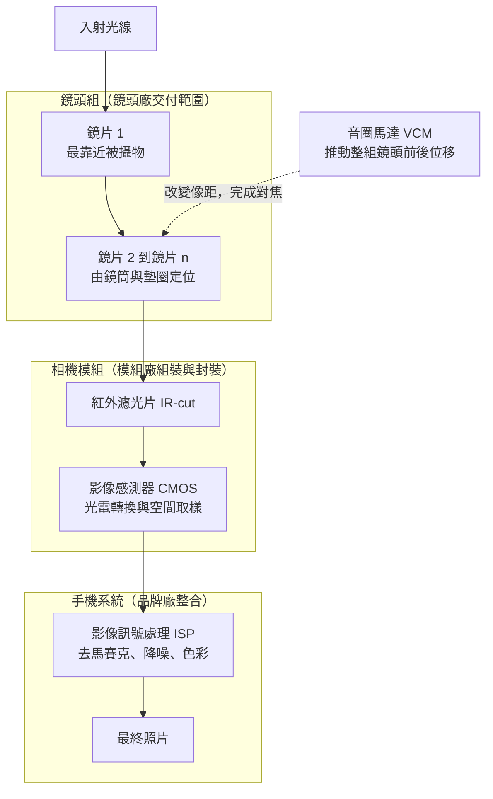

# 01 一支手機的相機，大立光做哪一段？

## 開場問題：一則「相機大升級」的新聞，能算在誰頭上？

每年都會出現這樣的句子：某款新手機「相機大幅升級」、「夜拍能力提升」、「換上兩億畫素主鏡頭」。看到這種消息，很多人下一個動作是去查大立光電（3008，以下簡稱大立光）的營收。這個聯想不算離譜，卻跳過了一段很重要的距離。

一張照片從光線進入手機，到你在螢幕上看到成品，中間經過光學、感測、致動、組裝與影像處理等不同角色，以及零件、模組與整機等層次的驗收。**照片好不好看，是整條鏈共同決定的結果，不能單獨算在任何一段的頭上。** 鏡頭再好，感測器取樣不足、模組組裝歪掉、或影像處理調得過頭，照片一樣不好看；反過來，影像處理再厲害，也補不回鏡頭沒有解析出來的細節。

本章要做的第一件事，就是把這條鏈拆開，讓你知道每一段「誰做、交付什麼、用什麼判定合格」。拆完之後，才有辦法回答本書真正的問題：大立光做的是哪一段、那一段的能力怎麼累積、以及那段能力如何轉成收入。

## 結構與角色：把一顆相機拆到零件層

先建立一個最小但完整的骨架。一顆手機後鏡頭（camera，指一整顆可獨立成像的相機）由下列元素構成，依光線前進的順序排列：

1. **鏡片 lens element**：單一片塑膠或玻璃透鏡，兩個表面各自有設計好的曲面形狀。手機鏡頭常見的表面不是球面，而是**非球面 aspheric**，用來在很短的光路裡壓住像差。市場上說的 6P、7P、8P，P 指的是塑膠鏡片（plastic）的片數，講的是**一顆鏡頭裡有幾片鏡片**。
2. **鏡頭組 lens module／lens assembly**：把多片鏡片依序疊進**鏡筒 barrel**，中間以**墊圈 spacer**控制間距，再加上**遮光片**抑制雜散光，最後固定成一個可以整體搬運與安裝的光學組件。這是鏡頭廠交付的成品。
3. **音圈馬達 VCM（voice coil motor）**：一個微型電磁致動器，通電後推動整組鏡頭前後微幅位移，改變鏡頭到感測器的距離，完成**自動對焦 AF**；加上額外自由度後也可做**光學防手震 OIS**。它移動的是整顆鏡頭，本身不參與成像。
4. **紅外濾光片 IR-cut filter**：擋掉人眼看不到、感測器卻感得到的近紅外光，避免色彩偏移。
5. **影像感測器 CMOS image sensor（CIS）**：把光轉成電訊號，並依畫素陣列做空間取樣。畫素數、畫素尺寸、讀出速度由它決定。
6. **相機模組 camera module**：模組廠把鏡頭組、VCM、濾光片、感測器、軟性電路板與外殼組裝成一顆可以焊上主機板的模組。最關鍵的一道工序是**主動對準 AA（active alignment）**：一邊實際拍測試圖、一邊微調鏡頭相對於感測器的位置與傾角，找到成像最好的姿態後點膠固定。AA 是「用成像結果回頭決定機構位置」的組裝方式，而不是照著圖面裝上去就好。
7. **影像訊號處理 ISP（image signal processor）**：把感測器輸出的原始資料做去馬賽克、降噪、銳化、色彩與動態範圍處理。近年還疊上多幀合成與機器學習後處理。
8. **手機廠整合與調校**：品牌廠決定整機規格、選擇供應商組合、訂定驗收條件，並做最終的影像風格調校。使用者感受到的「這支手機拍得好不好」，判定者是品牌廠與使用者，不是任何一段零件供應商。

*圖 01-1：從入射光到照片的順序示意。**非按比例、非特定公司產品。** 這張圖能讀的是「責任的先後順序」與「哪幾段被封在同一個模組裡」；不能讀成任何實際鏡頭的片數、厚度、間距或元件尺寸比例，也不代表所有相機都採用相同的元件組合。*

把責任攤成一張表會更清楚。注意最後一欄：**每一段的合格判定基準都不一樣，而且不能互相替代。**

| 環節 | 典型供應者類型 | 交付物 | 驗收依據（誰判、判什麼） |
|---|---|---|---|
| 鏡片 | 光學元件廠（常與鏡頭廠同一家） | 單片非球面鏡片 | 廠內量測：面形誤差、厚度、外觀瑕疵、材料特性 |
| 鏡頭組 | 鏡頭廠（大立光在此） | 已組立、可安裝的鏡頭組件 | 光學量測：在指定條件下的解析表現、偏心與傾斜、雜散光；由客戶的入料規格判定 |
| 音圈馬達 VCM | 致動器廠（集團內為大陽科技） | 可通電位移的致動器 | 行程、定位精度、電流、壽命與可靠度測試 |
| 紅外濾光片 | 鍍膜／濾光片廠 | 帶膜系的薄片 | 穿透率與截止波長曲線 |
| 影像感測器 | 半導體 IDM 或晶圓代工＋設計公司 | 已封裝的感測器晶片 | 畫素良率、暗電流、雜訊、讀出時序 |
| 相機模組 | 模組廠 | 可焊上主機板的整顆相機 | AA 後的整體成像判定、可靠度測試、模組層良率 |
| ISP 與影像調校 | 手機晶片商＋品牌廠軟體團隊 | 處理流程與參數 | 主觀與客觀影像評分，含品牌自訂風格 |
| 整機相機體驗 | 品牌廠 | 一支手機 | 品牌內部規格＋市場與媒體評測 |

*圖表 01-2：供應鏈責任表。這張表能讀的是「責任分工的一般結構」與「各段驗收基準的性質差異」；**不能讀成任何特定機種的實際供應商名單**，也不代表每個品牌都採同樣的分工（有些品牌自行承擔更多模組或調校工作）。表中僅大立光與大陽科技為本書已核對的公司，其餘欄位是產業角色的通稱。*

## 作用機制：為什麼分工會長成這個樣子

分工不是憑空切的，是被三件事切出來的。

**第一是製程完全不同。** 鏡片靠精密射出成形與模仁加工，管的是微米甚至次微米級的面形；感測器靠半導體製程，管的是奈米級的電晶體；VCM 靠繞線、磁路與彈片；模組靠貼裝、點膠與固化。四種製程的核心設備與專業不同，也共享精密量測、自動化與品質管理能力，硬要一家做完，等於同時扛四種不同的學習曲線。

**第二是驗收指標不同構面。** 鏡頭的合格與否是光學問題，判的是它在指定條件下能把多細的空間結構轉成多少對比；模組的合格與否是「鏡頭＋感測器這一對裝在一起之後」的問題，AA 就是為了吸收兩者之間的機構誤差而存在的工序；照片好不好看，則是一個含有主觀成分的系統層判斷。上游的指標過關，不保證下游過關；下游不過關，也不一定是上游的錯。

**第三是責任邊界要能追責。** 供應鏈必須能回答「這批不良是誰造成的」。所以每一段交付時都有一組雙方同意的量測條件與門檻，作為責任交接點。這也是為什麼談論鏡頭品質時，**條件比數字重要**：離開了場點、空間頻率、波長與對焦位置，任何解析數字都不能直接跟另一組數字比較（這一段的機制留到[第 03 章](03-image-quality.md)展開）。

理解這三點之後，本書的邊界就很自然了：**大立光交付的是鏡頭（光學鏡片與鏡頭組）。** 馬達與相機模組是供應鏈上的鄰居，不是同一段責任。集團內確實有相鄰業務——大陽科技做音圈馬達，大根光學工業做車用鏡頭與相機模組——但那是**不同的法人主體**。閱讀財報時必須記住：**合併集團的數字不等於母公司單體的數字**，把子公司的產品能力直接說成「大立光做模組」，在法人層次上是錯的。

## 缺陷與失敗：最常見的三種誤讀

**誤讀一：把整機相機表現算在鏡頭廠頭上。** 「這支手機夜拍很強」可能來自更大的感測器、更好的多幀合成、更積極的降噪策略，也可能來自鏡頭的大光圈設計。單看一則評測，無法拆出鏡頭的貢獻比例。反過來，「某機種相機被罵」也不能反推鏡頭供應商出了問題。

**誤讀二：把鏡片數當成相機顆數。** 「8P」是一顆鏡頭裡有 8 片鏡片，不是手機有 8 顆相機。同理，一支有主鏡頭、超廣角、長焦三顆相機的手機，三顆各自有自己的鏡片數，彼此不相加也不相比。片數多通常代表設計上需要更多自由度來壓像差，但**片數本身不是品質指標**：多一片也多一個面形誤差來源、多一組組裝公差、多一層界面反射。

**誤讀三：把鏡頭解析能力當成照片畫素。** 鏡頭的解析能力決定「影像裡最細能分辨到多細的結構」，感測器的畫素數決定「這個影像被切成幾格取樣」。兩者要匹配：鏡頭跟不上，畫素再高也只是把模糊放大；畫素太疏，鏡頭解得再細也被取樣丟掉。所以「兩億畫素」在感測器上指取樣格數；鏡頭商用同一數字描述適配的感測器級別時，仍需搭配 MTF 等條件，也不保證成品照片的細節。

第三種誤讀還有一個更難察覺的版本：看到規格升級的新聞，就推論鏡頭廠獲利一定變好。規格升級同時抬高了價值與製造難度，方向必須靠良率、價格與產品組合的證據來判斷，這是[第 06 章](06-assembly-yield-cost.md)與[第 09 章](09-business-economics.md)的工作。

## 量測與控制：一則消息落在鏈上的哪一格？

面對任何一則相機相關消息，先做三個定位動作：

1. **定位環節**：這是鏡片、鏡頭組、致動器、感測器、模組、ISP，還是整機層次的消息？講「感測器尺寸」的消息不直接對應鏡頭廠；講「鏡頭片數與光圈」的消息才在鏡頭廠的責任範圍內。
2. **定位法人**：消息講的是母公司單體、合併集團，還是集團內某個子公司？大立光、大陽科技、大根光學工業是三個不同主體，官網把它們放在同一個產品入口，不代表收入、客戶或產能可以合在一起講。
3. **定位階段**：這是研發、開發完成、送樣、驗證、量產，還是已認列收入？公司用哪個詞，就寫哪個詞，不往上升級。這條紀律在[第 08 章](08-qualification-competition.md)會變成一整座證據階梯。

## 與大立光的連結

### 已確認事實

- 公司名稱大立光電股份有限公司，股票代號 3008，上市公司；官網所列成立日期 1987 年 5 月 21 日（與 112 年報 p.2 的設立日不同，差異見待查附錄），產業別為光學精密元件製造，公司地址位於台中市南屯區。來源：[官方公司概況](https://www.largan.com.tw/tw/investor)，公司自述，發布日未標示，查閱日 2026-09-14。
- 114 年度年報（即 2025 會計年度，2026-04-20 刊印，法定揭露）記載業務範圍為「各式光學鏡頭模組、與光電零組件等產品之研究開發、設計、生產、銷售與售後技術服務」，產品涵蓋智慧型手機、平板電腦、筆記型電腦、3D 結構光、ToF、屏下光學指紋、AR/VR、汽車鏡頭、鏡片等（第 54 頁）。
- **主力產品自陳**：114 年報第 61 頁載「目前公司以手機鏡頭為主力產品，Tablet 鏡頭次之。客戶均為國內外大廠，故訂單均能有穩定成長。」同頁不利因素欄自陳「手機鏡頭出貨狀況所佔比重過高，無法有效分散市場產品風險。」這兩句是公司自己寫進法定揭露的敘述與風險評估，不是第三方驗證的結論，但它同時告訴我們主力產品與主要風險是同一件事。
- **財務錨點**：114 年度合併營業額新台幣 61,147,888 千元，較 113 年度 59,457,553 千元成長 3%；研發費用 5,293,321 千元，佔營收 8.66%。來源：114 年報第 1 頁致股東報告書與第 57 頁技術及研發概況，法定揭露，2026-04-20 刊印。**口徑為集團合併、新台幣千元、年度期間。**
- **客戶以代號揭露**：114 年報第 63 頁依規定揭露占銷貨總額 10% 以上的客戶，全部以數字代號列示，未揭露名稱。113 年度與 114 年度，代號 653021 均占 30%（金額分別為 18,035,001 千元與 18,338,766 千元）。**年報沒有具名，本書就不具名。** 任何把代號對應到某家品牌手機廠的說法，都超出這份文件的揭露範圍。
- **關鍵沿革（保留公司原文階段用語）**：以下取自[公司沿革](https://www.largan.com.tw/tw/about/history)（公司自述，發布日未標示，查閱日 2026-09-14）。

| 年份 | 公司原文敘述 | 這條能證明什麼 |
|---|---|---|
| 1987 | 大立光電股份有限公司創立 | 成立時點 |
| 1990 | LP1（大立一廠）落成 | 廠房工程進度 |
| 2002 | 上市掛牌成功；手機用相機鏡頭**開發完成** | 進入手機鏡頭領域的研發里程碑 |
| 2009 | 手機 EDOF 鏡頭全球首家**量產**；手機 12M AF 自動對焦鏡頭**開發完成**；LP5 落成 | 同一年同時出現「量產」與「開發完成」兩種不同階段用語 |
| 2018 | 手機用 1 億畫素超高解像 8P 高階鏡頭**開發完成** | 高片數設計的研發里程碑 |
| 2019 | LP8 落成；10 倍光學變焦手機鏡頭**開發完成** | 同上 |
| 2020 | 手機用 2 億畫素超高解析鏡頭**開發完成** | 同上 |
| 2022 | LP10（大立十廠）**啟用**；手機用潛望式變焦鏡頭**開發完成** | 廠房啟用＋潛望式研發里程碑 |
| 2025 | LP4（大立四廠）**落成**；LP9（大立九廠）**落成** | 廠房工程進度 |

*圖表 01-3：沿革與階段用語對照。**「開發完成」是公司自陳的研發或工程里程碑，不等同量產出貨、不等同特定客戶採用、也不代表出貨規模；「落成」「啟用」是廠房工程進度，不等於產能已滿載或已投入特定產品生產。** 這張表能讀的是能力累積的時間順序，不能讀成市場份額或營收的時間序列。*

### 合理推論

- 既然公司自陳手機鏡頭是主力、且自陳比重過高難以分散風險，那麼**手機機種的規格與出貨節奏，對這家公司的季度營收具有放大效果**。這是方向性的推論，幅度無法從年報數字反推。
- 114 年度研發費用占營收 8.66%，且 114 年報第 55 頁列出的未來研發方向橫跨車用、醫療、AR/VR、可變光圈、模造玻璃、分群 folded tele 等多條路線，可以推論公司正在用研發支出換取應用面的分散。但**研發方向清單屬公司計畫性文字，不是已完成或已出貨的證據**。

### 尚待查證

- 大陽的會計控制判斷與大根現行持股結構。2026-09-15 複核 114 年報第 49 頁，已確認 2025-12-31 大立光直接持有大陽 49.37%；綜合投資 55.35% 含董事、經理人等，不等於母公司持股。另有兩家公司官網的自述定位（大陽科技自述成立於 1998 年、為「大立光電集團成員之一」、主要產品為音圈馬達；大根光學工業自述成立於 2021 年、專注車用與工業鏡頭及相機模組），持股數字需另查公開資訊觀測站「關係企業三書表專區」或合併財務報表附註。
- 兩家子公司是否有單獨揭露的收入或毛利，以及它們在合併報表中的貢獻比例。
- 大立光鏡頭在任一具名客戶機種上的採用證據。本書不從「客戶均為國內外大廠」這類敘述補上任何品牌名稱。

## 推理檢查

1. 某評測說 A 手機夜拍明顯優於 B 手機，而兩支手機的主鏡頭都採 7P 設計。可以據此判斷 A 的鏡頭供應商技術較強嗎？還缺哪些資訊？
2. 一則消息說「某新機採用 8P 鏡頭，較上一代的 7P 增加一片」。這增加的一片，可能同時帶來哪些正面與負面效果？
3. 大立光官網的產品頁同時展示手機鏡頭、音圈馬達與影像鏡頭模組。能不能因此說「大立光同時做鏡頭、馬達與模組」？要怎麼修正這句話才精確？
4. 114 年報第 63 頁顯示代號 653021 的客戶在 113、114 兩個年度都占銷貨的 30%。這個事實能支持什麼結論、不能支持什麼結論？
5. 如果某模組廠回報「這批相機模組的成像判定不過」，在追查責任之前，至少要先排除哪幾個非鏡頭因素？

??? note "參考推理"
    1. 不能。夜拍差異可能來自感測器尺寸與畫素設計、光圈值、多幀合成與降噪策略、甚至機構遮光。要判斷鏡頭貢獻，需要同條件下的鏡頭光學量測數據，而這類數據通常不公開。「7P 相同」只說明片數相同，鏡片材料、面形、光圈與整體設計都可能不同。
    2. 正面：多一片提供額外的設計自由度，可望更好地校正像差或支援更大光圈、更廣視角。負面：多一個面形誤差來源、多一組組裝公差、多兩個界面的反射與雜散光風險，且鏡頭總長與成本可能上升。方向要靠實測與良率資料判斷。
    3. 不能直接這樣說。官網是**集團**產品入口；音圈馬達對應的是大陽科技、車用鏡頭與模組對應的是大根光學工業，三者法人主體不同。精確的說法是「大立光電交付鏡頭；集團內另有法人分別從事音圈馬達與車用鏡頭／模組業務，大陽直接持股見年報第 49 頁，完整控制與大根持股結構尚待查證」。
    4. 能支持：公司存在顯著的客戶集中，且該集中在兩個年度間穩定。不能支持：該客戶是誰、該客戶採用的是哪些機種或產品、以及占比穩定是否意味關係穩固（占比相同也可能是兩年內各自不同組合的巧合）。年報未具名，就維持未具名。
    5. 至少要先排除：感測器批次差異、AA 製程參數與點膠固化偏移、濾光片鍍膜異常、外殼機構應力造成的傾斜、以及測試治具與測試條件本身的變異。鏡頭只是候選原因之一。

## 來源與待查

本章的公司敘述全部來自兩類來源：**公司自述**（官網公司概況、公司簡介、公司沿革、產品與服務頁，發布日均未標示，查閱日 2026-09-14）與**法定揭露**（大立光電 114 年度年報，2026-04-20 刊印，引用頁碼逐條標於正文）。兩者證據等級不同：法定揭露受申報規範拘束並標明適用期間與口徑，公司自述則未經第三方查核，且沿革頁的年份為公司自陳，非外部公告日。

本章刻意沒有提供的東西：任何客戶名稱、任何市占率或排名、任何鏡頭良率或價格數字。這些不是漏寫，是本輪沒有可核對的一手來源。完整來源清單與待查項目見[來源索引](appendix-sources.md)與[待查問題](appendix-open-questions.md)。

下一章把鏡頭這一段單獨放大，處理它內部的第一組矛盾：手機要薄、要拍得遠、又要夜拍好——這三件事為什麼會互相打架。前往[第 02 章](02-optical-tradeoffs.md)。
