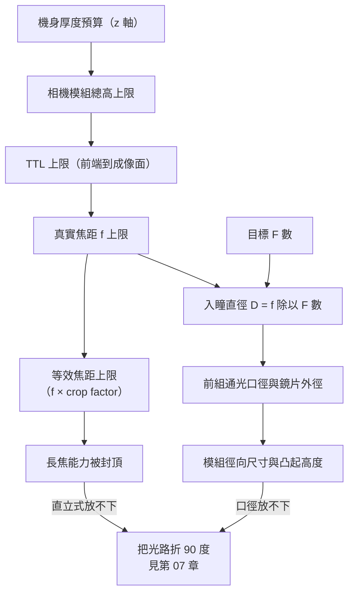

# 02 手機要薄、要拍得遠、又要夜拍，衝突在哪？

## 開場問題：三個規格為什麼不能一起往上加

規格表上常同時出現：「等效 24mm 主鏡、F/1.6」「等效 120mm 長焦、5 倍」「大底感測器、夜拍更亮」「機身厚度 8.x mm」。每一行單獨看都合理，於是讀者會問：既然長焦好用，為什麼不把所有鏡頭都做長一點？既然大光圈進光多，為什麼長焦的 F 數總是比主鏡大？

答案不在行銷，而在幾個互相綁死的物理量。本章把焦距、視角、感測器尺寸、F 數與總光學長度 TTL 放在同一張表上，說明為什麼「薄」會直接吃掉「遠」。這也是[第 07 章](07-telephoto-actuation.md)潛望式結構存在的理由。

**本章所有焦距、TTL、F 數、厚度數字都是教學假設，用來示範關係與量級，不是大立光或任何特定機型的實際規格。** 標「文獻數據」者附研究來源；標「教學假設」者由作者設定，可代換重算。

### 動態圖解：波前如何經過透鏡聚焦

<figure class="wiki-media">
  <a href="https://upload.wikimedia.org/wikipedia/commons/c/c7/Lens_and_wavefronts.gif"></a>
</figure>

先看上方平行的紅色波前，再看透鏡下方彎曲並向焦點收攏的波前。紅線表示同相位的位置，不是一條條光線；這是理想化聚焦示意，沒有呈現真實鏡頭的繞射斑、像差或多片結構。

*圖源：[Lens_and_wavefronts.gif](https://commons.wikimedia.org/wiki/File:Lens_and_wavefronts.gif)，Oleg Alexandrov，[公有領域](https://commons.wikimedia.org/wiki/File:Lens_and_wavefronts.gif)。[開啟線上動畫](https://upload.wikimedia.org/wikipedia/commons/c/c7/Lens_and_wavefronts.gif)；直接載入 Wikimedia 原始 GIF，未修改。*

## 結構與角色：五個綁在一起的變數

| 變數 | 符號／單位 | 誰主要決定 | 對讀者的意義 |
|---|---|---|---|
| 真實焦距 effective focal length | f，mm | 鏡頭設計 | 鏡頭的實體光學量，不是規格表上那個數字 |
| 感測器對角線 | d，mm | 感測器廠與品牌選型 | 和 f 一起決定視角，也決定 crop factor |
| 對角視角 angular field of view | AFOV，度 | f 與 d 共同決定 | 「拍得廣或拍得窄」的真正描述 |
| 光圈 F 數 f-number | F#，無單位 | 鏡頭設計 | 等於 f ÷ 入瞳直徑，決定單位面積進光 |
| 總光學長度 total track length | TTL，mm | 鏡頭設計 | 鏡頭最前端到成像面，直接吃機身厚度 |

鏡頭廠只能直接動 f、F#、TTL 三項；d 由品牌與感測器供應商決定，AFOV 則是前兩者的結果，不是可以獨立指定的自由變數。對無限遠物體、近似無畸變的直線投影鏡頭，綁定關係為 AFOV = 2 × arctan(d ÷ 2f)（Edmund Optics,〈Understanding Focal Length and Field of View〉）。式子裡沒有「倍率」這個量——手機講的「5 倍」可能是兩支鏡頭等效焦距的比值；單看倍率不能判定是否連續光學變焦。

## 作用機制一：等效焦距只是換算，不是真實焦距

規格寫「24mm」而鏡頭實體焦距只有 5mm 左右，並非誇大。**等效焦距 35mm equivalent focal length 的定義是：要在 35mm 全片幅相機上拍出同樣視角，需要多長的焦距。** 換算係數叫 crop factor，等於兩者感測器對角線的比值（Wikipedia,〈35 mm equivalent focal length〉、〈Crop factor〉）。

```text
35mm 全片幅感光面 36 × 24 mm，對角線 = √(36² + 24²) ≈ 43.27 mm
crop factor = 43.27 ÷ d
等效焦距 = 真實焦距 f × crop factor
```

所以「等效 24mm」是**視角的代號**，不是長度的宣告。下表直接給對角線 d 而不用「1/1.3 吋」這種寫法，因為吋制型號的對角線換算在業界並不一致，寫 mm 才能重算。

| 用途 | 感測器對角線 d（mm） | crop factor | 真實焦距 f（mm） | 等效焦距（mm） | 對角視角 |
|---|---:|---:|---:|---:|---:|
| 超廣角 | 6.4 | 6.76 | 2.2 | 約 14.9 | 約 111° |
| 主鏡 | 9.6 | 4.51 | 5.3 | 約 23.9 | 約 84° |
| 中焦（相對本例主鏡約 1.9 倍） | 6.4 | 6.76 | 6.7 | 約 45.3 | 約 51° |
| 長焦 | 5.0 | 8.65 | 14.0 | 約 121 | 約 20° |

*圖表 02-1：真實焦距、等效焦距與視角對照。全部為教學假設，非特定公司產品或機型實測值；基準為 35mm 全片幅對角線 43.27 mm。這張表能讀出「等效焦距是換算值、視角才是物理描述」，不能讀出任何機型的規格，也不能用來比較畫質。*

第四列是關鍵：想要「等效 120mm」，在對角線 5.0 mm 的感測器上就需要 **14 mm 的真實焦距**。這個數字馬上會撞上機身厚度。

## 作用機制二：薄度限制 TTL，TTL 限制焦距

TTL 在本章指第一光學面到成像面沿光軸的幾何距離。直立式鏡頭中，它佔用厚度預算；完整模組還要加上封裝、外殼等空間，折疊架構則需另算各方向尺寸。

TTL 與 f 不相等，但被綁在一起。TTL/f 隨設計而變，沒有通用固定比值；長焦可採「望遠型 telephoto 配置」（前組正、後組負）把 TTL/f 壓到 1 以下，但壓縮幅度有限，愈壓，像差校正餘裕與公差敏感度愈差——代價在[第 03 章](03-image-quality.md)與[第 06 章](06-assembly-yield-cost.md)付出。

```text
比例尺：每一格 ≈ 0.5 mm（僅橫向長度同一尺度；鏡片形狀未繪出）

z 軸可用高度（教學假設 7.0 mm）   |==============|
超廣角  f=2.2   TTL≈4.8 mm        |==========|
主鏡    f=5.3   TTL≈6.6 mm        |=============|
2x 中焦 f=6.7   TTL≈7.7 mm        |===============|      ← 已略為超出
長焦    f=14.0  TTL≈11.9 mm       |========================|  ← 直立式放不進去
```

*圖 02-2：同尺度光路長度對照。TTL 由教學假設的 TTL/f 比值算出（超廣角 2.2、主鏡 1.25、中焦 1.15、長焦 0.85），z 軸可用高度 7.0 mm 亦為教學假設。這是數值長條示意，橫向格數四捨五入；非特定公司產品，並非鏡頭剖面。這張圖能讀出「長焦所需長度會超出厚度預算」，不能讀出任何實際模組的設計。*

因果鏈於是成形：機身要薄 → 模組 z 高度預算變小 → TTL 上限變小 → 真實焦距上限變小 → 在給定感測器下等效焦距上限變小 → 長焦能力被封頂。常見的取捨有：增加模組凸起或調整光學配置；也可換更小的感測器（crop factor 變大，但進光量變差），或者**把光路折彎**，讓那 12 mm 躺在機身的長寬平面上。後者就是潛望式，見[第 07 章](07-telephoto-actuation.md)。

## 作用機制三：F 數是比值，長焦要維持 F 數就得放大口徑

F 數的定義是**有效焦距 ÷ 系統入瞳直徑**（Edmund Optics,〈System Throughput, f/#, and Numerical Aperture〉）。它是比值不是孔徑，所以同一個 F 數在不同焦距上，實際光孔可以差好幾倍。

```text
入瞳直徑 D = f ÷ F 數           （以下皆為教學假設代入定義式）
主鏡：f = 5.3 mm、F/1.6  → D ≈ 3.31 mm
長焦：f = 14.0 mm、F/2.8 → D ≈ 5.00 mm
若長焦也要 F/1.6         → D = 14.0 ÷ 1.6 ≈ 8.75 mm
```

這解釋了規格表上的固定現象：**長焦的 F 數幾乎總是比主鏡大。** 不是設計者不想做大光圈長焦，而是入瞳直徑必須隨焦距等比放大，前組通光口徑與鏡片外徑跟著放大，模組在長、寬、高三個方向同時變大——凸起更高、佔用主板面積更多、成形與公差難度也上升。手機沒有這個空間預算。



*圖 02-3：規格之間的約束鏈。箭頭是「限制誰」的方向，不是製造順序。能讀出各變數的相依關係，不能讀出任何量化的臨界值。*

### 動態圖解：光圈開合：先看孔徑，再讀 F 數

<figure class="wiki-media">
  <a href="https://upload.wikimedia.org/wikipedia/commons/0/03/Aperture-Lens.gif"></a>
</figure>

觀察中央開口如何隨葉片移動而變大、變小。這是傳統相機鏡頭示範，不代表手機鏡頭都有可變光圈，也不是大立光產品；F 數中的入瞳直徑仍需依光學定義判定，不能直接拿照片上的孔洞像素換算。

*圖源：[Aperture-Lens.gif](https://commons.wikimedia.org/wiki/File:Aperture-Lens.gif)，GRPH3B18，[CC BY-SA 3.0](https://creativecommons.org/licenses/by-sa/3.0/)。[開啟線上動畫](https://upload.wikimedia.org/wikipedia/commons/0/03/Aperture-Lens.gif)；直接載入 Wikimedia 原始 GIF，未修改。*

## 作用機制四：夜拍真正能動的槓桿

同一場景亮度與曝光時間下，落在單一像素的光子數大致正比於「像素面積 ÷ F 數的平方」；光子雜訊主導時，訊噪比大致正比於光子數的平方根。於是在固定透過率與量子效率的簡化模型中，夜拍有三個直接槓桿：壓小 F 數、把像素做大（或增加感測面積以提高全畫面總收光）、拉長曝光時間（代價是手震與被攝物移動）。

滿井容量 full well capacity 是像素飽和前可容納的電子數。它與量子效率、讀出雜訊都受感測器製程影響，不能單凭像素大小判定。以下只比較光子雜訊主導、其他條件相同時的單像素訊噪比；若比較相同輸出尺寸，還須考慮像素合併與重採樣。

教學算例：在感測器總面積與 F 數都不變下，像素間距從 2.0 μm 縮到 1.0 μm，單像素受光面積變成四分之一，光子數約為四分之一，光子雜訊主導下的單像素訊噪比約為原來的一半（教學假設，忽略讀出雜訊與量子效率差異）。像素合併 pixel binning 在後端把相鄰像素加總補回訊號，但那是拿解析度換訊噪比，不代表感測器物理本身變好。

**「大光圈＝淺景深」這句話在手機上要謹慎說。** 固定焦距、物距及清晰判定標準時，F 數變小會帶來進光量增加與光錐角變大、景深變淺（Opto Engineering,〈F/# and depth of field in optical systems〉）。但手機感測器極小、真實焦距極短，同視角下的物理景深其實遠比大片幅相機深。研究筆記據此推論：多數手機「人像模式」的淺景深主要來自計算攝影模擬，而非純光學大光圈的自然結果。**這句本書標示為推論**——研究過程未找到直接做此對比的文獻，讀者若要引用應自行查證，或參考[MIT 計算攝影](../../mas531-computational-photography/html/index.html)另行核對。

## 缺陷與失敗：每個取捨都有帳要付

| 為了拿到 | 付出的代價 | 會出現什麼 |
|---|---|---|
| 更薄（壓縮 TTL） | 像差校正餘裕變小、公差敏感度上升 | 邊角銳利度掉得快，組裝偏差更容易顯影（[第 06 章](06-assembly-yield-cost.md)） |
| 更薄（出瞳拉近成像面） | 邊緣主光線入射角 CRA 升高 | 邊角亮度不均與色偏 |
| 更長焦（同 F 數） | 入瞳直徑等比放大 | 前組口徑與模組凸起變大 |
| 更多畫素（同面積） | 單像素變小 | 滿井容量與單像素訊噪比可能下降；同尺寸輸出仍須另比 |
| 更深景深（縮光圈） | 艾里斑變大 | 繞射開始限制解析力（[第 03 章](03-image-quality.md)） |

CRA chief ray angle 是離軸物點通過光圈中心的主光線與光軸夾角，量測於成像面，規格通常標最大值。文獻描述：出瞳放遠則主光線幾乎垂直入射，但需要較大的後組孔徑與較長機身；緊湊模組把出瞳推近感測面以縮短 z 軸高度，邊緣 CRA 因此升到 25°–35°，而工業用感測器通常維持 0°–15° 以相容傳統玻璃光學（文獻數據，Commonlands Optics,〈Lens Chief Ray Angle (CRA) and CRA Mismatch〉，更新於 2026 年 5 月）。

關鍵是：**CRA 過大不是鏡頭單方面的缺陷，而是鏡頭與感測器的配對問題。** 鏡頭的 CRA 曲線若與感測器的角度響應不匹配，就可能產生額外的邊角損失；匹配能減少此風險，並不保證其他像質項目合格。這也是為什麼「鏡頭好不好」如果不指定搭配對象，通常沒有答案。

## 量測與控制：要看懂一份規格，至少要這六欄

單獨一組「等效 24mm、F/1.6」無法判斷任何事。可比較的最小欄位是：**(1)** 真實焦距 f 與量測波長條件；**(2)** 等效焦距的換算基準（是否為 43.27 mm 對角線）；**(3)** 感測器對角線與像素間距，不要只寫吋制型號；**(4)** F 數並註明是否為最大光圈；**(5)** TTL，以及是否含感測器封裝與保護玻璃；**(6)** CRA 規格（最大值與對應像高）與搭配感測器的目標 CRA。

缺任何一欄，兩支手機的規格就只能並排看，不能相減。特別是第 2 與第 3 欄：兩支手機都標「等效 24mm」，真實焦距、感測器尺寸、TTL 可以完全不同，光學難度也完全不同。

## 與大立光的連結

### 已確認事實

公司官方沿革列出 2018 年 8P（八片式）鏡頭、2022 年手機用潛望式變焦鏡頭**開發完成**，以及 2025 年 LP4／LP9 廠區落成（[公司沿革](https://www.largan.com.tw/tw/about/history)，查閱 2026-09-14）。階段用語維持公司原文：「開發完成」就是開發完成，不等於指定客戶採用、量產或認列收入。

### 合理推論

本章推導的「薄度 → TTL → 焦距 → 長焦能力」約束鏈是產業普遍面對的物理限制；一家手機鏡頭廠的產品線上出現潛望式結構，與這條約束鏈的方向一致。這只是**邏輯一致性**，不構成公司內部設計選擇、時程或技術路線的證據。

### 尚待查證

以下全部未查證，不得從本章推出：公司任何產品的真實焦距、TTL、F 數、CRA 規格；8P 與潛望式產品的客戶、機型、出貨時點與數量；任何良率、價格或毛利數字；公司與感測器廠在 CRA 匹配上的協作方式。列入[待查問題](appendix-open-questions.md)。

## 推理檢查

1. 兩支手機都標「等效 24mm」，能不能推論它們的真實焦距相同？不能的話，還需要知道什麼？
2. 把長焦真實焦距從 14.0 mm 提高到 20.0 mm，同時維持 F/2.8，入瞳直徑要變多大？TTL 往哪個方向走？
3. 感測器總面積與 F 數都不變，只把畫素數從 1200 萬拉到 5000 萬，夜拍單像素訊噪比往哪走？廠商為什麼要加像素合併？
4. 為什麼縮小光圈換景深不是免費的？代價出現在[第 03 章](03-image-quality.md)的哪個機制？
5. 某支手機邊角偏暗又偏色，能不能直接判定「鏡頭不好」？

??? note "參考推理"
    1. 不能。等效焦距只是視角的換算代號，真實焦距 = 等效焦距 ÷ crop factor，而 crop factor 取決於感測器對角線。至少還要知道感測器對角線與換算基準。
    2. D = 20.0 ÷ 2.8 ≈ 7.14 mm，比原來的 5.00 mm 放大約 1.43 倍。TTL 通常隨焦距變長；即使用望遠型配置壓到 TTL/f = 0.85，TTL 也從約 11.9 mm 升到約 17 mm，更放不進厚度預算。
    3. 單像素面積約變為四分之一，光子數與訊噪比都下降。像素合併把相鄰像素加總，用解析度換回訊噪比，屬於後端取捨，不是感測器物理變好。
    4. F 數變大會讓艾里斑變大（直徑正比於波長與 F 數）。不能只以艾里斑是否大於一個像素判定像素已無效，應比較指定頻率的光學對比與取樣極限，即第 03 章的繞射極限。
    5. 不能。邊角偏暗偏色可能來自相對照度的自然衰減（cos⁴ 幾何）、暈影，也可能來自 CRA 與感測器微透鏡不匹配。CRA 是配對指標，判定前必須知道搭配的感測器規格。

## 來源與待查

**通用光學來源**（研究筆記查閱日 2026-09-15；各頁面未標示發布日者記為未標示）：Edmund Optics〈Understanding Focal Length and Field of View〉<https://www.edmundoptics.com/knowledge-center/application-notes/imaging/understanding-focal-length-and-field-of-view/>；Edmund Optics〈System Throughput, f/#, and Numerical Aperture〉<https://www.edmundoptics.com/knowledge-center/application-notes/imaging/lens-iris-aperture-setting/>；Wikipedia〈35 mm equivalent focal length〉與〈Crop factor〉；Commonlands Optics〈Lens Chief Ray Angle (CRA) and CRA Mismatch〉（更新於 2026 年 5 月）<https://commonlands.com/blogs/technical/lens-chief-ray-angle-and-mismatch>；Opto Engineering〈F/# and depth of field in optical systems〉<https://www.opto-e.com/basics/f-and-depth-of-field>；Farrell、Feng、Kavusi〈Resolution and Light Sensitivity Tradeoff with Pixel Size〉SPIE 2006。

**公司來源**：大立光[公司沿革](https://www.largan.com.tw/tw/about/history)，查閱 2026-09-14，未標示頁面更新日。

**待查**：

1. Zeiss/Advanced Optical Technologies 手機相機光學設計論文原文：目前只有搜尋摘要支持「TTL 通常小於約 10mm」，作者、年份、發表處與頁碼皆未確認。
2. 「TTL/f 可壓到 1 以下」的定量界線：本章以 0.85 作教學假設，尚未取得光學設計教科書（如 Smith,《Modern Optical Engineering》）的章節頁碼佐證。
3. 手機人像模式淺景深中，純光學與演算法的貢獻比例：研究筆記列為推論，未找到直接文獻。
4. Edmund Optics〈Depth of Field and Depth of Focus〉在研究時回傳 403，景深關係僅由 Opto Engineering 佐證。
5. 大立光任何產品的實際焦距、TTL、F 數、CRA 規格與客戶對應關係。

下一章換一個問題：規格上的焦距與光圈都對了，照片為什麼還是不夠清楚？
