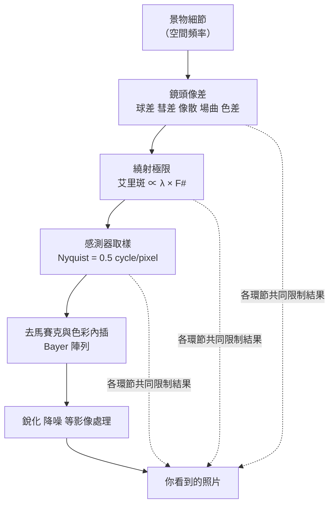

# 03 畫素更高，為什麼照片不一定更清楚？

## 開場問題：五千萬畫素，放大看卻不比一千兩百萬清楚

同一場景，用兩支手機各拍一張：一支標 5000 萬畫素，一支標 1200 萬畫素。把兩張照片放到 100% 檢視，中心的細節差距遠小於畫素數的差距，邊角甚至是高畫素那支更糊；拍磚牆或細格紋衣服時，高畫素那支還多出一圈不存在的彩色條紋。

畫素數是感測器上的取樣格子數，不是「照片裡有多少可辨識的細節」。細節在到達那些格子之前，要先通過鏡頭的像差、繞射，之後還要通過取樣與色彩內插。本章把這條鏈拆開，並用相當篇幅處理一個最容易被誤用的指標：MTF。

**本章所有 MTF 數值、像素間距與頻率都是教學假設，用來示範讀圖方法，不是任何公司或產品的量測結果。** 標為「文獻數據」者附研究來源。

## 結構與角色：解析力是一條鏈，不是一個數字

<div class="diagram-scroll" style="--diagram-width: 480px" markdown="1">



</div>

*圖 03-1：解析力鏈路。這張圖能讀出「每一關都會限制細節」以及木桶效應的概念，不能讀出各關在特定產品上的實際強弱順序——那要靠量測。*

在可視為線性、局部平移不變的條件下，串聯系統的傳遞函數可相乘。鏡頭像差與繞射需合併計算光學響應；取樣會造成疊頻，銳化可能提升高頻響應，降噪也常是非線性的，不能把圖中每一關都當成獨立低通濾波器。所以**只提升其中一關（例如把畫素數翻四倍）而其他關沒有同步改善，成品不會等比變清楚**。

### 動態圖解：不同入射方向，落在焦平面的不同位置

<figure class="wiki-media">
  <a href="https://upload.wikimedia.org/wikipedia/commons/0/02/Focal_plane.gif"></a>
</figure>

跟著紅色平行光束的方向變化，看交會點沿右側灰色焦平面上下移動。這是理想化的方向與像點對應；不是對焦馬達移動，也沒有示範真實鏡頭的場曲或量測 MTF。

*圖源：[Focal_plane.gif](https://commons.wikimedia.org/wiki/File:Focal_plane.gif)，Fffred，[公有領域](https://commons.wikimedia.org/wiki/File:Focal_plane.gif)。[開啟線上動畫](https://upload.wikimedia.org/wikipedia/commons/0/02/Focal_plane.gif)；直接載入 Wikimedia 原始 GIF，未修改。*

## 作用機制一：六種像差，各自在照片上長什麼樣

單色像差有五種（賽德三階像差 Seidel aberrations），加上一種因波長而異的色差。下表讓讀者能從照片徵狀往回推。

| 像差 | 發生位置 | 照片上的樣子 | 主要校正手段 |
|---|---|---|---|
| 球差 spherical aberration | 軸上也發生 | 整體發虛、亮點外圈帶柔光暈，縮光圈會改善 | 非球面面形、多片折射力分配 |
| 彗差 coma | 離軸 | 點光源拖出彗星／翅膀狀尾巴，尾巴方向多指向畫面外側 | 面形與光闌位置設計 |
| 像散 astigmatism | 離軸 | 同一位置的徑向線條與切向線條無法同時合焦 | 面形設計；量測上表現為 sagittal／tangential 分離 |
| 場曲 field curvature | 離軸 | 中心合焦時邊緣糊，把焦點移到邊緣則中心糊 | 加入負度數鏡片壓平像場 |
| 畸變 distortion | 離軸 | 直線變成桶狀或枕狀，但銳利度不受影響 | 常留給影像處理電子校正 |
| 色差 chromatic aberration（軸向） | 軸上也發生 | 高反差邊緣出現對稱的紫邊或綠邊，縮光圈會改善 | 不同折射率／阿貝數材料搭配 |
| 色差（橫向／倍率） | 離軸 | 邊緣細節往外側出現彩色位移，愈靠角落愈明顯 | 材料搭配；部分可軟體校正 |

*圖表 03-2：像差徵狀對照。整理自 JML Optical,〈Third-Order Seidel Aberrations〉與色差相關文獻（研究筆記查閱 2026-09-15）。這張表能用來從徵狀列出候選成因，不能單憑一張照片就確定成因——同一個徵狀可能來自設計、成形或組裝。*

兩個常被混在一起的觀念要分開：

- **非球面處理的是單色像差**（球差、彗差、像散、場曲、畸變），因為它改的是面形。
- **非球面不會消除材料色散**。面形與光焦度配置仍會影響色差，但一般消色差設計需要搭配材料色散與正負光焦度，這是[第 04 章](04-lens-design-materials.md)談阿貝數與玻塑混合的直接動機。

這也回答了「為什麼要疊 6 片、7 片、8 片」：單一球面鏡片幾乎不可能同時壓低六種像差。多片設計是把不同像差分配給不同鏡片去部分抵消，追求的是**整體系統平衡**，不是單片最優。所以片數是「這支鏡頭在對付什麼設計難題」的線索，**不是畫質分數**；同樣是 8P，在不同焦距、光圈、視角、TTL 約束下代表的難度完全不同，不能跨機型直接比片數論高下。

## 作用機制二：MTF 是一條曲線，不是一個分數

MTF（調制傳遞函數 modulation transfer function）量的是：把一組已知對比的黑白條紋拍下來，輸出的對比還剩多少比例。對正弦條紋，對比 C = (Imax − Imin)/(Imax + Imin)，MTF 是同一空間頻率下輸出對比與輸入對比之比，通常再以零頻率響應歸一化。斜邊量測則由線擴散函數的傅立葉轉換取得響應；其中 f 是空間頻率（Imatest,〈Sharpness〉，查閱 2026-09-15）。Trioptics 稱 MTF 為「全球公認、用來描述光學系統成像性能的基本參數」（Trioptics,〈Measuring the imaging quality of optics〉，查閱 2026-09-15）。

**脫離頻率談 MTF 沒有意義。** 「這顆鏡頭 MTF 90%」這句話缺少最重要的自變數。下面是一條教學曲線，用表格列出數值點：

| 空間頻率（cy/mm） | 場點 0.0（S＝T） | 場點 0.8 sagittal | 場點 0.8 tangential |
|---:|---:|---:|---:|
| 0 | 100 | 100 | 100 |
| 50 | 88 | 78 | 70 |
| 100 | 72 | 55 | 43 |
| 150 | 55 | 36 | 24 |
| 200 | 40 | 22 | 12 |
| 250 | 27 | 12 | 5 |
| 300 | 17 | 6 | 2 |

*圖表 03-3：教學用 MTF 曲線的數值點（單位％）。**全部為作者設定的教學假設，非任何產品的量測值。** 這張表能用來練習判讀曲線形狀與場點差異，不能當成任何鏡頭的性能基準。*

讀這張表要看三件事：

1. **本例曲線隨頻率單調下降**。零頻率的 100% 是歸一化基準，不表示鏡頭沒有光量損失；實際 MTF 可能有谷值或回升，含銳化的系統響應甚至可超過 100%。用線性內插求「降到 50% 的頻率」（業界常寫成 MTF50）：場點 0.0 約 167 cy/mm，場點 0.8 的 sagittal 約 113 cy/mm、tangential 約 87 cy/mm。
2. **本例邊角比中心差**。離軸像差常使邊角較弱，但這不是所有設計、頻率與對焦條件下的必然排序。
3. **場點 0.8 的兩條線分開**，分離提示方向性差異，像散是候選原因之一，不能把分離量直接當成像散量（Edmund Optics,〈The Modulation Transfer Function〉，查閱 2026-09-15）。而**場點 0.0 的兩條線在理想旋轉對稱系統中應該重合**——如果實測的中心場點也出現明顯分離，那通常不是設計問題，而是鏡片偏心或傾斜這類組裝誤差的訊號，屬於[第 06 章](06-assembly-yield-cost.md)的範圍。

sagittal（弧矢，部分廠商稱 radial）指測試圖案的線條平行於「畫面中心到角落」的連線；tangential（切向，部分廠商稱 meridional）則垂直於該連線。這是**條紋方向的定義，不是鏡頭上某個物理部位**。

## 作用機制三：為什麼不同條件下的 MTF 不能直接比較

這是本章最需要記住的一段。MTF 不是一個分數，而是至少五到六個變數的函數；只要有一個變數不同，兩個數字就不能比大小——就像拿不同考卷、不同給分標準的分數來排名。

| 變數 | 改變它會發生什麼 | 常見的不可比情形 |
|---|---|---|
| 空間頻率單位 | lp/mm 只跟物理尺寸有關；cy/px 跟像素間距有關；LW/PH 才是跨感測器尺寸比較的合適單位 | 兩支不同感測器尺寸的手機直接比「MTF50 在多少 lp/mm」 |
| 場點 | 中心與邊角差距可以很大 | 一方報中心、另一方報全場平均 |
| 方向 | 像散會讓 sagittal 與 tangential 差很多 | 只報比較好看的那一個方向 |
| 波長條件 | 可在單一波長或某個光譜範圍內量測；單色量測會把色差藏起來 | 一方用單色雷射、另一方用白光加權 |
| 對焦位置 | 可在有限、無限及非聚焦（afocal）位置量測；逐場最佳對焦會把場曲抵消掉 | 一方固定像面、另一方逐場找最佳焦 |
| 量測對象 | 純鏡頭 MTF vs 含感測器與影像處理的系統響應 | 後者的銳化會把數字抬高 |

（單位、方向、波長與對焦條件的描述整理自 Imatest,〈Sharpness〉與 Trioptics,〈Measuring the imaging quality of optics〉，查閱 2026-09-15。）

第六列值得單獨說明。Imatest 區分 SFR 與 MTF：SFR（空間頻率響應）較常對應**完整系統**的響應，MTF 較常對應**單一元件**的個別效應。ISO 12233 定義的 slanted-edge 法拍一張傾斜幾度的黑白邊緣，從邊緣擴散函數微分得到線擴散函數，再傅立葉轉換得到頻率響應——量的是「鏡頭＋感測器＋處理」整條鏈路。2023 版標準描述兩種量法：基於邊緣的 e-SFR 與基於正弦波（西門子星靶）的 s-SFR，並把 e-SFR 測試圖的傾斜方塊改為四週期傾斜星以支援對角方向量測（Imatest,〈ISO 12233 — Resolution and SFR〉；ANSI Blog,〈ISO 12233:2023〉，查閱 2026-09-15）。用鏡頭量測儀直接測光學本身，得到的是另一回事，兩者不能混報。

關於場點的標示：實務上常見以歸一化像高標示量測位置（0.0 為畫面中心、1.0 為最角落），並以 0.0／0.5／0.8 三個位置作為**常見的標示方式**。研究過程中沒有找到單一標準文件明確規定這個三分法是業界規範，因此本書只稱它「常見」，不稱它「標準」，並把出處列入下方待查。

## 作用機制四：繞射、Nyquist 與去馬賽克，誰先飽和

### 繞射極限

光通過有限孔徑會擴散成艾里斑 Airy disk，直徑 D ≈ 2.44 × λ × F#（Edmund Optics,〈The Airy Disk and Diffraction Limit〉，查閱 2026-09-15）。文獻示範計算：以 f/16 拍紅光時，光斑擴散至約 23.4 μm（文獻數據，一般攝影鏡頭示範，手機常見 F 數遠小於此，不可直接套用）。

代入手機常見 F 數（教學計算，取 λ = 0.55 μm）：

```text
F/1.6 → 2.44 × 0.55 × 1.6 ≈ 2.15 μm
F/2.2 → 2.44 × 0.55 × 2.2 ≈ 2.95 μm
F/2.8 → 2.44 × 0.55 × 2.8 ≈ 3.76 μm
```

把這個結果對上教學假設的 0.7–1.0 μm 像素間距：**即使在 F/1.6，艾里斑直徑也已經橫跨兩三個像素以上。** 這是「高畫素未必更清晰」最直接的一條物理理由——縮小像素並不會讓光斑跟著縮小。不過光斑大於單一像素不等於增加取樣無效；仍須看光學 MTF、取樣頻率與輸出尺寸。

### Nyquist 與 aliasing

對均勻取樣且訊號已限制頻寬的理想模型，避免疊頻須讓最高空間頻率低於 Nyquist 頻率，等於每像素 0.5 個週期（Imatest,〈Sharpness〉）。換算到 cy/mm：Nyquist = 1000 ÷ (2 × 像素間距 μm)。

| 像素間距 p（μm） | Nyquist（cy/mm） | 教學曲線的中心 MTF 在該頻率 | 誰先成為瓶頸 |
|---:|---:|---:|---|
| 0.7 | 約 714 | 表外，未知 | 需補量測，不能外推 |
| 1.0 | 500 | 表外，未知 | 需補量測，不能外推 |
| 2.0 | 250 | 約 27% | 仍有對比；是否足夠取決於門檻 |
| 4.0 | 125 | 約 64% | 此處仍有光學對比，須注意疊頻 |

*圖表 03-4：取樣極限與教學曲線的對照。Nyquist 由公式直接算出；MTF 欄取自圖表 03-3 的線性內插。4.0 μm 這一列是為了示範「另一端」而刻意取的粗像素，不是手機常見值。這張表能讀出「誰先飽和取決於雙方的數字」，不能當作任何產品的判定。*

超過 Nyquist 的細節不會乖乖消失，而是折返成影像中原本不存在的假紋路——aliasing（疊頻），視覺上就是摩爾紋。是否使用光學低通濾鏡及其強度須查產品設計，不能由手機厚度推定。

### 去馬賽克

多數感測器用 Bayer 濾光陣列：每 2×2 格中兩個對角像素給綠、另兩個分別給紅與藍（50% 綠、25% 紅、25% 藍）。**每個像素原始只量到一個顏色通道，其餘兩個通道都是演算法內插推算出來的。** 雙線性內插等簡單方法在邊緣會產生鋸齒或 zippering 偽影，實際可用的彩色解析力通常低於標示的畫素數（綜合去馬賽克技術綜述，代表性文獻為 Menon & Calvagno,〈Color image demosaicking: An overview〉；研究筆記標註正式出處與頁碼尚待核對）。

紅與藍通道的取樣密度只有總像素數的四分之一，因此**色彩摩爾紋比亮度摩爾紋更早出現**——這正是開場那圈「不存在的彩色條紋」的來源。

## 缺陷與失敗：從徵狀往回追

| 照片上的徵狀 | 候選成因 | 下一步要查什麼 |
|---|---|---|
| 中心清楚、四角都糊 | 場曲、離軸像散、CRA 失配 | 看設計的場曲與 MTF 邊角場點；確認感測器目標 CRA |
| 只有某一角特別糊、不對稱 | 鏡片偏心或傾斜（組裝） | 中心場點的 S／T 是否分離；見[第 06 章](06-assembly-yield-cost.md) |
| 高反差邊緣出現對稱紫邊綠邊 | 軸向色差 | 換波長條件再測；材料搭配（[第 04 章](04-lens-design-materials.md)） |
| 邊緣細節往外側彩色位移 | 橫向色差 | 是否已由影像處理部分校正 |
| 直線彎成桶狀或枕狀，但很銳利 | 畸變 | 不影響銳利度，多半交給軟體 |
| 細密紋理出現彩色條紋 | aliasing 與 Bayer 色彩取樣 | 該紋理的頻率是否超過 Nyquist |
| 逆光時整張發灰、暗部失去細節 | veiling glare（雜散光） | 量 VGI／GSF，不能只看 MTF |
| 畫面出現特定形狀光斑 | ghost（內部反射重影） | 鏡片鍍膜與鏡筒內壁反射 |
| 邊角均勻變暗 | 相對照度衰減、暈影、CRA 失配 | 量相對照度曲線 |

相對照度 relative illumination 是像面上任一點的照度相對於最大照度位置（通常是軸上）的百分比，綜合了暈影與自然的輻射衰減兩種效應（Edmund Optics,〈Relative Illumination, Roll-Off, and Vignetting〉，查閱 2026-09-15）。關鍵是：**即使是完全無暈影的理想鏡頭，仍會有自然衰減**，在簡單投影與瞳孔幾何的假設下，近似遵循 cos⁴θ 法則；真實廣角鏡頭的瞳孔像差、畸變及感測器角度響應會改變結果；而且縮小光圈也改變不了它，因為它是投影幾何的函數，不是光圈孔徑的函數（Photonics Online,〈Breaking Down The "Cosine Fourth Power Law"〉，查閱 2026-09-15）。所以邊角變暗不能一概歸咎於品質或製造瑕疵。

雜散光是獨立於 MTF 的另一個品質維度：一支 MTF 數字漂亮的鏡頭，仍可能在逆光下因雜散光控制不佳而幾乎不能用。要注意的是 stray light、lens flare、veiling glare、ghost 這些詞「多數未被嚴格定義，不同讀者理解不同」（Imatest,〈Veiling Glare〉，查閱 2026-09-15），所以量測時必須指明用的是哪個指標，例如 VGI（veiling glare index）或 GSF（glare spread function）；ISO 9358 是相關的入門標準（Optikos,〈Stray Light Measurement on LensCheck Lens Measurement Systems〉，查閱 2026-09-15）。

## 量測與控制：一份可比的 MTF 報告至少要寫明這些欄位

| 欄位 | 要寫明什麼 | 沒寫會發生什麼 |
|---|---|---|
| 量測對象 | 純鏡頭光學／鏡頭＋感測器（SFR）／含完整影像處理 | 銳化會把數字抬高，兩邊不同基準 |
| 量測方法與標準 | 儀器機型；若用 slanted-edge，註明 ISO 12233 版本與測試圖版本 | 結果不可重現 |
| 場點 | 歸一化像高，並註明沿對角、水平或垂直方向取點 | 中心與邊角被混為一談 |
| 方向 | sagittal／tangential（或 radial／meridional，需註明對應） | 像散資訊整個消失 |
| 空間頻率與單位 | 明列頻率點與單位（lp/mm、cy/px、LW/PH） | 跨感測器尺寸的比較必然失真 |
| 光圈條件 | F 數，以及是否為最大光圈 | 球差與繞射的條件不同 |
| 波長條件 | 單一波長，或光譜範圍與加權方式 | 色差被隱藏或被放大 |
| 對焦條件 | 無限遠／有限共軛／afocal；固定像面或逐場最佳對焦 | 逐場最佳對焦會抵消場曲 |
| 物距與放大率 | 量測共軛條件 | 近攝與無限遠的表現不同 |
| 溫度條件 | 量測環境溫度 | 塑膠鏡片折射率隨溫度變化大（[第 04 章](04-lens-design-materials.md)） |
| 樣本與統計 | 單顆最佳品、n 顆平均或分佈（含 n 值） | 「能做到」與「都做得到」是兩件事（[第 06 章](06-assembly-yield-cost.md)） |

*圖表 03-5：MTF 報告的最小可比欄位清單。欄位取自 Imatest、Trioptics 與 ISO 12233 相關文件描述的量測變數（查閱 2026-09-15），加上本書從證據紀律出發追加的「樣本與統計」。這張表能用來檢查兩份報告能不能相比，不能用來判定任何鏡頭的優劣。*

實務上的判讀規則很簡單：**上表任何一欄兩邊不一致，兩個 MTF 數字就只能並排放，不能相減，也不能排名。**

## 與大立光的連結

### 已確認事實

公司在官方沿革中列出 2018 年 8P（八片式）鏡頭與 2022 年手機用潛望式變焦鏡頭**開發完成**（[公司沿革](https://www.largan.com.tw/tw/about/history)，查閱 2026-09-14）。「開發完成」維持公司原文的階段強度，不等於客戶採用、量產或收入。

### 合理推論

本章的像差邏輯說明：片數增加是像差校正自由度的結果，而不是畫質分數。因此「8P」這個規格語言的合理讀法是「這支鏡頭需要較多的設計自由度去同時處理多種像差」，而不是「這支鏡頭比 7P 清楚」。這是從通用光學原理得到的讀法，**公司並未公開哪一片負責哪一種像差校正**，也未公開對應的視角、光圈與 TTL 約束。

### 尚待查證

以下全部未查證：公司任何產品的 MTF 規格與其量測條件（場點、方向、頻率單位、波長、對焦、溫度、樣本數）；出貨判定門檻與抽樣方式；相對照度與雜散光的驗收指標；8P 產品對應的機型與客戶。沒有這些，任何「畫質領先」或「規格勝出」的說法都不具備可查證性。相關缺口列入[待查問題](appendix-open-questions.md)。

## 推理檢查

1. 甲鏡頭報「MTF 85%」，乙鏡頭報「MTF 72%」，能不能判定甲比乙銳利？至少要先問哪四件事？
2. 某支鏡頭在**中心場點**的 sagittal 與 tangential 曲線明顯分開。這比較可能是設計問題還是組裝問題？為什麼？
3. 感測器像素間距 0.7 μm（Nyquist 約 714 cy/mm），鏡頭在 300 cy/mm 的 MTF 已經只剩 17%。此時把畫素數再翻倍，對可辨識細節有幫助嗎？
4. 為什麼縮小光圈可以改善球差與軸向色差，卻改善不了相對照度的自然衰減？
5. 一支鏡頭 MTF 數字很好，實拍逆光照片卻整張發灰。這代表量測有誤嗎？

??? note "參考推理"
    1. 不能。至少要先問：量的是純鏡頭還是含感測器與影像處理的系統；在哪個場點與哪個方向；空間頻率與單位是什麼；波長條件與對焦條件為何。任何一項不同，兩個數字就沒有共同基準。
    2. 比較可能是組裝問題。理想旋轉對稱系統在軸上不存在像散，中心場點的 S 與 T 應該重合；出現分離通常指向鏡片偏心、傾斜或面形不對稱等製造與組裝誤差。
    3. 不能只憑 300 cy/mm 的一個數值判定。表格沒有提供 300 cy/mm 以上的完整響應；增加畫素是否有用，還取決於剩餘對比、雜訊、疊頻與輸出尺度。需補全頻率量測後再判斷。
    4. 縮光圈常減少球差與離焦模糊圈；軸向色差來自色散，縮光圈不會讓不同波長的焦距相同，只是可能讓其模糊徵狀減輕。相對照度的自然衰減是投影幾何（cos⁴ 關係）的結果，與孔徑大小無關，所以縮光圈不會改變它。
    5. 不代表。MTF 量的是對比傳遞隨頻率的變化，雜散光是另一個維度，要用 VGI 或 GSF 等指標另外量。兩者都合格才算通過，缺一不可。

## 來源與待查

**已核對的通用光學與量測來源**（研究筆記查閱日 2026-09-15，各頁面未標示發布日者記為未標示）：

- JML Optical,〈Third-Order Seidel Aberrations〉。<https://jmloptical.com/resources/third-order-seidel-aberrations/>
- Imatest,〈Sharpness〉。<https://www.imatest.com/imaging/sharpness/>
- Imatest,〈ISO 12233 — Resolution and SFR〉。<https://www.imatest.com/imaging/iso-12233/>
- Imatest,〈Veiling Glare〉。<https://www.imatest.com/docs/veilingglare/>
- Trioptics,〈Measuring the imaging quality of optics〉。<https://www.trioptics.com/applications/alignment-and-testing-of-lens-systems/image-quality>
- Edmund Optics,〈The Modulation Transfer Function〉，MTF 與 S/T 說明，未標發布日，2026-09-15 核對。<https://www.edmundoptics.com/knowledge-center/application-notes/imaging/modulation-transfer-function-mtf-and-mtf-curves/>
- Edmund Optics,〈The Airy Disk and Diffraction Limit〉。<https://www.edmundoptics.com/knowledge-center/application-notes/imaging/limitations-on-resolution-and-contrast-the-airy-disk/>
- Edmund Optics,〈Relative Illumination, Roll-Off, and Vignetting〉。<https://www.edmundoptics.com/knowledge-center/application-notes/imaging/sensor-relative-illumination-roll-off-and-vignetting/>
- Photonics Online,〈Breaking Down The "Cosine Fourth Power Law"〉。<https://www.photonicsonline.com/doc/breaking-down-the-cosine-fourth-power-law-0001>
- Optikos,〈Stray Light Measurement on LensCheck Lens Measurement Systems〉。<https://www.optikos.com/blog/stray-light-measurement-on-lenscheck-lens-measurement-systems/>
- ANSI Blog,〈ISO 12233:2023—Photography Resolution & Spatial Frequency〉。<https://blog.ansi.org/ansi/iso-12233-2023-photography-resolution-sfr/>

**公司來源**：大立光[公司沿革](https://www.largan.com.tw/tw/about/history)，查閱 2026-09-14，未標示頁面更新日。

**待查**：

1. **場點 0.0／0.5／0.8 三分法的出處**：研究過程未找到單一標準文件（如 ISO 12233 或量測設備商規格書）明確定義這是業界標準用語，因此本章只寫「常見標示方式」。需查 ISO 12233 原文、Trioptics／Imatest 正式規格書或鏡頭廠官方 MTF 報告格式確認實際慣例。
2. **賽德像差的教科書級出處**：目前引用 JML Optical 這類專業社群網站，尚未取得 Hecht《Optics》或 Smith《Modern Optical Engineering》的對應章節頁碼。MIT OpenCourseWare 2.71 第 8–9 講講義 PDF 亦尚未逐頁核對。
3. **色差與阿貝數引文**：RP Photonics 頁面在研究時回傳 403，相關敘述僅來自搜尋摘要，未逐字核對，也未確認頁面更新日。
4. **去馬賽克綜述的正式出處**：Menon & Calvagno 一文的期刊卷期、頁碼與年份尚未核對。
5. **繞射截止頻率的定量說明**：本章只用艾里斑直徑公式，未引入截止頻率公式，若後續章節需要，應另找可核對的一手文件。
6. **大立光任何產品的 MTF 規格與量測條件**，以及驗收門檻與抽樣方式。

下一章把問題從「怎麼判定好壞」換成「怎麼設計出來」：片數、材料與表面形狀各自負責什麼，以及塑膠與玻塑混合的取捨在哪裡。
