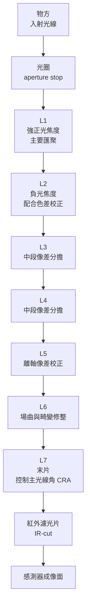

# 04 為什麼一顆鏡頭要疊到七片、八片？

## 開場問題：規格表上的「8P」，到底升級了什麼

一份手機規格表寫「主鏡頭 8P」，另一份寫「6P」。多數人會直覺排序：8P 比 6P 好。但這三個字元只說了一件事——**這顆鏡頭有八片塑膠鏡片，P 指 plastic**。它沒說焦距、光圈、視角、總光學長度 TTL，也沒說那八片用什麼材料、什麼表面形狀做出來。

本章把四件常被混為一談的事分開：

1. **片數**（有幾片鏡片）
2. **材料**（折射率與色散是多少）
3. **表面形狀**（球面還是非球面，係數怎麼給）
4. **系統性能**（在指定條件下的解析力、畸變、雜散光）

前三項是設計者手上的手段，第四項才是讀者在意的結果。手段可逐項比較，結果只能在同一組測試條件下比較——這是[第 03 章](03-image-quality.md)的結論。片數是四項裡最容易被印在規格表上、也最容易被誤讀成第四項的那一項。

## 結構與角色：一顆鏡頭裡有哪些可調的東西

以下選用前置光闌作教學例；實際光闌可在鏡組內。由物方往像方依序是光圈（孔徑光闌 aperture stop）、數片各自成形的鏡片、紅外濾光片（IR-cut filter），最後是感測器成像面。鏡片之間由間隔環（spacer）與鏡筒（barrel）定位。



*圖 04-1：七片式鏡頭的角色順序示意。**非按比例、非特定公司產品**；這是一組教學分配，不是所有七片式設計的固定分工，各片通常共同影響多種像差。這張圖能讀「順序與分工」，不能讀任何一片的實際曲率、厚度或材料。*

| 參數類別 | 每加一片新增什麼 | 主要用來對付 |
|---|---|---|
| 曲率（兩個面） | 兩個新的曲率半徑 | 焦距分配、球差、場曲 |
| 厚度 | 一個中心厚度 | 光程分配、機構可行性 |
| 間距 | 一個新的空氣間隙 | 像差平衡、TTL 分配 |
| 材料 | 一組折射率 n 與阿貝數 Vd | 色差、折射力分擔 |

*圖表 04-2：每增加一片鏡片新增的四類自由度。這張表能讀「自由度的種類」，不能讀「自由度愈多性能一定愈好」——自由度只讓解可能存在，不保證解好找、也不保證做得出來。*

## 作用機制：為什麼一片做不到

### 單片球面透鏡的自由度不夠用

一片球面透鏡只有兩個曲率半徑、一個厚度、一種材料。但它同時被要求給出指定焦距，並壓低球差（spherical aberration，不同入射高度的光軸向聚焦位置不同）、彗差（coma，離軸物點成像拖尾）、像散（astigmatism，弧矢與子午方向焦點分離）、場曲（field curvature，像面是彎的而感測器是平的）、畸變（distortion，直線變彎）與色差（chromatic aberration，折射率隨波長變化導致不同顏色聚焦位置或放大率不同）。

這是六、七個互相衝突的要求，配上三、四個可調參數。球面形狀本身也是限制：一個球面只由半徑一個數字決定，焦距一旦選定，它在邊緣區的彎折方式就被鎖死，沒有餘地再去修球差。

**所以多片不是為了「更清楚」而堆料，是為了把互相衝突的要求分配給不同鏡片去部分抵消。** 典型做法是讓某幾片承擔主要正光焦度，另幾片以負光焦度搭配不同色散的材料把色差反向拉回；靠近像面的幾片專門處理場曲與畸變，同時把出射的主光線角 CRA 控制在感測器能接受的範圍。每一片都不是單片最優，而是整體平衡的一部分。

### 看圖理解：球差不是「焦點整體移動」

<figure class="wiki-media">
  
</figure>

先比較最外側與最靠近光軸的紅線：它們沒有匯聚在同一個點。這說明本例的球差無法只靠把感測器前後移動就完全消除；圖示未按實際產品比例，也不能讀出非球面設計的改善幅度。

*圖源：[Lens-sphericalaberration.png](https://commons.wikimedia.org/wiki/File:Lens-sphericalaberration.png)，DrBob，[CC BY-SA 3.0](https://creativecommons.org/licenses/by-sa/3.0/)。原圖未修改。*

### 非球面：用一條可調曲線取代固定球面

第二個自由度來源不在片數，而在**表面形狀**。非球面（aspheric）把「一個半徑決定一切」換成一條可調曲線。手機鏡頭大量使用偶次非球面多項式：

```text
z(r) = c·r² / [ 1 + √(1 − (1+k)·c²·r²) ] + A₄r⁴ + A₆r⁶ + A₈r⁸ + …
```

z 是半徑 r 處的垂度（sag），c 是頂點曲率，k 是圓錐常數（conic constant），A 是各階係數（此慣例不另加 r² 項，故 c 可直接表示頂點曲率）。前半項是二次曲面基礎：k=0 為球面、k=−1 為拋物面、k<−1 為雙曲面、−1<k<0 為長橢球面、k>0 為扁橢球面；後半項的偶次冪修正讓表面連續、平滑地偏離那個基礎曲面。

不必記公式，要記它的意義：**「非球面」不是一種形狀，是一整個可調曲面家族。** 設計者拿到的是一條能在不同半徑處分段微調彎折程度的曲線——光線打在鏡片中心和打在邊緣，可以被設計成用不同力道彎折。這正是球面做不到、也正是球差的根源。一片非球面能承擔的校正量，往往要好幾片球面才換得到。在 TTL 受限的手機裡，非球面不是選配，是前提。

### 為什麼塑膠讓非球面變便宜

問題在於怎麼把非球面做出來。玻璃研磨的工藝邏輯建立在球面之上：兩個互磨的球面會自然收斂成球面，這是幾何自帶的自我修正機制。非球面沒有這個機制，必須靠確定性加工逐點成形再反覆量測迭代，仍有逐片加工與量測成本，但設備、製程開發與自動化成本也能隨產量攤提。玻璃另可使用精密模造，不能把玻璃等同逐片研磨。

塑膠射出成形的邏輯相反：非球面形狀**一次性**加工在金屬模仁上，之後每次射出都是複製。非球面的加工成本從「每片一次」變成「每副模具一次」，量產時可降低每片的模具攤提；模具仍有磨耗、維護與更換成本。這是塑膠鏡頭能在手機普及的關鍵，也是整條產業鏈能用「模具＋量產」模式規模化的物理前提。代價在下一章：複製的前提是模仁本身極準，而模仁的誤差會系統性出現在每一片上。

### 材料：折射率與阿貝數是兩個獨立旋鈕

材料提供兩個數字。折射率 n 描述彎折光線的能力，決定同樣曲率能給出多少光焦度。阿貝數 Vd 描述折射率隨波長變化的程度，即色散：**Vd 愈低色散愈強，Vd 愈高色散愈弱**；傳統上 Vd 低於 50 者稱火石（flint）類、較高者稱冕（crown）類。

消色差設計的基本手法，就是把高色散與低色散材料搭配，讓一片引入的色差被另一片反向抵消。這就是「材料」作為自由度的意義：常見消色差組合使用正、負光焦度與不同阿貝數；不能只把相同曲率的正透鏡換材料，就認定色差貢獻會反號。

常見誤解是把兩者綁在一起，以為折射率高就一定色散強。**n 與 Vd 是要分別查表的獨立特性**，只是傳統玻璃中兩者常有相關趨勢，那是材料家族的統計現象，不是物理必然。

研究筆記中經核對的塑膠數值僅一例：環烯烴聚合物（COP）的特定廠牌產品，折射率約 1.53、阿貝數約 56。這是單一廠牌規格，不代表所有 COP，更不代表任何手機鏡頭實際使用的牌號。

### 塑膠、玻璃與玻塑混合的取捨

| 比較項 | 全塑膠 | 全玻璃 | 玻塑混合（G+P） |
|---|---|---|---|
| 量產單位成本 | 射出可攤薄模具成本 | 取決於研磨或精密模造、材料與批量 | 須合算各片製程與組裝 |
| 非球面可行性 | 可射出複製 | 可研磨拋光，也可用適合材料精密模造 | 玻璃與塑膠均可承擔非球面 |
| 熱穩定（dn/dT 與熱膨脹） | 較差，**量級上塑膠的折射率溫度係數遠大於玻璃** | 較好 | 介於兩者，但兩種材料熱膨脹不同會引入新的失配 |
| 折射率／阿貝數可選範圍 | 較窄 | 明顯較寬 | 可借玻璃補足塑膠缺乏的組合 |
| 重量 | 輕 | 重 | 介於兩者 |
| 組裝難度 | 相對單純 | — | 較高，異材質膨脹與加工基準不同 |

*圖表 04-3：三種材料策略的定性取捨。這張表能讀「方向」，不能讀「數值」——本表刻意不填折射率範圍、dn/dT 或成本數字，因為研究筆記中這些數值來源信度不足或未經一手核對，已轉入章末待查。*

「玻塑混合」在規格表上常寫成 **1G3P、2G4P**：G 前的數字是玻璃鏡片數，P 前的數字是塑膠鏡片數，兩者相加才是總片數。所以 1G3P 是四片鏡頭。

要提醒：**玻塑混合不等於「一定比較好」。** 混用兩種材料會同時引入兩種熱膨脹係數、兩種加工基準與兩套檢驗流程，組裝公差控制難度上升，良率與總成本未必優於設計良好的純塑膠方案。是否採用是系統級權衡，不是單向的品質升級。至於市場採用比例、成本區間、哪些機型用哪種配置，本書研究筆記中僅有的來源是 B2B 電商平台的採購指南，信度不足以寫進正文，一律列為待查。

## 缺陷與失敗：片數多同時代表什麼代價

回到開場。「8P」同時代表兩件方向相反的事。

**它代表設計自由度高。** 八片給出約十六個曲率、八個厚度、多組空氣間隙與八次材料選擇，足以在更嚴苛的 TTL、光圈與視角約束下同時壓住多種像差。片數被推高，通常正因為系統約束變嚴了。

**它同時代表製造難度高。** 每多一片，就多一組成形公差、多一次偏心與傾斜、多兩個表面要量測、多一個空氣間隙要控制。公差鏈（tolerance stack-up）變長，個別誤差在組裝後疊加成系統誤差的機會變多。這是[第 05 章](05-molding-process.md)與[第 06 章](06-assembly-yield-cost.md)的主題。

所以「8P」不是性能保證，是**難題規模的線索**：它說這顆鏡頭在對付一個需要八片才擺得平的設計問題，但不說設計者擺平了沒有。

同樣要拆開的還有：

- **片數 ≠ 相機顆數。** 「8P」是一顆鏡頭裡有八片鏡片，「三鏡頭手機」是機身上有三顆獨立相機模組。
- **片數 ≠ 畫素。** 畫素由感測器決定，與鏡片數沒有換算關係。
- **片數 ≠ 畫質。** 決定成像的是每片做得多準、組得多正，以及整體設計在指定條件下的表現。
- **同片數 ≠ 同難度。** 廣角 7P 要壓畸變與像散，望遠 7P 要壓色差與長光路的公差敏感度，跨機型比片數論高下沒有意義。

## 量測與控制：要比較，先對齊條件

如果片數不能拿來排序，該拿什麼？答案回到[第 03 章](03-image-quality.md)：在指定條件下量到的系統性能。要比較兩顆鏡頭，至少先對齊焦距與視角、光圈 F 數、感測器與像素尺寸、TTL、MTF 的場點（中心／0.5／0.8 視場）、弧矢與子午方向、空間頻率單位（lp/mm 或 cy/px）、波長權重、對焦位置。任何一項不同，兩個 MTF 數字就不能直接相減。

在設計端，衡量「這組自由度用得好不好」不是數片數，而是看在多嚴的約束下達到多高的性能：同樣的 TTL 與光圈，誰的邊緣 MTF 更高、畸變更小、對製造公差更不敏感。最後那一項是設計與製造的交界，也是片數增加時最先失守的地方。

## 與大立光的連結

**已確認事實。** 大立光在官網公司簡介自述其業務為精密光學鏡頭與相關製造能力（https://www.largan.com.tw/tw/about ，查閱 2026-09-14）。公司沿革頁記載 2018 年 8P 鏡頭相關進展、2022 年潛望式變焦鏡頭開發完成（https://www.largan.com.tw/tw/about/history ，查閱 2026-09-14）。這兩頁是本章唯一可引用的公司來源，皆未標示發布日。

**合理推論。** 「8P」出現在公司沿革裡，與本章邏輯一致：片數被推高通常對應更嚴的系統約束。但沿革上的用語是公司自述的開發階段，**開發完成不等於量產、不等於出貨、不等於收入**，不能從一則沿革推出任何出貨或營收結論。

**尚待查證。** 大立光使用哪些材料牌號、各機種的折射率與阿貝數組合、是否採用玻塑混合、成本結構、市占率、良率，研究筆記中**都沒有可引用的一手來源**，一律列為待查，不以推測填補。

**本章描述的是公開的一般光學工程原理，不代表大立光的實際設計方法、材料選擇或產品配置。**

## 推理檢查

1. 把一顆 8P 鏡頭的全部八片都換成球面、其他條件不變，最可能先失守的是哪一種像差？
2. 甲鏡頭 7P、TTL 較長、光圈 F2.2；乙鏡頭 6P、TTL 較短、光圈 F1.8。能否因甲片數多就判定甲的解析力較好？
3. 為什麼比較玻璃與塑膠非球面成本時，必須先分辨逐片加工與模造？
4. 「玻塑混合一定優於純塑膠，因為玻璃比塑膠好」漏掉了哪兩層？
5. 「1G3P」與「4P」哪一個片數多？

??? note "參考推理"
    第 1 題：球差是重要候選，但沒有光學處方無法保證它最先失守；離軸像差也可能惡化。球面的邊緣彎折方式被半徑單獨鎖死，無法針對不同入射高度分別調整，而這正是球差的來源；非球面的高階項就是專門修這一段的。第 2 題：不能。兩顆的 TTL 與光圈都不同，代表面對的約束不同；要比解析力必須先對齊場點、方向、空間頻率單位、波長權重與對焦位置再看 MTF。第 3 題：來自成形方式。玻璃非球面可逐片加工或精密模造；塑膠射出與玻璃模造都能複製模具，但材料、模溫、模具壽命與批量決定實際成本。第 4 題：一是「玻璃比塑膠好」本身不成立，選材是成本、量產可行性與光學性能的多目標取捨；二是混合會引入兩種熱膨脹係數與兩套加工基準，組裝難度上升，良率與總成本未必更好。第 5 題：一樣多，都是四片。

## 來源與待查

**本章使用的來源**

- Edmund Optics,〈All About Aspheric Lenses〉精密玻璃模造段；未標發布日，2026-09-15 核對。https://www.edmundoptics.com/knowledge-center/application-notes/optics/all-about-aspheric-lenses/

- 大立光電公司簡介 https://www.largan.com.tw/tw/about ；公司沿革 https://www.largan.com.tw/tw/about/history （查閱 2026-09-14，均未標示發布日）
- 偶次非球面多項式與圓錐常數：Ansys Optics, "Aspheric Surfaces – Part 1." https://optics.ansys.com/hc/en-us/articles/42661802686355-Aspheric-Surfaces-Part-1-Introduction-to-Aspherical-Surfaces-in-Optical-Design （查閱 2026-09-14）
- COP 材料特性（特定廠牌產品規格）：Zeon Specialty Materials, "Optical Lenses." https://www.zeonsmi.com/applications/optical-lenses/ （查閱 2026-09-14）

**本章刻意不寫的數字**（研究筆記標示來源信度不足或未經一手核對，全數轉入[待查問題](appendix-open-questions.md)）

| 待查項目 | 不寫的理由 |
|---|---|
| 塑膠與玻璃 dn/dT 的具體數值 | 僅見於搜尋摘要，無可逐頁核對的一手文件；正文只寫「量級上塑膠遠大於玻璃」 |
| 玻塑混合的市場占比、成本區間 | 唯一來源為 B2B 電商平台採購指南，未見原始出處 |
| 特定機型採用哪種玻塑配置 | 同上；不從單一低信度來源指認任何機型 |
| 塑膠與玻璃可選 n／Vd 的完整範圍 | 研究筆記僅核對到單一廠牌 COP 一例 |
| 6P/7P/8P 與畫質關係的工程級文件 | 現有引用多為消費電子媒體，應改用專利說明書或原廠白皮書補強 |
| 大立光的材料、配置、成本、良率、市占 | 研究筆記中無一手來源 |

完整清單見[來源索引](appendix-sources.md)。下一章追蹤這些設計出來的曲面如何被複製到幾億片實體鏡片上，以及誤差從哪裡進來。
