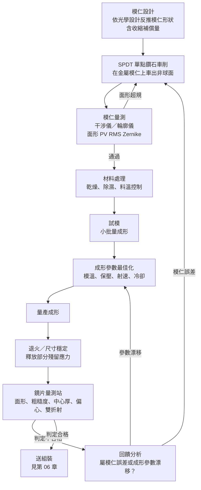

# 05 設計好的曲面，如何被複製幾億次？

## 開場問題：為什麼做得穩，仍可能整批不合格

抽樣檢驗需要有代表性的取樣、可靠的量測與明確的允收規則。它既能發現隨機變異，也能發現整批平均值偏移；能否推估不良比例，還取決於樣本數與批次結構。

但塑膠非球面鏡片有一類誤差完全不隨機。它出現在每一片上，大小相同、方向相同，批次之間一致。抽檢當然會抓到它——但抽到的每一片看起來都一樣，量出來的離散度很小，製程看起來非常「穩定」。問題是整批一起偏了。

這類誤差的來源是**模仁**。第 04 章說過，塑膠鏡頭之所以便宜，是因為非球面形狀只在模仁上加工一次，之後每次射出都是複製。這句話還有後半段：

> **模仁的誤差會系統性地複製到每一片上，不會隨機互相抵消。**

這是本章最重要的一句話。它決定了整條製程的控管邏輯：模仁不是「一個零件」，是整批鏡片形狀的**定義源頭**；模仁量測不是一道檢驗，是整批品質的前置條件。

本章追蹤一片塑膠非球面鏡片從模仁到判定合格的完整路徑，並在每一站標出誤差從哪裡進來、在影像上長什麼樣、用什麼量測方法抓。

## 結構與角色：四個站點，各自定義不同的東西

*圖 05-1：塑膠非球面鏡片成形的教學製程圖。**非特定公司產品、非按比例**，站點順序與分支邏輯是精密光學製造的一般安排。這張圖能讀的是「誤差回饋要先分辨來源才知道該修哪裡」，不能讀的是任何實際產線的站點數、節拍或參數。*

四個站點各自「定義」不同的東西：

| 站點 | 它定義了什麼 | 它管不到什麼 |
|---|---|---|
| 模仁（SPDT） | 每一片鏡片的**目標形狀** | 材料收縮後的實際形狀 |
| 材料處理 | 熔膠的流動與固化**行為基準** | 幾何形狀 |
| 成形（射出、保壓、冷卻） | 實際形狀**偏離模仁多少**、內部應力多大 | 模仁本身錯了的部分 |
| 量測站 | **判定**與回饋依據 | 已經做壞的那一片 |

*圖表 05-2：站點責任分工。重點是最後一欄——量測站不製造品質，只判定與回饋；當一批鏡片系統性偏移，應同時核對模仁、成形設定與量測基準。*

## 作用機制：誤差從哪裡進來

### 模仁：SPDT 是精度的源頭，也是中頻誤差的源頭

塑膠非球面鏡片不直接加工鏡片本體，而是先在金屬模仁上把非球面形狀車出來。模仁材料常見無電鍍鎳（electroless nickel）或碳化鎢等。加工方式是單點鑽石車削（Single Point Diamond Turning, SPDT）：一把鑽石刀具沿著程式化的連續路徑切削，直接依非球面函數走出輪廓。

SPDT 之所以能做非球面，正是因為它擺脫了玻璃研磨那套「兩個球面互磨會自然收斂成球面」的幾何自我修正機制——它是確定性加工，形狀由刀具路徑決定，不由幾何巧合決定。文獻中的 SPDT 加模造案例報告可達約 60–80 Å RMS 的表面粗糙度、優於 1/2 波長 PV 的面形精度（此為文獻個案數據，**不是任何公司的規格**）。

代價有兩層：

**第一，路徑誤差直接變成形狀誤差。** 刀具磨耗、對刀誤差、進給率與主軸轉速的匹配、機台熱漂移，任何一項都會直接寫進模仁形狀。而模仁形狀就是後續每一片鏡片的形狀。

**第二，刀具路徑本身會留下週期性紋路。** 車削非球面時，刀尖沿螺旋路徑前進，相鄰路徑之間必然留下規則的殘留起伏。這種介於「整體面形偏差」與「微觀粗糙度」之間的週期性紋路叫**中頻誤差**（mid-spatial frequency error），頻帶界線須依口徑、量測帶寬與光學用途定義，沒有跨產品通用的週期界線。下一節會說它在影像上長什麼樣。

### 收縮與翹曲：PVT 行為決定形狀會跑掉多少

熔融塑膠冷卻固化時體積會縮。這不是缺陷，是物理，設計模仁時就要預先補償。問題出在**收縮不均勻**。

收縮量由材料的比容–壓力–溫度（PVT, pressure–volume–temperature）行為決定，受模具溫度、保壓壓力與保壓時間、冷卻速率影響。當鏡片厚薄不均（透鏡幾乎必然厚薄不均——中心厚邊緣薄，或反過來），各處冷卻速率就不同。先固化的區域已經定型，會反過來限制後固化區域的收縮，在內部拉出應力，並把整片鏡片拉變形。這就是翹曲（warpage）。

翹曲的結果是：成形後的鏡片面形偏離模仁形狀。第 04 章那條精心調過的非球面曲線，做出來不是那條曲線。

### 殘留應力與雙折射：一個無法同時最小化的取捨

高分子鏈在熔膠流動時被拉伸、定向排列。如果在固化前沒有完全鬆弛，這個定向就被凍結在鏡片內部，成為殘留應力。應力使材料在不同方向的折射率略有差異，這就是雙折射（birefringence）。

殘留應力分兩類：**流動誘發**（flow-induced，流動階段分子鏈被拉伸定向）與**熱誘發**（thermally-induced，非晶塑膠快速冷卻時各處收縮不同步）。流動誘發在填充階段占主導，但非晶塑膠快速冷卻時，熱誘發應力也可能成為重要來源，主導程度取決於材料與製程條件。

降低雙折射的做法方向明確：提高模具溫度（降低冷卻速率梯度）、降低射出速度與壓力峰值、拉長保壓時間，讓分子鏈有時間鬆弛。

問題是——**這些做法往往同時提高翹曲**。

> 多篇獨立研究反覆驗證：**翹曲與殘留應力（雙折射）在製程參數上互相制約，降低其一的製程條件往往提高另一個。** 特定試驗的最佳條件可能不同，但不能將此提升為兩者永遠無法同時改善的物理定理。

因此需要在指定材料、模具與實驗範圍內確認製程窗。所以文獻中的做法不是求單一最優，而是多目標最佳化：以模流分析（mold flow simulation）搭配田口法、灰關聯分析或類神經網路加粒子群演算法，在翹曲、雙折射與像差之間找一個可接受的折衷區。射壓合模成形（injection-compression molding）——填充後以壓縮動作補償收縮——是另一條路，可同時改善面形精度與降低雙折射，但需要額外控制壓縮間隙、時機與力量三組參數。

讀到這裡要建立的判斷是：**一套成形參數是一組折衷，不是一個答案。** 當有人說某製程「已最佳化」，該問的是「對哪個目標最佳化、犧牲了哪個」。

### 熔接線、澆口與脫模

**熔接線**（weld line）：熔膠從澆口注入後若分成多股流動路徑，或繞過模穴內的結構後再會合，兩股熔膠前緣相遇處的溫度已下降，分子鏈難以充分交融，該處成為結構與光學的弱區，兩側分子定向方向不同。文獻指出負度數（minus）鏡片成形時尤其常見。控制方式包括提高熔膠溫度、射出壓力與速度，或把熔接線位置移到靠近澆口、保壓效果較好之處；更根本的是在模具設計階段就把熔接線趕出光學有效區。

**澆口**（gate）效應：澆口的位置、厚度、入口與出口寬度直接影響流動平衡與最終應力分布，是控制殘留應力的重要因子，通常靠模流模擬支援設計。

**脫模**：脫模角度不足或頂出力不均會在鏡片邊緣留下應力集中與外觀痕跡。（此項在研究筆記中被標為缺乏一手文獻直接支持的通用射出成形常識，本書據此標示為簡化陳述。）

## 缺陷與失敗：缺陷來源矩陣

把上述機制整理成一張可查的對照表。使用方式是反向的：從影像上看到的徵狀，回推可能的站點與該用的量測方法。

| 製程站點 | 缺陷／誤差 | 成因摘要 | 影像上的可觀察徵狀 | 量測或控制方法 |
|---|---|---|---|---|
| 模仁加工（SPDT） | 模仁面形誤差 | 刀具磨耗、路徑誤差、對刀誤差 | **系統性、批次一致**的像差與解析力下降（同批鏡片共有同一方向的偏差） | 干涉儀量測模仁面形（PV／RMS／Zernike） |
| 模仁加工（SPDT） | 中頻紋路（刀紋殘留） | 車削或次口徑拋光路徑週期性重疊 | MTF 曲線漣漪、雜散光、霧化、照度斑駁；PSF（點擴散函數）能量可能移入外環，形狀變化取決於誤差頻譜 | 高解析力干涉儀或輪廓儀＋空間頻譜分析 |
| 射出成形 | 收縮不均、翹曲 | 冷卻速率不均、厚薄不一、保壓不足 | 面形偏離設計值造成的像差，以形狀誤差為主 | 干涉儀量測面形；與模流模擬結果比對 |
| 射出成形 | 殘留應力、雙折射 | 分子鏈流動定向未鬆弛；快速冷卻的熱應力 | 偏振相關的對比度下降、局部霧化或條紋（消費鏡頭中通常不顯著，需專用儀器才量得到） | 偏光儀（polariscope）／雙折射量測儀 |
| 射出成形 | 熔接線 | 多股熔膠前緣會合；澆口位置設計不當 | 局部線狀或色差瑕疵；散射、局部像差；嚴重時伴隨氣泡空洞影響穿透率 | 目視／顯微檢查；模流模擬預測熔接線位置 |
| 射出成形 | 脫模應力、頂出痕 | 脫模角度不足、頂出力不均（**通用常識，一手文獻待補**） | 邊緣局部應力集中、外觀瑕疵 | 目視檢查、應力儀 |
| 鏡片量測站 | 厚度／中心厚偏差 | 成形製程波動 | 影響鏡組整體光程，間接影響對焦位置 | 接觸式／非接觸式厚度量測 |
| 鏡片量測站 | 單片偏心（面偏心） | 模仁對心不良或成形冷卻不均 | 該片本身的像差呈現非對稱分布 | 自準直儀式偏心量測 |

*圖表 05-3：成形階段的缺陷來源矩陣。這張表能讀的是「徵狀與站點的對應關係」，不能讀的是任何發生頻率或嚴重度排序——各項在實際產線上的占比需要真實資料，本書沒有。組裝階段（偏心疊加、傾斜、空氣間隙、污染、對準殘留）的對應列見[第 06 章](06-assembly-yield-cost.md)。*

矩陣裡最值得記的一組對照是前兩列與其餘各列的差別：

- **模仁造成的誤差是系統性的**——整批同方向偏移，離散度小，SPC 管制圖看起來很穩，但平均值偏了。
- **成形參數漂移可能呈現趨勢，也可能形成穩定偏移**——片與片之間有變異，管制圖上看得到趨勢或跳動。

這兩種在數據上長得不一樣，處理方式也不一樣：必須先比對模仁實測、試模與量測校正，確認原因後才決定修模或調參數。分不清楚就會出現「參數調了半天沒用」或「換了模仁問題還在」。

## 量測與控制：怎麼判定一片鏡片合格

### 面形誤差：PV、RMS 與 Zernike

面形誤差（form error）是實際表面與設計理論面的偏差，常用兩個統計量表示：

- **PV（Peak-to-Valley）**：最高點與最低點的差。對單一局部異常敏感，但不反映整體分布。
- **RMS（Root-Mean-Square）**：全部偏差的均方根。反映整體，但可能掩蓋局部尖峰。

兩者要一起看。只報 RMS 會漏掉一個深坑，只報 PV 會被一個孤立點主導。

**Zernike 多項式**是定義在圓形孔徑上的一組正交基底函數，可以把量到的面形誤差分解成不同階數的分量，而這些分量能對應回傳統的賽德像差項——離焦、像散、彗差、球差。這是量測與光學性能之間的橋樑：它讓「這片鏡片面形差 0.3 個波長」這種抽象數字，變成「這片鏡片主要帶著像散，會在離軸視場造成方向性模糊」這種可判斷的敘述。

主力量測工具是干涉儀，把待測面的反射波前與參考波前干涉，算出面形偏差圖並輸出 Zernike 係數。它的誤差來源包括隨機雜訊、系統建模誤差、拼接（stitching，用於大口徑或高陡度非球面）誤差，以及 Zernike 擬合本身的誤差。

### 中頻誤差：第三類缺陷

前面說過中頻誤差是 SPDT 刀具路徑留下的週期性紋路。它值得單獨一節，因為它**在機理上獨立於低頻面形誤差與高頻表面粗糙度**，是第三類缺陷：

- 低頻（面形誤差）→ 像差模糊，PSF 主瓣變形
- **中頻（波紋）→ 把能量從 PSF 主瓣散射到愛里環或整個焦平面，主瓣與外圍能量分布的變化依誤差幅度及頻譜而定**
- 高頻（粗糙度）→ 散射霧化

中頻誤差在影像上的徵狀因此很特別：MTF 曲線上出現異常的漣漪（ripple）、雜散光增加、成像霧化（haze）、照度斑駁不均，整體解析力下降——但用一般的面形 PV／RMS 去量，可能完全看不出異常，因為它的幅度小、空間頻率又不在低頻擬合會抓到的範圍。

要抓它必須用足夠高空間解析度的干涉儀或輪廓儀量測，再對面形誤差做**空間頻譜分析**，把不同空間頻率分段，才能把中頻分量從低頻與高頻中分離出來單獨評估。控制端則回到 SPDT：優化車削路徑的重疊率與進給參數。

這一段連回第 04 章：規格表上的「8P」不會告訴你這八片的中頻誤差控制得如何，但那正是「非球面能不能真的發揮設計價值」的關鍵之一。

### 粗糙度、中心厚與偏心

- **表面粗糙度**：精密光學一般要求奈米等級。
- **中心厚度與周向邊厚差**（後者可反映楔形或偏心；中心厚減邊厚本身是正常透鏡曲率造成的，不等於楔形量）：關鍵尺寸公差，影響整體光程與對焦位置，由接觸式或非接觸式輪廓儀、影像量測系統控管。量測站通常與成形站分開設置，形成獨立的檢驗環節。
- **偏心**（decenter／eccentricity）：光學面的曲率中心沒有與機械基準軸重合，分為平行偏心（光軸平移，單位如 μm）與傾斜偏心（光軸傾斜，單位如角分）。業界標準做法以自準直儀（autocollimator）為核心：待測鏡片繞精密參考軸旋轉，自準直儀聚焦在待測面的曲率中心觀察反射像；若有偏心，反射的分劃板像會在旋轉時描出一個圓，**圓的半徑正比於偏心量**。這類系統的廠商宣稱可達約 0.1 μm 等級的偏心量測精度，並可延伸用於已完全組裝的多片式鏡頭。

偏心是連結第 05 與第 06 章的量：單片偏心讓這一片自己的像差變得非對稱；多片偏心在組裝後疊加，就是[第 06 章](06-assembly-yield-cost.md)的公差鏈問題。

### ISO 10110-5：讓「多準」這件事可以寫進圖面

上述所有量測，如果各廠各自用不同方式標註，供應鏈就無法溝通。**ISO 10110** 是規範光學元件與系統工程圖面標註方式的國際標準，其中 **Part 5 專門規範表面形狀公差（surface form tolerances）** 的標註方法，適用於平面、球面、非球面、柱面、環形面等形狀。標準規定以奈米作為面形偏差的標準單位（過去允許以參考波長的條紋數 fringe 表示，但必須明確標示基準波長）。ISO 官網於 2026-09-15 核對時列有 10110-5:2026。波前變形與非球面圖面規則須分別查對相應分冊，不能將表面誤差直接當作透射波前誤差。

它的角色不是「規定多準才合格」，而是**規定「多準」這件事要怎麼寫、用什麼單位、對哪個基準**，讓客戶的規格書、鏡頭廠的圖面與量測站的報告講同一種語言。驗收爭議多半不是誰量錯，而是兩邊量的不是同一個東西。

## 與大立光的連結

**已確認事實。** 大立光在官方網站公司簡介中，自述其業務為精密光學鏡頭與相關製造能力（公司簡介頁 https://www.largan.com.tw/tw/about ，查閱 2026-09-14）。公司沿革頁記載 2018 年 8P 鏡頭相關進展、2022 年潛望式變焦鏡頭開發完成（沿革頁 https://www.largan.com.tw/tw/about/history ，查閱 2026-09-14）。這是本章可引用的全部公司來源。

**合理推論。** 任何以射出成形量產塑膠非球面鏡片的廠商，都必然面對本章描述的物理限制：模仁誤差的系統性複製、收縮與翹曲、殘留應力與翹曲的相互制約、中頻誤差。這些是物理，不是選擇。因此可以合理推論，這類製程能力的差異——模仁加工精度、製程窗的掌握、量測回饋的速度——是精密光學鏡頭廠之間競爭力的一部分。但**這是對產業的通則推論，不是對特定公司能力水準的判斷**。

**尚待查證。** 以下項目在本書研究筆記中**沒有任何一手來源**，一律列為待查，不在正文中以推測填補：

- 大立光的模仁加工方式、設備、模仁材料與鍍層
- 模仁自製或外購、供應來源
- 成形設備、成形參數、製程窗
- 使用的塑膠牌號與配方
- 各站良率、整體良率、不良分布
- 量測設備、檢驗標準、抽樣方案
- 是否採用射壓合模成形或退火製程

**本章描述的是公開的一般工程原理，來源為學術論文、國際標準與量測設備商技術資料，不代表大立光的實際製程、參數、配方或良率。**

## 推理檢查

1. 一批鏡片的面形量測結果離散度很小，但平均值偏離設計值。應同時核對哪些來源？為什麼僅憑離散度小不能判定模仁有錯？
2. 為什麼「把模具溫度提高以降低雙折射」不能無條件執行？
3. 一顆鏡頭的 MTF 曲線上出現規則的漣漪，雜散光也偏高，但單片面形的 PV 與 RMS 都在規格內。最可能的缺陷是哪一類？該補什麼量測？
4. 熔接線落在鏡片的光學有效區外，是否就可以忽略？
5. 如果模仁只做一副，每片鏡片的形狀誤差可以靠「多片鏡頭互相抵消」來解決嗎？

??? note "參考推理"
    第 1 題：同時核對模仁實測、成形收縮補償與量測基準。離散度小只代表樣本相似，不能排除穩定的製程偏移或量測偏差。第 2 題：因為翹曲與殘留應力互相制約——提高模溫、降低冷卻速率梯度確實讓分子鏈有時間鬆弛、降低雙折射，但同一組條件通常會讓翹曲變差。製程窗是多目標折衷，是否存在共同改善區域需用實驗確認。第 3 題：中頻誤差。它的機理是把能量從 PSF 主瓣散射到外環，不能只靠總 PV／RMS 定位其頻帶，須查量測帶寬與空間頻譜。要抓它必須用高空間解析度的干涉儀或輪廓儀量測後做空間頻譜分析，把中頻分量分離出來單獨評估。第 4 題：不能直接忽略，但風險大幅下降。熔接線區的問題除了局部光學異常，還包括結構弱區與可能伴生的氣泡空洞；即使不在有效區內，仍可能影響機械強度與良率，只是不再直接寫進成像。第 5 題：不能寄望自然抵消。鏡組中不同片位通常使用不同處方與模仁；誤差對系統的影響取決於各片敏感度，既可能相加也可能部分抵消。隨機獨立只支持統計分析，不保證單顆抵消；刻意配對則須經量測與光學模型驗證。

## 來源與待查

**本章使用的來源**

- 模仁 SPDT 與射出成形：Injection molding of high-precision optical lenses: A review. https://www.researchgate.net/publication/358696772_Injection_molding_of_high-precision_optical_lenses_A_review （查閱 2026-09-14）
- 模仁超精密車削：Fabrication and Characterization of Automotive Aspheric Camera Lens Mold based on Ultra-precision Diamond Turning Process. https://www.researchgate.net/publication/391662086_Fabrication_and_Characterization_of_Automotive_Aspheric_Camera_Lens_Mold_based_on_Ultra-precision_Diamond_Turning_Process （查閱 2026-09-14）
- 雙折射、殘留應力與收縮的相互制約：A study of birefringence, residual stress and final shrinkage for precision injection molded parts. https://www.researchgate.net/publication/288532135_A_study_of_birefringence_residual_stress_and_final_shrinkage_for_precision_injection_molded_parts （查閱 2026-09-14）
- 像差與雙折射的多目標製程最佳化：Grey optimization of injection molding processing of plastic optical lens based on joint consideration of aberration and birefringence effects. https://link.springer.com/article/10.1007/s00542-018-4001-4 （查閱 2026-09-14）
- 澆口設計：Gate design optimization in the injection molding of the optical lens. https://www.researchgate.net/publication/289064062_Gate_design_optimization_in_the_injection_molding_of_the_optical_lens （查閱 2026-09-14）
- 中頻誤差對 MTF 的影響：Theory of modulation transfer function artifacts due to mid-spatial-frequency errors and its application to optical tolerancing (Optica). https://opg.optica.org/ao/abstract.cfm?uri=ao-49-25-4825 （查閱 2026-09-14）
- 偏心量測原理：TRIOPTICS, Centration measurement. https://www.trioptics.com/applications/alignment-and-testing-of-optical-components/centration-measurement （查閱 2026-09-14）
- 圖面標註標準：ISO 10110-5:2026. https://www.iso.org/standard/86355.html （查閱 2026-09-14）
- 大立光電公司簡介：https://www.largan.com.tw/tw/about （查閱 2026-09-14；頁面未標示發布日）
- 大立光電公司沿革：https://www.largan.com.tw/tw/about/history （查閱 2026-09-14；頁面未標示發布日）

**證據等級提醒**

| 項目 | 狀態 |
|---|---|
| 60–80 Å RMS 粗糙度、優於 1/2 波長 PV | 文獻個案報告值，**不是任何公司的規格或業界通用門檻** |
| 偏心量測 0.1 μm 精度 | 量測設備商的**產品宣稱**，非第三方驗證 |
| 脫模應力與頂出痕一列 | 通用射出成形常識，本輪未找到一手文獻直接支持，已於表中標註 |
| Edmund Optics 中頻誤差技術文件 | 原始 PDF 抓取被拒，內容依搜尋摘要整理，**未逐字核對原文** |
| 黏合固化收縮的具體數字 | 未取得可讀的一手技術資料，本章不引用任何數字 |
| 模仁鍍層（如 DLC 類）對壽命與脫模的影響 | 本輪檢索未涵蓋，列為待查 |

本章刻意不含任何可重算的成本或良率算例。良率與合格單位成本的教學模型放在[第 06 章](06-assembly-yield-cost.md)，因為那些數字必須在組裝與篩選配對的脈絡下才有意義——單看成形站的良率，會低估篩選配對對最終合格率的貢獻。

完整來源清單見[來源索引](appendix-sources.md)，未解決的問題見[待查問題](appendix-open-questions.md)。下一章把單片合格的鏡片堆進鏡筒，回答一個更難的問題：每一片都合格，組起來為什麼還是可能失敗。
