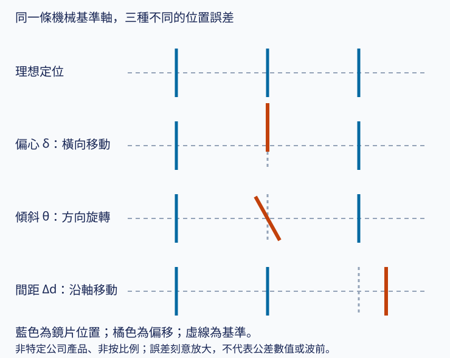
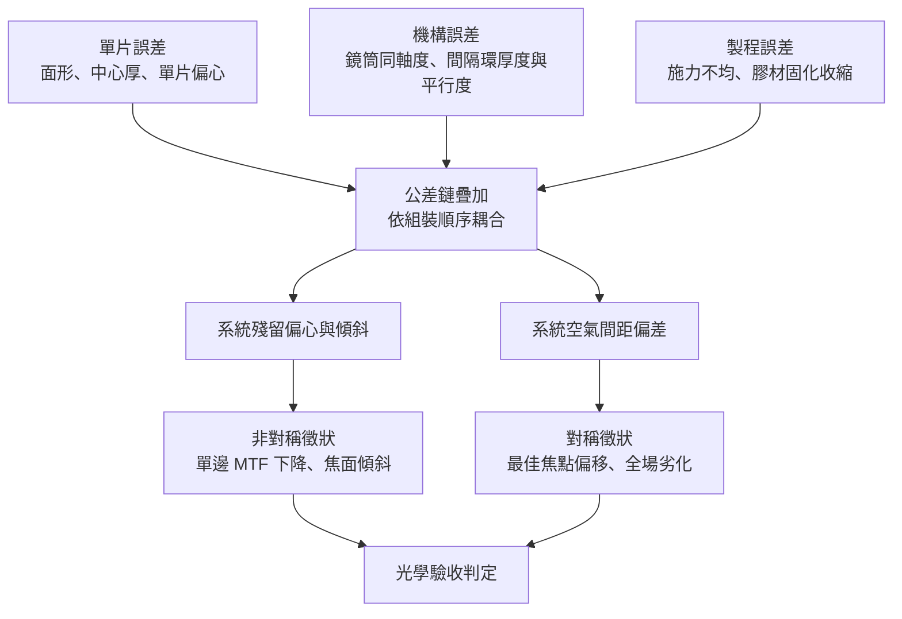
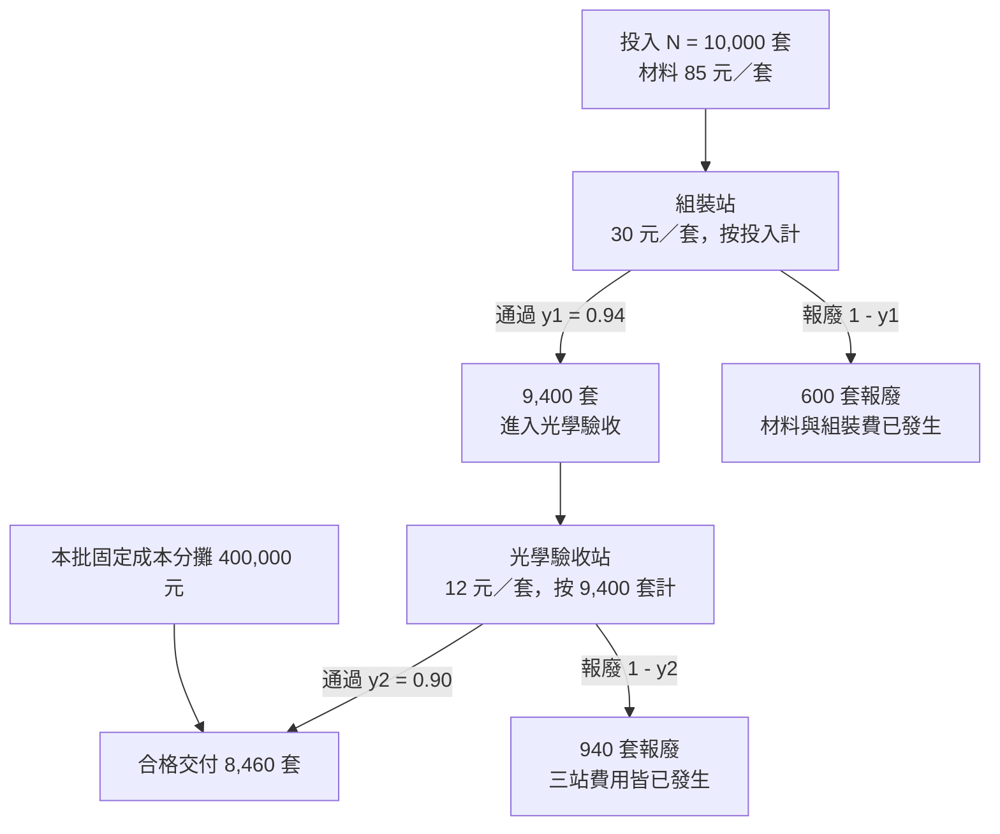

# 06 每片鏡片都合格，鏡頭組起來為什麼還會失敗？

## 開場問題：零件檢驗全過，成品驗收卻掉了一成

想像一條產線的鏡片檢驗報表：面形誤差、中心厚度、單片偏心逐項量測，每一項的合格率都在九成五以上，沒有任何一片帶著超出圖面公差的缺陷流到下一站。可是同一批鏡片依序堆進鏡筒、鎖上壓環、送到出貨前的光學驗收站之後，卻有一成左右的鏡頭在解析力或暗角項目上被判退。

零件全部合格、成品卻不合格，這不是統計上的矛盾，而是因為**零件規格與系統規格是兩套不同的判定條件**。每一片鏡片被允許的誤差，是相對於它自己的圖面；鏡頭被允許的誤差，是所有零件疊起來之後、相對於成像規格。前者合格不蘊含後者合格。

本章要交出三樣東西：把組裝誤差拆成偏心、傾斜、空氣間距三類，並各自對上影像上的徵狀；說明為什麼**不能**用「單片良率的片數次方」當鏡頭良率；最後用一個可以自己重算的算例，把良率的變化換算成「每一套合格品要攤多少錢」。

**算例中所有價格、良率、成本與情境都是教學假設，不是大立光的真實價格、良率或成本結構。** 全章沒有任何一個數字來自公司揭露。

## 先備摘要：快速路線的讀者只需要帶三件事進來

本書的快速路線是 01 → 02 → 03 → 06 → 09 → 11 → 12，會跳過[第 04 章](04-lens-design-materials.md)的設計與材料和[第 05 章](05-molding-process.md)的成形製程。為了讓這條路線走得通，以下是本章會用到的全部先備知識。

**一、「6P」數的是鏡片數，不是相機顆數。** 一顆手機鏡頭是由五到八片（有時更多）非球面 aspheric 塑膠鏡片依序疊成的，6P 表示六片塑膠鏡片（P 指 plastic）。同一支手機上的廣角、超廣角、長焦是三顆各自獨立的鏡頭，各有各的片數。片數多是為了讓設計師有更多曲面可以分攤像差，代價是每多一片就多一組公差要疊進來——這正是本章的主題。

**二、塑膠鏡片是「複製」出來的，不是磨出來的。** 它的曲面先用單點鑽石車削刻在金屬模仁上，再用射出成形把模仁形狀複製到每一片鏡片。這帶來一個對良率很關鍵的性質：**同一個模仁生產出來的鏡片，帶有同一方向的系統性誤差**，不會像隨機誤差那樣在多片之間互相抵消。這提醒我們檢查批次相關性；但不同片位通常使用不同模仁，同一片位的批次偏移不自動證明所有片位誤差相關。

**三、鏡片本身的誤差分成三個空間尺度。** 低頻的面形誤差（整體形狀偏離設計值）、中頻的週期性紋路（車削或拋光路徑留下的波紋）、高頻的表面粗糙度。這三者的成像後果不同：面形誤差造成像差，中頻紋路把能量從點擴散函數的主瓣推到外圍、造成雜散光與霧化，粗糙度造成散射。本章談的則是**第四類**誤差——鏡片本身都沒問題，是它們彼此的相對位置出了問題。

判定「通過」的語言來自[第 03 章](03-image-quality.md)：MTF 必須附帶場點、空間頻率、波長與離焦條件才有意義，不同條件下的 MTF 不能直接比較。本章所說的「光學驗收站」，指的就是依規格書把這些條件固定下來之後的判定。

## 結構與角色：鏡筒裡有什麼，誰決定它們的相對位置

一顆交付給模組廠的鏡頭組 lens assembly，內容物大致如下。

| 零件 | 作用 | 它的誤差會變成什麼 |
|---|---|---|
| 鏡片（5–8 片非球面） | 折射光線、分攤像差 | 面形誤差、單片偏心、中心厚偏差 |
| 間隔環 spacer | 維持相鄰兩片之間的軸向空氣間距 air gap | 間距誤差 → 對焦位置偏移 |
| 鏡筒 barrel | 提供所有鏡片共同的定位基準與外徑配合 | 同軸度誤差 → 整體偏心與傾斜 |
| 遮光片／光欄 | 擋掉非成像光線 | 位置偏移 → 暗角、雜散光 |
| 壓環、膠材 | 軸向鎖固、固定位置 | 施力不均 → 傾斜；固化收縮 → 位移 |

角色分工要先講清楚，否則後面談良率會歸錯責任。**鏡頭廠**交付的是上表這個組件；**模組廠**再把鏡頭組、影像感測器與機構件整合成相機模組，其中感測器與鏡頭之間的對位通常用主動對準 active alignment（下節說明）完成；**馬達廠**提供音圈馬達等致動元件（見[第 07 章](07-telephoto-actuation.md)）；**終端品牌**定義驗收規格。本章談的「組裝良率」與「光學驗收良率」，指的都是鏡頭廠自己這一段，不包含模組廠的 AA 良率。這兩段良率會被市場上的說法混在一起，但它們的分母、責任方與改善手段都不同。

## 作用機制：三種幾何誤差，三種影像徵狀

把鏡片放進鏡筒，理論上每一片的光軸都應該和鏡筒的機械軸重合、每片的定位基準與頂點切平面應符合設計方向、每兩片之間的距離都應該等於設計值。實際上三者都會偏。



*圖 06-1：三種組裝誤差的幾何定義。這張圖能讀「誤差發生在哪個自由度」，不能讀誤差的實際量級——真實鏡頭的偏心公差在微米等級，畫出來會看不見。*

三種誤差在影像上的徵狀不同，這是現場判斷「問題出在哪一站」的主要線索。

| 誤差 | 幾何描述 | 影像上的典型徵狀 | 常見來源 |
|---|---|---|---|
| 偏心 decenter | 某片（或某群）的光軸橫向平移 δ | 場點分布**不對稱**：畫面一側清晰、另一側模糊；彗差在各視場角呈現非對稱分布；單邊 MTF 明顯下降 | 鏡筒與鏡片外徑配合間隙、鏡片滾轉耦合 |
| 傾斜 tilt | 某片繞垂直光軸的橫軸旋轉 θ | 焦面傾斜：把對焦拉到左邊最佳時右邊失焦，反之亦然；像散與場曲在對角方向不對稱 | 間隔環平行度、壓環施力不均、承靠面毛邊 |
| 空氣間距誤差 | 相鄰兩片軸向距離偏離設計值 Δd | 整體最佳焦點位置偏移、球差與場曲改變；徵狀通常**對稱**，全場一起變差 | 間隔環厚度公差、中心厚偏差沿堆疊累積 |

*圖表 06-2：誤差類型與影像徵狀對照。「非對稱徵狀傾向指向偏心／傾斜、對稱徵狀傾向指向面形或間距」是從公差鏈與量測原理推得的教學經驗法則（合理推論），不是逐字引用單一文獻的結論；實務判定仍需搭配實際量測。*

這些誤差之所以難處理，關鍵在於**它們會沿組裝順序累積，而且彼此耦合**。光學公差分析的文獻明確指出：當鏡片以滾轉方式彼此連動時，前一片的偏心會牽動後一片，形成耦合誤差；但若某片是以環形面或平面靠在間隔環上，它就能獨立於前一片而移動。因此做蒙地卡羅 Monte Carlo 公差分析時，必須依照**實際組裝順序**去配置每一片的傾斜與偏心疊加方式，才能得到正確的系統誤差分布。換句話說，同樣一組零件公差，換一種堆疊設計，系統誤差分布就不一樣。

<div class="diagram-scroll" style="--diagram-width: 640px" markdown="1">



</div>

*圖 06-3：誤差如何從三個來源匯流成兩類系統徵狀。這張圖能讀因果方向，不能讀各條路徑的權重——權重取決於具體設計，本書沒有任何公司的實際數據。*

還有一條不屬於幾何的失效路徑：**污染**。光學文獻指出，即使在潔淨室中，人員仍是最大的微粒來源。落在光路內表面的微粒會造成局部暗影、模糊斑點或局部散射，徵狀是**局部**的，與面形誤差的全域性劣化、中頻誤差的規則紋路都可以區分。污染責任原則上依「微粒在哪一站被引入」劃分，但公開文獻只描述通用原則，鏡頭廠與模組廠之間的正式責任邊界屬於待查。

## 缺陷與失敗：為什麼不能用「單片良率的片數次方」當鏡頭良率

這是本章最重要的防混淆點。看到「7P 鏡頭」時，很容易會想：如果單片良率是 0.98，七片全好的機率就是 0.98⁷ ≈ 0.868，所以鏡頭良率約 87%。**這個算法是錯的**，而且不只是「粗略」——它的方向可能兩邊都錯。

錯在三個獨立的地方。

**第一，鏡片誤差不是獨立的。** 前面提過，同一模仁複製出來的鏡片帶有同方向的系統性誤差；同一批原料、同一段模溫循環生產的鏡片，也會共享製程偏移。這意味著各站、各片的通過與否存在批次相關性。必須區分「未篩選單片的邊際合格率」與「已通過前站後的條件通過率」。對同一批無重工的串聯流程，P(A 且 B) = P(A) × P(B｜A)，**不需要站間獨立**。RTY 的逐站乘積必須維持相同流程、分母與首次通過口徑；只有把邊際機率 P(B) 代替 P(B｜A) 時，才需要獨立假設。

**第二，篩選配對會讓實際良率高於天真乘冪的預期。** Journal of Optical Technology（Optica 出版）2021 年一篇論文指出：與其把沒有完全達到個別規格的元件直接報廢，選擇性組裝 selective assembly／分箱配對 binning-pairing 的做法是依據量測到的個別元件特性，把**誤差方向互補**的元件配成一組，使最終通過驗收的比例高於把各元件良率相乘所預期的結果；該論文並開發了在光學設計軟體中運行的巨集來自動化這個依序配對流程。直觀地說：兩片量測誤差經光學敏感度分析確認能互補後，再配成一組，組出來的鏡頭反而比兩片都「剛好合格但同方向」的組合更好。所以鏡頭組良率同時取決於單片公差分布、批次內誤差的相關結構、以及配對演算法的有效性；**在同樣的單片良率下，配對能力較強的產線可以做出更高的鏡頭良率**（此為從該論文結論延伸的合理推論）。

**第三，組裝與補償會改變系統判定。** 本章成本模型止於鏡頭廠交付；以下常見的鏡頭—感測器主動對準屬模組廠工序，用來說明下游補償，不能拿它推高前段鏡頭良率。若鏡頭廠對群組也用主動對準，須另查其具體流程。 主動對準是在組裝過程中一邊即時擷取成像指標（對焦、對比度、MTF），一邊動態調整可動元件的位置與角度，達標後再以膠材固化定位，典型流程約五個步驟：點膠、放置與初步定位、依成像結果精密對準（沿光軸平移、垂直光軸平移、繞光軸旋轉、傾斜）、固化、最終檢驗，可達微米等級精度。它的存在意味著公差鏈疊加後的殘留誤差不必然導致報廢——有一部分可以在組裝階段被「補」回來。這同樣打破了「各片各自判定、獨立相乘」的模型。

反過來說，主動對準也帶來一個容易被忽略的失效模式：**膠材固化收縮**。膠在固化時體積收縮，若收縮不均或量太大，會把已經對準好的元件拉偏，前功盡棄。對準做得再精準，最終量到的是固化**之後**的結果。這是為什麼產線要在固化前後各測一次，而不是只測對準完成的瞬間。

結論：任何把「n 片 × 單片良率」直接推成公司鏡頭良率的說法，都缺少三項關鍵資訊——批次相關結構、配對規則、主動對準能力。這些是廠商的核心 know-how，通常不公開。**本書不對大立光的鏡頭良率做任何數值估計。**

## 量測與控制：把良率變成一筆可以重算的成本

良率本身不是目的，它的意義在於決定每一套**合格交付品**要攤多少成本。以下建立一個最簡化、可完全重算的兩階段模型。

<div class="diagram-scroll" style="--diagram-width: 640px" markdown="1">



</div>

*圖 06-4：從投入到合格交付的良率流量。這張圖能讀「費用在哪一站、按什麼數量發生」，不能讀真實產線的站數與報廢比例；真實產線通常還有重工與多輪複檢，本模型刻意排除。*

**模型設定（全部為教學假設）**：投入 N = 10,000 套。兩階段，無重工。組裝站通過率 y₁ = 0.94；光學驗收通過率 y₂ = 0.90，**其分母是第一階段已通過的數量**，不是原始投入。

```text
第一階段通過 = 10,000 × 0.94 = 9,400 套
合格交付     = 10,000 × 0.94 × 0.90 = 8,460 套
```

成本（單位：新台幣元）：

| 項目 | 單價 | 計價基礎 | 金額 |
|---|---:|---|---:|
| 材料（鏡片組＋鏡筒） | 85 元／套 | **投入** 10,000 套 | 850,000 |
| 組裝站 | 30 元／套 | **投入** 10,000 套 | 300,000 |
| 光學驗收站 | 12 元／套 | **進入該站的 9,400 套** | 112,800 |
| 本批固定成本分攤 | — | 整批 | 400,000 |
| **總成本** | | | **1,662,800** |

*圖表 06-5：成本按「各站實際投入數量 × 站點單價」累加。三個變動成本項的計價基礎各不相同，這是本模型最容易算錯的地方。*

```text
總成本 = 850,000 + 300,000 + 112,800 + 400,000 = 1,662,800 元
合格單位成本 K = 1,662,800 ÷ 8,460 = 196.55 元／套
```

這裡有一個觀念必須說死：**報廢品已經耗用的成本不會從分子消失**。那 600 套在組裝站被判退的產品，材料費和組裝費都已經付出去了；那 940 套在光學驗收被判退的產品，三站費用全都付過了。成本在「嘗試」時發生，價值只在「通過」時產生，兩者的分母不同，這正是 K 會遠高於單套變動成本（85 + 30 + 12 = 127 元）的原因。

### 三個情境：各自只改一個變數

以下三個情境的其餘參數都與基準相同。

| 情境 | 改動 | 合格交付 | 總成本 | K（元／套） |
|---|---|---:|---:|---:|
| 基準 | — | 8,460 | 1,662,800 | 196.55 |
| A 提高組裝良率 | y₁ 0.94→0.97 | 8,730 | 1,666,400 | 190.88 |
| B 提高光學要求 | y₂ 0.90→0.82 | 7,708 | 1,662,800 | 215.72 |
| C 增加固定成本 | F 400,000→550,000 | 8,460 | 1,812,800 | 214.28 |

*圖表 06-6：單變數敏感度。這張表能讀三個變數各自對合格單位成本的方向與量級，不能讀它們同時變動時的結果——三者若一起改，必須重算，不能把三列的差額相加。*

三列各有一個值得停下來看的地方。

**情境 A：總成本為什麼上升了？** 直覺會認為「良率變好，成本應該下降」，但總成本從 1,662,800 升到 1,666,400。原因是組裝站少報廢了，進入光學驗收站的數量從 9,400 增為 9,700，該站費用因此從 112,800 增為 116,400，多了 3,600 元。良率改善並沒有讓已耗用的成本憑空消失，它只是讓**更多產品活到下一站、去消耗下一站的費用**。K 之所以仍然下降（196.55 → 190.88），是因為分母增加的幅度（8,460 → 8,730，約 +3.2%）大於分子增加的幅度（約 +0.2%）。「良率提高 → 單位成本下降」成立，但成立的機制是分母，不是分子。

**情境 B：規格變嚴，是漲價還是虧損？** 這一列模擬客戶把光學驗收條件拉高（例如要求更高的邊緣 MTF），通過率從 0.90 掉到 0.82。總成本一毛不變——因為進入光學驗收站的數量沒變，只是判退得更多——但合格交付從 8,460 掉到 7,708，K 從 196.55 升到 215.72，上升約 9.8%。這就是「規格升級同時增加價值與製造難度」的量化樣貌：規格更嚴的鏡頭在市場上可能賣得更貴，但它的合格單位成本也更高。**單看售價上升不能推出獲利改善**，若要提高毛利率，售價的百分比漲幅須高於 K 的百分比漲幅；若只問每套毛利金額是否增加，則須比較售價與 K 各自增加多少元。整批毛利還取決於合格交付量，三個問題不能混用。

**情境 C：固定成本被誰攤掉？** 固定成本 400,000 升到 550,000，合格交付完全不變，K 升到 214.28。固定成本分攤的分母是**合格交付量**，不是投入量。所以擴廠、新增設備、導入新製程所帶來的固定成本，會在良率還沒爬上來的期間被特別放大——同一筆折舊，攤在 8,460 套上和攤在 7,708 套上是兩個數字。這是新產品導入初期單位成本偏高的結構性原因之一。

### 這個模型刻意排除了什麼

必須誠實列出限制，否則讀者會把它當成真實產線模型使用。本模型**沒有**納入：

1. **批次變動**——模型固定本批 y₁ 與條件通過率 y₂，不預測跨批分布。y₁ × y₂ 是條件機率鏈，並未假設兩站獨立。
2. **篩選配對 binning／pairing**——真實產線會利用誤差互補提高組出率，模型把 y₁ 當成固定常數，可包含既有配對結果，但不另計配對成本與效果。
3. **重工 rework**——真實產線有一部分被判退的品項可以重新拆裝、重新對準後回流，模型假設一退就報廢。
4. **產能瓶頸**——模型假設兩站都能吃下全部數量，沒有排隊、沒有機台稼動率限制。若光學驗收站是瓶頸，提高 y₁ 反而會讓瓶頸更塞。
5. **主動對準的補償能力**——模型把 y₂ 當成外生的通過率，沒有把「可以調多少回來」建模進去。
6. **時間價值、在製品資金占用、客戶罰則、售後退回**——全部不在邊界內。

這些不是零，只是在這次教學邊界之外。合格單位成本公式本身，是把 RTY 概念與基礎成本會計常識組合而成的**教學推導**，不是引用任何業界標準會計模型；正式成本會計中，變動與固定成本的分攤方式、重工成本的認列規則都更複雜。

## 與大立光的連結

### 已確認事實

- 大立光電於 114 年報（2026-04-20 刊印）第 57 頁揭露，114 年度研發費用為新台幣 5,293,321 千元，占當年度營收 8.66%。來源：法定揭露。
- 114 年報第 57–58 頁列出「114 年度至年報刊印日止所成功開發之技術與產品」清單，Phone Camera 類別包含多款 6P／5P／7P／8P AF 手機鏡頭、自由曲面鏡頭、2 群潛望式與多群潛望式鏡頭等品項。**這是公司自陳「開發成功」，不是量產、出貨或客戶採用的證據。**
- 114 年報揭露的主要客戶均以數字代號表示（如 653021 占 30%），未具名。

### 合理推論

- 本章所述的公差鏈、配對與主動對準機制，是精密光學組裝的通用工程原理，**任何**做多片非球面鏡頭堆疊的廠商都必須處理這些問題。因此可以合理推論大立光在其產線上也面對同類問題，但**不能推論它採用哪一種具體做法、達到什麼精度、或良率落在什麼水準**。
- 年報中同時列出 5P 到 8P 多種片數的鏡頭，顯示產品組合橫跨不同複雜度。依本章模型，片數不同的產品其公差鏈長度與良率結構通常不同，因此合格單位成本結構也不會一致。這解釋了為什麼**毛利率變化不能反推良率**——毛利率同時受產品組合、單價、成本與匯率影響，而本章說明了即使只看成本這一項，內部也有良率、固定成本分攤等多個互相牽動的變數（此推論建立在本章的教學模型上，不構成對公司實際成本結構的描述）。

### 尚待查證

- 大立光的組裝良率、光學驗收通過率、任何一站的單位成本、固定成本分攤方式——公開揭露中**沒有**這些資訊，本章算例的所有數字皆為作者設定的教學假設。
- 公司採用的公差規格、配對策略、主動對準導入範圍與精度。
- 客戶端的允收條件（MTF 門檻、場點定義、抽樣規則）。年報中客戶僅以代號揭露，**不得指名任何手機品牌**。
- 鏡頭廠與模組廠之間，關於污染與偏心／傾斜的正式責任邊界定義。本輪檢索未找到明確劃分的一手技術或產業文件。

## 推理檢查

1. 某產線宣稱「單片良率 0.99、7P 鏡頭」，因此鏡頭良率應為 0.99⁷ ≈ 0.932。這個推論可能高估還是低估？為什麼兩個方向都有可能？
2. 情境 A 把 y₁ 從 0.94 提到 0.97，總成本上升了 3,600 元。如果改成把 y₂ 從 0.90 提到 0.93（y₁ 維持 0.94），總成本會不會變？合格交付與 K 會怎麼變？
3. 一顆鏡頭在驗收時發現左半邊 MTF 明顯低於右半邊，中心視場正常。這比較可能是單片面形誤差，還是組裝誤差？若要進一步分辨，該量什麼？
4. 若客戶把驗收規格拉嚴、同時願意把單價提高 8%，依基準情境的數字，這筆生意的獲利方向是變好還是變差？你還需要知道什麼才能回答？
5. 為什麼固定成本分攤的分母要用合格交付量，而不是投入量？用投入量會得到什麼樣的誤導？

??? note "參考推理"
    **1.** 兩個方向都可能。低估的方向：篩選配對會把誤差互補的鏡片配在一起，使實際組出率高於乘冪預期，這有 Optica 期刊論文直接支持；主動對準也能補回一部分殘留誤差。高估的方向：乘冪式假設各片獨立，但未量測的相關結構可能使結果偏離獨立乘積，影響方向不能只由「有相關」判定；此外乘冪式只算了鏡片，沒算鏡筒同軸度、間隔環、施力與膠材固化這些純組裝來源的誤差。所以真正缺的資訊是批次相關結構、配對規則與對準能力，這三樣都不在公開資料裡。

    **2.** 總成本完全不變，仍是 1,662,800 元。因為兩站的計價基礎（投入 10,000 與進入該站的 9,400）都沒有改變，y₂ 只影響判退多少，不影響任何一站處理了多少件。合格交付變成 9,400 × 0.93 = 8,742 套，K = 1,662,800 ÷ 8,742 ≈ 190.21 元／套。對照情境 A（K = 190.88）可以看出：在這組假設下，改善末站良率比改善首站良率更有效率，因為它只增加分母、完全不增加分子。這個結論依賴本模型的成本結構，換一組站別單價就可能翻轉。

    **3.** 偏心與傾斜是候選原因，但不能單憑左右 MTF 不對稱就確診。單片面形也可能不對稱，材料應力或折射率分布、感測面與測試靶傾斜、量測對準偏差都可能產生相似徵狀。先確認測試靶、感測面與量測基準，再做多場點離焦掃描、鏡組偏心量測，必要時回查單片面形與材料應力。左右最佳焦點不同可提示相對傾斜，仍須用獨立幾何量測和公差分析確認發生在哪個元件或裝配介面。

    **4.** 不能只憑「漲價 8%」判斷。依情境 B，通過率從 0.90 掉到 0.82 時 K 上升約 9.8%，若售價只漲 8%，毛利率在此模型中會下降，但每套毛利金額未必下降。每套毛利變化 = 0.08 × 原售價 − (215.72 − 196.55)，須先知道原售價；原售價高於約 239.69 元時，每套毛利仍可增加。要回答，至少需要：原本的售價與單位毛利、規格變嚴後的實際通過率（不是假設值）、是否伴隨材料或站別成本變動、以及出貨量是否同時改變。這正是本書反覆強調的「需要哪些價格、良率與成本證據才能判斷獲利方向」。

    **5.** 因為固定成本要由「真正能拿去賣的東西」吸收。用投入量當分母會得到 400,000 ÷ 10,000 = 40 元／套，看起來比用合格交付量算出的 400,000 ÷ 8,460 ≈ 47.28 元／套便宜，但那 1,540 套報廢品不會產生任何收入，它們攤到的固定成本最終還是要由合格品扛。用投入量當分母，等於假裝報廢品也能賣錢，會系統性低估單位成本——良率越差，低估越嚴重。

## 來源與待查

本章工程機制使用下列可追溯資料；廠商技術說明只支持一般方法，不代表大立光採用該廠設備或製程。

- 公差與裝配：[Edmund Optics，Tips for Designing Manufacturable Lenses and Assemblies](https://www.edmundoptics.com/knowledge-center/application-notes/optics/tips-for-designing-manufacturable-lenses-and-assemblies/)，未標示發布日，研究查閱 2026-09-14。
- 傾斜與偏心耦合：[Ansys Optics，How to tolerance for tilts and decenters of a double pass system](https://optics.ansys.com/hc/en-us/articles/43071118693139-How-to-tolerance-for-tilts-and-decenters-of-a-double-pass-system)，未標示發布日，研究查閱 2026-09-14；用於說明建模原則，不將雙程系統範例直接當作手機鏡頭處方。
- 主動對準：[Averna，Active Alignment Camera Modules & Optical Devices](https://www.averna.com/en/expertise/active-alignment-camera-modules)，未標示發布日，研究查閱 2026-09-14。
- 污染與製造環境：[Schneider Kreuznach，Cleanroom Environments](https://schneiderkreuznach.com/en/industrial-optics/capabilities/production/cleanroom-environments)，未標示發布日，研究查閱 2026-09-14。
- 選擇性組裝：[I. A. Levin 與 Yu. Yu. Kachurin，Automation of the batching process of optical elements in the selective assembly of camera lenses](https://opg.optica.org/jot/abstract.cfm?uri=jot-88-4-178)，Journal of Optical Technology，88(4)，2021，起始頁 178；研究查閱 2026-09-14。具體配對效益不外推為任何公司良率。
- 膠材：[Henkel，Low-shrinkage active alignment adhesives 白皮書](https://dm.henkel-dam.com/is/content/henkel/active-alignment-whitepaper-landscape)，未標示發布日，研究查閱 2026-09-14；原研究僅取得產品定位，未讀得完整正文，因此不引用收縮率或性能數字。

公司數字引自大立光電 114 年報（2026-04-20 刊印）第 57–58 頁，來源類型為法定揭露。查閱日：2026-09-14。

條件機率區分是本書的數學推導；RTY 用語另核對 [Minitab 官方說明](https://support.minitab.com/en-us/minitab/help-and-how-to/quality-and-process-improvement/six-sigma/supporting-topics/what-are-throughput-yield-ytp-and-rolled-throughput-yield-yrt/)（未標發布日，2026-09-15 核對）。

算例可用以下程式重算，不需額外套件：

```python
def cost_per_good(N=10000, y1=0.94, y2=0.90,
                  mat=85, asm=30, opt=12, fixed=400000):
    stage1 = N * y1                 # 通過組裝站
    good = stage1 * y2              # 合格交付
    total = mat * N + asm * N + opt * stage1 + fixed
    return stage1, good, total, total / good

print(cost_per_good())                  # (9400, 8460, 1662800, 196.548...)
print(cost_per_good(y1=0.97))           # (9700, 8730, 1666400, 190.882...)
print(cost_per_good(y2=0.82))           # (9400, 7708, 1662800, 215.723...)
print(cost_per_good(fixed=550000))      # (9400, 8460, 1812800, 214.278...)
```

四列數字已重算核對一致。**再次聲明：這些參數是教學假設，不是大立光的真實價格、良率或成本。**

待查清單（同步至[待查問題](appendix-open-questions.md)）：鏡頭廠與模組廠的污染與幾何誤差責任邊界正式定義；主動對準膠材的實際收縮率與固化曲線；針對「多站塑膠光學鏡頭組裝」的正式良率-成本學術模型（目前只找到半導體光電封裝層級的一般性陳述）。

下一章把問題換一個方向：前面談的都是**沿著同一條直線疊起來**的鏡頭，[第 07 章](07-telephoto-actuation.md)要處理光路被折彎 90° 之後，多出來的稜鏡、致動與防手震責任該怎麼歸屬。
