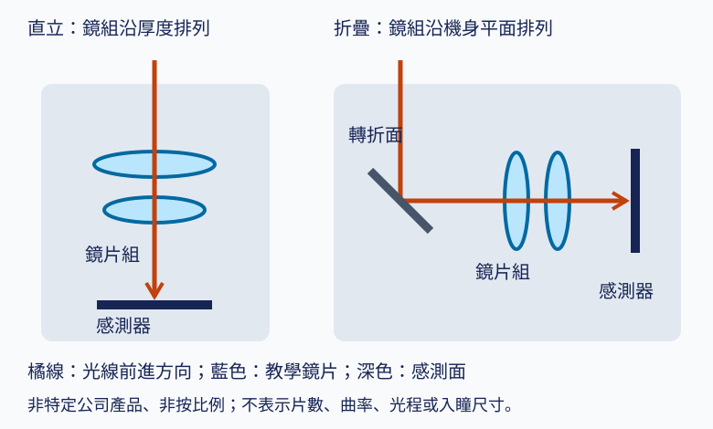

# 07 潛望式鏡頭如何在薄手機裡裝下長光路？

## 開場問題：機身沒有變厚，長焦是怎麼塞進去的

[第 02 章](02-optical-tradeoffs.md)留下一個看起來無解的矛盾：要拍得遠就需要長焦距，長焦距需要長的光學總長 TTL（total track length），而 TTL 是沿著手機厚度方向排列的。手機厚度大約八到九毫米，扣掉螢幕、電池、機構件之後，留給鏡頭的空間更少。想把焦距拉長兩倍，鏡頭就要往外凸——這就是「相機凸起」的來源，而且再凸下去消費者不會接受。

然後市面上出現了標榜五倍、十倍的手機長焦鏡頭，機身卻沒有明顯變厚。解法不是把光學總長縮短了，而是**把它折彎**：用一片稜鏡或反射鏡把光路轉 90°，讓原本要沿厚度方向排列的鏡片組，改成沿著手機的寬度或長度方向躺著排。厚度限制因此被繞開，長度改由手機平面上的可用空間決定。

這個機構帶來三個新問題，正是本章要處理的：第一，折疊之後的鏡頭能不能變焦，以及「N 倍變焦」到底是什麼的倍數；第二，鏡片被折到側邊之後，對焦與防手震要怎麼做；第三，這一整包東西的責任落在誰身上——鏡頭廠、馬達廠、模組廠還是手機廠。

## 結構與角色：折疊光路的零件清單

*圖 07-1：直立與折疊光路的比較（教學示意，非特定公司產品、非按比例）。這張圖能讀「長度被換到哪個方向」，不能讀鏡片片數、稜鏡尺寸或實際光程比例。*

折疊之後，零件清單比直立鏡頭多了幾樣，責任也跟著散開。

| 零件 | 作用 | 通常由誰提供 |
|---|---|---|
| 直角稜鏡或反射鏡 | 把光路轉 90° | 光學元件廠／鏡頭廠 |
| 鏡片組（塑膠、玻塑混合或全玻） | 成像、分攤像差 | 鏡頭廠 |
| 鏡筒與載台 | 定位鏡片、提供可動群組的導軌 | 鏡頭廠／機構件廠 |
| 致動器（VCM、SMA、壓電、MEMS） | 驅動對焦、變焦或防手震 | 馬達廠 |
| 影像感測器 | 光電轉換 | 感測器廠 |
| 模組整合（含主動對準） | 把上述整合成相機模組 | 模組廠 |
| 演算法與標定（ISP、防手震濾波） | 決定最終畫面 | 手機廠／晶片商 |

要注意的是這張表描述的是**產業一般分工**，不是任何特定供應鏈的實際安排。實務上一家公司可能同時做鏡頭與馬達，也可能有廠商向上整合到模組，具體歸屬需要逐案查證。

一片學術論文揭露的十倍潛望式變焦設計包含一片稜鏡、兩片非球面塑膠鏡片與六片非球面玻璃鏡片（玻璃轉化溫度 Tg 低於 550°C）。這是**學術實施例**，用來理解玻塑混合設計在折疊架構下能達到的變焦能力量級，不代表任何廠商實際出貨產品的規格。

## 作用機制：折疊之後，哪個尺寸被放鬆了

折疊沒有讓光學總長變短。有效焦距、幾何總長與含折射率的光程不是同一個量；在給定光學配置下，轉折元件主要是把這段光程從「垂直於機身平面」改成「平行於機身平面」。被放鬆的是**厚度**這個最稀缺的維度，被消耗的是手機平面上的**面積**。

這個交換有代價，而且代價很具體：

**入光口徑受厚度限制。** 轉折後橫躺的鏡組，其通光口徑在厚度方向上的尺寸，以及稜鏡和載台的包絡，仍須容納於模組高度。入瞳是孔徑光闌的像，不能直接等同背面開口或機身厚度。換句話說，折疊解放了鏡片組的長度，卻沒有解放**入瞳直徑**。這是為什麼潛望式長焦的光圈值（F 數）通常比主鏡頭大（進光量較少），夜拍相對吃力——這是幾何上的硬限制，不是設計偷懶。

**佔用平面面積。** 一顆躺著的長焦鏡頭在手機內部佔掉一條長條狀空間，這條空間要和電池、主機板競爭。這也是為什麼折疊光路幾乎只用在長焦，主鏡頭仍然是直立的：主鏡頭焦距短，直立排列本來就塞得下，折疊只會白白浪費面積。

**多出轉折元件及其光學面與公差。** 稜鏡本身的角度誤差、反射面平整度、以及它與後方鏡片組的相對姿態，都會疊進[第 06 章](06-assembly-yield-cost.md)講的公差鏈。稜鏡姿態偏移會改變光線方向，造成像移或額外像差；是否出現焦面傾斜須由具體光學配置判定，不能與鏡片傾斜完全等同。

## 名詞拆解：折疊光路不等於連續光學變焦

這是本章最重要的防混淆點。媒體常把「潛望式」直接等同「光學變焦」，但這是兩個獨立的設計選擇：**折疊只解決「長光程如何塞進薄機身」的機構問題，它沒有規定鏡頭有幾個焦距。**

折疊後的鏡頭至少有三種完全不同的東西：

| 型態 | 焦距行為 | 機構 | 使用者看到的「變焦」 |
|---|---|---|---|
| 固定長焦 fixed tele | **單一**焦距，不可改變 | 鏡片組全部固定，只有對焦群可動 | 該焦距以外全靠數位裁切，或與其他鏡頭切換 |
| 分段切換 | 兩個或數個**離散**焦距 | 鏡片群在幾個固定位置之間切換 | 在有限個焦段上是光學的，中間仍是數位 |
| 連續光學變焦 | 焦距在一個**區間內連續**可變 | 一個或多個變焦群沿光軸連續移動，改變群間相對距離 | 區間內可連續改變光學焦距；各焦段像質仍需分別量測 |

*圖表 07-2：三種折疊鏡頭型態。這張表能讀「焦距如何改變」與「靠什麼機構改變」，不能用來推斷任何特定機型屬於哪一類——判定需要該產品的官方規格頁。*

專利文獻描述的連續變焦做法包括：讓變焦鏡片群沿光軸方向移動，或在特殊設計中沿垂直於光軸的方向滑動，藉由改變群間相對距離達成連續變焦；也有維持兩群固定關係做變焦、僅移動第一群做對焦的較早期設計。這些都是**專利揭露的實施例**，與實際出貨產品規格必須分開討論。

### 動態圖解：連續變焦：鏡組移動，但像面維持固定

<figure class="wiki-media">
  
</figure>

觀察中間鏡組的相對位置，再對照左側固定的像面與光線落點變化。此動畫是大幅簡化的直線式變焦機制；不能從中推定潛望式手機一定能連續變焦，也不能把圖中片數當成大立光產品規格。

*圖源：[Zoom_prinzip.gif](https://commons.wikimedia.org/wiki/File:Zoom_prinzip.gif)，Rainer Knäpper（Smial），[Free Art License](https://artlibre.org/licence/lal/en/)。[開啟線上動畫](https://upload.wikimedia.org/wikipedia/commons/e/e3/Zoom_prinzip.gif)；直接載入 Wikimedia 原始 GIF，未修改。*

### 「N 倍變焦」的基準是什麼

規格表上的「5x」「10x」是一個比值，比值一定要有分母。至少有四個常見基準會被混用：

1. **相對主鏡頭的等效焦距**——最常見的行銷用法。「5x」通常指這顆長焦的等效焦距是主鏡頭等效焦距的五倍。分母是主鏡頭，而不同機型的主鏡頭等效焦距本來就不同，所以**兩支手機的 5x 不一定是同一個焦距**。
2. **該鏡頭自身的變焦範圍**——傳統相機鏡頭的用法。「10x 變焦鏡頭」指這一顆鏡頭的長焦端是廣角端的十倍，這時它必須是連續光學變焦。
3. **相對超廣角**——若分母換成超廣角鏡頭，同一支手機的倍數會瞬間變大好幾倍。
4. **含數位裁切的總倍率**——常標為「最高 100x」之類，其中只有一小段是光學的。

所以讀到「N 倍變焦」時要問三件事：**分母是哪一顆鏡頭？是光學還是含數位？是連續可變還是單一焦距？** 三題都答不出來，這個數字就沒有可比較性。真實焦距與等效焦距的差別在[第 02 章](02-optical-tradeoffs.md)已經說明：等效焦距是換算到 35mm 片幅的結果，它會隨感測器尺寸改變，本身就不是鏡頭的物理屬性。

## 致動：對焦與防手震是兩件不同的任務

鏡頭裡的可動元件由致動器驅動，但「動」有兩個目的，不能混為一談。

**自動對焦 AF（autofocus）**：沿**光軸方向**移動鏡片（或感測器），改變像距，讓不同物距的被攝物成像在感測器平面上。它處理的是「遠近」。

**光學防手震 OIS（optical image stabilization）**：補償拍攝當下手的**抖動**，讓像在曝光期間相對感測器保持靜止。它處理的是「晃動」，動作方向通常垂直於光軸或是繞軸旋轉。

**光學變焦**：改變群間距離以改變焦距，處理的是「視角」。折疊長焦若是固定長焦型態，就完全沒有這一項。

三者可以共存於同一顆鏡頭，也可以只有其中一兩項。「有 VCM 馬達」不等於「有 OIS」，「有 OIS」也不等於支援連續變焦。

### 四種致動技術

| 技術 | 原理 | 特點（一般工程比較，非特定公司規格） |
|---|---|---|
| 音圈馬達 VCM | 鏡片附著於線圈與彈簧結構、靠近固定磁鐵；改變線圈電流產生電磁力，沿光軸移動鏡片 | 常見的相機致動方式；設計重點在縮小體積、提升定位重複精度、降低耗電；仰賴釹鐵硼 NdFeB 磁鐵提供高力密度 |
| 形狀記憶合金 SMA | 細鎳鈦合金絲通電加熱，晶體結構相變使絲長收縮，藉此控制位置 | 不依靠磁鐵產生作動力；成本、致動力與電磁相容性須在完整系統比較；但形變曲線明顯非線性且有遲滯 hysteresis，位置控制較困難 |
| 壓電 piezoelectric | 利用壓電材料的超音波振動驅動鏡筒移動，常搭配位置感測 IC 做閉迴路控制 | 可用於微型定位；需比較行程、摩擦、磨耗及閉迴路精度，尺寸不宜跨產品概括 |
| MEMS 靜電致動 | 微機電靜電致動器，可直接驅動整個影像感測器移動來對焦，而非移動鏡片 | 低功耗、高響應速度、體積小；把「移動端」從鏡片轉移到感測器的另一條路線 |

*圖表 07-3：四種致動技術的一般比較。這張表能讀各技術的原理差異與取捨方向，不能讀任何廠商的採用狀況或實際性能數字。*

折疊架構對致動器的要求和直立鏡頭不同：可動群組躺在側邊、行程方向是水平的，重力方向與行程方向的關係隨手機姿態改變；若是連續變焦，還需要多組致動器同時做位置閉迴路控制，複雜度比單純 AF 高出一個層級。

### OIS 的三種做法

防手震要補的是手抖造成的像移。廣義上手抖有六個自由度（X、Y、Z 三個平移加 roll、yaw、pitch 三個旋轉），但實務上多數手機 OIS 只主動補償其中的俯仰 pitch 與偏擺 yaw——也就是對應鏡頭或稜鏡繞兩個橫向軸的旋轉；滾轉 roll 補償則依系統設計而定，部分專利描述了額外的滾轉補償機制。**所以「有 OIS」不是一個固定的能力等級**，它依補償對象與自由度數量而有明顯差異。

| 做法 | 移動什麼 | 主要補償的自由度 | 責任通常落在 | 量測與驗證方式 |
|---|---|---|---|---|
| 鏡頭位移 lens shift | 整個鏡筒或某一鏡片群，垂直光軸平移 | 對應 pitch／yaw 的兩個橫向像移分量 | 馬達廠提供致動與閉迴路；模組廠整合與標定 | 震動台施加已知頻譜的角振動，比較開啟與關閉 OIS 的 MTF 或邊緣銳利度差 |
| 感測器位移 sensor shift | 影像感測器本身 | 兩個橫向像移分量；部分設計可加入 roll 補償 | 模組廠／感測器模組供應商 | 同上，另需量測感測器行程與定位精度 |
| 稜鏡傾斜 prism tilt（折疊專用） | 轉折光路的稜鏡本身，繞 X、Y 兩軸旋轉 | 兩個旋轉自由度；行程依具體設計規格判定 | 馬達廠與鏡頭廠共同定義稜鏡載台介面 | 角度行程與重複精度量測，加上系統級震動測試 |

*圖表 07-4：三種 OIS 做法的自由度、責任與量測。這張表能讀「誰動、補什麼、誰負責」，不能讀各做法的補償能力優劣——那取決於行程、頻寬與控制演算法，需逐案查證。責任歸屬欄為產業一般分工的合理推論，公開文獻未提供正式的責任邊界定義文件。*

感測器位移免去移動整組鏡頭，但可動質量包含載台與封裝，還受排線剛性、行程和控制頻寬影響，不能一概認定比移動鏡片更輕或更好。稜鏡傾斜則是折疊架構特有的選項——既然光路最前端已經有一個要轉 90° 的元件，讓它微幅擺動就能移動整個像，而不必去推動後面那一長串鏡片。

## 缺陷與失敗：折疊架構多出來的失效模式

前一章的偏心、傾斜、間距誤差在折疊鏡頭裡全部存在，而且多了幾項。

**稜鏡姿態誤差改變入射條件。** 稜鏡角度偏移會使光線方向改變，造成像移與可能的額外像差；其靈敏度及場點分布須依具體配置分析。

**可動群組的定位重複性。** 有致動器就有行程、有回程差。SMA 的遲滯、VCM 的彈簧非線性，都會讓「送同一個電流值，鏡片不一定停在同一個位置」。閉迴路控制（加裝霍爾元件等位置感測）是常見對策，代價是元件數與成本。

**姿態相依性。** 鏡片群躺著的時候，重力方向與行程方向的夾角會隨手機是直立、平放還是倒置而改變，致動器需要克服的負載因此不同。驗收必須涵蓋多種姿態，只在單一姿態量測會漏掉問題。

**熱漂移。** 玻塑混合設計中，玻璃與塑膠的熱膨脹係數與折射率溫度係數不同，溫度改變時各片的貢獻不一致，可能造成對焦位置漂移。既有文獻已討論十倍潛望式變焦鏡頭的熱分析與混合補償設計，顯示這是該類設計必須正面處理的議題；具體補償手段與量化結果本書未逐字核對，列為待深入。

## 量測與控制：三個判定必須分開

要判斷一顆折疊長焦鏡頭「好不好」，至少要分開三組互不替代的判定：

1. **靜態成像品質**——在固定焦距、固定物距、關閉致動的條件下量 MTF。這一組完全沿用[第 03 章](03-image-quality.md)的紀律：附上場點、空間頻率、波長與離焦條件，否則數字不可比較。
2. **致動性能**——行程範圍、定位重複精度、遲滯量、響應時間、姿態相依性、耐久循環次數。這些是機電規格，會影響動態成像品質，但不能由靜態 MTF 代替。
3. **系統級防手震效果**——在震動台上施加已知頻譜的角振動，比較開啟與關閉 OIS 時的成像差異。這個結果同時包含光學、機電與**演算法**的貢獻，不能單獨歸給任何一方。

第三項最容易被誤讀：使用者感受到的防手震效果，是鏡頭、馬達、模組與手機端演算法四層共同作用的結果。把最終畫面的穩定程度直接算在某一家供應商頭上，在證據上不成立。

## 與大立光的連結

### 已確認事實

- 公司沿革載，2022 年「手機用潛望式變焦鏡頭**開發完成**」；同年 LP10（大立十廠）啟用。來源：[公司沿革](https://www.largan.com.tw/tw/about/history)，公司自述，各年份為公司自陳，發布日未標示，查閱日 2026-09-14。沿革另載 2019 年「10 倍光學變焦手機鏡頭開發完成」。**「開發完成」是公司自陳的開發里程碑，不等同量產、出貨或任何客戶採用。**
- 114 年報（2026-04-20 刊印）第 57–58 頁列出「114 年度至年報刊印日止所成功開發之技術與產品」，Phone Camera 類別包含多款 6P／5P／7P／8P AF 手機鏡頭、自由曲面鏡頭，以及 **2 群潛望式與多群潛望式鏡頭**。來源類型：法定揭露。**這是公司自陳「開發成功」，不是量產或出貨證據。**
- 114 年報第 55 頁列出 115 年度研發方向，包含可變光圈鏡頭、**分群 folded tele 鏡頭**、模造玻璃鏡頭等。來源類型：法定揭露，屬**計畫性陳述**，是未來研發方向，不是已完成或已出貨的證據。
- 大陽科技（Largan Digital）官網自述成立於 1998 年、為「大立光電集團成員之一」，主要產品為音圈馬達 VCM，涵蓋單／雙向 Open Loop、Closed Loop AF、OIS、Folded Tele 及 IRIS 運用；核心產品列有光學防手震音圈馬達、可變光圈與潛望式鏡頭馬達。來源：[大陽科技官網](https://info.largan.com.tw/largandigi/)，公司自述，發布日未標示，查閱日 2026-09-14。

### 合理推論

- 年報同時列出「2 群潛望式」與「多群潛望式」兩種品項，且 115 年度研發方向另列「分群 folded tele」，顯示公司在文件上區分了折疊鏡頭的**群數**。依本章的分類，群數與可動群數是決定「固定長焦／分段切換／連續變焦」的關鍵機構差異，因此可以合理推論公司在處理的是本章所述的同一組設計問題。**但年報用語本身沒有說明哪一種對應哪一類焦距行為，也沒有說明可動群數，故不能由群數直接推斷變焦型態。**
- 集團內同時存在鏡頭（大立光電）與音圈馬達（大陽科技）兩類產品的自述，意味著集團在本章表 07-1 的分工中，至少橫跨「鏡頭廠」與「馬達廠」兩格。**但這不代表任何一顆實際出貨產品同時採用了集團內的鏡頭與馬達**；搭配關係需要產品級證據，本輪沒有。

### 尚待查證

- **會計控制判斷與產品收入歸屬**：114 年報第 49 頁已載 2025-12-31 母公司直接持股大陽科技 49.37%，綜合投資比例 55.35%；後者包含董事、經理人及直接或間接控制事業，不能視為母公司單獨持股。控制判斷附註與逐產品收入對應仍待補。來源與口徑見[來源索引 G1](appendix-sources.md#g1)。
- 年報所列潛望式品項的焦距行為（固定長焦、分段切換或連續變焦）、可動群數、致動方式。
- 上述任何品項是否已量產、是否已出貨、出貨規模、單價與毛利貢獻。
- 客戶名稱與採用狀況。114 年報中客戶僅以數字代號揭露（如 653021 占 30%），**不得指名任何手機品牌**。
- 折疊鏡頭的組裝良率、稜鏡公差規格、客戶允收條件——與[第 06 章](06-assembly-yield-cost.md)相同，全部未公開。

### 一條必須守住的界線：專利實施例不等於出貨產品

本章引用的所有專利文獻，只代表**申請人在申請當時揭露的技術方案**。它不代表該技術已量產出貨，不代表該技術由本書研究對象持有或使用，也不代表揭露的具體數字（角度、尺寸、群數）是任何實際出貨產品的規格。同理，學術論文中的十倍潛望式設計是論文作者的設計實例，與任何公司的產品無關。

把專利或論文的實施例寫成「某公司的產品長這樣」，是本書明確禁止的推論。要連到公司的實際產品，必須另外以官網產品頁、年報或法說資料核對，並保留原始階段用語——**專利 ≠ 開發完成 ≠ 展示 ≠ 驗證 ≠ 出貨 ≠ 收入**，這六個階段各自需要各自的證據。

## 推理檢查

1. 一則新聞說「某廠推出潛望式鏡頭，達成 5 倍光學變焦」。這句話至少有兩處語意不完整，是哪兩處？各需要什麼資訊才能補上？
2. 折疊光路解放了手機厚度對光學總長的限制，為什麼潛望式長焦的光圈值（F 數）通常仍比主鏡頭大？
3. 一款折疊長焦採用稜鏡傾斜式 OIS，另一款採用感測器位移式。若只看「都有 OIS」，會漏掉哪些可能的差異？
4. 公司年報寫著「多群潛望式鏡頭開發成功」。依本書的證據紀律，這句話可以支持哪些結論、不可以支持哪些結論？
5. 使用者實測發現某手機長焦在夜間手持的成功率特別高。這個結果可以歸功於鏡頭廠嗎？

??? note "參考推理"
    **1.** 第一處是「5 倍」的分母：是相對這支手機的主鏡頭等效焦距、相對超廣角、還是這顆鏡頭自身的長短焦端之比？三種算法會得到完全不同的數字。第二處是「光學變焦」的型態：是連續光學變焦（區間內任意焦距都有光學解析力），還是單一固定焦距、其餘靠數位裁切？「5 倍」若指的是固定焦距鏡頭相對主鏡頭的焦距比，那它根本不是變焦，只是一個較長的定焦。要補上這兩處，需要該產品官方規格頁上的實際焦距（mm）、等效焦距、以及是否標明變焦範圍。

    **2.** 因為折疊只解放了鏡片組的**長度**，沒有解放**入光口徑**。折疊後鏡組與稜鏡在厚度方向的通光尺寸仍受模組高度限制。F 數大致等於有效焦距除以入瞳直徑；焦距被拉長而入瞳直徑被厚度卡住，在入瞳受限的假設下，F 數便會變大。實際限制還取決於瞳孔成像與光機布局，不能直接把機身厚度當入瞳直徑。

    **3.** 至少會漏掉：補償的自由度數量（兩個橫向分量，還是額外含 roll）、移動端的質量與可達行程（需查包含載台的質量、角度行程與像移靈敏度，不能從型態直接排序）、響應頻寬與控制方式（開迴路或閉迴路）、姿態相依性，以及責任歸屬與標定方式的差異。另外還有一個根本問題：最終使用者感受到的穩定度包含手機端演算法的貢獻，OIS 硬體型態只是其中一層。

    **4.** 可以支持的：公司在該年度的法定揭露文件中，自陳完成了該項技術或產品的開發；公司在此技術方向上有投入；文件上區分了不同群數的潛望式設計。不可以支持的：已經量產、已經出貨、已被任何客戶採用、產生了多少營收、良率達到什麼水準、性能優於任何競爭者。這些都需要各自的證據，「開發成功」一詞本身不蘊含其中任何一項，而年報也沒有附上出貨量、客戶名稱或收入貢獻的揭露。

    **5.** 不能單獨歸功給鏡頭廠。夜間手持成功率同時取決於：鏡頭的光圈與解析力（鏡頭廠）、OIS 的補償能力（馬達廠與模組廠）、感測器的靈敏度與讀出雜訊（感測器廠）、模組整合的對準品質（模組廠），以及曝光策略、多幀合成與去模糊演算法（手機廠與晶片商）。實測結果是一個系統級輸出，把它歸給供應鏈上任何單一環節，在證據上都不成立。這與[第 01 章](01-camera-value-chain.md)建立的責任表是同一個原則。

## 來源與待查

折疊光路原理、致動技術比較與 OIS 三種做法，整理自以下公開文獻：折疊光路與十倍潛望式變焦光學設計（PMC 收錄之學術論文兩篇，其一為熱分析與混合補償設計）、固定長焦與連續變焦的機構差異（WO2016024161A2、US8085474B2、US4961635A 等專利公開文獻）、致動技術（ScienceDirect 五自由度 VCM 設計論文、Cambridge Mechatronics 之 SMA 技術說明、New Scale Technologies 壓電模組產品資料、US20170180619A1 等 MEMS 專利）、OIS 做法與自由度（PMC 收錄之二自由度 OIS 控制論文、含滾轉補償的折疊相機專利、Samsung CamCyclopedia 技術科普頁）。完整連結見[來源索引](appendix-sources.md)。

上述專利與學術文獻**不作為大立光實際採用或出貨的證據**，僅用於說明通用技術原理。

公司資訊引自大立光電[公司沿革](https://www.largan.com.tw/tw/about/history)（公司自述，發布日未標示）、114 年報第 55 及 57–58 頁（法定揭露，2026-04-20 刊印），以及[大陽科技官網](https://info.largan.com.tw/largandigi/)（公司自述，發布日未標示）。查閱日統一為 2026-09-14。

待查清單（同步至[待查問題](appendix-open-questions.md)）：大陽科技的會計控制判斷附註與產品收入歸屬；連續光學變焦機構在實際出貨手機產品上的具體規格（移動群數、變焦範圍與光學總長的關係），本書蒐集的資料多為專利與論文層級的實施例，未系統性比對市售產品；玻塑混合鏡頭中玻璃與塑膠熱特性差異造成的對焦漂移與補償手段的量化細節。

下一章把問題從「做得出來」推進到「客戶為什麼採用」：[第 08 章](08-qualification-competition.md)處理設計、送樣、驗證、出貨這一串階段各自需要什麼證據，以及供應商為什麼會被換掉。
