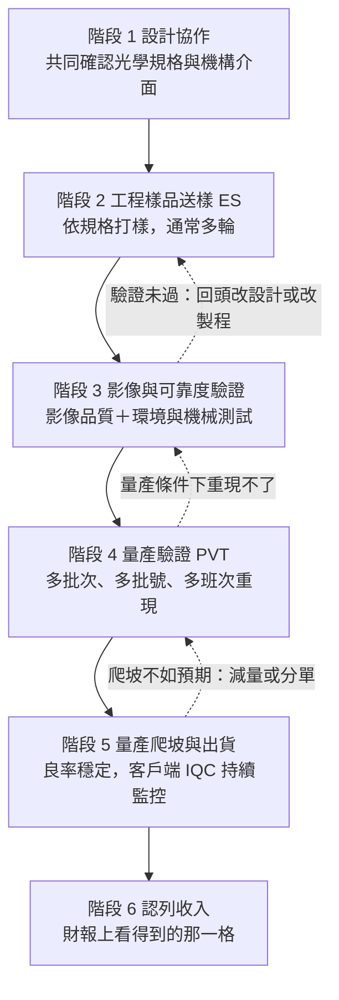

# 08 做得出來之後，客戶為什麼採用、又為什麼換掉？

## 開場問題：「打進供應鏈」這四個字，到底證明了什麼？

供應鏈新聞最常見的句型是「某公司打進某大廠供應鏈」。這句話沒有指定階段：它可能表示雙方剛開始討論規格，可能表示送了幾輪工程樣品，可能表示通過了可靠度測試，也可能表示已經在出貨並認列收入。這五種情況對營收的意義差了好幾個量級，但在標題上長得一模一樣。

[第 06 章](06-assembly-yield-cost.md)處理的是「做得出來嗎」——鏡片合格、鏡頭組得起來、良率撐得住成本。本章處理的是接在後面的問題：**做得出來之後，客戶憑什麼採用你；已經採用了，又會在什麼情況下換掉你。**

先講結論：客戶採用不是一個事件，是一座階梯。每一階證明的東西都比上一階多一點，但**沒有任何一階可以代替下一階**。讀懂這座階梯，才有辦法把一則消息放到正確的高度上。

## 結構與角色：從設計協作到認列收入的證據階梯

*圖 08-1：客戶驗證的證據階梯。**證據等級提醒：此流程的分期描述來自多篇相機模組製造與品管業者的技術部落格（公司自述層級），不是標準組織發布的正式規範，也不是任何一家公司對外揭露的實際流程。** 不同客戶、不同專案的命名與切分方式都可能不同。這張圖能讀的是「階段之間的依賴關係與回退路徑」；不能讀成任何具體專案的時程、輪次或通過標準。虛線是回退，不是失敗即出局——實務上多半是回到前一階重做。*

把每一階能證明與不能證明的事攤開，是本章最重要的一張表：

| 階段 | 這一階能證明 | 這一階**不能**證明 | 典型可見的外部訊號 |
|---|---|---|---|
| 1 設計協作 | 客戶願意把規格與機構介面拿出來一起討論 | 不證明會採用，也不證明供應商做得出來 | 幾乎沒有公開訊號 |
| 2 工程樣品送樣 ES | 供應商能依規格做出實體樣品 | **不證明量產穩定性**；來源明確區分「設計驗證」與「製程驗證」，指出少量工程樣品足以證明設計可行，通常不足以證明量產可重現 | 公司說「送樣」「客戶端驗證中」 |
| 3 影像與可靠度驗證 | 這個設計在指定測試條件下撐得住 | 不證明在量產的批次變異下每一顆都撐得住 | 「通過客戶驗證」，但通常不說是哪一階的驗證 |
| 4 量產驗證 PVT | 在多批次、多批號物料、多班次的條件下能重現前一階結果 | 不證明實際下單量，也不證明價格 | 「取得資格」「進入量產準備」 |
| 5 量產爬坡與出貨 | 若來源明示出貨，可確認交付；良率與獲利須另查 | 不證明佔該客戶的份額，也不證明持續性 | 可對應該產品的出貨揭露；合併月營收變化不足以定位 |
| 6 認列收入 | 財報數字上看得到 | 不證明來自哪個客戶、哪個機種、哪種產品組合 | 月營收、季報、年報 |

*圖表 08-2：階段與證據範圍對照。這張表能讀的是「一句話該被放在第幾階」；不能讀成任何公司的實際進度。第三欄的「外部訊號」是產業慣見說法的整理，不是任何公司的正式用語。*

各階段的內容依同一批技術部落格來源整理如下（同樣為公司自述層級）：**影像驗證**涵蓋中心與邊緣銳利度、對焦一致性、視角、畸變、色彩還原、訊噪比、動態範圍、低光表現、雜散光與陰影；**可靠度測試**涵蓋高低溫循環與熱衝擊、濕熱、跌落與震動。這些項目名稱可以幫你理解「驗證在測什麼」，但**具體門檻值不在公開來源中**，不要假設有一套業界通用的及格線。

## 作用機制：為什麼客戶要分這麼多階，換掉又那麼難

### 一階證不了下一階，因為變異的來源不同

工程樣品可能採較受控的設備、材料與操作條件。它回答的問題是「這個設計在物理上成立嗎」。量產要回答的是完全不同的問題：**當模具用到第 N 萬模、當材料換到另一個批號、當作業換到夜班、當環境溫濕度飄移時，還成立嗎？** 前者是設計驗證，後者是製程驗證。客戶之所以堅持分階，正是因為歷史上太多案例是「樣品漂亮、量產崩盤」。

這也解釋了為什麼公司說「開發完成」時不能讀成「量產」，說「送樣」時不能讀成「已獲採用」。階段用語是有資訊量的，公司用哪個詞，通常就是它目前站到的那一階。

### 換供應商的真實成本：三筆帳

「有替代來源」是採購的基本要求，但**有替代來源不等於明天就能換**。換一家鏡頭供應商，客戶至少要付三筆帳：

**第一筆：重新驗證。** 新供應商須按客戶要求重新確認相關項目，範圍取決於沿用設計與認證程度。設計協作要重來（不同廠的設計自由度與製程能力不同，規格往往要微調）、樣品要重送、影像與可靠度驗證要重測、量產驗證要重做。這筆帳的成本主要不是錢，是**時間**——而手機機種有發表時程，時間窗一旦錯過，可能必須延到下一代，或另外付出延期與改版成本。

**第二筆：良率爬坡。** 新供應商初期的良率通常低於既有供應商的穩態良率，因為製程參數、治具、量測條件都需要沿著自己的學習曲線收斂。爬坡期的單位成本較高，交期也較不穩。客戶要嘛吸收這段成本，要嘛承擔缺料風險。

**第三筆：產線切換。** 鏡頭不是獨立使用的，它要被模組廠裝進相機模組。換鏡頭供應商，模組廠的 AA 參數、治具、來料檢驗規格、甚至點膠與固化條件都可能要重新設定與驗證。這筆帳落在下游，但最終回到客戶的成本與時程上。

三筆帳加起來，造成一個重要的結構性後果：**既有供應商有黏性，但黏性來自轉換成本，不是來自感情或承諾。** 而轉換成本最低的時刻是機種換代——新機種本來就要重走一次階梯，這時候多評估一家供應商的邊際成本最小。所以供應商的更替通常不是「某天被換掉」，而是「下一代沒有被選上」。理解這一點，就知道為什麼觀察供應關係要看機種週期，而不是看單月數字。

## 缺陷與失敗：驗證會卡在哪

驗證階段卡關有兩種面貌：一種是明確不過，一種是過了但排查不出原因、客戶不敢放行。後者更麻煩。

**高低溫循環後出現對焦飄移。** 來源指出的排查方向包含：接著劑選用、固化參數、鏡頭固定設計、材料熱膨脹相容性。注意這些方向**大多落在模組組裝層，而不是鏡頭本身**——鏡頭廠交付的是光學組件，但熱膨脹相容性是鏡頭材料與模組機構共同決定的。這正是責任歸屬最容易吵架的地帶。

**震動測試後出現訊號間歇性異常。** 排查方向包含：軟性電路板走線、連接器固定、焊點、外殼支撐結構。這一組幾乎全部在模組與機構層，和鏡頭關係更遠。

（以上兩組排查方向同樣來自模組廠技術部落格，**公司自述層級**，是實務經驗的整理，不是標準條文。）

**從這兩個例子可以抽出一條通則：驗證失敗的現象發生在系統層，原因卻分散在各段供應商身上。** 所以驗證卡關時，第一件事不是找出誰的錯，而是先做「分離實驗」——換一組鏡頭、換一組模組、換一批膠、改一次固化條件，看現象跟著誰走。在分離完成之前，任何歸責都只是猜測。

對讀新聞的人來說，推論方向是：看到「某供應商驗證未過」的消息，先問這是哪一階的驗證、失效現象是什麼、以及有沒有證據顯示原因確實落在該供應商的交付範圍內。這三個問題通常一個都答不出來——那就表示這則消息的證據強度很低。

## 量測與控制：怎麼比較同業，怎麼讀專利與訴訟

### 口徑對齊說明（務必先讀，再看表）

把幾家公司的數字放進同一張表之前，以下四項差異不可忽略：

1. **「鏡頭廠」和「模組廠」是兩種不同的生意。** 大立光、玉晶光電賣的是光學鏡頭組件；舜宇光學、丘鈦科技、LG Innotek 是相機模組廠或兼營鏡頭與模組，賣的是把鏡頭、致動器、感測器、電路板組裝完成的相機模組。**模組廠的毛利率天生遠低於純鏡頭廠**，因為模組多了感測器、IC、組裝與良率風險，附加價值分散在更多環節，代工組裝性質的定價權也較低。把鏡頭廠的毛利率和模組廠的毛利率並列比較「誰比較賺」，如果不先講清楚這是產業結構差異，就是誤導。
2. **出貨量的單位與產品層級不同。** 有的公司公告「相機模組銷售數量（百萬顆／月）」，有的公司只公告月營收金額，有的公司在年報中拆「手機鏡頭」與「手機攝像模組」兩條產品線。單位不同、產品層級不同、統計期間也不同，不能直接相除或相加。
3. **統計期間不同。** 下表引用的數字橫跨不同年度與期間，比較前必須先統一到相同期間，否則會製造出淡旺季或一次性事件造成的假趨勢。
4. **幣別與合併範圍不同。** 港股公司以人民幣列示、台股以新台幣、韓股以韓元。毛利率是百分比不受幣別影響，但營收與出貨的絕對值比較必須換算並註明匯率基準日。**另外，除非明確標示為「鏡頭／光學元件業務」的分部數字，否則毛利率一律是公司整體合併毛利率，不可誤用為單一產品線的毛利率。**

### 可比業者對照表

| 比較對象 | 先核對的業務邊界 | 本書採用範圍 |
|---|---|---|
| 大立光電 | 合併集團，以光學元件為主 | 114 年報 p.78：營收 61,147,888 千元、毛利 30,837,054 千元，毛利率自算 50.43% |
| 舜宇光學科技 | 光學元件與光電產品須分開 | 已定位港交所年報，但未完成分部數字複核，不引用金額 |
| 玉晶光電 | 鏡頭與其他光學元件範圍須核對 | 尚未取得足夠原始財務文件，數字待查 |
| LG Innotek、丘鈦科技 | 相機模組、其他事業與合併範圍須核對 | 原研究的日期、分部定義或原始數字尚未補齊，刪除未核實百分比 |

*圖表 08-3：可比業者的口徑檢查。可以用來規劃查證，不能比較市占、技術優劣或效率排名。其他公司的數字尚未核對時，不用媒體金額補空格。*

**特別說明玉晶光電那一列。** 本輪研究確實搜尋到若干數字（如某期間的營收與毛利率），但來源是財經彙整站與媒體轉述法說會的報導，本輪未能開啟公司原始年報或法說會文件核對，公司投資人關係頁亦連不上。依本書的證據紀律，**寧可留白並標示待查，也不引用未溯源的數字**。這一列的空白本身就是一條資訊：當你在別處看到玉晶光電的數字時，請先問它出自哪份原始文件的第幾頁。

### 專利與訴訟：只支持其揭露內容

專利與訴訟是少數可以取得日期與程序記錄的公開證據，但它們能證明的範圍比一般想像窄很多。三條原則先講在前面：

- **一件專利只支持它自己揭露的內容**，不支持「該公司的產品就是這樣做的」，也不支持「其他公司不能做類似的事」。專利實施例與量產品之間沒有必然對應。
- **專利件數的多寡不等於技術領先。** 不同專利資料庫對同一公司的專利總數可能不同，差異取決於資料庫涵蓋範圍是僅美國、全球家族、是否含已放棄或失效專利。這類彙整站數字互相矛盾，本書不引用為任何主張的依據；要主張件數，應以智慧財產局與 USPTO 的官方檢索結果為準，本輪未執行該檢索。
- **訴訟結果不等於市場結果。** 勝訴不代表對方退出市場，和解不代表任何一方認錯，撤告也不代表主張不成立。訴訟只證明程序上發生了什麼。

| 案件 | 可直接定位的原始揭露 | 不能推導的事項 |
|---|---|---|
| 軟體授權著作權案 | 114 年報 p.81（刊印 2026-04-20）記載 2024-04-19 公司部分員工及公司被起訴、委請律師應訴，現任及前任代表人已確定不起訴 | 這是年報刊印時的公司揭露，不是本書查閱日的法院程序查詢；亦不涉及鏡頭技術優劣 |

*圖表 08-4：公司年報可定位的法律程序紀錄。只能確認公司在該日披露的內容，不能據此推論其他專利案件或市場結果。*

原研究另蒐集大立光與三星、玉晶光電、先進光的爭議新聞，但尚未逐案取得足以核對目前程序與裁判範圍的法院原件，因此不在本章重述結果。先進光（3362）與玉晶光電（3406）為不同公司，案名也不能混用。法律案件若需補寫，應先取得案號、完整裁判與確定狀態，而非只依勝訴、和解、撤告的新聞標題。

## 與大立光的連結

### 已確認事實

- **客戶集中且以代號揭露。** 114 年報第 63 頁（法定揭露，2026-04-20 刊印）顯示，113 與 114 兩個年度，代號 653021 的客戶均占銷貨總額 30%（金額分別為新台幣 18,035,001 千元與 18,338,766 千元）；114 年度另有代號 632019 占 15%、643006 占 13%、622020 占 11%。**全部以數字代號列示，未揭露名稱。**
- **公司自陳集中風險。** 114 年報第 81 頁載：「本公司之銷售對象有顯著集中在少數客戶之情形，為降低信用風險，本公司持續評估主要客戶財務狀況及實際收款情形，且定期評估應收帳款回收之可能性。」第 61 頁不利因素欄載「手機鏡頭出貨狀況所佔比重過高，無法有效分散市場產品風險。」
- **財務規模。** 114 年度合併營業收入新台幣 61,147,888 千元、營業毛利 30,837,054 千元（114 年報第 78 頁，法定揭露，集團合併口徑）。
- **一件已揭露的法律程序。** 即前表的著作權案，來源為 114 年報第 81 頁。

### 合理推論

- 客戶集中度高，加上換供應商的三筆成本（重新驗證、良率爬坡、產線切換），意味著**單一客戶單一機種的驗證結果，對季度營收的影響會被放大**。這是方向性的推論；幅度無法從年報揭露的數字反推，因為年報沒有把收入拆到機種或產品層級。
- 公司自陳「手機鏡頭比重過高」與 114 年報第 55 頁列出的多方向研發計畫（車用、醫療、AR/VR、可變光圈等）合併來看，可以推論公司正嘗試用應用面的分散來回應集中風險。但**研發方向不是收入**，這條推論不能升級成任何營收預期。

### 尚待查證

- 大立光在任一具名客戶專案中所處的驗證階段、送樣輪次、量產驗證通過與否——本書所用來源沒有提供這些資訊，本書不推測。
- 玉晶光電可核對的一手財務數字（年報或法說會原始文件）。
- 舜宇光學手機鏡頭分部的單獨毛利率（需逐頁精讀其年報分部揭露）。
- 大立光 v. 三星的和解協議條款；大立光 v. 玉晶光電兩案的法院原始裁定文件。
- 大立光專利件數的官方檢索結果（智慧財產局與 USPTO）。

## 推理檢查

1. 一則新聞說「某鏡頭廠已通過客戶驗證」。在你能判斷這對營收的意義之前，至少要追問哪三個問題？
2. 某供應商的工程樣品在三輪送樣後全部達標，客戶卻仍未下量產訂單。列舉兩個合理且不涉及「客戶刁難」的解釋。
3. 教學假設：鏡頭廠毛利率 48%、模組廠 8%（非任何公司真實數字）。能說前者經營效率是後者六倍嗎？
4. 假設某公司在一宗專利案的特定爭點獲法院支持，是否足以推論其鏡頭技術全面優於對方？
5. 若某客戶決定在下一代機種引入第二家鏡頭供應商，這個決定最可能在什麼時間點發生、又會先在哪一階看到跡象？

??? note "參考推理"
    1. 第一，是哪一階的驗證（工程樣品的設計驗證？可靠度驗證？還是量產驗證）。第二，驗證的標的是哪個產品、哪個機種、預計何時進入量產。第三，這個說法的來源是公司正式揭露、法說會發言，還是記者轉述——三者的證據等級差很多。三個問題答不出來，這則消息就只能停在「有此一說」。
    2. 其一，樣品證明的是設計可行，客戶還在等量產驗證（多批次、多批號、多班次）的結果；其二，客戶的機種規劃、成本目標或供應商配置本來就未定，與樣品品質無關。另外也可能是客戶端的模組或整機整合仍有未收斂的問題，與該供應商無關。
    3. 錯在把兩種生意的結構差異讀成經營效率差異。純鏡頭廠賣的是高附加價值的光學組件；模組廠賣的是包含感測器、IC 與組裝的相機模組，附加價值分散在更多環節，且原材料成本占比高。兩者的毛利率會受不同成本與議價結構影響，不能相除。此外兩家公司幣別、合併範圍與產品組合都不同，營收絕對值須換匯；百分比本身不需換匯，但必須對齊業務範圍。
    4. 不能。中間判決只就部分爭點作出法律上的判斷，證明的是「在該案的特定專利與特定爭點上，法院支持原告的主張」，不是技術全面優劣的評價。還須查核裁判範圍與程序狀態。訴訟結果也不等於市場結果。
    5. 最可能發生在機種換代的時點，因為新機種本來就要重走一次驗證階梯，這時多評估一家供應商的邊際成本最低。最早的跡象會出現在階段 1 到 2（設計協作與工程樣品送樣），但這兩階幾乎沒有公開訊號，外部通常要到量產爬坡（階段 5）造成出貨或月營收變化時才看得見——這也是為什麼供應鏈變動往往「後知後覺」。

## 來源與待查

本章公司數字與法律程序採 114 年報第 61、63、78、81 頁（法定揭露，2026-04-20 刊印）。驗證流程為作者依公開工程原理與業者技術說明整理的教學框架，並非大立光實際流程或產業統一規範。未逐項核對的競爭者財務與訴訟結果已刪除，保留待查方向。

需要特別記住的三件事：第一，**驗證流程的分期來自公司自述層級的技術部落格，不是標準規定**，不要把它當成業界通行的正式規範引用。第二，**本章不含任何市占率或排名**，因為本輪沒有取得定義一致、期間對齊的市場統計。第三，**玉晶光電的財務數字本輪未取得可核對的一手來源，因此留白待查**，這是刻意的空白。

完整來源清單與待查項目見[來源索引](appendix-sources.md)與[待查問題](appendix-open-questions.md)。本章建立的階段語言，會在[第 11 章](11-largan-evidence-map.md)變成整張公司證據矩陣的欄位，也會在[第 12 章](12-reading-news.md)用來判讀真實新聞。下一章先回到財報，處理鏡頭規格升級如何反映在營收、毛利與現金流上：前往[第 09 章](09-business-economics.md)。
