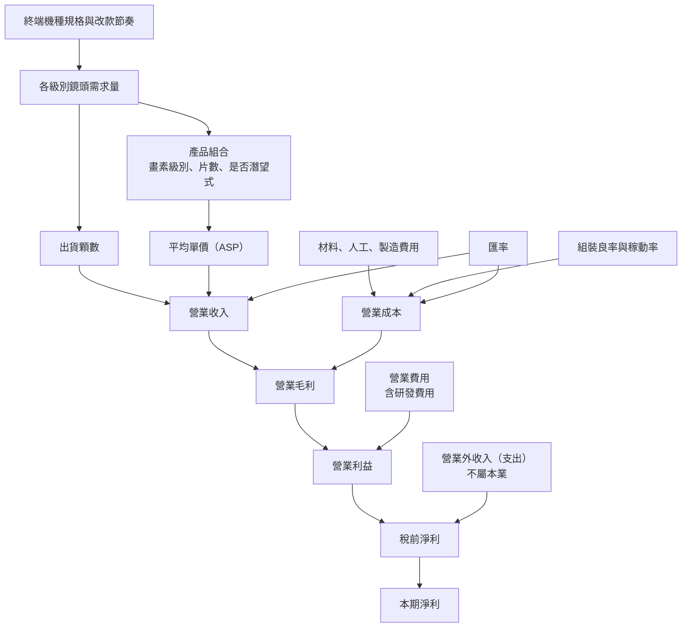

# 09 鏡頭升級如何反映在報表上？

## 開場問題：規格一直升級，為什麼營收只成長 3%？

前面八章談的都是「更難做的鏡頭」：更多片、更大光圈、潛望式、更高解析。直覺上，產品變難、單價變高，報表應該同步變好。

但大立光 114 年度（即 2025 會計年度）的合併營業收入是新台幣 61,147,888 千元，113 年度是 59,457,553 千元，成長約 2.84%（本書自算：(61,147,888 − 59,457,553) ÷ 59,457,553 = 1,690,335 ÷ 59,457,553 ≈ 2.84%；年報致股東報告書寫「成長 3%」）。同一期間，合併營業毛利反而從 31,209,309 千元降到 30,837,054 千元。

**規格升級與報表變好之間，隔著至少三層：出貨顆數、產品組合、以及每顆合格品的成本。** 這一章要做的事，是把這三層拆成可以各自查證的欄位，並且示範一件更基本的功課——在動手算之前，先確認手上的數字是同一個口徑。

本章所有金額單位為新台幣千元、合併報表口徑，出處逐項標注。本章不討論股價、目標價或買賣建議。

## 結構與角色：把營收拆成兩個可查的因子

最小的拆解只有兩項：

```text
單一產品集合的營業收入 = 已認列銷售量 × 平均單價（ASP）
平均單價 = Σ(各級別鏡頭單價 × 該級別出貨占比)
```

第二式是重點：**平均單價同時受各品項議價與產品組合 product mix 影響。** 影響組合的變數在前幾章都出現過——畫素級別、鏡片片數（6P/7P/8P）、是否為潛望式或折疊光路、是否含可變光圈。同樣是「鏡頭一顆」，不同級別的售價可以差很多倍。

由此往下，三個層次各有自己的分母：

| 層次 | 欄位 | 公開揭露程度 | 讀的時候要補什麼條件 |
|---|---|---|---|
| 量 | 出貨顆數 | **未逐期揭露絕對顆數** | 顆數 ≠ 相機顆數 ≠ 手機台數 |
| 價 | 平均單價 | **未揭露** | 可看畫素組合區間，無法單靠它判定平均單價方向 |
| 組合 | 各畫素級別出貨占比 | 法說會簡報以**區間**揭露 | 區間不是點估計，見下節 |
| 成本 | 營業成本、營業費用 | 年度合計揭露 | 未拆分產品別或廠別 |

把「營收成長 3%」直接說成「單價漲了」或「賣得更多了」，都是跳過了這張表。

<div class="diagram-scroll" style="--diagram-width: 680px" markdown="1">



</div>

*圖 09-1：需求到營收與獲利的因子鏈。實線是因子依賴，不是會計科目的加總順序。這張圖能讀「毛利率變化有哪幾個候選來源」，不能讀「哪一個來源貢獻了多少」——公開揭露沒有把毛利拆到產品別或因子別。*

## 口徑：同一年度為什麼有三個淨利數字

在算任何比率之前，先看一組事實。大立光 114 年度的稅後淨利，在三份官方文件裡是三個數字：

| 來源 | 位置 | 114 年度淨利（千元） | EPS（元） |
|---|---|---:|---:|
| 114 年報，致股東報告書 | 第 1 頁 | 21,275,407 | 159.41 |
| 2026-01-08 法人說明會簡報 | 1–4Q25 合併綜合損益 | 21,282,488 | 159.46 |
| 114 年報，財務績效比較表 | 第 78 頁 | 21,560,257 | 未於該表列示 |

*圖表 09-2：同一會計年度、三個官方來源的淨利數字。年報刊印日 2026-04-20，法說會簡報發布日 2026-01-08，查閱日 2026-09-14。這張表能讀「必須註明口徑」，不能讀「哪一個是錯的」。*

差額不大但真實存在。本書自算：21,560,257 − 21,275,407 = 284,850 千元；同樣兩個欄位在 113 年度是 26,210,952 − 25,915,410 = 295,542 千元。兩個年度的差額都落在 2.8 至 3.0 億元、方向一致，這與「**歸屬於母公司業主之淨利** vs. **含非控制權益之本期淨利總額**」的口徑差異相容——但年報該表並未在欄位上註明口徑，所以這只是**合理推論，不是已確認事實**。法說會簡報與致股東報告書之間只差 7,081 千元，且簡報自陳「未經會計師查核」，與查核前後調整相容，同樣是推論。

113 年度的毛利也有兩個數字：2025-01-09 法說會簡報載 31,165,575 千元，114 年報財務績效表載 31,209,309 千元，差 43,734 千元。

**正確做法只有一個：整段分析固定引用單一來源，並在文字裡寫出「哪一份文件、第幾頁、什麼口徑、是否經查核」。** 把年報的分子配上法說會的分母，算出來的比率不屬於任何一份文件，也無法被任何人複核。本章以下的年度數字，一律取自 114 年報第 77–79 頁，同一組來源。

## 作用機制：產品組合怎麼推動平均單價

法說會簡報每季揭露鏡頭出貨的畫素級別組合，但揭露形式是**區間**：

| 期間 | 10MP | 20MP+ | 8MP | 其他 |
|---|---|---|---|---|
| 2025 全年 | 50–60% | 10–20% | 0–10% | 20–30% |
| 2026 第一季 | 60–70% | 10–20% | 0–10% | 10–20% |
| 2026 第二季 | 50–60% | 10–20% | 0–10% | 20–30% |

*圖表 09-3：鏡頭出貨組合，來源為公開資訊觀測站法人說明會簡報（2026-01-08、2026-04-16、2026-07-09），查閱日 2026-09-14。這張表能讀占比的**移動方向**，不能讀出精確占比，更不能反算平均單價。*

為什麼不能反算？把 2025 全年的四個區間下界相加是 50+10+0+20 = 80%，上界相加是 60+20+10+30 = 120%（本書自算）。**真實的那組數字被夾在中間，但無法唯一決定。** 即使再給定每個級別的單價（而單價從未揭露），算出來的平均單價也會是一個區間；其寬度與用途取決於額外條件。

區間能讀的是方向。以 2026 第一季對 2026 第二季為例：10MP 的區間由 60–70% 下移到 50–60%，「其他」由 10–20% 上移到 20–30%，20MP+ 與 8MP 的區間不變。可以說的是「10MP 占比區間下移、其他占比區間上移」；不能說的是「10MP 少了 10 個百分點」——區間邊界移動 10 個百分點，若上下界皆含端點，實際變化可從 0 到 20 個百分點；不能假定恰好 10 個。

還有一個更容易犯的錯：**占比是顆數口徑，不是金額口徑。** 一顆 20MP+ 潛望式鏡頭與一顆 8MP 鏡頭在營收上的權重完全不同，但在這張圓餅圖裡各算一顆。顆數組合右移不必然等於營收組合右移，反之亦然。

## 五年營收：先補時間尺度，再談原因

以下為合併營業收入，單位新台幣千元。2026-09-15 續查官網年報原檔，補足原稿只有兩年對照的缺口。

| 年度 | 合併營收 | 年增率（本書自算） | 官方年報定位 |
|---|---:|---:|---|
| 2021 | 46,962,402 | −16.06% | 110 年報印刷 p.52，2020 對照為 55,944,489 |
| 2022 | 47,675,228 | +1.52% | 112 年報印刷 p.55 |
| 2023 | 48,842,247 | +2.45% | 112 年報印刷 p.55；114 年報 p.54 可交叉核對 |
| 2024 | 59,457,553 | +21.73% | 114 年報印刷 p.54、78 |
| 2025 | 61,147,888 | +2.84% | 114 年報印刷 p.54、78 |

*圖表 09-6：2021–2025 合併營收趨勢。年增率＝本年營收÷前一年營收−1，四捨五入到小數第二位。原始連結見[來源索引 A1](appendix-sources.md#a1)。可讀年度規模與變化，不可將成長唯一歸因於鏡頭升級、顆數或新應用。*

2024 的增幅明顯高於其餘列，2025 則是在較高基期上小幅成長。這不構成「成長結束」或「技術失去優勢」的證據：還需產品量價、匯率與合併範圍變動。為避免混用淨利歸屬與查核版本，本表只接合併營收，獲利分析仍使用下方同一份年報的兩年對照。

114 年報 p.54 另將 2025 年營收分為光學元件 60,828,323 千元（99.48%）與其他 319,565 千元（0.52%）。這是已揭露的大類，不能說公司「完全沒有產品別資料」；但該分類仍不能拆出手機、車用、潛望式或 CPO 的收入。

## 需求：季節性、地區欄位與客戶集中度

法說會簡報揭露的季度營收，可以先做一次自我檢查。本書自算：14,579,231 + 11,672,625 + 17,677,392 + 17,218,640 = 61,147,888 千元，與 114 年報的年度營業收入完全相同——這與兩份文件均採合併年度營收的標示一致；其他欄位仍須分別確認。

由此看季節性（本書自算，分母為 114 年度營收 61,147,888）：1Q25 佔 23.84%、2Q25 佔 19.09%、3Q25 佔 28.91%、4Q25 佔 28.16%，上半年合計 42.93%。**單季營收的年增率以去年同季為基準；與上一季相比則是季增率。**

2026 年已公告期間：第一季 15,544,079 千元（年增 7%、較 2025 年第四季減 10%）；第二季 13,664,759 千元（年增 17%）；上半年合計 29,208,838 千元，2025 年同期 26,251,856 千元，年增約 11.26%（本書自算：2,956,982 ÷ 26,251,856）。第一季的「季減 10%」與「年增 7%」並存，正是季節性與年度趨勢兩件事。

銷售地區欄位（114 年報第 60 頁）是另一個容易誤讀的地方：

| 地區 | 114 年度（千元） | 占比 | 113 年度（千元） | 占比 |
|---|---:|---:|---:|---:|
| 亞洲 | 61,015,006 | 99.78% | 56,875,960 | 95.66% |
| 美洲 | 129,236 | 0.21% | 2,570,548 | 4.32% |
| 歐洲 | 3,646 | 0.01% | 11,045 | 0.02% |

**限制：原表名為「主要商品之銷售地區」，該頁未交代按交貨地址或客戶所在地分類；不能直接視為終端市場或客戶國籍。** 手機的組裝與模組廠大量位於亞洲，鏡頭出貨到亞洲的模組廠、模組出貨到亞洲的組裝廠、成品手機賣到全世界，這條路徑上每一段的「地區」都不一樣。從「亞洲占 99.78%」推論「終端需求集中在亞洲」，或推論任何特定品牌，都超出這張表的範圍。

客戶集中度方面，114 年報第 63 頁以**數字代號**列示達揭露門檻的客戶：114 年度四個代號分別占 30%、15%、13%、11%，其他 31%；113 年度兩個代號占 30%、12%，其他 58%。年報未揭露任何客戶名稱，本書全書因此維持客戶不具名。兩個年度列示的代號數不同，部分原因是揭露門檻（占比達 10%）造成的顯示差異，不能直接讀成「客戶結構發生了多大變化」。年報並自陳不利因素：「手機鏡頭出貨狀況所佔比重過高，無法有效分散市場產品風險。」（114 年報第 61 頁）

## 成本：毛利率的解讀紀律

以 114 年報第 78 頁財務績效比較表為單一來源（單位千元）：

| 項目 | 114 年度 | 113 年度 |
|---|---:|---:|
| 營業收入 | 61,147,888 | 59,457,553 |
| 營業成本 | 30,310,834 | 28,248,244 |
| 營業毛利 | 30,837,054 | 31,209,309 |
| 營業費用 | 7,278,790 | 7,176,778 |
| 營業利益 | 23,558,264 | 24,032,531 |
| 營業外收入（支出） | 2,341,946 | 8,141,839 |
| 稅前淨利 | 25,900,210 | 32,174,370 |
| 本期淨利 | 21,560,257 | 26,210,952 |

本書自算的比率（算式一併列出，讀者可自行複核）：

- 毛利率 114 年度 = 30,837,054 ÷ 61,147,888 ≈ **50.43%**；113 年度 = 31,209,309 ÷ 59,457,553 ≈ **52.49%**。
- 營業利益率 114 年度 = 23,558,264 ÷ 61,147,888 ≈ **38.53%**；113 年度 = 24,032,531 ÷ 59,457,553 ≈ **40.42%**。
- 營業費用率 114 年度 = 7,278,790 ÷ 61,147,888 ≈ **11.90%**；113 年度 ≈ **12.07%**。
- 研發費用 5,293,321 千元佔 114 年度營收 8.66%（此為 114 年報第 57 頁揭露數，非本書自算）；115 年度第一季研發費用 1,401,143 千元佔該季營收 9.01%（同頁）。

毛利率年減約 2.06 個百分點。**這個變化有至少四個候選來源：產品組合、單位成本、稼動率、匯率。公開揭露沒有把它們拆開，因此不能反推未公開的良率。** 良率只是候選來源之一，而且是被包在「單位成本」裡的一個子項；用毛利率變化去推良率，等於用一個混合結果去推其中一個未觀察分量。

還有一個必須分開看的：**本業與業外**。113 年度的營業外收入 8,141,839 千元遠高於 114 年度的 2,341,946 千元，兩者差 5,799,893 千元。同期間稅前淨利減少 6,274,160 千元，其中營業利益只貢獻了 −474,267 千元。本書自算：業外差額占稅前淨利減幅的 5,799,893 ÷ 6,274,160 ≈ **92.4%**。

換句話說，「114 年度稅前淨利年減約 19.5%」這句話如果不加限定，會讓人以為本業大幅衰退；實際上本業營業利益只減少約 1.97%（本書自算：474,267 ÷ 24,032,531）。**業外科目可能來自利息、投資評價或匯兌，與鏡頭賣得好不好是兩件事，必須分列。**

2026 年第一季（法說會簡報，未經查核）：營收 15,544,079 千元、營業毛利 7,679,569 千元、營業利益 5,812,218 千元、本期淨利 6,123,204 千元、EPS 46.63 元。本書自算：毛利率 ≈ 49.41%、營業利益率 ≈ 37.39%、淨利率 ≈ 39.39%。**注意淨利率高於營業利益率**——因為業外收支 1,475,741 千元為正。這再次說明淨利率不能當成本業效率指標。

### 敏感度：把第 06 章的合格單位成本接上毛利

以下**全部是教學算例，不是大立光的真實價格、良率或成本數據**。沿用[第 06 章](06-assembly-yield-cost.md)的合格單位成本概念，這裡把站別簡化成單一有效良率，另設一組參數。假設當期合格產出全部出售、收入與成本在同一期認列；不直接沿用第 06 章的兩站數值：

```text
合格單位成本 = (投入量 × 單位變動成本 + 期間固定成本) ÷ (投入量 × 組裝良率)
```

基準假設：售價 100 元／顆、投入量 250,000 顆／月、單位變動成本 30 元、期間固定成本 3,000,000 元／月、組裝良率 80%。

```text
合格產出 = 250,000 × 0.80 = 200,000 顆
合格單位成本 = (250,000 × 30 + 3,000,000) ÷ 200,000 = 10,500,000 ÷ 200,000 = 52.5 元
毛利率 = (100 − 52.5) ÷ 100 = 47.5%
```

單改一項、其餘固定：

| 情境 | 合格單位成本（元） | 毛利率 | 相對基準 |
|---|---:|---:|---:|
| 基準 | 52.50 | 47.50% | — |
| 售價 +10%（至 110 元） | 52.50 | 52.27% | +4.77 pt |
| 售價 −10%（至 90 元） | 52.50 | 41.67% | −5.83 pt |
| 良率 80% → 90% | 46.67 | 53.33% | +5.83 pt |
| 良率 80% → 70% | 60.00 | 40.00% | −7.50 pt |
| 固定成本 +20%（至 360 萬元） | 55.50 | 44.50% | −3.00 pt |
| 固定成本 −20%（至 240 萬元） | 49.50 | 50.50% | +3.00 pt |

*圖表 09-4：三方向敏感度，教學算例。良率情境下只有分母改變（總成本 1,050 萬元不變，合格產出由 20 萬顆變為 22.5 萬或 17.5 萬顆），本表不同情境的變動幅度並不相同，不能據此宣稱良率永遠最敏感。這張表能讀「毛利率同時對三個方向敏感」，不能讀「大立光的毛利率變動來自哪一項」。*

這張表就是前一節「不能反推良率」的算術理由：**毛利率下降 2 個百分點，可以由售價小幅下滑造成，也可以由良率下滑造成，也可以由固定成本上升（例如新廠折舊開始攤提）造成，還可以由三者部分抵銷後的淨結果造成。** 一個觀測值，三個以上的未知數。

## 現金流：利潤、資產與現金的時間不同

114 年報第 77 頁（單位千元）：不動產、廠房及設備 51,472,361（113 年度 46,935,885）；資產總額 220,787,020（216,526,820）；負債總額 29,919,075（31,139,214）。

本書自算：負債占資產比率 114 年度 = 29,919,075 ÷ 220,787,020 ≈ **13.55%**，113 年度 ≈ **14.38%**；不動產廠房設備占資產 114 年度 ≈ **23.31%**，113 年度 ≈ **21.68%**；不動產廠房設備帳面金額年增 4,536,476 千元，約 **+9.67%**。

**這裡有一個關鍵限制：帳面淨額的增加不是資本支出。** 帳面淨額變動 = 新增取得 − 折舊 − 處分帳面淨額 − 減損 + 匯兌、重分類及其他調整。前三章提到公司自陳 2025 年 LP4、LP9 落成，新廠一旦達到預定可使用狀態就會開始提列折舊，折舊會進入營業成本或營業費用，但不是當期現金流出；而買地建廠的現金流出可能發生在更早的期間。**利潤、資產與現金這三條時間軸不會對齊。**

114 年報第 79 頁的三個現金流量比率：

| 比率 | 114 年度 | 113 年度 |
|---|---:|---:|
| 現金流量比率 | 87.67% | 103.27% |
| 現金流量允當比率 | 130.32% | 143.65% |
| 現金流量再投資比率 | 6.22% | 9.24% |

*圖表 09-5：114 年報第 79 頁揭露之現金流量比率，刊印日 2026-04-20。這三個比率的分子分母定義依年報所採用的財務分析公式，本書未取得該表的公式頁，因此只讀方向、不重算分項——列為待查。*

三個比率都較 113 年度下降。可以說的是「三項公布比率都下降」。尚未核對公式與期間前，不將允當比率當成單一年度指標，也不將再投資比率直接解讀成相對既有資產的營業現金流。**不可以做的是：拿法說會簡報的流動負債（4Q25 為 30,010,715 千元，未經查核）去乘年報的現金流量比率，反推營業活動淨現金流量。** 那是混用兩個來源的分子分母——正是本章第二節禁止的事。

同一頁還揭露一項重大資本支出：計畫項目「**土地房屋款**」，所需資金總額 10,092,870 千元，實際支出 5,768,345 千元（截至民國 115 年 4 月 11 日），資金來源為自有資金。本書自算：執行進度約 **57.15%**（5,768,345 ÷ 10,092,870）。

**限制（必須寫在正文裡，否則這個數字會被誤用）：這是年報明示揭露的單一重大資本支出項目，不是公司當年度的資本支出總額。** 設備、模具、模仁與其他工程支出是否包含在內，這一欄沒有說。任何「大立光 2025 年資本支出約 X 億元」的說法，如果只引用這一欄，就是把一個項目當成全部。公司年度資本支出總額與折舊總額的官方數字，本書尚未從完整現金流量表與附註核對，列入待查。

## 與大立光的連結

**已確認事實。** 114 年報（2026-04-20 刊印，法定揭露）第 78 頁載 114 年度／113 年度營業收入 61,147,888／59,457,553 千元、營業毛利 30,837,054／31,209,309 千元、營業利益 23,558,264／24,032,531 千元、營業外收入（支出）2,341,946／8,141,839 千元、稅前淨利 25,900,210／32,174,370 千元、本期淨利 21,560,257／26,210,952 千元。第 77 頁載不動產廠房設備 51,472,361／46,935,885 千元、資產總額 220,787,020／216,526,820 千元、負債總額 29,919,075／31,139,214 千元。第 79 頁載三項現金流量比率，及重大資本支出「土地房屋款」所需資金總額 10,092,870 千元、實際支出 5,768,345 千元（截至 115-04-11）。第 60 頁載銷售地區金額與占比。第 57 頁載研發費用 5,293,321 千元佔 114 年度營收 8.66%、115 年度第一季 1,401,143 千元佔該季營收 9.01%。法人說明會簡報（公開資訊觀測站，法定揭露）載各季合併營收與鏡頭出貨組合區間。同一年度的淨利與 EPS 在三份官方文件之間存在小幅差異，此差異本身是已確認事實。

**合理推論。** 年報財務績效表與致股東報告書的淨利差額，在 114、113 兩個年度分別為 284,850 與 295,542 千元，金額級距與方向一致，與「歸屬母公司業主」及「含非控制權益」的口徑差異相容；法說會簡報與致股東報告書之間 7,081 千元的差額，與「未經查核 vs 查核後調整」相容。114 年度毛利率較 113 年度下降約 2.06 個百分點，與產品組合、單位成本、稼動率、匯率中的一項或多項有關。稅前淨利年減主要由業外科目變動解釋（本書自算占 92.4%），本業營業利益僅減約 1.97%。不動產廠房設備帳面金額年增約 9.67%，與公司自陳 2025 年 LP4、LP9 落成的方向相容。**以上皆為推論，年報未逐項說明因果。**

**尚待查證。** （一）公司年度資本支出總額與折舊總額的官方數字。（二）年報第 79 頁三項現金流量比率所採用的公式與分項金額，以及營業活動淨現金流量絕對數。（三）鏡頭出貨的絕對顆數與各級別單價，公開揭露沒有。（四）三個官方淨利數字的口徑，何者為「歸屬母公司業主」——年報未在該表註明。（五）現金及約當現金明細，114 年報第 77 頁僅列流動資產大類。（六）五年營收已由官網年報補核；五年毛利、營益、淨利與資本支出仍需逐年確認口徑。（七）客戶代號對應的實際客戶，年報僅以代號揭露，全書維持不具名。

## 推理檢查

1. 某季鏡頭出貨組合的 20MP+ 區間由「10–20%」上移到「20–30%」，是否足以推論該季平均單價上升？
2. 毛利率下降 2 個百分點，有人說「一定是良率掉了」。要推翻或支持這句話，最少需要哪些額外欄位？
3. 一家公司同一年度的淨利在年報與法說會簡報中差了 7,081 千元。這個差額是否代表其中一份文件有誤？
4. 不動產廠房設備帳面金額年增 45 億元，能不能說「當年度資本支出約 45 億元」？
5. 銷售地區欄位顯示亞洲占 99.78%。能不能推論「公司幾乎不做歐美市場的生意」？

??? note "參考推理"
    第一題：不足。組合是顆數口徑且為區間，區間邊界移動不等於實際占比移動同樣幅度；且平均單價還受同級別內部的片數、是否潛望式等規格差異影響，即使占比真的上升，同級別單價下滑仍可能抵銷。第二題：至少需要分產品別的成本與售價、稼動率、匯率影響金額，而這些都未公開；沒有它們，良率只是四個候選來源之一，無法被單獨確認或否證。第三題：不代表有誤。法說會簡報自陳未經會計師查核，查核後的調整可能造成差異，仍需附註確認；正確處理是整段分析固定引用同一來源，而不是判定誰對誰錯。第四題：不能。淨額變動還包含折舊、處分、減損、匯兌與重分類；不能只由差額確定新增取得額，而且取得與付款未必同期。第五題：不能。原表是銷售地區且未交代歸類基準；即使按交貨地分類，也不等於終端市場或客戶國籍。

## 來源與待查

年度財務數字依大立光電 114 年度年報（法定揭露，刊印日 2026-04-20）第 57、60、61、63、77、78、79 頁；季度營收、鏡頭出貨組合與 2026 年已公告期間數字依公開資訊觀測站法人說明會簡報（法定揭露，發布日 2026-01-08、2026-04-16、2026-07-09）。查閱日 2026-09-14。完整來源清單見[來源索引](appendix-sources.md)。

本章所有比率凡標注「本書自算」者，均由上列揭露數字直接相除，算式已列於正文，未使用未公開資料。敏感度算例的售價、良率、投入量與固定成本全為教學假設，不是大立光的真實數據，模型結構沿用[第 06 章](06-assembly-yield-cost.md)。資本支出總額、折舊總額、現金流量比率公式、出貨顆數與單價、淨利口徑註記等缺口，逐項記入[待查問題](appendix-open-questions.md)。公司主張與各項證據的階段對應，見[第 11 章](11-largan-evidence-map.md)；本章的財務欄位如何用在單一消息的判讀上，見[第 12 章](12-reading-news.md)。
