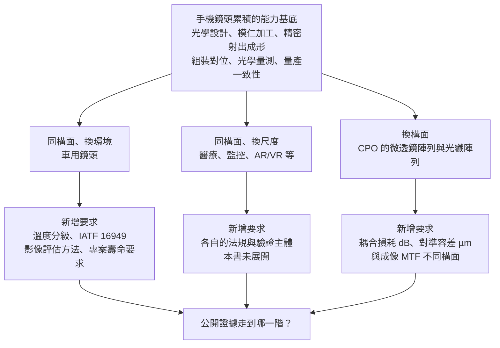

# 10 手機累積的能力，能搬到哪些市場？

## 開場問題：官網列了十幾個品項，這算幾條產品線？

大立光官網的「產品與服務」頁展示的類別包括：手機鏡頭、車用鏡頭、隱形眼鏡、音圈馬達、影像鏡頭模組、碳化矽晶體、鈮酸鈦負極材料、光纖雷射及太空通訊、CPO 應用（含稜鏡微透鏡陣列與光纖陣列）、睡眠健康監測、美麗健康產品（公司自述，發布日未標示，查閱日 2026-09-14）。

看到這份清單，很容易得到一個結論：**這家公司已經從手機鏡頭擴張到十幾個市場了。**

這個結論跑得太快。官網產品頁是集團產品的展示入口，不是逐項的收入揭露、量產證明或具名客戶採用證據。而 114 年報自陳的不利因素則是另一個方向：「手機鏡頭出貨狀況所佔比重過高，無法有效分散市場產品風險。」（114 年報第 61 頁，法定揭露，刊印日 2026-04-20）

本章要做的不是評估這些方向會不會成功，而是建立一個更基本的工具：**把「原有能力」與「新市場的新要求」分開，然後逐列問公開證據走到了哪一階。** 這一章依計畫收斂為「公開主張與待查」；資料不足的方向就停在待查，不補。全書的財務結論在[第 09 章](09-business-economics.md)，不依賴本章任何一個新方向是否成功。

## 結構與角色：三種不同距離的遷移

把「能力搬到新市場」拆成三種，距離由近到遠：

| 遷移類型 | 沿用什麼 | 要換什麼 | 本章主要例子 |
|---|---|---|---|
| 同構面、換環境 | 成像光學設計、MTF 驗收邏輯、成形與組裝 | 環境與可靠度條件、品質管理體系、影像品質標準 | 車用鏡頭 |
| 同構面、換尺度 | 成像光學、既有量測方法 | 光學規格、法規、驗證主體 | 醫療、安全監控、AR/VR（本書僅列公司計畫，未展開） |
| **換構面** | 超精密成形、微米級公差控制、量產一致性 | **驗收指標整組換掉**：從成像 MTF 換成耦合損耗與對準容差 | CPO 的微透鏡陣列與光纖陣列 |

*圖表 10-1：遷移距離分類，作者整理，非任一公司或標準文件的分類。這張表能讀「哪一類遷移需要換掉的東西最多」，不能讀「哪一類比較容易成功」——距離近不等於商業上容易。*

*圖 10-2：能力遷移的三條路徑與各自的新要求。箭頭是「需要額外滿足什麼」，不是時間順序，也不表示公司已完成任何一階。*

## 作用機制（一）：車用鏡頭多要求什麼

車用是本章的主案例，因為它的新要求有正式文件可查。

**溫度分級。** AEC-Q100（由 Automotive Electronics Council 制定，Rev J，2023-08-11，標準文件原始 PDF）定義四個溫度等級：

| 等級 | 環境溫度範圍 | 注意事項 |
|---|---|---|
| Grade 0 | −40°C 至 +150°C | 不按安裝位置自動指定 |
| Grade 1 | −40°C 至 +125°C | 須看 IC 與系統規格 |
| Grade 2 | −40°C 至 +105°C | 須看 IC 與系統規格 |
| Grade 3 | −40°C 至 +85°C | 須看 IC 與系統規格 |

*圖表 10-3：AEC-Q100 溫度分級，來源為 AEC 官方標準文件，查閱日 2026-09-14。**重要限制**：AEC-Q100 是針對積體電路（IC）制定的失效機理導向壓力測試標準。車用鏡頭或相機模組若引用「車規等級」，通常是**借用**這套溫度分級架構來描述工作環境，本書未查到光學鏡頭專屬的 AEC-Q 子標準。因此這張表能讀「車用電子的環境溫度要求怎麼分」，不能讀成「鏡頭有一套自己的 AEC 認證」。*

把這套範圍對照手機：手機鏡頭走的是一般消費性電子等級，工作溫度範圍通常遠窄於車規。溫度範圍拉寬直接牽動前面幾章的內容——塑膠鏡片的折射率與尺寸隨溫度變化，多片式鏡頭的間距與偏心在熱循環下的漂移，鏡筒與鏡片的熱膨脹係數匹配，這些在手機的溫度窗內可以被壓住，換到 −40°C 至 +105°C 就是另一個設計問題。

**品質管理體系。** IATF 16949:2016 是汽車業品質管理系統標準，與 ISO 9001 維持對齊，並納入客戶特定要求。認證涵蓋特定組織、據點與活動，不能保證每個產品已通過客戶驗收；AEC-Q100 則是 IC 壓力測試資格要求，不能拿來替代鏡頭或模組的驗證。[IATF 官方說明](https://www.iatfglobaloversight.org/iatf-169492016/about/)（發布日未標示，複核 2026-09-15）。

**影像品質標準。** IEEE 2020 涉及車用影像系統的品質評估方法；本書未取得完整條文，不引用具體門檻。標準組織提供方法，實際驗收仍由客戶依產品、安裝位置與合約規格執行，不能說驗收主體變成標準組織。手機影像也有 ISO 12233 等公開量測方法，差別在各專案如何選用與設定門檻。

**LED 閃爍與眩光。** 車用相機必須處理 LED 車燈與號誌燈的 PWM 調光造成的閃爍取樣問題（LED flicker），以及強光源造成的雜散光導致對比下降。**這主要是感測器與影像處理層面的工程問題，不是鏡頭光學設計單獨能解決的**，但鏡頭的鍍膜與雜散光抑制設計與後者直接相關。（來源類型：半導體廠商技術白皮書，屬公司自述層級。）

**壽命。** 車用專案可能要求較長服役期間，因此要確認鍍膜、膠合與密封在指定溫濕度、振動及使用循環後是否仍達標。手機換機週期不是元件壽命規格，車輛年限也不能直接當成某鏡頭的合格門檻；兩者均須以客戶可靠度計畫為準。

| 面向 | 手機鏡頭 | 車用鏡頭 |
|---|---|---|
| 工作溫度範圍 | 一般消費性電子等級 | 依 AEC-Q100 分級思路，常見 −40°C 至 +85°C／+105°C（依安裝位置） |
| 品質管理標準 | 一般消費性電子品管流程 | 依供應鏈角色確認 IATF 16949 與客戶特定要求 |
| 影像品質驗收 | 品牌廠內部 MTF 與影像品質規格（未公開統一標準） | 有 IEEE 2020 系列正式標準可循 |
| 使用壽命要求 | 依專案可靠度規格 | 依安裝位置、服役時間與任務條件 |
| 特殊光學挑戰 | 薄型化、大光圈、潛望式變焦 | LED 閃爍抑制、強光眩光抑制、寬視角、耐候（防水氣、防塵） |

*圖表 10-4：手機與車用鏡頭的要求對照，作者根據上述來源歸納，非任一公司或標準文件的逐字複製。這張表能讀「新市場多要求哪些面向」，不能讀「某公司已滿足哪幾列」。*

## 大根光學工業：能查到什麼、查不到什麼

大根光學工業（Largan Industrial Optics）是本章少數有具體主體可查的節點。

**官網自述（公司自述層級，發布日未標示，查閱日 2026-09-14，<https://www.larganindustrialoptics.com/_index.php>）：** 公司成立於 2021 年，專注於研發工業用與車用鏡頭以及相機模組。產品類別包含車用鏡頭（ADAS 8M 窄視角／廣視角／混合視角、DMS 駕駛監控、OMS 乘客監控、AVM 3Mega、E-Mirror）、車用相機模組（高解析廣角、全玻、超低反射鍍膜前視車用相機模組）、智能模組（AIoT，含人臉識別、視訊會議、居家監控、VR/AR、無人機相機模組）、3D 感測相機模組（飛時測距與雙目立體視覺）。官網並自述「繼承母公司 10 年以上車載產品生產經驗」，企業集團欄列大立光電為上級公司。

**限制：**「繼承母公司經驗」是公司的自我定位敘述，不是獨立第三方驗證的技術移轉證據；官網也未明確揭示具體持股比例或法律結構。

**媒體報導（媒體轉述層級，2021 年）：** 大立光成立大根光學工業，資本額新台幣 10 億元，為 100% 持股，設立時已有 2 家主要客戶（客戶未具名）。

**限制（必須寫清楚，否則會被當成現狀）：這是 2021 年設立時點的媒體報導，本書未核對截至 2026 年是否仍為 100% 持股、資本額是否變動、客戶數是否變動。**「已有 2 家主要客戶」為未具名，不得推成任何特定車廠。這三項全部列入待查，應另查公開資訊觀測站「關係企業三書表專區」或合併財務報表附註的轉投資明細。

**母公司年報側的證據（法定揭露）：** 114 年報第 57–58 頁「114 年度至年報刊印日止所成功開發之技術與產品」清單中，除 Phone Camera 類別外，另列出「汽車倒車影像鏡頭」類別的多款寬視角／窄視角設計。**這是公司自陳的開發成功品項，不是量產、出貨或客戶採用的證據，也沒有附帶出貨量、良率、客戶名稱或收入貢獻。** 年報第 54 頁的業務範圍條文也把「汽車鏡頭」列入產品項目。

**查不到的：** 大根光學工業的最新持股比例、是否有單獨揭露的收入或毛利、車用產品線的量產狀態與客戶、是否已取得 IATF 16949 或完成指定車用環境條件的驗證。這些沒有一項在本書取得的公開文件裡。

## 作用機制（二）：CPO 的驗收指標，換了一個構面

這是本章最需要展開的防混淆點。

**共同封裝光學（CPO, co-packaged optics）** 把光學引擎與交換晶片封裝在一起，縮短電訊號路徑。OIF（Optical Internetworking Forum）的《Co-Packaging Framework Document》（OIF-Co-Packaging-FD-01.0，2022-02 發布，標準組織正式文件）說明其技術框架與應用場景；《Implementation Agreement for a 3.2Tb/s Co-Packaged Module》（OIF-Co-Packaging-3.2T-Module-01.0，2023-03 發布）則定義 3.2T CPO 模組規格，鎖定乙太網路交換應用。

光學元件在這裡的角色是：**微透鏡陣列（MLA, micro lens array）搭配光纖陣列單元（FAU, fiber array unit），負責把矽光子晶片上的光訊號與外部光纖之間做耦合對準。** 具體耦合方式取決於封裝架構、波長、模態與光纖。本書尚未核對研究全文中的完整量測條件，因此不列可跨設計誤用的微米容差數字。

現在把兩件事並排：

| 構面 | 手機鏡頭 | CPO 的 MLA／FAU |
|---|---|---|
| 這個元件在做什麼 | 把物空間的場景成像到感測器平面 | 把晶片上的光訊號耦合進／出光纖 |
| 核心驗收指標 | **成像 MTF**（調制傳遞函數） | **耦合損耗（insertion loss, dB）** |
| 第二層指標 | 場曲、畸變、相對照度、雜散光、色差 | **對準容差（µm）**、回波損耗、偏振相關損耗、溫度與回焊後的穩定性 |
| 量測條件必須註明 | 場點、空間頻率、波長、對焦位置 | 波長、模態、光纖型號、對準方式、溫度 |
| 「合格」的定義 | 影像在指定空間頻率下的對比保真度達標 | 多少光能量成功耦合進光纖、在容差窗內是否維持 |
| 失效長什麼樣 | 邊緣糊、暗角、鬼影、色散 | 損耗超標、鏈路預算不足、溫度循環後損耗漂移 |

*圖表 10-5：成像光學與光互連光學的驗收構面對照，作者整理。這張表能讀「兩者的合格定義完全不同」，不能讀「哪一邊比較難」——難度取決於具體規格，兩邊都不是一句話能比較的。*

**這張表就是本章最重要的結論：MTF 好不代表耦合損耗低，反過來也一樣。它們量的不是同一件事。** 成像光學問的是「影像在不同空間頻率下的對比保真度」，光互連問的是「多少光能量成功耦合進光纖」。測試設備不同、判定門檻不同、良率的定義也不同——一顆鏡頭的良率是「成像品質達標的比例」，一組 FAU 的良率是「耦合損耗落在窗內的比例」，兩個數字不能互相換算，更不能拿手機鏡頭的良率經驗去預估 CPO 的良率。

那什麼是共通的？**超精密模仁加工、微米甚至次微米級的公差控制、大量生產下的一致性、以及把這些能力轉成穩定良率的製造管理。** 這些確實是[第 05 章](05-molding-process.md)與[第 06 章](06-assembly-yield-cost.md)談過的同一組能力。**但「有相關能力」與「能通過新驗收」之間，隔著整套新的量測方法、新的規格、新的可靠度條件與新的客戶驗證流程**——也就是[第 08 章](08-qualification-competition.md)的整條證據階梯，必須重走一遍。

## 證據紀律：CPO 進度的說法，證據強度到哪裡

這一節要特別小心，因為公開資訊裡的「證據」與「說法」落差很大。

**官方文件側（法定揭露）：** 2026-04-16 與 2026-07-09 兩場法人說明會的簡報 PDF（公開資訊觀測站），**內容僅包含合併營收、綜合損益、資產負債表與鏡頭出貨組合圖表，沒有任何關於 CPO、FAU 或可變光圈的文字說明。** 官網「產品與服務」頁把 CPO 應用（含稜鏡微透鏡陣列與光纖陣列）列為展示品項，屬公司自述層級，不附帶量產或客戶採用資訊。

**媒體轉述側：** 以下所有階段描述，**均為媒體轉述之法說會問答內容，未見於官方簡報 PDF，本書未取得公司逐字稿或官方新聞稿**：

- 2026-04-16 場次，媒體報導稱 CPO 矽光技術與 FAU 精密光學元件「正式進入客戶送樣階段」，並稱可變光圈鏡頭預計 2026 年第三季開始出貨。
- 2026-07-09 場次，部分媒體報導稱 CPO／FAU「仍處於送樣與驗證階段，量產尚需 1–2 年產線建置」；另有媒體報導轉引管理層發言為「已收到量產型客戶正規格式」「7 月會送樣」「如果驗證通過，試產會在第三季底」「有機會於明年年中開始放量」，並將此解讀為「首張 CPO 訂單」。技術路線上，報導提及市場主流設計為光柵耦合器（GC），與競爭對手主推的邊緣耦合器（EC）路線不同。

**請注意：同一場法說會的不同媒體轉述彼此並不一致**——「量產尚需 1–2 年產線建置」與「最快明年年中放量」不是同一個時程。這個不一致本身，就是不能把媒體轉述當成一手證據的最好理由。

因此本書的處理方式是：

1. 全部標示為「據媒體轉述之法說會問答內容」，來源類型為媒體轉述。
2. **保留原始階段用語**：送樣、驗證、試產、規劃放量。
3. **不升級**：不寫成「已量產」「已獲客戶正式採用」「已認列收入」。媒體所稱的「首張訂單」是記者對進度的定性描述，本書不採用為公司原話。
4. 客戶維持不具名。

**改判條件（要看到什麼，才能把這個判斷升一階）：**

| 要升到哪一階 | 需要的證據 |
|---|---|
| 送樣屬實 | 公司書面揭露（重大訊息、法說會簡報文字、年報）明確記載已送樣；開發成功清單只能確認開發階段，不能代替送樣證據 |
| 通過驗證 | 公司書面揭露記載客戶驗證通過，或揭露對應的驗證里程碑 |
| 進入量產 | 公司書面揭露量產起始，並交代適用產品與期間；新產品營收本身未必代表大量生產 |
| 對財務有實質貢獻 | 年報或法說會出現該類產品的營收金額或占比揭露，且金額達到可辨識的規模 |
| **需要往下修正** | 後續法說會或重大訊息顯示送樣／試產時程延後，或訂單性質由「量產型」降級為概念驗證；；長期未有新文件只能維持未知，不能據此判定技術失敗 |

*圖表 10-6：CPO 方向的證據階梯與改判條件。這張表能讀「下一個該找什麼文件」，不能讀「公司目前在哪一階」——截至查閱日 2026-09-14，本書取得的官方書面揭露沒有涵蓋任何一階。*

## 公司計畫清單：屬於計畫性陳述

114 年報第 55 頁「計劃開發與正在開發之新商品」列出 115 年度（2026 年）研發計畫：預計投入研發費用占營收 5–15%（視全球市場狀況調整），並列出未來數年主流產品研發方向，包含汽車用影像鏡頭、醫療用鏡頭、安全監控鏡頭、大光圈／大廣角鏡頭、全幅對焦鏡頭、虹膜辨識鏡頭、運動相機鏡頭、空拍機鏡頭、小 pixel size 鏡頭、Z height 更低鏡頭、ToF 鏡頭、屏下光學指紋鏡頭、自由曲面鏡頭、AR/VR 鏡頭、IoT 鏡頭、可變光圈鏡頭、筆記型電腦窄邊框鏡頭、模造玻璃鏡頭、分群 folded tele 鏡頭等。

**這份清單是法定揭露沒錯，但它揭露的是「公司計畫做什麼」，屬計畫性陳述——不是已完成、不是已驗證、更不是已出貨的證據。** 讀這份清單的正確方式是把它當成「未來要追蹤哪些關鍵字」的索引，而不是「公司已經有這些產品」的清單。研發費用占營收 5–15% 是一個很寬的規劃區間，與[第 09 章](09-business-economics.md)實際揭露的 114 年度 8.66%、115 年度第一季 9.01% 對照著看即可，不需要從區間推論任何方向。

## 必要視覺：原有能力／新要求／證據缺口矩陣

| 方向 | 手機鏡頭已有的能力 | 新市場額外要求什麼 | 目前公開證據到哪一階 | 缺什麼（待查） |
|---|---|---|---|---|
| 車用鏡頭（成像） | 廣角與窄視角光學設計、精密成形、組裝對位、MTF 量測 | 依專案訂定的寬溫工作範圍（AEC-Q100 僅適用 IC）、IATF 16949 製程管理、IEEE 2020 影像品質標準、專案壽命、LED 閃爍與眩光耐受 | **公司自陳開發成功**（114 年報第 57–58 頁「汽車倒車影像鏡頭」多款設計）；官網列為產品類別 | 量產狀態、客戶（未具名）、驗證等級、是否取得 IATF 16949、收入拆分 |
| 車用相機模組（大根光學工業） | 母公司自述之車載經驗、鏡頭設計與製造 | 模組級組裝與校正、車廠供應鏈資格、模組級可靠度驗證 | **公司自述之產品清單**（ADAS 8M、DMS、OMS、AVM、E-Mirror、全玻超低反射鍍膜前視模組）；設立資訊為 2021 年媒體轉述 | 現行持股比例、資本額現狀、客戶數與名稱、收入或毛利是否單獨揭露、驗證與量產狀態 |
| CPO 的 MLA／FAU | 超精密模仁加工、微米級公差控制、量產一致性、光學元件成形 | **驗收構面整組更換**：耦合損耗 dB、對準容差 µm、回波損耗、回焊與溫循後穩定性；新的量測設備與良率定義 | **官網列為展示品項（公司自述）**；階段描述僅見於**媒體轉述之法說會問答**，官方簡報 PDF 無對應文字 | 公司書面揭露的送樣／驗證／量產任一里程碑、客戶、規格、營收貢獻 |
| 可變光圈鏡頭 | 鏡頭光學設計；集團內音圈馬達（大陽科技自述含可變光圈） | 機構致動、耐久循環、與模組廠介面 | 114 年報第 55 頁列為**計畫性研發方向**；「2026 年第三季出貨」說法為**媒體轉述** | 公司書面揭露的出貨或量產證據 |
| 醫療、安全監控、AR/VR、ToF、屏下光學指紋、模造玻璃 | 成像光學設計與製造能力 | 各領域法規、驗證主體與規格（本書未展開） | **僅為 114 年報第 55 頁之計畫性陳述** | 全部：規格、客戶、階段、收入 |

*圖表 10-7：能力／要求／證據缺口矩陣，查閱日 2026-09-14。這張表能讀「每一列目前最強的公開證據是什麼類型」，不能讀「公司在哪一列比較有機會」——證據階段低不等於做不成，只代表現在還不能下結論。*

## 與大立光的連結

**已確認事實。** 114 年報（法定揭露，刊印日 2026-04-20）第 54 頁業務範圍條文將汽車鏡頭、ToF、屏下光學指紋、AR/VR、醫療儀器用鏡頭列入產品項目；第 55 頁列出 115 年度研發方向清單並載明研發費用規劃占營收 5–15%；第 57–58 頁列出公司自陳「開發成功」的汽車倒車影像鏡頭多款設計；第 61 頁自陳「手機鏡頭出貨狀況所佔比重過高，無法有效分散市場產品風險」。官網產品頁（公司自述，發布日未標示，查閱日 2026-09-14）展示車用鏡頭、CPO 應用（含稜鏡微透鏡陣列與光纖陣列）等類別。大根光學工業官網（公司自述，發布日未標示，查閱日 2026-09-14）自述 2021 年成立、專注工業用與車用鏡頭及相機模組，並列出上述產品清單。AEC-Q100 溫度分級、OIF 的 CPO 框架文件與 3.2T 模組實作協議為標準組織正式文件，可直接引用。2026-04-16 與 2026-07-09 兩份法說會簡報 PDF 的內容僅含財務表格與出貨組合圖表，不含 CPO 相關文字——**這個「沒有」本身也是已確認事實。**

**合理推論。** 手機鏡頭累積的超精密模仁加工、成形與微米級公差控制能力，與 CPO 光學元件所需的加工能力有重疊，這是能力層面的相關性；車用鏡頭與手機鏡頭同屬成像光學，設計與量測方法的遷移距離較近。年報將汽車鏡頭列入業務範圍並列出開發成功品項，與公司確實在投入車用方向的方向相容。**以上皆為推論，公開文件沒有說明任何一項的量產狀態、客戶或收入貢獻。**

**尚待查證。** （一）CPO／FAU 的送樣、驗證、試產、量產各階段，本書尚未取得公司書面揭露；本書取得的全部階段描述皆為媒體轉述之法說會問答摘要，且不同媒體對同一場法說會的轉述彼此不一致。（二）大根光學工業截至 2026 年的持股比例、資本額、客戶數與名稱、收入或毛利是否單獨揭露——2021 年的「100% 持股、資本額 10 億元、2 家未具名客戶」為媒體轉述且未核對現狀。（三）公司或大根光學工業是否取得 IATF 16949 認證、車用產品通過的溫度等級、是否依 IEEE 2020 進行影像品質驗收。（四）IEEE 2020 完整條文本書未取得（通常為付費標準），因此本書不引用任何具體數值門檻。（五）114 年報第 55 頁研發方向清單中各項的實際進度。（六）可變光圈鏡頭的出貨證據。**以上任一項若出現公司書面揭露，本章對應列可按[第 08 章](08-qualification-competition.md)的證據階梯逐列升階，不需要整章改寫。**

## 推理檢查

1. 大立光的模仁加工與成形能力可以做到微米級公差，這是否足以推論它能通過 CPO 客戶的 FAU 驗收？
2. 官網把 CPO 列為產品類別，年報把汽車鏡頭列為業務範圍。這兩件事的證據強度是否相同？
3. 媒體報導「大立光取得 CPO 首張訂單」。要把這句話寫進一份可被複核的判斷裡，最少要做哪幾件事？
4. 一顆手機鏡頭若在 −40°C 至 +105°C 下 MTF 仍達標，是否等於它符合車用要求？
5. 114 年報第 55 頁列了十幾個研發方向。這份清單能支持「公司產品線正在多元化」這個結論嗎？

??? note "參考推理"
    第一題：不足。加工公差能力只是共通的一半，另一半是整組換掉的驗收指標（耦合損耗、對準容差、回波損耗、回焊與溫循穩定性）、對應的量測設備與方法、以及重走一遍的客戶驗證流程；能力相關不等於驗收通過。第二題：不同。年報是法定揭露，且業務範圍條文是公司依法申報的登記與營運範圍；官網產品頁是公司自述的展示入口，兩者都不證明量產或客戶採用，但文件層級與可追溯性不同。第三題：至少三件——標示證據類型為媒體轉述之法說會問答；保留「送樣」「驗證」「試產」原始階段用語，不升級為量產或已採用；寫出改判條件（需要看到哪一份公司書面揭露才能升階，以及什麼情況要往下修正）。此外應註記不同媒體轉述彼此不一致。第四題：不等於。溫度只是其中一列，還有 IATF 16949 的製程管理、IEEE 2020 的影像品質評估、專案壽命的可靠度驗證、LED 閃爍與眩光耐受，以及車廠供應鏈的資格審查。第五題：不能。那份清單是計畫性陳述，揭露的是打算投入的方向；要支持「多元化」這個結論，需要的是各方向的出貨或營收揭露，而 114 年報第 61 頁公司自陳的仍是手機鏡頭比重過高。

## 來源與待查

車用要求依 AEC-Q100 Rev J（標準文件，2023-08-11）、IATF 16949 官方用途說明（2026-09-15 複核）、IEEE 2020／P2020（標準文件，僅確認存在與涵蓋範圍，全文未取得）、LED 閃爍抑制之半導體廠商技術白皮書（公司自述層級）。CPO 依 OIF-Co-Packaging-FD-01.0（2022-02）與 OIF-Co-Packaging-3.2T-Module-01.0（2023-03）兩份標準組織正式文件，具體耦合容差因缺完整條件而不列數字。公司側依 114 年度年報（法定揭露，2026-04-20）第 54、55、57–58、61 頁，官網產品頁與大根光學工業官網（公司自述，發布日未標示），及 2026-04-16、2026-07-09 法說會簡報（法定揭露，僅財務與出貨組合圖表）。CPO 階段描述依媒體轉述之法說會問答摘要。查閱日統一為 2026-09-14。完整清單見[來源索引](appendix-sources.md)。

本章的遷移距離分類、手機與車用對照表、驗收構面對照表與證據缺口矩陣，均為作者整理，非任一公司或標準文件的逐字複製。所有標示為「尚待查證」的項目逐條記入[待查問題](appendix-open-questions.md)。各主體的產品與商業階段彙總見[第 11 章](11-largan-evidence-map.md)；本章的證據紀律如何套用到單一則新聞，見[第 12 章](12-reading-news.md)。
