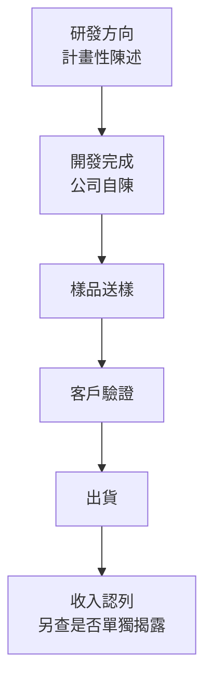

# 11 大立光的哪些主張，已經有證據？

## 開場問題：一張官網產品頁，能推到哪一步？

大立光官網的「產品與服務」頁同時列出手機鏡頭、車用鏡頭、隱形眼鏡、音圈馬達、影像鏡頭模組、碳化矽晶體、鈮酸鈦負極材料、光纖雷射及太空通訊、CPO 應用（含稜鏡微透鏡陣列與光纖陣列）、睡眠健康監測與美麗健康產品。看完這張頁面，很容易得到一個印象：這家公司同時在十個市場交付產品。

但這是一張**集團產品入口頁**，頁面本身未標示發布日，也沒有在該入口把各品項對應到出貨量、客戶或收入。它能支持的結論只有一句：公司公開展示了這些產品方向。至於每一項走到哪一步、由哪個法人交付、誰驗證過、有沒有認列收入，必須逐項另找文件。

本章把前十章談過的公司主張攤成一張矩陣，逐列標記它的來源與成熟度。全章法人主體若未另外標明，一律指**大立光電股份有限公司（3008）**；集團其他法人單獨列出。各列初查日為 **2026-09-14**；大陽持股與年報營收分類於 **2026-09-15** 補核；來源頁面未標示發布日者寫「未標示」，不拿查閱日冒充發布日。

## 結構與角色：兩把尺，不能合成一個分數

判讀一則公司主張要同時量兩件事，而這兩件事是**互相獨立**的座標軸。

第一把尺量的是「這句話是誰說的、寫在什麼文件上」——**證據類型**。

| 證據類型 | 典型文件 | 能證明到哪裡 | 不能證明什麼 |
|---|---|---|---|
| 公司自述 | 官網簡介、沿革、產品頁、子公司官網 | 公司對外如此陳述，且陳述內容可逐字引用 | 未經第三方驗證；無出貨、客戶或財務含意 |
| 法定揭露 | 年報、財報、法說會簡報、重大訊息、月營收公告 | 可追溯公司依法申報的內容、期間與頁碼；仍須區分查核數字、估計與計畫 | 只支持**實際披露的範圍**；未揭露的拆分不能反推 |
| 交易雙方公告 | 買賣、股份轉換、設備取得等雙方各自的公告 | 存在該筆交易、交易對手、金額與期間 | 不證明機台型號、安裝、驗收、產能或客戶採用 |
| 原始技術文獻 | 專利說明書、標準文件、期刊論文、原廠技術白皮書 | 提出的方法、規格或實驗結果及其適用條件；專利本身不保證可行性 | 專利實施例不是量產配置；標準存在不等於通過驗證 |
| 媒體轉述 | 新聞報導、法說會問答摘要、部落格整理 | 某人在某日如此說、記者如此記錄 | 用語可能已被改寫；階段容易被記者升級 |
| 作者推論 | 本書自己的推理 | 明示前提之下的邏輯連結 | 不是證據；必須標明成立條件與反證 |

*圖表 11-1：證據類型六類圖例。這張表能讀的是「一份文件最多能支持到什麼」，不能讀的是「等級高的來源說的事一定更重要」——年報寫的研發方向仍然只是方向。*

第二把尺量的是「這件事走到商業流程的哪一格」——**商業階段**。收入認列是業務與會計結果，是否單獨對外揭露則是另一欄；沒有分項揭露，不代表沒有收入。

*圖 11-2：商業階段階梯。這張圖能讀的是「後一格需要前一格以外的新證據」，不能讀的是「每個方向都會沿著箭頭走完」——研發方向可能停在中途，而停在中途不會有另一份公告通知你。*

**兩把尺不能乘成一個分數。** 舉兩個對照：114 年報第 55 頁列出的「可變光圈鏡頭」是法定揭露（可追溯原始文件）但停在研發方向（階段低）；媒體轉述的 CPO 客戶送樣是媒體轉述（尚缺官方逐字原件）但階段已到送樣（階段較高）。若把兩者壓成單一評分，它們會落在相近的位置，但要補的東西完全相反：前者缺的是後續階段的任何一份文件，後者缺的是把同一件事寫進公司書面揭露的文件。合成分數會把「缺什麼」這個最有用的資訊抹掉。

## 作用機制：矩陣的每一欄各自回答什麼

| 欄位 | 填寫規則 |
|---|---|
| 法人主體 | 寫到具體公司。集團合併口徑不等於母公司單體，子公司產品不自動算成 3008 的產品 |
| 產品或應用 | 用來源的原始品名，不改寫成市場流行詞 |
| 交付物 | 交付的是鏡頭、馬達、模組、元件還是一份規劃 |
| 公開技術主張與條件 | 以摘要保留原義與限定詞（如「至年報刊印日止」），必要短引文加引號 |
| 商業階段 | 用圖 11-2 的六格，**不得升級** |
| 客戶是否具名 | 來源有沒有把客戶名稱與這項交付物綁在一起 |
| 收入是否單獨揭露 | 有沒有一個可對應到這項交付物的營收或毛利數字 |
| 來源位置與日期 | 文件、頁碼、發布日、查閱日四項齊備 |
| 證據類型 | 用圖表 11-1 的六類 |
| 待查事項 | 寫「要去查哪一份文件的哪一欄」，不寫「仍有不確定性」 |

## 矩陣 A：手機鏡頭主力業務（大立光電 3008）

寬表可左右捲動；先看法人、階段，再查來源與待查欄。

| 法人主體 | 產品／應用 | 交付物 | 公開技術主張與條件 | 商業階段 | 客戶具名 | 收入單獨揭露 | 證據類型 | 來源位置／發布日／查閱日 | 待查事項 |
|---|---|---|---|---|---|---|---|---|---|
| 大立光電 | 手機鏡頭 | 光學鏡頭 | 「目前公司以手機鏡頭為主力產品，Tablet 鏡頭次之。客戶均為國內外大廠，故訂單均能有穩定成長。」不利因素欄自陳「手機鏡頭出貨狀況所佔比重過高」 | 出貨（主力業務） | 未具名 | 未單獨揭露 | 法定揭露 | 114 年報 p.61／2026-04-20／2026-09-14 | 手機鏡頭佔營收比重的官方數字；年報未給百分比 |
| 大立光電 | 業務範圍全清單 | 各式光學鏡頭模組與光電零組件 | 產品列舉含筆電、智慧型手機、3D 結構光、ToF、屏下光學指紋、平板、AR/VR、IoT、穿戴、虹膜、醫療與汽車鏡頭 | 混合（登記營業範圍） | 未具名 | 未單獨揭露 | 法定揭露 | 114 年報 p.54／2026-04-20／2026-09-14 | 這是營業範圍條文，非各項皆在出貨的證明；逐項出貨狀態待查 |
| 大立光電 | 6P／5P／7P／8P AF 手機鏡頭、自由曲面鏡頭 | 鏡頭設計與產品 | 列於「114 年度至年報刊印日止，所成功開發之技術與產品」 | **開發完成（公司自陳）** | 未具名 | 未單獨揭露 | 法定揭露（內容為公司自陳） | 114 年報 p.57–58／2026-04-20／2026-09-14 | 清單無數量、良率、客戶與收入；是否進入送樣或出貨待查 |
| 大立光電 | 2 群潛望式、多群潛望式鏡頭 | 鏡頭設計與產品 | 同上清單之潛望式項目 | **開發完成（公司自陳）** | 未具名 | 未單獨揭露 | 法定揭露（內容為公司自陳） | 114 年報 p.57–58／2026-04-20／2026-09-14 | 與 2022 年沿革所載「潛望式變焦鏡頭開發完成」的關係與差異未說明 |
| 大立光電 | 8P 高階手機鏡頭 | 鏡頭 | 沿革載 2018 年「手機用 1 億畫素超高解像 8P 高階鏡頭開發完成」 | **開發完成（公司自陳）** | 未具名 | 未單獨揭露 | 公司自述 | 公司沿革頁／未標示／2026-09-14 | 頁面僅標年份，無月日；後續量產與客戶採用無揭露 |
| 大立光電 | 手機用潛望式變焦鏡頭 | 鏡頭 | 沿革載 2022 年「手機用潛望式變焦鏡頭開發完成」 | **開發完成（公司自陳）** | 未具名 | 未單獨揭露 | 公司自述 | 公司沿革頁／未標示／2026-09-14 | 是否對應特定客戶量產訂單，沿革未載；見[第 12 章](12-reading-news.md)案例二 |
| 大立光電 | 廠區 LP4、LP9 | 廠房 | 沿革載 2025 年「LP4（大立四廠）落成」「LP9（大立九廠）落成」 | 不適用（廠房工程進度） | 不適用 | 未單獨揭露 | 公司自述 | 公司沿革頁／未標示／2026-09-14 | 完工月日、產能、稼動、對應產品線皆未揭露 |
| 大立光電 | 115 年度研發計畫 | 研發方向清單 | 預計投入研發費用佔營收 5–15%，並列車用、醫療、安全監控、大光圈／大廣角、虹膜、小 pixel size、低 Z height、ToF、屏下指紋、自由曲面、AR/VR、IoT、**可變光圈**、筆電窄邊框、模造玻璃、分群 folded tele 等方向 | **研發方向（計畫性陳述）** | 未具名 | 未單獨揭露 | 法定揭露（公司計畫文字） | 114 年報 p.55／2026-04-20／2026-09-14 | 清單無優先順序、預算分配與時程；不可讀成產品路線圖 |

*圖表 11-3：手機鏡頭與本體業務矩陣。這張表能讀的是「每一句公司主張的原文、位置與階段」，不能讀的是任何一項的出貨量、良率或毛利——這些數字在所引來源中都不存在。*

注意矩陣 A 中三種階段的密集對比：年報第 61 頁的「主力產品」是**出貨**層級的陳述，第 57–58 頁的開發成功清單是**公司自陳開發完成**，第 55 頁的研發方向是**計畫性陳述**。三者印在同一本年報裡、同一個申報日，證據類型完全相同，商業階段卻差三格。只看「年報有寫」而不看寫在哪一節，就會把這三格壓平。

## 矩陣 B：集團法人（母公司單體不等於集團）

| 法人主體 | 產品／應用 | 交付物 | 公開技術主張與條件 | 商業階段 | 客戶具名 | 收入單獨揭露 | 證據類型 | 來源位置／發布日／查閱日 | 待查事項 |
|---|---|---|---|---|---|---|---|---|---|
| 大陽科技（Largan Digital） | 音圈馬達 VCM | 馬達、透鏡＋VCM 一體式產品 | 自述成立於 1998 年、為「大立光電集團成員之一」；產品線涵蓋單／雙向 Open Loop、**Closed Loop AF、OIS、Folded Tele、可變光圈、潛望式鏡頭馬達**，適用手機、筆電、平板攝相模組 | 公開產品線（未標階段） | 未具名 | 未單獨揭露 | 公司自述 | 大陽科技官網／**未標示**／2026-09-14 | 114 年報 p.49 載 2025-12-31 直接持股 49.37%、綜合投資 55.35%；後者含董事、經理人等，不等於母公司持股。控制判斷附註待補 |
| 大根光學工業 | 車用鏡頭與相機模組 | ADAS 8M 窄／廣／混合視角、DMS、OMS、AVM 3Mega、E-Mirror 鏡頭；廣角與全玻車用相機模組 | 自述「成立於 2021 年，專注於研發工業用與車用鏡頭以及相機模組」；自述「繼承母公司 10 年以上車載產品生產經驗」 | 公開產品線（未標階段） | 未具名 | 未單獨揭露 | 公司自述 | 大根光學工業官網／**未標示**／2026-09-14 | 「繼承母公司經驗」是自我定位敘述，非技術移轉證據 |
| 大根光學工業 | 智能模組、3D 感測模組 | AIoT 人臉辨識、視訊會議、居家監控、VR/AR、無人機相機模組；飛時測距與雙目立體視覺模組 | 同上官網產品分類 | 公開產品線（未標階段） | 未具名 | 未單獨揭露 | 公司自述 | 同上／未標示／2026-09-14 | 同上 |
| 大根光學工業 | 持股結構 | 不適用 | 2021 年媒體報導稱資本額新台幣 10 億元、為大立光 100% 持股，設立時已有 2 家主要客戶（未具名） | 不適用 | 未具名 | 未單獨揭露 | 媒體轉述 | 數位時代報導／2021 年（確切日期未核對）／2026-09-14 | **這是 2021 年設立時點的報導，未核對現狀**；截至 2026 年是否仍為 100% 持股、客戶數是否變動，均**尚待查證** |

*圖表 11-4：集團法人矩陣。這張表能讀的是「集團內有哪些法人、對外自述做什麼」，不能讀的是各產品收入或具名客戶；大陽持股已由年報補核，不能將綜合投資比例當成母公司直接持股或完整控制判斷。*

矩陣 B 的兩列「待查」不是客套話，而是一個結構性缺口：**持股比例、會計控制與產品收入是三個不同問題**。114 年報第 49 頁已列大陽直接持股 49.37%；是否納入合併須查控制判斷附註，不能只用持股是否過半決定。第 09 章的財務數字是合併口徑，本章的子公司產品線卻只有官網自述；兩者之間缺少一份能把法人、產品與金額對起來的文件。

## 矩陣 C：新應用與拓展方向（階段最容易被升級的一區）

| 法人主體 | 產品／應用 | 交付物 | 公開技術主張與條件 | 商業階段 | 客戶具名 | 收入單獨揭露 | 證據類型 | 來源位置／發布日／查閱日 | 待查事項 |
|---|---|---|---|---|---|---|---|---|---|
| 大立光電 | 汽車倒車影像鏡頭 | 鏡頭 | 列於「114 年度至年報刊印日止，所成功開發之技術與產品」，含多款寬視角／窄視角設計 | **開發完成（公司自陳）** | 未具名 | 未單獨揭露 | 法定揭露（內容為公司自陳） | 114 年報 p.57–58／2026-04-20／2026-09-14 | 未列車規驗證項目、環境條件或客戶；與大根光學工業車用產品線的分工未揭露 |
| 大立光電 | 可變光圈鏡頭 | 鏡頭 | 列於 115 年度研發方向清單 | **研發方向（計畫性陳述）** | 未具名 | 未單獨揭露 | 法定揭露（公司計畫文字） | 114 年報 p.55／2026-04-20／2026-09-14 | — |
| 大立光電 | 可變光圈鏡頭（另一來源） | 鏡頭 | 媒體報導稱法說會提及「預計 2026 年第三季開始出貨」 | 規劃中的出貨時程（**據媒體轉述**） | 未具名 | 未單獨揭露 | **媒體轉述** | 2026-04-16 法說會之媒體筆記／2026 年 4 月／2026-09-14 | 官方簡報 PDF 無此文字；是否如期出貨，截至查閱日無後續書面揭露 |
| 大立光電 | CPO 應用（稜鏡微透鏡陣列、光纖陣列 FAU） | 光學元件 | 官網產品頁列為展示品項 | 公開展示品項（未標階段） | 未具名 | 未單獨揭露 | 公司自述 | 官網產品與服務頁／未標示／2026-09-14 | 展示不等於量產或已有客戶採用 |
| 大立光電 | CPO／FAU | 光學元件 | 媒體報導稱 2026-04-16 法說會首度確認 CPO 矽光技術與 FAU 精密光學元件「正式進入客戶送樣階段」 | **送樣（據媒體轉述）** | 未具名 | 未單獨揭露 | **媒體轉述** | 2026-04-16 法說會之媒體筆記／2026 年 4 月／2026-09-14 | **官方簡報 PDF 僅含財務表格與出貨組合圖表，無此文字**；公司逐字稿或新聞稿未取得 |
| 大立光電 | CPO／FAU | 光學元件 | 媒體報導稱 2026-07-09 法說會提及 CPO／FAU「仍處於送樣與驗證階段，量產尚需 1–2 年產線建置」 | **送樣／驗證（據媒體轉述）** | 未具名 | 未單獨揭露 | **媒體轉述** | 2026-07-09 法說會之媒體報導／2026 年 7 月／2026-09-14 | 同上；量產時程為口頭估計，無書面文件支持 |

*圖表 11-5：新應用矩陣。這張表能讀的是「哪些新方向有官方文件、哪些只有媒體轉述」，不能讀的是任何一項的訂單金額或量產時點。三列 CPO／FAU 的證據類型有兩種、階段有三種，**不可合併敘述成一句「大立光的 CPO 已進入驗證」**。*

CPO 這一區值得單獨說明，因為它是全書階段用語最容易失守的地方。事實是：**官方 2026-04-16 與 2026-07-09 兩份法說會簡報 PDF 只有合併營收、損益、資產負債表與鏡頭出貨組合圖表，沒有任何 CPO 相關文字。** 所有 CPO 的階段描述都來自媒體對法說會問答的摘要。本書的處理方式是：證據類型欄一律寫「媒體轉述」，階段欄一律保留原始用語「送樣」「驗證」，並在每一列加註「據媒體轉述」。不寫成「已量產」，也不寫成「已獲客戶正式採用」。

## 客戶欄與收入欄：兩個全表一致的答案

上面三張矩陣的「客戶具名」欄全部是「未具名」，「收入單獨揭露」欄全部是「未單獨揭露」。這不是偷懶，而是來源本身的狀態。

**客戶。** 114 年報第 63 頁依規定揭露「最近二年度任一年度中曾占銷（進）貨總額百分之十以上之客戶」，但全部以**數字代號**列示：113 年度代號 653021 佔 30%（18,035,001 千元）、代號 632019 佔 12%；114 年度代號 653021 佔 30%（18,338,766 千元）、代號 632019 佔 15%、代號 643006 佔 13%、代號 622020 佔 11%。年報同頁也載明銷售地區以亞洲為主（114 年度 61,015,006 千元、佔 99.78%）。**這些代號在年報中沒有對照表。** 任何把代號對應到特定品牌手機廠的推論，都超出年報揭露範圍，本書不做，也建議讀者在看到這類對應時要求對方出示具名的原始文件。年報第 61 頁那句「客戶均為國內外大廠」同樣是公司自述，不構成具名。

**收入。** 年報將營收分為「光學元件」與「其他」，但未細分到本章各應用或鏡頭類型。年報與法說會簡報給的是合併營收、合併毛利與鏡頭出貨的**畫素組合比例**（例如 2025 年 10MP 佔 50–60%、20MP+ 佔 10–20%、8MP 佔 0–10%、其他佔 20–30%），不是金額拆分。出貨顆數的畫素分布無法換算成金額分布，因為不同畫素的單價未揭露。因此**不能從合併數字拆出未揭露的產品毛利**——包括不能拆出「潛望式鏡頭的毛利率」「車用鏡頭的貢獻」或「CPO 的營收」。這一點與[第 09 章](09-business-economics.md)的口徑討論一致：毛利率變化可能來自產品組合、成本或匯率，單一變化不能反推未公開的產品線獲利。

## 常見誤讀：四種最容易發生的跳階

| 誤讀 | 看起來像什麼 | 為什麼不成立 |
|---|---|---|
| 把開發清單讀成訂單 | 「年報說 8P、潛望式都開發成功了，代表訂單滿手」 | 開發成功清單每年更新，是研發產出的證據，不含客戶、數量與價格；下一格「送樣」需要另一份文件 |
| 把代號讀成品牌 | 「代號 653021 佔 30%，那一定是某大廠」 | 年報沒有對照表。占比高只能支持「銷貨集中在少數客戶」這個年報自己也寫出的風險 |
| 把合併數字拆成產品毛利 | 「毛利率上升，代表高階鏡頭賺得多」 | 合併毛利沒有產品拆分；組合、成本與匯率都可能造成同方向變化 |
| 把落成讀成產能 | 「兩座新廠落成，產能大增」 | 沿革頁只寫「落成」。設備進場、認證、量產與稼動各需要另外的揭露 |

## 如何查證：每一列該去哪一份文件覆核

| 想確認的事 | 該查的文件與欄位 | 目前狀態 |
|---|---|---|
| 某項技術是否已出貨 | 年報「業務內容」之主要產品銷售狀況、法說會簡報出貨組合、月營收公告 | 現有來源皆未按技術項目拆分 |
| 大陽控制判斷、大根現行持股 | 公開資訊觀測站關係企業資料與合併財報附註 | 大陽直接持股已見 A1 p.49；其餘待補 |
| 子公司是否單獨揭露收入 | 同上 | **本輪未取得，列為待查** |
| CPO／FAU 的公司書面說法 | 公司法說會簡報 PDF 文字、重大訊息、年報研發概況 | 目前三處皆無 CPO 文字 |
| 客戶名稱 | 年報客戶集中度表、重大訊息、雙方公告 | 年報僅代號；**不存在具名來源** |
| 廠區產能與稼動 | 年報產能與產量表、法說會簡報、資本支出揭露 | 年報僅揭露單一重大資本支出項目（土地房屋款，所需資金總額 10,092,870 千元，截至 2026-04-11 實際支出 5,768,345 千元），非全年資本支出總額 |

## 與大立光的連結：這張矩陣能支持什麼結論、不能支持什麼結論

**已確認事實。** 公司在年報中自陳以手機鏡頭為主力產品、平板鏡頭次之，並自陳手機鏡頭比重過高為不利因素（114 年報 p.61）。公司在同一份年報中列出至刊印日止成功開發的技術與產品清單，含多款 5P/6P/7P/8P AF 手機鏡頭、自由曲面鏡頭、2 群與多群潛望式鏡頭、寬窄視角汽車倒車影像鏡頭（p.57–58），並列出 115 年度的研發方向清單（p.55）。公司沿革頁載 2018 年 8P 開發完成、2022 年手機用潛望式變焦鏡頭開發完成、2025 年 LP4 與 LP9 落成。集團另有大陽科技（音圈馬達）與大根光學工業（車用與工業鏡頭、模組）兩個法人，各自在官網陳述其產品線。114 年度研發費用 5,293,321 千元、佔當年度營收 8.66%（p.57）。年報第 63 頁的客戶揭露全部使用數字代號。

**合理推論。** 一家連續多年在年報列出潛望式、自由曲面與高片數 AF 鏡頭開發成果、並維持接近 9% 營收的研發投入的公司，在光學設計與成形製程上持續累積能力，是與現有證據相容的解釋。集團同時擁有鏡頭、馬達與模組三種法人角色，在**能力配置**上具備往模組層整合的條件。這兩句都是推論，成立條件是：研發投入持續、開發成果持續被列出、三個法人持續存在。它們**不能**再往前推成「因此已取得某類訂單」。

**尚待查證。** 大陽的控制判斷附註與大根光學工業現行持股比例；兩家子公司是否有單獨揭露的收入或毛利；各產品線佔營收比重的官方數字；LP4 與 LP9 的完工月日、產能與對應產品線；公司年度資本支出與折舊總額；CPO／FAU 的公司書面說明與客戶驗證進度；開發成功清單中各項目是否已進入送樣或出貨。以上尚未取得足夠的一手來源，本書不以推測填補。

**這張矩陣能支持的結論**是三句：公司的手機鏡頭主力地位有法定揭露支持；公司有持續且被逐年列名的研發產出；公司的新應用方向有官方文件的部分只到「研發方向」與「公司自陳開發完成」，再往後全部依賴媒體轉述。

**不能支持的結論**是四句：不能指認任何客戶；不能給出任何產品線的收入或毛利；不能判斷任何一項新應用是否會走到量產；不能把集團合併財務結果歸因到特定技術。[第 12 章](12-reading-news.md)會用具體消息示範，當上述其中一格出現新文件時，該怎麼更新這張表。

## 推理檢查

1. 114 年報第 55 頁與第 57–58 頁的清單，證據類型完全相同，為什麼商業階段差兩格？差別在文件的哪裡？
2. 某人主張「114 年報顯示代號 653021 連兩年佔 30%，這種穩定度代表是長期合作的品牌客戶」。這句話裡哪一部分有年報支持，哪一部分沒有？
3. 已知 2025 年鏡頭出貨中 10MP 佔 50–60%、20MP+ 佔 10–20%。能不能據此推算高畫素鏡頭的營收占比？缺哪一個數字？
4. 大根光學工業官網自述「繼承母公司 10 年以上車載產品生產經驗」。這句話能支持大立光已在車用鏡頭量產嗎？
5. 若明年年報的研發概況一節首次出現「CPO 光學元件已完成客戶驗證」字樣，矩陣 C 的哪幾欄要改？哪幾欄不用改？

??? note "參考推理"
    第 1 題：差別在節名與限定詞。p.55 是「計劃開發與正在開發之新商品」，p.57–58 是「至年報刊印日止所成功開發之技術與產品」；前者描述未來意圖，後者描述已達成的研發里程碑，兩者都不含出貨。第 2 題：「連兩年佔 30%」有年報支持（113 年度 18,035,001 千元、114 年度 18,338,766 千元）；「是品牌客戶」沒有——年報只有代號，沒有對照表，也沒說明該代號是終端品牌還是模組廠或代理商。第 3 題：不能。缺各畫素級距的平均單價或金額拆分。顆數分布乘不出金額分布，而單價未揭露。第 4 題：不能。這是子公司對自己的定位敘述，屬公司自述，既不是技術移轉的第三方證據，也不含母公司的量產、客戶或收入資訊。第 5 題：要改的是證據類型（媒體轉述→法定揭露）、商業階段（送樣／驗證→客戶驗證）、來源位置與發布日、待查事項；不用改的是客戶具名欄（除非該段同時具名客戶）與收入單獨揭露欄（除非同時出現可對應的金額）。

## 來源與待查

**本章使用的來源**

- 大立光電股份有限公司 114 年度年報（刊印日 2026-04-20）：p.54 業務範圍、p.55 計劃開發與正在開發之新商品、p.57–58 技術及研發概況與成功開發清單、p.60 銷售地區、p.61 主要產品之銷售狀況、p.63 客戶與供應商集中度、p.79 重大資本支出、p.81 集中風險與訴訟。來源類型：法定揭露。查閱 2026-09-14。
- 大立光電公司沿革：<https://www.largan.com.tw/tw/about/history> （公司自述；頁面未標示發布日；查閱 2026-09-14）
- 大立光電產品與服務：<https://www.largan.com.tw/tw/product> （公司自述；未標示發布日；查閱 2026-09-14）
- 大陽科技官網：<https://info.largan.com.tw/largandigi/> （公司自述；未標示發布日；查閱 2026-09-14）
- 大根光學工業官網：<https://www.larganindustrialoptics.com/_index.php> （公司自述；未標示發布日；查閱 2026-09-14）
- 2026 年第一季法人說明會簡報：<https://mopsov.twse.com.tw/nas/STR/300820260416M001.pdf> （法定揭露；2026-04-16；查閱 2026-09-14）
- 2026 年第二季法人說明會簡報：<https://mopsov.twse.com.tw/nas/STR/300820260709M001.pdf> （法定揭露；2026-07-09；查閱 2026-09-14）
- 2025 年第四季法人說明會簡報：<https://mopsov.twse.com.tw/nas/STR/300820260108E001.pdf> （法定揭露；2026-01-08；查閱 2026-09-14）
- CPO／FAU 階段描述之媒體轉述來源：vocus.cc 之 2026-04-16 法說筆記、MoneyDJ 之 2026-07-09 法說報導（媒體轉述；查閱 2026-09-14）
- 大根光學工業設立之媒體報導：數位時代（媒體轉述；2021 年，確切日期未核對；查閱 2026-09-14）

**本章刻意不寫的內容**

| 待查項目 | 為什麼不寫 |
|---|---|
| 大陽控制判斷與大根持股比例 | 大陽直接持股已由年報 p.49 補核；完整控制附註仍待補 |
| 兩家子公司的單獨收入或毛利 | 無可對應的揭露文件 |
| 任一客戶的名稱 | 年報僅以代號揭露，無對照表 |
| 各產品線佔營收比重 | 年報僅分光學元件／其他，未拆到本章各應用 |
| LP4／LP9 的產能與稼動 | 沿革頁只寫「落成」，年報無對應揭露 |
| 公司年度資本支出與折舊總額 | 年報僅揭露單一重大資本支出項目 |
| CPO 的訂單金額與量產時點 | 僅媒體轉述之口頭估計，無書面文件 |

完整來源定位見[來源索引](appendix-sources.md)，缺口清單見[待查問題](appendix-open-questions.md)。下一章把這張矩陣反過來用：當一則新消息到達時，先判斷它應該寫進哪一列、哪一欄，以及它把哪一格從「待查」變成「已知」。
