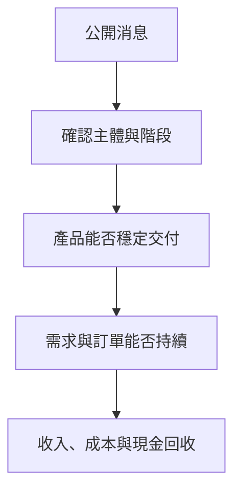

# 12 看到擴產與新產品消息，該如何改變判斷？

## 開場問題：三則好消息，能不能接成同一條成長故事？

新廠落成、鏡頭開發完成、官網新增應用品項，讀起來都像業務向前一步。但如果把它們接成「新廠開始替新客戶大量生產高毛利產品」，其中的產品、客戶、產量與獲利，可能沒有任何一項出現在原始文件。

本章用三個可回查的一手案例，練習把消息轉成可更新的判斷。案例保留原始動詞，再分開寫事實、推論、未知與改判條件。目標是知道下一份文件要回答什麼，讓工程原理真正用得上。

研究基準日為 **2026-09-14**；本章接續撰寫時於 **2026-09-15** 重讀 C2、C3 官網核對。動態頁面均未標發布日，不能把這次查閱當成新事件發生日期。案例主體依來源區分大立光電及集團產品入口。

## 結構與角色：先把一句話拆成四個問題

讀新聞時先圈出「誰、做什麼、何時、做到哪一步」。集團展示的元件不一定由母公司直接生產；歷史沿革中的年份也不等於頁面更新年份。若一開始主體與時間就錯位，後面再精確的計算也沒有用。

| 必填欄位 | 寫法 | 缺少時如何處理 |
|---|---|---|
| 主體與交付物 | 某法人交付鏡頭、馬達或光學元件 | 保留集團層級，不自行指定生產者 |
| 時間與動詞 | 某年落成、開發完成、展示 | 不換成量產或已認列收入 |
| 原始文件位置 | 沿革年份、產品頁分類或報表欄位 | 新聞只作查找線索 |
| 更新條件 | 哪份新證據能支持下一個判斷 | 寫明待查，不猜日期與客戶 |

*圖表 12-1：消息拆解表。可以檢查論述缺了哪一欄，不能把填滿欄位當成商業成功的保證。*

「公司沒有在這份文件揭露」和「公司沒有做」是不同命題。前者是閱讀結果；後者需要更多證據。沒有查到量產資料時，結論應停在目前可支持的階段，既不自動升級，也不自動否定。

## 作用機制：從技術機會走到收款，中間有多個條件

[第 06 章](06-assembly-yield-cost.md)說明合格品需要製造與組裝公差同時受控；[第 08 章](08-qualification-competition.md)說明供應能力還要通過客戶驗證。這兩道條件決定技術成果能否轉成可反覆交付的產品。收入之外，還要看成本、付款條件和現金回收，才能判斷投入是否產生經濟成果。

*圖 12-2：閱讀時依序補上的問題。箭頭表示需要新的證據，不表示各階段必然成功，也不要求每個階段都對外單獨公告。*

### 案例一：2025 年兩座廠落成，是產能已經增加嗎？

**事實。** C3 公司沿革的 2025 年欄將 LP4、LP9 分別記為落成。來源主體為大立光電；頁面未標發布日，事件僅標年份。這是可追溯的廠房里程碑。[C3：公司沿革，2025 年欄](https://www.largan.com.tw/tw/about/history)

**推論。** 更多廠房空間可能提供擴充或調整生產配置的選擇。但合格品產能還取決於設備、瓶頸站、班次與良率。廠房數不能直接換算月產量，也不能假設每座廠的規模相等。

**未知。** 這一欄沒有設備進場時點、產品配置、認證狀態或利用率，因此不能把兩座廠指定給潛望式或 CPO。新空間也可能服務既有製程調整，未必全部形成新增可售產出。

**改判條件。** 若後續公司文件把特定廠區、設備驗收及可供交付產能連起來，可支持「可用供應能力增加」。若同時有出貨與需求資料，才進一步評估利用程度；若文件改列延後投產，就更新時程。即使後來知道產量，仍不能回填成落成當年已經滿載。

### 案例二：2022 年潛望式變焦鏡頭開發完成，是客戶已採用嗎？

**事實。** 同一沿革頁 2022 年欄記載手機用潛望式變焦鏡頭開發完成；未標客戶、數量或價格。這是大立光電自陳的開發成果，並非某款手機採用的公告。[C3：公司沿革，2022 年欄](https://www.largan.com.tw/tw/about/history)

**推論。** 開發成果提供進一步驗證與商品化的研究起點。但「開發完成」的內部驗收定義未附於沿革，不能替公司補成已完成特定工程樣品、已通過所有可靠度測試或已拿到訂單。

**未知。** 實際光路、焦距範圍、驅動配置和供貨分工都不在這一行。依[第 07 章](07-telephoto-actuation.md)，光路折疊與連續變焦是兩個問題；產品名稱不足以證明全焦段連續變焦，更不能保證成品手機的拍攝效果。

**改判條件。** 新文件若明確指出某交付物已出貨，可升級該交付物的出貨狀態。若客戶仍未具名，客戶欄繼續留白；若要判斷連續變焦，則需可確認焦距變動方式的設計或量測資料。單一技術進展，不會一次填滿所有未知欄。

### 案例三：官網展示 CPO 元件，是新收入已經形成嗎？

**事實。** C2 集團產品入口的 CPO 應用區展示稜鏡微透鏡陣列與光纖陣列，頁面未標發布日。該區未將品項與客戶、出貨或收入金額連結。可確認的是公開展示內容。[C2：產品與服務，CPO 應用區](https://www.largan.com.tw/tw/product)

**推論。** 品項讓研究問題變得具體：可以開始查這些元件如何完成光耦合，以及組裝與驗收要求。CPO 指共同封裝光學；其元件的角色應依[第 10 章](10-new-applications.md)分析，不能僅因同屬光學，就把手機鏡頭的成像能力當成新用途的驗證結果。

**未知。** 僅憑入口頁，無法確定生產法人、商業階段、驗收結果或持續訂單。有關送樣、試產和放量的媒體說法，必須逐則回到原始發言與時間條件，不能合併為官網已承諾量產。

**改判條件。** 取得公司對特定元件的送樣說明，可更新送樣狀態；取得量產揭露，可更新量產狀態；取得可對應期間與產品的收入資料，才分析收入貢獻。若進度低於先前規劃，要記錄延後，而不是把舊規劃改寫成已完成。

## 需求、成本與現金流：用同一組問題追蹤三個案例

三案分別給了空間、技術成果與應用品項，尚未共同給出需求。需求不是終端市場很大，而是有人願意在約定條件下反覆收貨。就算拿到首次訂單，也仍要區分一次性試製和持續交付；量增加時，價格、報廢與重工是否一起改變，也要另外追蹤。

**以下是教學假設，不是大立光的真實價格、良率或產品數據。** 假設一家工廠每期交付 100 件，每件收入 20 元、變動成本 12 元，當期固定成本 500 元，且所有成本均於當期認列，利潤為 `100 × (20 − 12) − 500 = 300` 元。

如果新增設備讓固定成本變為 900 元，交付仍只有 100 件，結果就變成負 100 元。若其他條件不變，必須交付 150 件才恢復 300 元。這說明產能投資與盈利改善之間，隔著「新增產出是否有人收貨」的條件；真實產品若價格或單位成本改變，需重新計算。

即使帳面已有利潤，也不能直接當成當期現金。客戶尚未付款、先建立庫存、已支付設備款，都可能造成差異。查閱[第 09 章](09-business-economics.md)時，應將收入、毛利與現金流分開；尤其不能用合併營收的變化，倒推出某座新廠或某個新產品的現金貢獻。

## 與大立光的連結：讓判斷保留可以更新的形狀

**已確認事實。** 本章可直接回查的是兩座廠落成、潛望式開發完成與 CPO 元件展示，來源位置已分別標示。三者各自成立，不等於它們屬於同一專案。

**合理推論。** 這些消息提供後續追蹤方向：廠房能否形成可交付產能、設計能否通過驗證、新元件能否形成持續收入。推論的用途是決定查什麼，不是替缺少的文件作證。

**尚待查證。** 三案的產品與廠區對應、具名客戶、個別收入與盈利貢獻仍未由本章來源建立。可將問題接回[第 11 章證據矩陣](11-largan-evidence-map.md)，每次只更新新證據確實支持的欄位，並保留舊結論的時間範圍。

## 推理檢查

1. 落成後隔年營收上升，為什麼仍不足以證明新廠帶來全部增量？
2. 公司後來確認某潛望式元件已出貨，可以同時確認客戶名稱和連續變焦嗎？
3. CPO 送樣說明與產品收入拆分，分別能更新哪個判斷？
4. 算例固定成本升至 900 元時，交付 150 件為何只恢復原本利潤？
5. 原本規劃於某季試產，該季結束仍未取得更新，應記成失敗還是完成？

??? note "參考推理"
    1. 尚有舊廠產出、價格、產品組合與其他業務等替代解釋，需建立廠區與增量的對應。2. 只能確認來源界定的出貨，客戶及光路功能各需獨立資料。3. 前者更新送樣狀態，後者才支持該期間的收入貢獻。4. 每件貢獻 8 元，新增 50 件只補足增加的 400 元固定成本。5. 記錄「原規劃時點已過，實際進度待查」；沒有更新不等於證明成功或失敗。

## 來源與待查

本章沿用 [C2](appendix-sources.md#c2) 與 [C3](appendix-sources.md#c3)，沒有引用未核對的月營收或庫藏股數字。案例是一手文件的閱讀練習，不是完整事件調查。後續需補公司對廠區用途、產品出貨及新應用貢獻的具體揭露；可追蹤文件種類見[待查問題](appendix-open-questions.md)。
