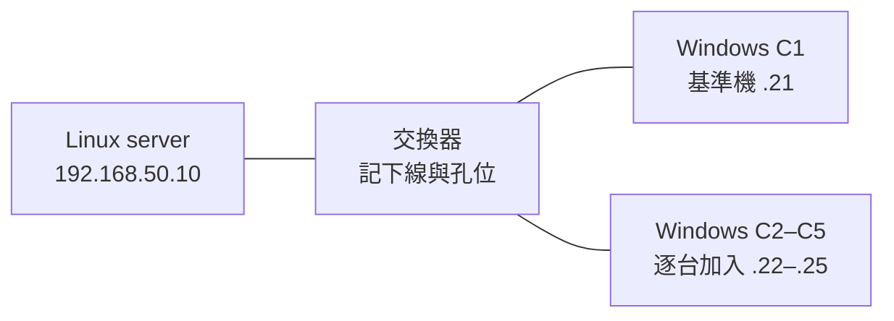
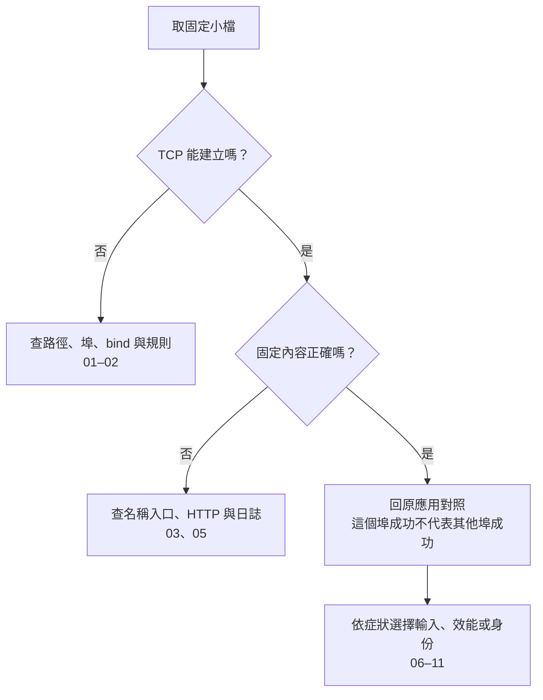

# 全書地圖：下一刀切哪裡

起點是一台 Linux、乙太網路交換器與約五台 Windows。C1 先當基準機，其他機器逐台加入；兩台直連只是可選縮小方法，不要求 server 有五張網卡。

圖 1：IP 為教學示例；實際 subnet/prefix 與路由必須另外確認。本圖不表示交換器有路由能力，也不表示已有防火牆放行。

## 按症狀找入口

| 你現在看到的事 | 先做的小動作 | 接著能拿到什麼 |
|---|---|---|
| 五台結果混在一起 | [01 只留一台](01-one-client.md) | 故障跟機器、線或孔走的紀錄 |
| ping 通，軟體連不上 | [02 敲真正的埠](02-port-and-bind.md) | TCP 與應用的分界 |
| IP 可用、名稱不行 | [03 單次解析覆寫](03-one-request.md) | proxy 與解析分開的對照 |
| 整套服務太複雜 | [04 先取固定小檔](04-tiny-server.md) | 最小 HTTP 路徑基線 |
| 剛才壞了，現在好了 | [05 保存現場](05-save-the-scene.md) | 有限範圍的 pcap 與事件時間 |
| 每次重試輸入都不同 | [06 保存輸入](06-replay-input.md) | 能反覆送出的 body 與指紋 |
| 檔案慢，但不知道慢哪邊 | [07 方向分開測](07-two-directions.md) | 吞吐、方向、競爭的差異 |
| 小的通、大的卡 | [08 尺寸門檻](08-size-threshold.md) | 進階選讀的 MTU 線索 |
| 想看到逾時怎麼發生 | [09 故意變慢](09-make-it-slow.md) | 有控制條件的等待／取消觀察 |
| 管理頁只聽 localhost | [10 拉隧道](10-local-tunnel.md) | 不改服務 bind 的替代入口 |
| 只有一台開不了共享 | [11 固定帳號與版本](11-one-client-smb.md) | TCP、SMB 與身份的分界 |

## 讀懂成功的範圍

圖 2：每一步只支持較窄的結論。小檔成功是調查的基線，不是全網健康證明。

第一次完整閱讀可走 04→01→02→03→05→06，再依需求選 07–11。08 與 09 都有較強環境前提；沒有隔離路徑或介面也能理解判讀，但不要直接把正式設備變成故障注入場。

做實驗時開著 [五台表與單次紀錄](appendix-records.md)。要找命令依據看 [來源](appendix-sources.md)，要辨別哪些真的跑過看 [驗證](appendix-validation.md)。圖表由本書自行整理，來源與閱讀限制見 [圖表出處](99-image-credits.md)。
