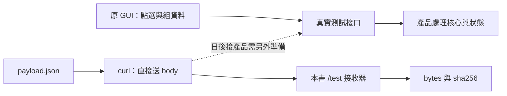

# 06｜不再重點十次：保存那一次輸入

**curl 是現有功能；本章接收器需要新增程式｜Python 3.10+｜不需重新建置機台軟體。** 接收器的本機 HTTP 檢查已執行；Windows–Linux LAN 與真實 GUI 重現仍未執行。

## 現場症狀

每次要點十個畫面才能觸發一次錯誤。工程師請現場再試，現場又改了某個欄位，兩邊以為在談同一筆資料，其實根本不同。

先把應用層輸入存成檔案，讓「再試一次」真的送出同一份位元組。這不是錄下滑鼠，也不是把 pcap 倒回網路；它刻意略過 GUI，把問題縮成一個可重送的要求。

## 小招式

### 先把「準備輸入」和「處理輸入」分開

GUI 的十次點選通常在準備一份資料。若每次都從畫面開始，你同時在測點選流程、資料組裝、送出與 server 處理，迭代會很慢。先把準備好的資料留成檔案，就能集中看送出後的那一段；這是固定測試輸入，也常叫 fixture。



先走下方的實線：確認資料能原樣送達。虛線目前沒有接上；本書接收器不含產品處理核心，所以指紋一致不代表已重現產品 bug。

如果你日後在 C++ 加 `test_mode`，可考慮讓固定輸入和正常入口進入同一個處理函式，才比較有機會測到共同邏輯。手動切模式也可以起步，但要記得重建需要重建的部分，並從啟動訊息或明確輸出確認正在跑的模式；本章不替你的產品提供這個開關。

本書提供三個小檔，可先下載到各自的測試目錄：

- Linux：[replay_receiver.py](examples/replay_receiver.py)，本書自訂的 `/test` 接收器。
- Linux：[check_receiver.py](examples/check_receiver.py)，放在接收器旁可執行自我檢查。
- Windows：[payload.json](examples/payload.json)，只含虛構機台名稱與數值。

Linux shell 在檔案所在目錄啟動。這次使用空閒 8081，與第 04 章的 8080 分開：

```bash
python3 replay_receiver.py --bind 192.168.50.10 --port 8081
```

Windows PowerShell 切到 `payload.json` 所在目錄，再送出：

先預測回應：目前沒有真正處理機台工作，因此你應該拿到內容長度與指紋，而不是「機台執行成功」。`@payload.json` 是讀取檔案內容；`--output` 則把回應另存，避免把輸入與輸出混在一起。

```powershell
curl.exe --noproxy "*" --connect-timeout 3 --max-time 5 --silent --show-error --data-binary "@payload.json" -H "Content-Type: application/json" --output reply-a.json --write-out "HTTP=%{http_code}\n" http://192.168.50.10:8081/test
Get-Content .\reply-a.json
```

回應預期含 `bytes` 和 `sha256`，不是機台操作結果。這個接口**不是任何現成機台產品的內建功能**，也不寫資料庫、不下控制命令。

## 必要原理

`--data-binary @檔名` 從檔案送出 body，保留換行；與一般 `--data` 從檔案讀取的處理不同。指定 Content-Type，才不會讓伺服器用另一種格式解讀。[curl 文件](https://curl.se/docs/manpage.html#--data-binary)

自訂接收器檢查路徑、Content-Length、Content-Type、UTF-8 與 JSON object，接受最大 65,536 bytes。它拒絕壓縮內容與 Transfer-Encoding；不提供登入、持久連線或通用 HTTP 服務。Python 的 `BaseHTTPRequestHandler` 只是供我們實作 POST 的底座，這些檢查與回應是本書新增的。[Python 文件](https://docs.python.org/3/library/http.server.html)

雜湊是把一串位元組變成便於比對的指紋。同樣 JSON 欄位換了空白、換行或順序，指紋就可能不同：本章比較的是**原始 bytes**，不是業務語意是否相同。

## 親手實驗

### 先不改任何輸入，再只改一個值

先把命令的輸出檔改成 `reply-b.json`，完全不改輸入，再送一次。比較兩個回應：

```powershell
Get-Content .\reply-a.json
Get-Content .\reply-b.json
Get-FileHash .\payload.json -Algorithm SHA256
```

預期兩次 bytes、sha256 相同，檔案雜湊與 server 回報一致（大小寫不影響十六進位值）。再用編輯器把 payload 的 `7` 改成 `8`，存成 **UTF-8 無 BOM**，另存 `payload-changed.json`；只改 `--data-binary` 的檔名與輸出檔名，送第三次。這次預期雜湊不同。

先在這裡停一下：如果兩次「未改輸入」的指紋已不同，就查檔案是否被重存、執行目錄是否不同，以及是否真的連到同一接收器。這個前提未成立前，先別開始比較產品行為。反過來，`7` 改 `8` 不一定改變 bytes 長度，因此要同時看長度與指紋。

### 再讓輸入故意不合法

接著把 JSON 改壞，例如刪除最後一個大括號，另存 `payload-bad.json` 後送出。預期 HTTP 400。curl 沒加 `--fail` 時，HTTP 400 不必然導致非零退出碼，所以這裡刻意輸出 HTTP 狀態，而不是只看命令有沒有跑完。

Linux 可先執行隨附檢查：

```bash
python3 check_receiver.py
```

它在本機隨機 loopback 埠檢查重送一致、單欄變動、錯誤 JSON、錯誤路徑、媒體型別、過大輸入與不支援的傳輸格式。本次已在編寫環境通過，環境與界線見 [驗證紀錄](appendix-validation.md)。

## 結果解讀

同一 body 在假端點得到相同指紋，只證明保存與送出路徑在本次測試一致。把它換到真正的測試接口時，還要固定 method、URL、headers、登入身份及可重設的 server 狀態。

若 GUI 壞而相同輸入的直接要求正常，問題可能在 GUI 前處理、時序、session 或連線重用；不能直接說 GUI 有 bug。如果某份 body 每次都失敗、另一份每次正常，才有一個值得縮小的輸入對照。

## 失效反例

token 過期、時間戳失效、nonce 只能用一次，都會讓相同 body 得到不同回應。涉及付款、移動軸、啟停設備的要求，也不能因為「同樣資料」就當作無副作用。

省下的是十次點選，轉移的代價是管理輸入版本與測試狀態。此接收器是單執行緒，慢 client 會影響下一個要求；它用來驗證內容，不能用來評估五台並行效能。

## 收尾與撤回

### 換個現場，下一步怎麼選？

同一 body 第一次成功，第二次回「已處理」。是不是重播工具壞了？

??? note "參考思路"

    先查要求識別碼、身份及 server 初始狀態。位元組相同不代表兩次執行條件相同；真實接口可能會記錄已處理的工作。應在可重設的測試環境比較，不要對有副作用的正式接口一直重送。

### 留作日常小工具也可以

即使沒有重現 bug，去識別的 payload 與明確命令也可以保留，供開發時快速重跑。若之後用 Python／uv script 封裝，就把「讀哪個檔、送哪個測試端點、輸出存哪裡」做成看得見的參數，並記下依賴與執行方式。先保留能查錯的小工具即可，不必一開始就接 CI；本章提供的 Python 接收器只用標準函式庫。

以下清理針對這次執行中的服務與臨時回應。要保留的去識別 fixture 先移到約定的位置，不把它和一次性輸出一起丟掉。

Linux 按 Ctrl-C 停接收器，Windows 再送一次確認已連不到。刪除本章測試目錄中的 payload 與 reply 檔案；不要把真實 token 留在 fixture。若某份去識別輸入能穩定重現 bug，再把它和預期回應納入原產品的回歸測試。

來源：P08、P01；前一章 [05](05-save-the-scene.md) 保存的是觀測，本章保存的是可再送的輸入。下一步可看 [09：故意變慢](09-make-it-slow.md)。
