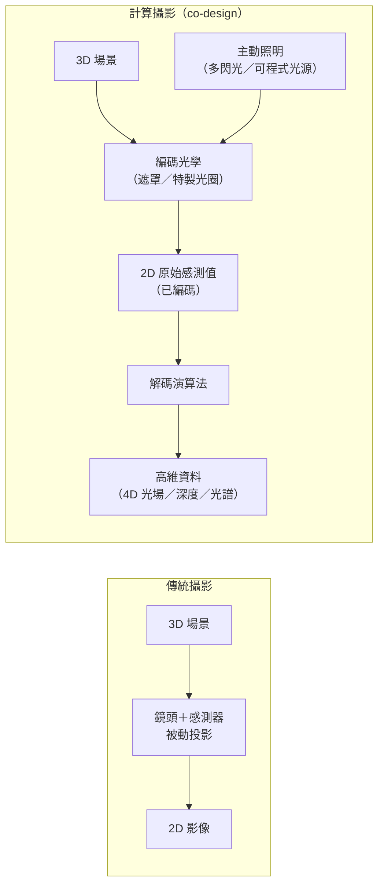
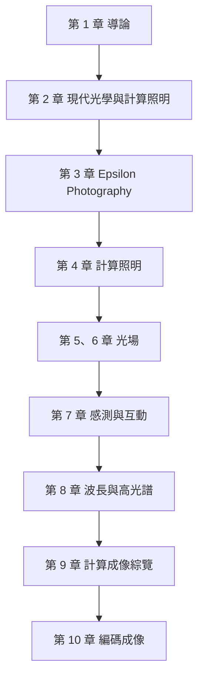

# 第 1 章：導論

對應講次：Lecture 1
影片主題：
- Introduction and fast-forward preview - Part 1
- Introduction and fast-forward preview - Part 2
對應講義：無

## 導讀

本章作為《計算攝影》課程的總覽，帶領我們打破對「相機」的傳統認知。在過去，相機被視為一個暗箱與透鏡的組合，只能被動地將三維世界的反射光投影成平面的二維陣列。然而，隨著運算能力與感測器的進步，攝影已經從單純的「捕捉」跨越到「運算與重建」。本章將快速預覽一系列看似魔法的技術：從事後對焦的[光場](05-lightfields-1.md)相機、能夠看穿轉角的飛秒雷射、到提取場景幾何特徵的多重閃光系統，揭示未來相機的樣貌將是光學、感測器與演算法的深度融合。

## 核心內容

傳統攝影大多專注於 [Epsilon photography](03-epsilon-photography.md)（在極小範圍內改變參數，如包圍曝光）來彌補相機物理極限。然而，本課程的核心在於 **Coded photography**：透過在相機硬體中加入編碼機制（例如在鏡頭前加裝光柵、特製光圈、或主動控制的光源），將場景的深度、光照反射特性甚至隱藏的結構資訊，壓縮編碼進單張或極少量的照片中。後續再由軟體解碼，還原出原本 2D 感測器無法捕捉的高維度資料（如 4D 光場）。

Raskar 進一步將攝影的演進分為三個層次，作為全課程的分類框架：

- **Epsilon Photography**：以極限包圍曝光（如 HDR、焦點堆疊）逼近底片攝影的品質上限。
- **Coded Photography**：以單張編碼影像捕捉場景的高維資訊（本課程重點）。
- **Essence Photography**：不追求擬真，而是擷取場景的高階語意與本質。

## 原理與系統

計算攝影的關鍵不在於「拍完再修」，而在於**光學、感測與演算法的共同設計（co-design）**：先在成像端刻意編碼光線，再於運算端解碼還原。下圖對比傳統相機的被動投影與計算相機的編碼—解碼流程：

在此框架下，本講快速預覽了數個代表性系統：

1. **光場相機（Light Field Camera）**：
   介紹了兩種截然不同的取徑。史丹佛大學團隊在感測器前放置微透鏡陣列（micro-lens array）來分離不同角度的入射光；而 MIT 團隊則提出成本極低的 Mask-based 光場相機，利用印有高頻圖案的遮罩，在空間上對光線進行調變（類似廣播電台的調幅／調頻技術），隨後在頻域解碼重現視差影像。課堂中並展示了單一鏡頭內含約 25 個子影像、可全軟體事後對焦的雛形（即 Lytro／refocus imaging 的前身）。

2. **對偶攝影（Dual Photography）**：
   利用亥姆霍茲光路可逆原理，將相機與投影機的位置邏輯互換，可以合成出從光源位置看出去的影像，甚至能用來讀取對手藏在手上的撲克牌。詳見[第 4 章](04-computational-illumination.md)。

3. **看穿轉角與飛秒成像（Looking Around Corners / Transient Imaging）**：
   利用飛秒雷射（femtosecond laser）極短的脈衝特性。因為光在 1 奈秒內約移動 1 英呎，要分辨公釐級的距離，必須有皮秒（picosecond）甚至飛秒等級的時間解析度。記錄光子在牆壁與隱藏物體間多次反彈的時間差（Time-of-flight），即可運算重建出不在視線內的物體。

    > **範圍說明**：此段為 Raskar 團隊當時的研究願景預告，**並非本課程的正式講次，OCW 亦無對應講義**（相關 femto-photography 論文多於 2011 年後發表）。本書不另立專章，僅於此處作為「相機的可能性」介紹。

此外，講者也以熱像儀 demo 說明波長的力量：在長波長紅外線下，可見光透明的玻璃變得不透明，且影像不受室內可見光照明改變影響——這預告了[第 8 章](08-wavelengths-color-hyperspectral.md)的波長與高光譜主題。

## 常見誤解

- **計算攝影只是高階的 Photoshop 後製嗎？** 不是。純軟體後製無法憑空創造出硬體未捕捉到的光學資訊。真正的計算攝影是硬體（光學／照明）與軟體的共同設計（co-design）。
- **光場相機只是為了事後對焦？** 事後對焦只是最直觀的應用。一旦捕捉到 4D 光場，我們等同獲取了幾何資訊，可以用於深度估計、去除眩光（glare reduction）、甚至看穿部分遮蔽物（synthetic aperture）。

## 後續發展（截至今日）

本講展示的「單鏡頭事後對焦」雛形，正是消費級光場相機 Lytro 的前身：Lytro 於 2006 年創立、2012 年推出首款消費機、2018 年停業並併入 Google。而講者所預言的「運算攝影將成為相機常態」，在 2016–2020 年間已於智慧型手機上全面兌現（人像模式、夜景、多鏡頭與 ToF／LiDAR 深度感測皆成標配）。

## 小結

未來的相機不會只是追求更高畫素或更小的感測器，而是能夠聰明地篩選與編碼光線。這些技術不只將改變消費型攝影，更將推動醫學影像（如簡化斷層掃描設備）、人機互動（如不受光照影響的精確追蹤）與科學成像的重大革新。後續各章將把本講預覽的每個主題，逐一展開其光學與計算細節。

## 延伸連結

本書章節地圖如下，各章循「光學基礎 → 編碼取捨 → 光場 → 感測互動 → 波長 → 綜覽」的脈絡推進：

- 下一章：[第 2 章：現代光學與 Ray-Matrix 運算／Context Enhanced Imaging](02-modern-optics-ray-matrix.md)
- 相關主題：[第 3 章：Epsilon Photography](03-epsilon-photography.md)、[第 4 章：計算照明](04-computational-illumination.md)、[第 5 章：光場（上）](05-lightfields-1.md)
- 名詞查閱：[術語表](glossary.md)
