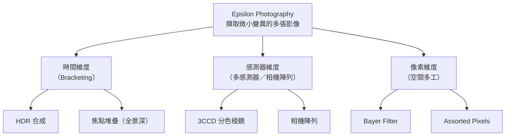

# 第 3 章（上）：Epsilon Photography

對應講次：Lecture 3
影片主題：
- Epsilon Photography: Improving Film-like Photography
對應講義：MITMAS_531F09_lec03.pdf

## 導讀

傳統攝影在按下快門的瞬間，受限於感測器的動態範圍、鏡頭光圈與對焦平面，往往只能妥協於某一種拍攝設定。本章探討 [Epsilon Photography（微擾攝影）](glossary.md)，這是一種藉由在時間、感測器或像素層面引入微小變數，多次擷取場景資訊並以計算方式疊加融合的方法，旨在突破單一曝光的物理限制。本講對應第 3 章上半；下半的「單張多域相機」見[第 3 章（下）](03-epsilon-photography-part2.md)。

## 核心內容

Epsilon Photography 的核心概念，在於擷取大量具有微小變異的資料並加以結合。這些變異主要沿三個維度展開：

1. **Epsilon in Time（時間維度）**
    - 在不同時間點連續拍攝多張參數不同的照片（Bracketing）。
    - **高動態範圍（HDR）合成**：拍攝多張不同曝光時間的照片，將亮部與暗部的細節結合。
    - **焦點堆疊（Focal Stacks）**：對焦於場景中的不同深度連續拍攝，再利用梯度域（Gradient domain）融合技術（如 Poisson solver），產生全景深（All-in-focus）的清晰影像。

2. **Epsilon in Sensors（感測器維度）**
    - 利用多個共焦的感測器或相機陣列，在同一時間獲取多維度資訊，解決了時間維度無法拍攝動態場景的缺點。
    - **3CCD 系統**：透過分色稜鏡（Dichroic prism）將光線無損分離至三個感測器。
    - **相機陣列（Camera Arrays）**：例如 Mitsubishi 開發的 8 相機共焦系統，或 Stanford 開發的大型相機陣列，能同時擷取不同焦距、不同曝光或不同視角的影像。

3. **Epsilon in Pixels（像素維度）**
    - 在單一感測器上，讓相鄰的像素負責擷取不同的資訊，這是一種空間多工技術。
    - **Bayer Filter**：最常見的像素級濾波，相鄰像素分別擷取紅、綠、藍光。
    - **Assorted Pixels**：在像素陣列上附加不同透光率的中性密度濾鏡，讓單次曝光就能兼顧極亮與極暗的細節。

講者也以 20 世紀初 Prokudin-Gorsky 在俄羅斯的彩色攝影為例：分別用紅、綠、藍濾波器拍三張黑白照，再以對應顏色的投影機疊加還原色彩——這正是「以多張微差影像換取單張所缺資訊」的早期實踐。

## 原理與系統

當微差發生在**視角**上時，Epsilon Photography 便延伸出合成孔徑與事後對焦的能力。

### Synthetic Aperture Photography（合成孔徑攝影）

透過相機陣列擷取多個微小視角差異（Epsilon in position）的影像，利用「平移與相加」（Shift and Add）的演算法，可以計算並模擬出具備大光圈鏡頭的極淺景深效果。其流程如下：

對焦於某一深度平面時，該平面上的物體在各視角中對齊、相加後清晰；其餘深度則因未對齊而模糊。這使得「數位重對焦」（事後決定對焦平面）成為可能，甚至能穿透前景障礙物（如樹叢）看見後方——Stanford 相機陣列即以此展示了穿透樹叢的效果。此概念與[第 5、6 章](05-lightfields-1.md)的光場密切相關。

### Image Destabilization

有別於軟體計算，另有研究提出在曝光期間**同步且精準地移動相機感測器與鏡頭**，改變光路與對焦平面的比例，從而以純光學方式，利用便宜的小光圈鏡頭模擬出昂貴大光圈鏡頭的淺景深效果。

## 常見誤解

- **將影像後製的模糊與光學淺景深混為一談**：單純從單張 2D 影像進行模糊處理，無法正確反映場景中物體的真實 3D 深度關係，邊緣也常出現不自然的光暈（Halo）。Epsilon Photography 則是透過多張影像提供的真實深度線索來重建模糊。

## 小結

Epsilon Photography 為運算攝影奠定了重要的基礎思想：我們不再苛求一次完美的曝光。相反地，透過擷取大量具有微小變異的冗餘數據，再交由計算機進行智慧的縫合與還原，就能產生超越物理硬體極限的影像。下半章將展示如何把「時間掃描」壓縮進單次快門，實現單張多域相機。

## 延伸連結

- 上一章：[第 2 章：現代光學與計算照明](02-modern-optics-ray-matrix.md)
- 下一章：[第 3 章（下）：單張多域相機](03-epsilon-photography-part2.md)
- 相關主題：[第 5 章：光場（上）](05-lightfields-1.md)（合成孔徑與 4D 光場的連結）
- 名詞查閱：[術語表](glossary.md)
