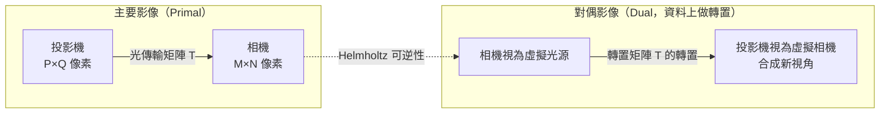

# 第 4 章：計算照明：Dual Photography 與 Relighting

對應講次：Lecture 4
影片主題：
- Computational Illumination: dual photography, relighting - Part 1
- Computational Illumination: dual photography, relighting - Part 2
對應講義：MITMAS_531F09_lec04.pdf、MITMAS_531F09_lec04_notes.pdf

## 導讀

如果說相機是被動接收光線的容器，那麼光源就是主動探測場景的畫筆。在傳統攝影中，閃光燈的作用僅是將暗處照亮；但在[計算照明（Computational Illumination）](glossary.md#c)的範疇內，照明可以是一個在空間、時間與頻率上受到精確控制的高維變數。本章將透過程式化的光源投影，讓相機「看」到原本看不見的死角（如對偶攝影），或是將交織在一起的光線解開，拆解出光線在物體表面只彈跳了一次，還是穿透表面進行了多次散射（直接與全局光分離）。

## 核心內容

本章的核心在於「照明的編碼與解碼」。

1. **[對偶攝影（Dual Photography）](glossary.md#d)**：基於物理學的亥姆霍茲可逆性（Helmholtz reciprocity），如果我們記錄下投影機發出的每道光線如何影響相機的每個像素（即光傳輸矩陣），我們就能透過對矩陣進行轉置（Transpose），在數學上互換投影機與相機的位置。這使得我們可以合成出從光源視角看出去的影像，甚至能看到原本背對相機的撲克牌花色。
2. **直接與全局光分離（Separating Direct and Global Illumination）**：透過投影高頻的棋盤格與其反相圖案，僅需兩張照片就能分離光線。直接反射（Direct）保留了物體表面的紋理；而全局反射（Global）則包含了多次彈跳、次表面散射與半透明材質的特性。
3. **時間調變（Temporal Modulation）**：借鑒通訊系統（如電視遙控器在約 40kHz 頻率運作），讓光源以特定頻率閃爍、感測器專門解碼該頻率，即可在強烈環境光下抽離出特定光源的貢獻。

## 原理與系統

### 對偶攝影的光傳輸矩陣

對偶攝影的骨幹是一個**光傳輸矩陣 $T$**。設攝影機的像素排列為 $M \times N$、投影機的像素排列為 $P \times Q$。我們讓投影機逐一點亮每個像素，並記錄下相機拍到的完整反應，把這些反應排列起來就得到矩陣 $T$，它描述了「投影機每一道光線」到「相機每一個像素」的完整傳輸關係。

亥姆霍茲可逆性保證了光路可逆：把發光點與接收點互換，光的傳輸比例不變。因此若把相機當成虛擬光源、把投影機當成虛擬相機，對應的光傳輸矩陣正好是原矩陣的轉置 $T^{\top}$。我們不必真的把相機搬到投影機的位置，只需在資料上做一次轉置，就能「合成」出從光源視角看出去的影像。

### 直接與全局光分離

當光源位置產生極微小的改變（如高頻棋盤格的亮暗切換）時，**直接反射**的像素亮度會劇烈改變，但經過多次彈跳的**全局反射**幾乎不受影響。假設高頻圖案覆蓋一半區域，投影棋盤格得到的影像可寫成 $I_1 = c\cdot D + \tfrac{1}{2}G$，投影反相圖案得到 $I_2 = (1-c)\cdot D + \tfrac{1}{2}G$。只要對每個像素取 $\mathrm{Max}(I_1, I_2) - \mathrm{Min}(I_1, I_2)$，就能解出直接分量 $D$，剩下的即為全局分量 $G$。

- **真假水果與次表面散射**：講者展示了真實的蘋果與蠟製模型。一般光照下兩者難以分辨，但提取直接反射光後，真實蘋果因為光線多在內部進行次表面散射，表面直接反射看起來非常暗沉且色澤不同；假水果只有表面反光，無所遁形。
- **合成孔徑（Synthetic Aperture）與看透樹葉**：除了改變光源，我們也能透過擴增感測器的空間分佈來達成不可能的任務。藉由相機陣列或移動單一相機（例如拍攝 24 張不同位置的照片），我們能模擬出一顆口徑極大的鏡頭。當景深極淺時，前方的障礙物（如樹叢或人群）會被極度模糊化，使我們能看透遮蔽物，將焦點鎖定在隱藏於其後的目標上。這正是通往下一章[光場](glossary.md#l)概念的橋樑。

## 常見誤解

- **「全局光（Global Illumination）」只有在電腦繪圖（CG）才有意義**：許多人以為這只是 3D 渲染的術語，但真實世界充滿了全局光（光線的多次彈跳）。正是因為早期的 CG 技術只渲染直接反射，所以像《玩具總動員》裡的塑膠玩具看起來很真實，但若要渲染逼真的人類皮膚（需次表面散射），便需要精密的全局光計算。
- **對偶攝影只是鏡子反射**：對偶攝影不需要鏡面，它是利用漫反射（Diffuse reflection）將光線散佈至整個場景。相機能透過觀察漫反射光芒的細微變化，解碼出隱藏物體的影像。
- **直接／全局分離對任何材質都有效**：對完美的鏡面反射（Specular reflection）會失效，因為鏡面反射高度依賴入射角度，無法假設在微小光源移動下全局分量保持不變。

## 小結

將通訊理論的調變（Modulation）與光學結合，我們賦予了光線傳遞資訊的能力。計算照明把拍照從單向的「紀錄」變成雙向的「探測」：對偶攝影用一次矩陣轉置換到光源的視角，直接／全局分離用兩張照片拆解光線的旅程。當相機像素能像遙控器接收器一樣解碼特定頻率的光線，我們甚至能在正午的烈日下，完美分離出相機閃光燈對場景的單獨貢獻。下一章我們將把「控制光源」的思路，延伸到「記錄光線的完整方向」——也就是光場。

## 延伸連結

- 上一章：[第 3 章：Epsilon Photography](03-epsilon-photography.md) —— 以多張微擾影像換取資訊，與本章「多張受控照明」互為對照。
- 下一章：[第 5 章：光場（上）](05-lightfields-1.md) —— 合成孔徑與相機陣列正是捕捉光場的起點。
- 相關章：[第 10 章：編碼成像](10-coded-imaging.md) —— 同樣以「編碼—解碼」的共同設計精神突破光學極限。
- 術語表：[Dual Photography](glossary.md#d)、[Computational Illumination](glossary.md#c)。
