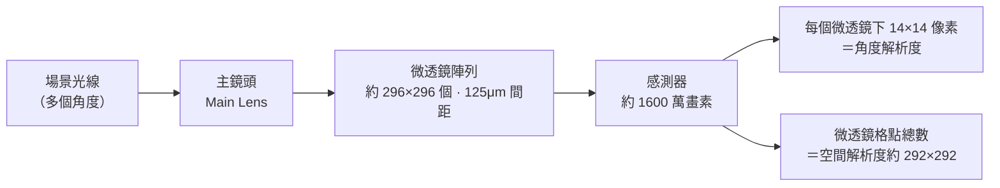

# 第 5 章：光場 (Lightfields) (上)

對應講次：Lecture 5
影片主題：
- Lightfields, part 1 - Part 1
- Lightfields, part 1 - Part 2
對應講義：MITMAS_531F09_lec05.pdf、MITMAS_531F09_lec05_notes.pdf

## 導讀

什麼是「[光場（Light Field）](glossary.md#l)」？我們習慣將相機捕捉到的畫面視為一張 2D 的像素陣列，但真實世界的光線遠比這豐富。空間中任意一點，都有來自四面八方不同角度的光線交會。傳統相機會把這些不同角度的光線透過鏡頭聚焦、積分，最終濃縮成感測器上的一個像素——這個「壓縮」過程讓我們失去了光線的方向資訊。本章將探討如何利用相機陣列或在感光元件前加入微透鏡，來捕捉包含空間與角度的「4D 光場」，進而達成「先拍照，後對焦」的魔法。

## 核心內容

### 4D 光場與 $x$-$\theta$ 空間

在真實的 3D 世界中，光線可以被表示為一個 4D 的函數（例如穿越兩個平行平面的 $u, v$ 與 $s, t$ 座標）。為了簡化討論，我們常使用 2D 的空間「Flatland」來思考：光線在 2D 平面中可以用空間位置 $x$ 與角度 $\theta$ 來參數化，形成 $x$-$\theta$ 空間（又稱為 Epipolar Plane Image, EPI）。

在 $x$-$\theta$ 空間中，光線的幾何行為變得十分直觀：

- **無限遠處的光源**：所有光線平行，在 $x$-$\theta$ 空間中是一條水平線。
- **非常靠近的光源**：向所有角度發散，是一條垂直線。
- **一般距離的點**：隨著光線傳播，不同角度的光線會到達不同的位置，在 $x$-$\theta$ 空間中呈現為一條傾斜線（Shear）。

### 事後對焦 (Shift and Add)

擁有光場資料後，對焦不再是物理鏡頭的專利，而是純數學的運算。我們可以將擷取到的不同視角（角度）的子影像，依照特定的位移量進行平移並相加（Shift and Add）。平移量決定了合成影像的對焦深度。我們甚至可以設定非平行的對焦平面（如傾斜移軸效果）。在 $x$-$\theta$ 空間中，這對應到把傾斜的光線束「剪切（Shear）」到水平後再沿角度方向積分。

### 散景設計與編碼光圈 (Coded Aperture & Bokeh)

有了光線角度的控制權，我們也能玩轉「散景（Bokeh）」。若將相機的光圈形狀改為特定的圖案（如十字形、文字，或用 LCD 動態控制），失焦的點光源所造成的模糊圓盤（Circle of Confusion）就會呈現出對應的圖案。這種物理光圈的遮蔽，本質上就是在 $x$-$\theta$ 空間中針對特定角度 $\theta$ 的光線進行阻擋。

## 原理與系統

### 光場相機與微透鏡陣列

史丹佛大學的 Marc Levoy 團隊開發了手持光場相機原型（後來 Ren Ng 據此創立了消費級產品 Lytro），其核心技術是在傳統感光元件與主鏡頭間插入**微透鏡陣列（Lenslet Array）**。光線經過主鏡頭聚焦後，微透鏡會將不同角度進入的光線分離，投射到其下方的不同像素上。

以史丹佛的原型為例，感測器約有 1600 萬畫素；其上排布約 $296 \times 296$ 個微透鏡（間距 125μm），每個微透鏡下方覆蓋約 $14 \times 14$ 個像素。也就是說，我們用 $14 \times 14$ 的**角度解析度**換取了對光線方向的記錄，代價是扣除邊界後可用的**空間解析度**只剩約 $292 \times 292$。感測器不僅記錄了「光有多亮」，更記錄了「光從哪裡來」。

> 數字辨析：$292 \times 292$ 指的是「空間解析度」（可用的成像格點數），並非微透鏡的實體數量；微透鏡陣列的實體數量約為 $296 \times 296$ 個。$1600$ 萬畫素、$14 \times 14$ 角度、$125\mu m$ 間距三者彼此相符。

### 波前感測與主動光學

微透鏡陣列的原理不僅用於消費型相機，在天文學的主動光學（Adaptive Optics）領域也發揮了極大作用。望遠鏡為了對抗大氣擾動帶來的波前（Wavefront）扭曲，科學家會利用發射雷射製造的「導引星（Guide Star）」，並透過 Shack-Hartmann 感測器（本質上也是一種微透鏡陣列光場感測器）來量測。當波前平整時，光點會落在微透鏡的正中心；波前發生擾動時，光點便會產生偏移。透過這些偏移量，系統能計算出波前的形變，並即時控制形變反射鏡（Deformable Mirror）進行補償。同樣的技術，也被眼科醫師用來測量人眼水晶體的像差。

## 常見誤解

- **光場相機的解析度太低？** 因為感測器總像素固定，這是一個空間解析度與角度解析度互換的零和遊戲（Trade-off）。要獲得高品質的光場照片，需要極高畫素的底層感測器。
- **事後對焦只是模糊與銳利的軟體濾鏡？** 不是。傳統軟體模糊無法無中生有還原被遮蔽的細節，光場的事後對焦是基於真實的光線幾何進行三維空間投影重建，能真正實現「看穿部分遮蔽物」的效果。
- **微透鏡陣列的數量就等於空間解析度數字？** 需區分實體與有效值：實體微透鏡約 $296 \times 296$ 個，扣除邊界後的有效空間解析度約 $292 \times 292$，兩者不是同一個量。

## 後續發展（截至今日）

史丹佛原型催生了首個消費級光場相機品牌 **Lytro**：2012 年推出首款消費機、讓「先拍照後對焦」進入大眾市場，2018 年停止營運、團隊併入 Google。消費級光場相機最終未能成為主流（空間解析度取捨是主因之一），但光場的核心思想在後續的多鏡頭手機運算攝影、VR 光場擷取與顯示等領域持續發酵。

## 小結

光場攝影打破了自針孔相機以來的成像典範。透過理解光線在空間與角度中的 4D 分布，我們發現鏡頭其實只是完美地將外部的 4D 光場「複製」到相機內部。只要我們有合適的硬體與運算方法來攔截、記錄這個 4D 結構，相機將不再只是二維影像的記錄器，而是能夠捕捉並重建現實物理光環境的強大工具。然而微透鏡陣列的製造成本高昂——下一章我們將看到，如何用一片便宜的編碼遮罩，從頻域巧妙地拿回同樣的 4D 資訊。

## 延伸連結

- 上一章：[第 4 章：計算照明](04-computational-illumination.md) —— 合成孔徑與相機陣列是光場擷取的前奏。
- 下一章：[第 6 章：光場（下）](06-lightfields-2.md) —— 遮罩式光場相機與頻域外差解碼。
- 相關章：[第 7 章：感測與互動](07-sensing-and-interaction.md) —— BiDi Screen 以光場原理達成螢幕的深度感測；[第 10 章：編碼成像](10-coded-imaging.md) —— 編碼光圈與散景設計的延伸。
- 術語表：[Light Field](glossary.md#l)。
