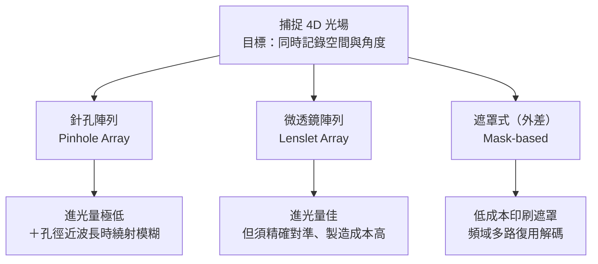

# 第 6 章：光場二

對應講次：Lecture 6
影片主題：
- Lightfields, part 2
對應講義：MITMAS_531F09_lec06.pdf、MITMAS_531F09_lec06_notes.pdf

## 導讀

延續前一章關於[光場（Light Field）](glossary.md#l)的概念，我們已知光場相機透過記錄光線的四維資訊（空間與角度），能夠在軟體中實現事後對焦、改變視角等突破性功能。本章將深入探討「如何捕捉」這些四維光場資訊。除了最直觀但存在嚴重物理缺陷的針孔陣列，以及工程上廣泛使用但成本高昂的微透鏡陣列之外，我們將介紹一種啟發自通訊領域多路復用（Multiplexing）概念的新型光場捕捉技術——遮罩式光場相機（Mask-based Light Field Camera）。

## 核心內容

要捕捉光線的角度方向，最簡單的想法是在感測器前放置一片**針孔陣列（Pinhole Array）**。然而這會面臨嚴重的進光量流失（大部分光被遮擋），以及當針孔縮小至接近光波長（約 500 奈米）時，會引發嚴重的**繞射（Diffraction）**現象，導致成像模糊。講者以水管作比喻：當水管口徑縮小至水分子等級，水不再直線流出而是四散噴射。當孔徑尺寸逼近波長時，繞射發散角可達約 1 弧度（約 57 度）。

為了改善進光量與繞射，傳統光場相機改用**微透鏡陣列（Lenslet Array）**，但這帶來了極高的硬體要求：微透鏡的成像平面必須精確落在感測器上，這在微觀尺度下極難製造且成本高昂。

## 原理與系統

### 三種光場捕捉方案的取捨

MIT 團隊提出的**遮罩式光場相機**，正是為了同時解決前兩種方案的痛點。下圖並列三種方案的核心取捨：

### Hadamard 多路復用的秤重比喻

遮罩式相機的核心概念，是放入一片帶有高頻圖案（如二元遮罩或餘弦遮罩）的透明片於感測器前方。這可以用 **[哈達瑪多路復用（Hadamard Multiplexing）](glossary.md#h)** 的「秤重比喻」來理解：

- **逐一秤重（如針孔陣列）**：一次只放一個袋子，重量太輕、量測不準，信噪比低。
- **一次全放（如透鏡陣列）**：所有袋子一起秤，總重很準卻無法分辨個別重量。
- **每次放一半的不同組合（如二元遮罩）**：讓每次量測都落在磅秤的線性區間，最後再用線性代數解碼出每個袋子的重量。

遮罩法就是在空間中對不同角度的光線進行這樣的分組組合，兼顧了進光量與可分離性。

### 頻域上的外差與解碼

在頻域上，這相當於把光場的角度資訊「調變（Modulate）」到高頻的載波（Carrier）上——這正是[外差（Heterodyning）](glossary.md#h)一詞的由來。透過 2D 傅立葉轉換，我們可以將這張看似帶有高頻雜訊的單張 2D 照片，重新分離並重組成 4D 光場資料。以在中片幅相機前加上一片特製列印遮罩為例，只需極低成本，便可將單張原始影像解碼為等效於 $9 \times 9$（81 台）虛擬相機的多視角光場。缺點是二元遮罩仍會擋掉約一半的光，且當場景本身帶有極高空間頻率（如極細棋盤格）時，解碼會與調變載波產生混疊（Aliasing）。

## 常見誤解

- **手機相機畫素越高越好？** 本講次打破了這個迷思。當手機的鏡頭光圈極小，繞射效應造成的模糊圈（blur circle）可能遠大於感光元件單一像素的尺寸（例如模糊圈達 20μm，而像素間距僅 5μm）。在這種受限於繞射極限的光學系統下，一味追求高千萬畫素並沒有實質意義。
- **遮罩會擋光，成像一定比透鏡差？** 遮罩雖擋掉約一半的光，但透過多路復用，其信噪比遠優於逐孔取樣的針孔陣列；它換來的是硬體對準要求大幅降低、成本極低的優勢。
- **頻域解碼是「無損」的萬靈丹？** 不是。遮罩式相機同樣受制於總畫素預算，且面對高空間頻率場景會有混疊風險，並非沒有代價。

## 小結

遮罩式光場相機展示了計算攝影的核心精神：將硬體的精密要求轉嫁到軟體計算上。透過簡單的編碼遮罩與多路復用概念，我們能用極低成本的硬體，獲取原本需要高難度精密微透鏡陣列才能得到的四維光場資訊。這種「以編碼換硬體」的思路，將在後續的感測互動與編碼成像章節中反覆出現。

## 延伸連結

- 上一章：[第 5 章：光場（上）](05-lightfields-1.md) —— 微透鏡陣列與事後對焦的基礎。
- 下一章：[第 7 章：感測與互動](07-sensing-and-interaction.md) —— BiDi Screen 正是把 LCD 當成分時遮罩、以外差感測深度。
- 相關章：[第 10 章：編碼成像](10-coded-imaging.md) —— 編碼孔徑與 Hadamard 多工的頻域共同設計。
- 術語表：[Hadamard Multiplexing](glossary.md#h)、[Heterodyning](glossary.md#h)。
