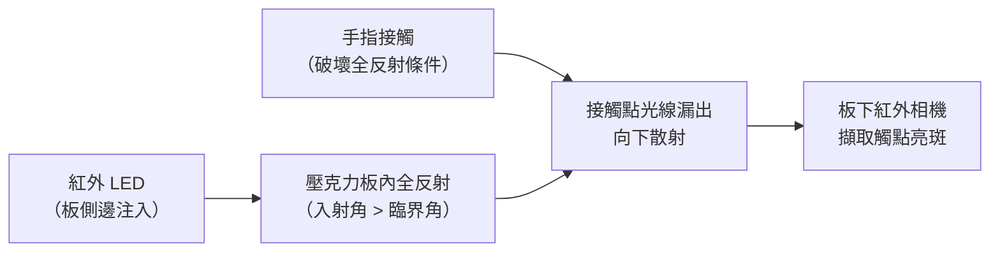
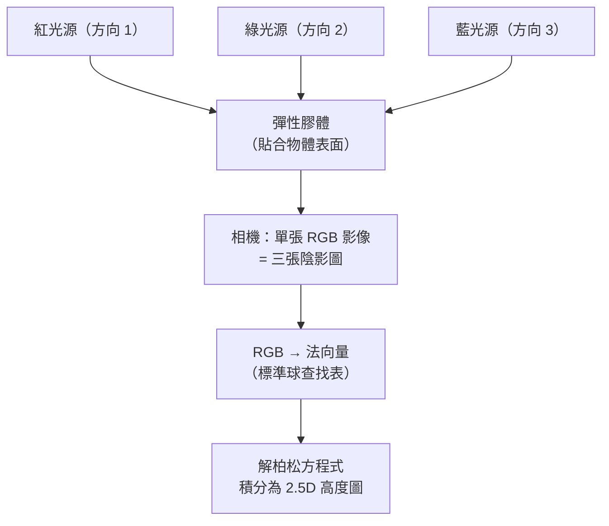
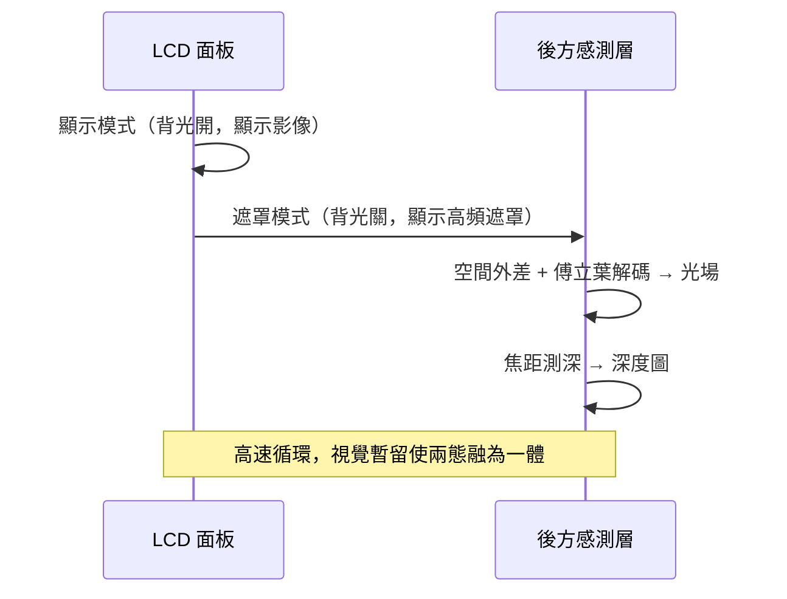

# 第 7 章：感測與互動

對應講次：Lecture 5 (Recent research: Retrographic Sensing), Lecture 6 (Cameras for HCI & Recent research: BiDi Screen)
影片主題：
- Recent research: Retrographic Sensing
- Cameras for human-computer interaction (HCI)
- Recent research: BiDi Screen
對應講義：無對應特定檔案（可參照 lec05、lec06）

## 導讀

計算攝影不僅用於「拍出更好的照片」，相機作為一種高密度的光學感測器，也徹底改變了人機互動 (HCI) 的領域以及我們測量世界的方式。本章的一句話主張是：**當我們不再要求相機輸出「照片」，而只要求它輸出「座標、法向量或深度」時，相機就能被拆解、藏匿並重組成各種不像相機的裝置。** 以下先探討幾種經典且具啟發性的相機 HCI 應用，看看我們如何透過不同的光學配置與感測策略與數位世界互動，再介紹兩種顛覆傳統的感測技術：[Retrographic Sensing](glossary.md) 與 [BiDi Screen](glossary.md)。

## 核心內容

### 7.1 把相機藏在日常裝置中

相機不一定要輸出照片，很多時候它只輸出座標或特徵：

- **光學滑鼠**：這可能是世界上銷量最大的影像感測器。它其實是一台解析度極低（如 20×20）但幀率極高（可達近萬 fps）的相機。它藉由內建晶片不斷比對連續影像的**光流 (Optical Flow)**，就能在無特殊標記的表面上精準算出 X 與 Y 的位移量。
- **Wii Remote**：任天堂的 Wii 遙控器前端其實是一台每秒 100 幀的紅外線相機，用來追蹤放置於電視上方的紅外線發光條。這將繁重的運算留在相機端，僅透過無線傳輸 4 個光點的座標，甚至可被進一步駭客化（如 Johnny Lee 的研究）用作 3D 空間追蹤。
- **Anoto 數位筆**：相機被安裝在筆尖。搭配印有無形微小編碼點陣圖案的專用紙，筆尖相機只要讀取一個 6×6 的區塊，就能解碼出其在紙張（甚至是面積大到數千平方公里的虛擬紙張）上的絕對座標。

### 7.2 光學觸控、空間追蹤與極簡感測

在智慧型手機的多點觸控普及前，大型互動螢幕主要仰賴光學感測：

- **FTIR (Frustrated Total Internal Reflection，受抑全內反射)**：由 Jeff Han 在 2005 年（UIST）展示的經典技術。紅外光在透明壓克力板內部不斷發生全反射，當手指壓上表面時，手指的折射率破壞了全反射條件，光線便會「漏」出並向下方散射，被底部的相機捕捉，形成極為清晰的多點觸控亮點。
- **光片追蹤 (Sheet of Light)**：在桌面上方極近處，平行投射一層極薄的紅外光片。當使用者的手指穿過光片時，會將光阻擋或散射，搭配相機便能偵測觸控或實現懸空投影鍵盤。

相機的極致簡化可能只有兩個像素！日常常見的自動門或感應燈，使用的是熱紅外感測器。為了避免受環境氣溫緩慢變化的干擾，系統使用兩個相鄰的感測像素進行**差分測量 (Differential Measurement)**。當人走過時，會先觸發第一個像素，再觸發第二個像素，兩者相減的訊號會產生一個明顯的正負波峰；而若是整個房間溫度一起上升，兩者相減後仍為零。這是一種透過硬體設計過濾雜訊的極致體現。

### 7.3 光場相機的隱藏功能：影片防手震

[光場](glossary.md)相機能同時捕捉多個視角，這帶來一個意想不到的應用——極致的軟體防手震。若我們有一個 5×5 的相機陣列，在劇烈搖晃的環境下手持拍攝，事後我們不需要進行傳統的影像扭曲或裁切，只要在每一幀從陣列中挑選出「剛好位在平滑軌跡上」的那顆鏡頭的畫面，就能直接拼湊出一段完美平滑的移動影片。未來的多鏡頭手機或許就能靠此完全取代昂貴的機械穩定器。

### 7.4 創新表面測量：Retrographic Sensing

在電腦視覺與圖學領域，捕捉物體的表面幾何形狀（Geometry）一直是一項挑戰。Retrographic Sensing 是一種基於接觸式的表面測量系統，核心在於一塊透明的彈性膠體，表面塗有一層特製的反射塗料。當物體壓入這塊膠體時，塗料會緊密貼合在物體表面，摒除物體原本材質（透明、反光、顏色干擾）的影響，單純提取出表面的形狀與紋理。

為了在保持即時性的前提下獲得精確的法向量，系統採用了 **[光度立體視覺 (Photometric Stereo)](glossary.md)** 技術：

1. 當物體壓入膠體時，從膠體下方同時開啟三個不同方向的 RGB 光源。
2. 在相機拍下的單張彩色影像中，紅、綠、藍三個通道等同於單一光源方向的灰階陰影圖。
3. 透過事先使用已知幾何形狀建立的 3D 查找表 (LUT)，系統能以極快的速度將像素的 RGB 值轉換為表面法向量。
4. 取得法向量後，透過求解柏松方程式 (Poisson equation)，還原出連續的 2.5D 高度圖。

這套系統能輕易掃描如 Oreo 餅乾的微小孔洞、透明玻璃飾品、反光金屬抽屜把手。調整膠體配方後，可以靈敏到測量肥皂泡泡壓在玻璃上的形變，或堅硬到讓汽車開過去量測輪胎表面的磨損。它展示了「計算相機」不一定要向外看，也可以成為一種高解析度、高彈性的「觸覺相機」。

### 7.5 BiDi Screen：感測與顯示的雙向融合

人機互動（HCI）正迎來新的變革，MIT 學生提出的 BiDi Screen（雙向螢幕）完美結合了遮罩式光場理論，創造出一個既能顯示影像，又能感測 3D 空間中手勢互動的輕薄螢幕裝置。

BiDi Screen 將 LCD 螢幕發揮了雙重作用。在分時多工（Time Multiplexing）的機制下，螢幕會以極快速度在兩種模式間切換：

1. **顯示模式**：背光開啟，顯示影像給使用者看。
2. **遮罩模式**：背光關閉，LCD 顯示特定的高頻二元圖案，作為光場編碼遮罩。

穿透遮罩的光線會投射到螢幕後方極近距離的感測層。利用**空間外差（[Spatial Heterodyning](glossary.md)）**原理，遮罩在空間域中對光線進行調變，透過傅立葉轉換解碼，系統能捕捉到多視角的光場影像，再透過焦距測深（Depth from Focus）即時推算出場景的深度圖。

相較於傳統針孔相機僅有極少的進光量，BiDi Screen 採用的二元遮罩能讓高達 50% 的光線穿透。BiDi Screen 是計算攝影學理論轉化為創新應用的絕佳範例，打破了相機必須「長得像相機」的傳統認知，為人機互動帶來無限的想像空間。

## 原理與系統

本章三種代表性系統背後，其實只有兩個反覆出現的物理槓桿：**折射率的邊界條件（FTIR）** 與 **對光線的空間編碼／解碼（光度立體、BiDi 遮罩）**。以下用三張圖點出各自的關鍵機制。

**FTIR 光路：** 紅外光在壓克力板內以大於臨界角的角度入射，被鎖在板內全反射傳遞；一旦手指接觸，接觸點的折射率條件被「破壞」，光便漏出並向下散射，由板下相機拍成亮點。

**光度立體三色光源（Retrographic Sensing）：** 三個方向不同的紅、綠、藍光源同時照亮貼合物體的膠體。相機一張 RGB 影像即等於三張不同光向的陰影圖，透過標準球建好的查找表把 RGB 反查成法向量，再解柏松方程式積分成高度圖。

**BiDi Screen 分時多工：** 同一片 LCD 在「顯示」與「遮罩」兩態間高速切換，利用人眼視覺暫留維持影像，同時在遮罩態以空間外差擷取光場並解出深度。

關鍵數字：BiDi 的二元遮罩透光率可達 **50%**，遠高於針孔式做法的 1–2%；FTIR 由 Jeff Han 於 **UIST 2005** 發表；Retrographic Sensing 由 Johnson 與 Adelson 於 **CVPR 2009** 發表。相關來源見[參考資料](references.md)。

## 常見誤解

- **「FTIR 是靠手指擋光才被看見」**：恰好相反。手指並非遮擋光線，而是**破壞了全反射條件**讓原本被鎖在板內的光「漏出來」向下散射，相機看到的是新出現的亮斑，而非陰影。
- **「Retrographic Sensing 是一種 3D 掃描器」**：它量的是接觸面的 **2.5D 高度圖**，不是完整 3D 結構；而且因為表面被反光塗料覆蓋，物體原本的顏色資訊會遺失，陡峭法向處的重建也較不準。
- **「BiDi Screen 裡藏了一台相機」**：它沒有鏡頭也沒有針孔陣列，而是讓**顯示器本身兼任編碼遮罩**，靠分時多工與光場解碼「算」出深度，這正是「相機不必長得像相機」的核心例證。

## 後續發展（選配）

- **Retrographic Sensing → GelSight**：本章介紹的膠體觸覺感測後續商品化為 **GelSight**，一方面用於工業表面量測（微米級缺陷檢測），另一方面演化為機器人指尖觸覺感測器（如 GelSight／DIGIT 系列），讓機械手能「摸」出物體的紋理與受力。截至今日，觸覺相機已成為機器人操作研究的重要感測模態。
- **BiDi Screen → 屏下感測**：如今智慧型手機的屏下指紋與屏下感測，在「讓顯示面板同時擔任光學感測層」的概念上與 BiDi Screen 呼應（屬概念上的呼應，非直接的技術繼承）。

## 小結

本章的共同線索是「把相機拆成功能而非外形」：光學滑鼠、Wii、Anoto 是把相機縮小藏進日常裝置；FTIR 與光片是把相機的感測面攤平成互動介面；Retrographic Sensing 把相機翻轉成向內觸摸的觸覺器；BiDi Screen 則讓顯示與感測合而為一。它們共享的技術根基——光場、遮罩編碼、外差解碼——正是第 5、6 章的主題；而 BiDi 把 4D 光場化為深度圖的思路，也預告了第 9 章「相機即受限斷層掃描」的觀點。

## 延伸連結

- [第 5 章：光場（上）](05-lightfields-1.md)、[第 6 章：光場（下）](06-lightfields-2.md)：本章防手震與 BiDi Screen 所依賴的光場與遮罩編碼原理。
- [第 9 章：計算成像綜覽](09-computational-imaging-survey.md)：BiDi 的光場解碼與「相機即受限斷層掃描」觀點的延伸。
- [術語表](glossary.md)：Retrographic Sensing、BiDi Screen、Photometric Stereo、Heterodyning、Light Field。
- [參考資料](references.md)：FTIR (Han, UIST 2005)、Retrographic Sensing (Johnson & Adelson, CVPR 2009)、BiDi Screen (Hirsch et al., SIGGRAPH Asia 2009)。
