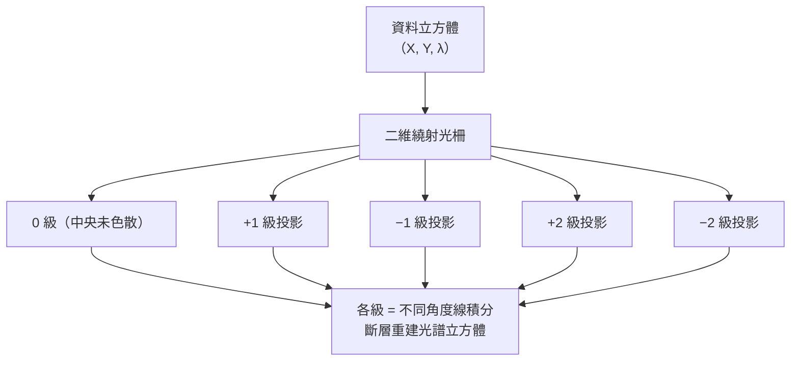

# 第 8 章：波長、顏色與高光譜成像

對應講次：Lecture 8
影片主題：
- Wavelengths and colors
- Survey of Hyperspectral Imaging Techniques
- Project ideas discussion
對應講義：MITMAS_531F09_lec08_2.pdf、MITMAS_531F09_lec08_3.pdf

## 導讀

什麼是顏色？我們常將「顏色」與「波長」混為一談，但波長是光子的客觀物理屬性，而顏色是人類視覺系統（或相機感測器）主觀感知的結果。舉個例子，如果將空氣中波長 630 奈米的紅色雷射筆射入水中，由於介質折射率改變，其波長會縮短為約 **473 奈米**[^water]。它變成藍光了嗎？並沒有，因為決定光子能量的「頻率」沒有改變，人類視覺感受到的依然是紅色。本章將帶領我們從人類與相機的色彩感知基礎出發，並介紹如何透過計算攝影技術，突破傳統相機固定 RGB 的限制，打造一台能像音響等化器般自由調整波長接收的「敏捷光譜相機」([Agile Spectrum Camera](glossary.md))；最後我們也將一窺多光譜成像技術 (Hyperspectral Imaging) 的發展。

[^water]: 波長在介質中依 $\lambda_{介質}=\lambda_{空氣}/n$ 縮短。原課堂以「2/3 係數」推得 630 → 420nm，對應的其實是玻璃（$n\approx1.5$）；水的折射率 $n\approx1.33$，正確值約 $630/1.33\approx473$nm。本書採物理正確的 473nm，並在此標明原講數字的由來。

## 核心內容

### 8.1 顏色的感知與傳統感測器

傳統相機為了捕捉色彩，最主流的作法是在感測器上鋪設 **Bayer 彩色濾波陣列 (Bayer Mosaic)**。每四個像素中包含兩個綠色、一個紅色與一個藍色濾鏡，再透過「去馬賽克(Demosaicing)」演算法插補出完整的彩色影像。這種做法不僅丟失了三分之二的光線，還容易在細節處產生摩爾紋(Moiré pattern)。

另一種硬體解法是 **Foveon X3 感測器**，利用矽晶片在不同深度吸收不同波長光線的特性，讓單一像素能同時感測 RGB，但其付出的代價是光譜通道間嚴重重疊，需要複雜的數學轉換才能還原色彩。

無論是上述哪一種相機，或者是我們日常使用的螢幕投影機，它們都受限於固定的三個原色（RGB Primary Colors）。這在 **CIE 色度圖 (Chromaticity diagram)** 上只構成一個小三角形（Gamut），無法涵蓋人類所能看見的所有色彩。

### 8.2 敏捷光譜相機 (Agile Spectrum Camera)

為了解決固定原色的限制，MIT 團隊利用「光譜光場」(Spectral Light Field) 的概念，開發了敏捷光譜相機。其系統架構如下：光線經過針孔與透鏡後，被稜鏡（或繞射光柵）依照波長發散開來。接著，另一組透鏡將發散的光線重新收斂到一個名為「彩虹平面 (Rainbow plane)」的地方。在這個平面上，所有相同波長的光線都會匯聚在一點。

只要在這個彩虹平面上放置特製的遮罩 (Mask)，就能精準地阻擋或放行特定的波長。這就像音響的等化器 (Equalizer)，可以隨心所欲地定義相機的色彩敏感度。

這個系統有許多令人驚豔的應用：

1. **高動態範圍去眩光**：當畫面中有顆極亮的 LED 燈，通常會造成周圍細節全黑。透過遮罩阻擋該 LED 的特定波長，就能在不影響背景亮度下，清晰看見 LED 後方的文字。
2. **突破色域的自適應投影**：相同的光學設計可用於投影機。捨棄傳統固定的 RGB，針對只有藍、黃兩色的場景，直接使用對應波長投影，能得到更亮且更飽和的影像。
3. **同色異譜 (Metamer) 與色盲輔助**：在白光下看起來相同的兩種顏色，實際上可能具有完全不同的光譜（同色異譜）。藉由過濾並投射特定波長，能讓紅綠色盲患者清楚分辨出原本無法區分的顏色差異。

### 8.3 跨越可見光：紅外線、紫外線與多光譜掃描

我們生活的世界充滿了豐富的電磁波頻譜，而人類視覺僅僅擷取了其中極其狹窄的一段（400–700 nm）。

- 移除相機的 IR blocking filter 可拍攝紅外線攝影；不同植物在近紅外線的反射率不同，極有利於遙測(Remote Sensing)分類。
- 利用熱成像儀(Thermal Camera)觀測時，日常熟悉的材質特性也會改變，例如玻璃在熱紅外線波段下是不透光的。
- 紫外線攝影則能捕捉到花朵上專為引導昆蟲降落而演化出的圖騰。

### 8.4 高光譜成像與光子效率的挑戰

在計算攝影中，我們常常將影像視為一個資料立方體 (Data Cube)，包含兩個空間維度 (X, Y) 以及一個光譜維度 ($\lambda$)。傳統相機透過拜耳濾色片將光譜維度壓縮成三個寬頻帶 (RGB)，而高光譜相機 (Hyperspectral Camera) 則致力於擷取數十甚至數百個狹窄波段的完整光譜。然而，捕捉這個三維立方體面臨了極大的物理限制：我們的感測器是二維的。

最直接的方法是掃描，例如加裝一個可調式濾波器（如聲光濾波器 Acousto-optic filter），每次只讓一個波長通過；或是使用推掃式光譜儀 (Push-broom spectrometer)，透過一道狹縫 (Slit) 擷取一條空間線的光譜，然後移動相機掃描整個場景。但這兩種方法都面臨致命缺點：**光子效率極低 (Poor photon efficiency)**。前者只利用了 $1/L$（L 為波長數）的光，後者只利用了 $1/N_y$ 的光。絕大多數進入鏡頭的光子都被浪費了。

為解決「光子飢渴」的問題，研究者們發展出了多種巧妙的計算光學架構，結合了編碼孔徑、壓縮感測與斷層掃描的概念，大幅提升了感測器捕捉高維度資訊的能力。

### 8.5 編碼孔徑與光譜多工 (Coded Aperture)

將推掃式光譜儀的單一狹縫替換成編碼遮罩（例如一半透光、一半遮光的 Hadamard 碼）。這樣一來，感測器一次能接收到約 50% 的光子，光子效率大幅提升。雖然不同空間位置和波長的光會在感測器上混疊，但因為使用的遮罩編碼是已知的，我們可以透過反矩陣運算精確解碼並分離出原始的光譜與空間資訊。這展現了計算攝影中「共同設計 ([Co-design](glossary.md))」的威力：硬體上保留更多光子，軟體上負責解碼還原。

### 8.6 壓縮感測 (Compressive Sensing Spectral Imager)

當我們測量的資料點少於三維資料立方體中的像素總數時，這在線性代數中是一個欠定問題 (Under-determined problem)。傳統上這無法求出唯一解，但「[壓縮感測](glossary.md)」理論指出，自然界的影像通常具有「稀疏性 (Sparsity)」——例如影像在小波轉換域下大部分的係數接近於零，或是夜空照片中大部分區域是黑的。只要結合適當的光學編碼以及尋找稀疏解的重建演算法，我們甚至能用單一張 2D 照片還原出完整的 3D 高光譜立方體。

### 8.7 光譜斷層掃描 (CTIS)

醫學上的 CT 斷層掃描是透過從各種角度拍攝 X 光的線積分來重建人體的 3D 內部結構。[CTIS](glossary.md) (Computed Tomography Imaging Spectrometer) 將這個概念完美借用到光譜成像上。

CTIS 系統在光路中放置一個特殊的二維繞射光柵，將光線分散成多個角度的繞射圖樣（例如 0, 1, 2, −1, −2 級繞射）。在感測器上捕捉到的每一個繞射光斑，在數學上等同於對 (X, Y, $\lambda$) 資料立方體進行某個特定角度的線積分投影 (Radon transform)。只要獲得足夠多個角度的繞射圖樣，就能透過斷層掃描演算法重建整個光譜立方體。雖然這種方法達成了單次快照成像 (Snapshot imaging)，但感測器的大部分區域必須留白以避免不同繞射光重疊，因此付出了犧牲空間解析度的代價。

### 8.8 專題發想與應用展望 (Project Ideas Discussion)

進入運算攝影（Computational Photography）的世界後，相機不再只是單純紀錄光線的感光元件，而是能與光源、演算法甚至其他相機互動的智慧節點。在學期中段，MIT 課堂上展開了一場腦力激盪，探討了多種將傳統硬體結合創新計算的專題方向：

#### 1. 硬體改造與非傳統感測器
- **掃描器駭客 (Flatbed Scanner Hack)**：平台式掃描器的感測器實際上是具有數千像素與極高頻率的線性相機，能用來設計出非常特別的影像應用。
- **無透鏡顯微鏡 (Lensless Microscopy)**：隨著感測器像素縮小到 1 微米等級，只要將樣本直接放在感測器表面並打光，不需昂貴的顯微鏡頭就能拍出微觀影像。

#### 2. 光源控制與頻閃
- **彩色頻閃 (Color Strobing)**：藉由控制閃光燈的頻率與顏色，可以讓瀑布的水流看起來靜止、倒流，甚至變成彩色的瀑布。
- **斷層掃描 (Tomography)**：利用陣列光源從不同角度照射物體，不需移動相機也能重建 3D 模型。

#### 3. 多光譜、熱成像與偏振
- **可見光與熱成像結合**：對於在可見光下全黑的玻璃，熱成像能看到完全不同的資訊。兩者結合能做出極佳的影像分割。
- **仿生視覺 (Bio-inspired Vision)**：模仿螳螂蝦或龍蝦，利用偏振與反射機制來設計相機，能在水下或濃霧中看得更清楚。

#### 4. 相機與光圈設計
- **編碼光圈 (Coded Aperture)**：將光圈換成特殊形狀（例如數字 8）或不同顏色，散景（Bokeh）就會呈現出對應的形狀。
- **感測器微動 (Sensor Shift)**：在微小光圈的手機相機上，透過拍照瞬間微動感測器，能模擬出大光圈單眼相機的淺景深效果。

這些專案點子展現了運算攝影的無限可能。不管是讓相機模仿生物視覺、用熱成像拍攝紋影攝影（Schlieren photography），還是讓多台相機互相通訊，重點都在於「打破相機只是個紀錄器」的成見，為未來探索醫療成像、去散射成像以及新一代顯示器技術，拉開了充滿想像力的序幕。

## 原理與系統

本章的兩個核心系統——敏捷光譜相機與 CTIS——都在回答同一個問題：**如何把三維的資料立方體 $(X, Y, \lambda)$ 塞進二維感測器，同時不浪費光子？** 它們給出兩種相反的思路。

**彩虹平面遮罩（Agile Spectrum Camera）：** 先用稜鏡把波長「攤開」到一個所有同波長光都匯於一點的平面上，在那裡放遮罩就能像等化器一樣逐波長增益或阻擋，再聚焦回感測器。

**CTIS 繞射級次：** 二維繞射光柵把每個場景點分裂成多個繞射級次（0、±1、±2……），每個級次是資料立方體在一個角度上的線積分投影，湊足多角度後以斷層掃描重建光譜。

兩者的取捨對照：彩虹平面遮罩用**掃描或多次曝光**換取乾淨的逐波長控制；CTIS 用**犧牲空間解析度**（感測器留白防重疊）換取單次快照。相關來源（Agile Spectrum Imaging、CTIS、CASSI）見[參考資料](references.md)。

## 常見誤解

- **「顏色就等於波長」**：錯誤。顏色是生物演化出的視覺模型，是大腦對光譜的三刺激值編碼；許多昆蟲能看見紫外線，在牠們眼中平凡的黃花可能佈滿引導降落的圖騰。討論光在介質中的傳遞時，應使用波長與頻率，而非主觀的顏色。
- **「雷射射入水中變短波長，所以看起來會偏藍」**：波長確實縮短（630nm → 約 473nm），但決定光子能量的**頻率並未改變**，因此顏色感知不變，仍是紅色。原課堂口誤說成 420nm，其實對應的是玻璃 $n\approx1.5$；水 $n\approx1.33$ 的正解約 473nm。
- **「快照式高光譜（如 CTIS）是免費午餐」**：並非如此。要在單次曝光取得整個光譜立方體，必然付出代價——CTIS 犧牲空間解析度、壓縮感測依賴影像的稀疏性假設，兩者都不是無條件的資訊增加。

## 小結

本章從「顏色 ≠ 波長」的基本澄清出發，說明傳統相機（Bayer、Foveon）如何被固定 RGB 原色所侷限，再一路走向能自由編輯波長的敏捷光譜相機，以及以編碼孔徑、壓縮感測、CTIS 對抗「光子飢渴」的高光譜成像。貫穿全章的是計算攝影的共同設計哲學：**在硬體端保留更多光子與資訊，把還原的重擔交給演算法。** 這條「編碼—解碼」的思路，正是下一章綜覽各種計算成像系統時反覆出現的主旋律。

## 延伸連結

- [第 9 章：計算成像綜覽](09-computational-imaging-survey.md)：CTIS 所借用的斷層掃描、傅立葉切片定理與編碼孔徑，將在此章系統性展開。
- [第 6 章：光場（下）](06-lightfields-2.md)：本章「光譜光場」與遮罩多工，正是光場外差編碼在波長維度上的推廣。
- [第 10 章：編碼成像](10-coded-imaging.md)：編碼孔徑與 Hadamard／MURA 遮罩的更完整討論。
- [術語表](glossary.md)：Agile Spectrum Camera、Coded Aperture、Compressive Sensing、CTIS。
- [參考資料](references.md)：Agile Spectrum Imaging (Mohan et al., 2008)、CTIS (Descour & Dereniak, 1995)、CASSI (Wagadarikar et al., 2008)。
