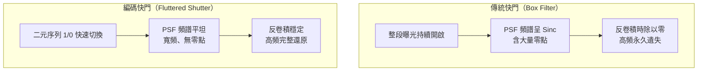

# 第 10 章：編碼成像 (Coded Imaging)

對應講次：Lecture 11
影片主題：
- Coded imaging
對應講義：MITMAS_531F09_lec11_1.pdf、MITMAS_531F09_lec11_2.pdf

## 導讀

你是否曾拍下一張高速移動的汽車，或者對焦失敗的風景，看著模糊的照片懊惱不已？在傳統攝影中，按下快門的瞬間，影像的模糊 (Blur) 似乎是一種「破壞性」的物理過程，將原本清晰的高頻細節永遠抹除。然而，計算攝影學卻給出了不同的答案：模糊不一定是資訊的毀滅，它其實是一場可以被「解開」的數學編碼。本章我們將探討編碼成像 (Coded Imaging) 如何透過改變快門的時間開關 (Fluttered Shutter) 與光圈的空間形狀 (Coded Aperture)，主動將「點擴散函數 (PSF)」工程化，讓那些看似無可救藥的模糊照片，能夠透過計算奇蹟般地還原成銳利影像。

## 核心內容

在傳統相機中，相機的曝光過程相當於在影像上套用一個方形濾波器 (Box filter)。從訊號處理的角度來看，Box filter 在頻域中的頻譜呈現 Sinc function，伴隨著無數的「零點」。這意味著，當我們試圖在後製軟體中進行反卷積 (Deconvolution) 來消除模糊時，將面臨致命的「除以零 (Division by zero)」問題，使得丟失的高頻資訊無法被還原。

Coded Imaging 的突破在於「Engineer the point spread function (PSF)」。如果我們能在曝光的過程中，有策略地控制光線的進入，讓 PSF 在頻域中保持寬頻 (Broadband) 特性而不產生零點，那麼高頻資訊就能被完整保留。

## 原理與系統

編碼成像的三種代表性技術，分別在**時間**、**空間光圈**與**相位**三個層面對點擴散函數動手腳。下圖以「傳統 Box filter 快門」對照「編碼快門」，說明為何前者無法反卷積、後者可以：

1. **時間編碼：Fluttered Shutter（Coded Exposure，Raskar 等人，SIGGRAPH 2006）**
   相較於傳統相機在曝光期間始終開啟快門，Fluttered Shutter 使用 Ferroelectric LCD 液晶在鏡頭前以極快的速度進行二元 (1/0) 切換。這使得移動物體在感光元件上留下的不再是連續的拖影，而是斷續的殘影。這個特定的開關序列經過計算挑選（例如長度 52 的序列有 $2^{52}$ 種可能，需以搜尋找出頻譜最平坦者），其傅立葉轉換在頻域是平坦的 (Flat)。實驗證明，透過這種技術，即便是高速駛過、肉眼與傳統相機皆無法辨識車牌的車輛，也能被反卷積出清晰的數字。

2. **空間編碼：Coded Aperture（Levin 等人，SIGGRAPH 2007）**
   光圈不僅控制進光量，也決定了失焦時的點擴散形狀 (Bokeh)。透過在鏡頭的中心投影點插入特定的二維遮罩（如 7×7 的編碼圖案），失焦的亮點將呈現該遮罩的形狀。這種特殊形狀的 PSF 同樣具備頻域寬頻特性，使得我們能在拍攝後，透過軟體對不同深度的物體進行反卷積，實現事後全幅對焦，甚至反推出深度資訊。

3. **光學與數位共同設計：Wavefront Coding（Dowski 與 Cathey，1995）**
   相較於改變光圈形狀，Wavefront Coding 採用一片特殊的三次方相位遮罩 (Cubic Phase Plate) 來扭曲光線相位。這使得系統的 PSF 在極大的深度範圍內都保持恆定（雖然視覺上是模糊的）。由於模糊程度與深度無關，我們只要套用單一的反卷積演算法，就能還原出具有無限景深的清晰照片。

除了上述三者，本講也延伸介紹了**壓縮感測（Compressive Sensing）**：當影像在某個轉換域（如小波域）是稀疏的，就能以遠少於總像素數的隨機／Hadamard 投影測量重建影像，「單像素相機」即為其代表。但一般自然影像並非完美稀疏，直接套用於單像素相機仍有挑戰。

## 常見誤解

- **為什麼不能用傳統的縮小光圈或提高快門速度來解決？** 
  雖然縮小光圈能增加景深，提高快門能凍結瞬間，但它們都會大幅減少進光量（可能減少到原本的 1/10 甚至更少），導致嚴重的雜訊。Coded Imaging 的優勢在於它僅阻擋了一半的進光量（保留約 50% 光線），卻能達到與高速快門/小光圈媲美甚至超越的清晰度。
- **隨便遮擋快門或光圈就可以嗎？**
  不行。編碼的序列與圖案必須經過嚴密的數學設計，確保其頻譜不含零點且能量分佈均勻。尋找最佳二維編碼甚至需要全新的數學理論 (如 RAT code) 來解決線性卷積帶來的邊界問題。

## 小結

Coded Imaging 完美詮釋了計算攝影的精神：相機不再只是被動地紀錄光線，而是透過硬體的「編碼 (Coding)」與軟體的「解碼 (Decoding)」共同設計 (Co-design)。當我們不再受限於傳統攝影的物理直覺，就能突破光學的極限，將未來的相機推向全新的維度。編碼光圈的空間遮罩概念，與[第 6 章](06-lightfields-2.md)遮罩式光場相機、[第 9 章](09-computational-imaging-survey.md)天文用的 URA/MURA 編碼孔徑一脈相承，都是「以遮罩對光線編碼、再以計算解碼」的同一思路。

## 延伸連結

- [第 6 章 光場（下）](06-lightfields-2.md)：遮罩式光場相機同樣以編碼遮罩調變光線，於頻域解碼。
- [第 9 章 計算成像綜覽](09-computational-imaging-survey.md)：編碼孔徑（URA/MURA）的天文源頭與斷層掃描重建。
- [附錄 動物之眼](appendix-lec10.md)：生物視覺如何以不同光學結構解決成像取捨。
- 術語表：[Coded Aperture](glossary.md#c)、[Fluttered Shutter](glossary.md#f)、[Wavefront Coding](glossary.md#w)、[Deconvolution](glossary.md#d)、[Compressive Sensing](glossary.md#c)。
- 各項技術原始論文年份與出處見[參考資料](references.md)。
