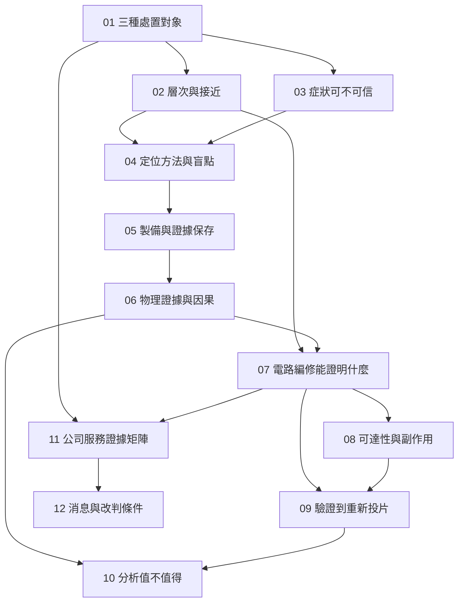

# 全書地圖：把一顆 FAIL 追到一份可改判的證據

全書先沿工程樣品建立症狀、接近路徑、定位與物理證據，再進入電路編修與改版，最後回到公司公開證據。中間不要跳過「驗證」：定位成功、看見異常、編修後功能通過，可能是三件不同的事。

*圖 00-1：實線是閱讀與推理依賴，不表示實驗室必須按章節順序操作。07 是示範章；10 的算例不依賴閎康真實報價。*

| 章 | 讀完要能交出的東西 | 下一步用在哪裡 |
|---|---|---|
| [01](01-failure-and-disposition.md) | 樣品／批次／下一版三欄決策卡 | 避免用同一份報告回答三種問題 |
| [02](02-chip-access.md) | 從封裝到金屬層的接近路徑 | 決定正面或背面、先看哪一層 |
| [03](03-trust-the-symptom.md) | 可重現條件與替代原因表 | 不把接觸誤判送去切片 |
| [04](04-localization.md) | 症狀→方法→盲點矩陣 | 選方法前先知道它看不到什麼 |
| [05](05-sample-preparation.md) | 製備順序與會被毀掉的證據 | 決定何時還能回頭 |
| [06](06-physical-evidence.md) | 因果假設與對照清單 | 不把裂縫直接寫成根因 |
| [07](07-circuit-edit.md) | 編修後「已支持／尚未驗證／不能宣稱」三欄 | 示範全書的結論強度 |
| [08](08-editing-limits.md) | 可達性與副作用對照表 | 判斷這條路走不走得通 |
| [09](09-validation-and-respin.md) | 假設→修改→驗證→改版決策圖 | 分開工程樣品與光罩決策 |
| [10](10-analysis-economics.md) | 可重算的分析／改版取捨 | 決定何時停止追加分析 |
| [11](11-matek-evidence-map.md) | 服務／用途／證據矩陣 | 限定公司主張強度 |
| [12](12-reading-company-news.md) | 事實、推論、未知與改判條件 | 獨立更新未來消息 |

主線是 **01 → 03 → 04 → 06 → 07 → 09 → 11**。02 與 05 是這條線上的幾何與製備前提；08 專門處理編修走不通或走完變了樣；10 把資訊價值算清楚，但不取代品質放行。

## 和既有書系接在哪裡

[昇陽書](../../psi/html/index.html)回答監控晶圓能否再被同一用途接收；本書回答功能異常的產品晶片如何被定位、驗證與改版。矽格書補 CP／FT 的電測脈絡，避免把「測試 FAIL」直接讀成「已經完成失效分析」。CoWoS 書的測試與 KGD 章提供封裝後測試的產業位置，不作本書的技術或公司一手證據。

跨書連結指向同一書庫的建置輸出；本書本身已提供必要概念，未建置其他書也可以依序閱讀。
