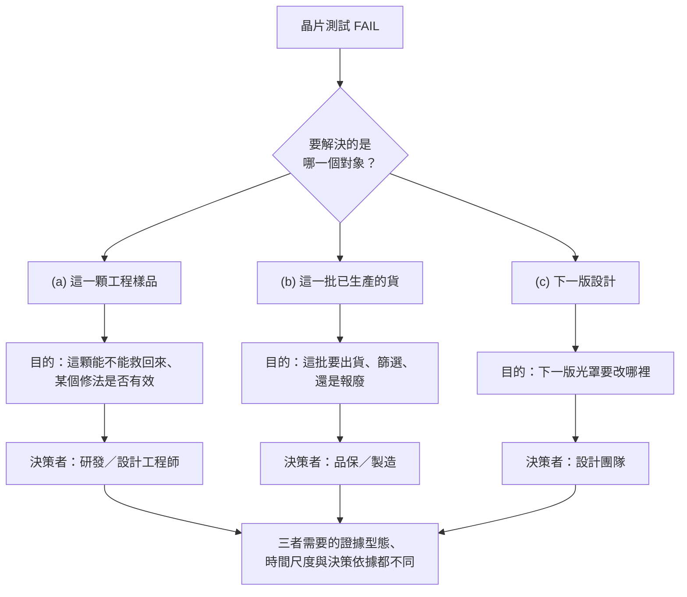

# 01 晶片 FAIL 之後有哪些去向？

## 開場問題

一顆晶片在測試站上 FAIL。工程師把它挑出來，接下來會發生什麼事？

直覺的答案通常只有一個版本：「送去做失效分析，查出原因。」但「FAIL 之後」這句話底下，其實藏著至少三個不同的問題——而這三個問題要的證據、花的時間、甚至誰有權拍板，都不一樣：

1. 這一顆（或這幾顆）工程樣品，能不能救回來？某個修法是否真的有效？
2. 這一批已經生產出來的貨，要不要出、要不要篩選、要不要報廢？
3. 下一版設計或光罩，該往哪個方向改？

如果不先分清楚自己在回答哪一個問題，後面所有的定位、切片、報告，都會做給錯的人看。本章要做的，就是把這三個對象拆開，並把「失效分析」實際能交付的東西，跟大家以為它會交付的東西，對齊。

*照片 01-A：整片圓形工件是晶圓，重複的小區塊是尚未切割的晶粒。測試 FAIL 的是其中一顆（或一批），不是整片自動變成同一種處置。此圖不是閎康或其客戶產品。* [來源與署名](99-image-credits.md#photo-01)

## 三個不同的對象，不是同一件事

| 處置對象 | 要回答的問題 | 決策者 | 需要的證據型態 | 時間尺度 |
|---|---|---|---|---|
| (a) 這一顆工程樣品 | 這顆能不能救回來？某個修法是否有效？ | 研發／設計工程師 | 定位＋物理證據，可能再加電路編修驗證（[第 07 章](07-circuit-edit.md)） | 快，跟著設計迭代走 |
| (b) 這一批已生產的貨 | 這批要出貨、要篩選，還是要報廢？ | 品保／製造，必要時客戶品保 | 抽樣、良率、可靠度推估（可靠度測試用來推算保固內退貨比例，[C6](appendix-sources.md#c6)） | 批次生產與出貨排程尺度 |
| (c) 下一版設計 | 下一版光罩該改哪裡、要不要改版？ | 設計團隊，規模夠大時牽涉法人決策 | 已被驗證支持的根因＋改版後重新驗證 | 一個設計周期 |

三欄之間沒有自動的因果箭頭。一顆樣品被 FIB 編修驗證「改對了」，不能自動代表這一批貨沒問題——單一樣品無法排除批次內的個別差異；也不能自動代表下一版就該照樣改——量產版本的金屬、時序與可靠度條件都不同於編修樣品，這條推理鏈在[第 07 章](07-circuit-edit.md)會拆得更細。反過來也一樣：批次篩選合格，不代表已經找到了根因；根因找到了，也不代表這一批舊貨就能免於報廢。

## FA 交付的是證據，不是修好的產品

閎康官網對故障分析的定義是：「故障分析（Failure Analysis）又稱失效分析，是透過科學方法找出產品失效根本原因的技術，廣泛應用於半導體、電子零件、材料工程、機械結構等產業。」（[C4](appendix-sources.md#c4)）這句定義裡的動詞是「找出」，不是「修好」。

同一個官網的服務地圖，把服務並列分成 RA 可靠度測試、FA 故障分析、MA 材料分析、SA 表面分析、CA 物理化學分析、樣品製備處理、整合性分析等類別（[C1](appendix-sources.md#c1)）。真正會拿工具去改動樣品的 FIB 電路修補服務，被歸在「樣品製備處理」底下（[C2](appendix-sources.md#c2)），不是「FA 故障分析」底下。這不是本書替公司做的區分，是這家公司自己的網站分類，就把「找出原因」和「動手改」放進了不同的資料夾。

這個分類能證明什麼、不能證明什麼要說清楚：能證明閎康公開陳列的服務架構確實把兩件事分開列示，可作為「分析」與「編修」是兩種不同服務的一個具體例子；不能證明業界所有公司都採取相同分類，也不能推出任一類服務的案件量或客戶採用比例——這仍是公司自述的服務目錄，不是經第三方查核的產能報告。

標準的 FA 流程描述也支持同一個結論。業界訓練教材給出的典型順序是：先用非破壞方法（X-ray、SAM）看封裝級證據，再決定是否去封裝，接著逐層去層並搭配電壓對比，直到定位到疑似缺陷層，最後才用 SEM 或 TEM 做物理觀察（[P1](appendix-sources.md#p1)）。這個流程的終點是「用 SEM／TEM 檢視到了什麼」，產出是一份報告，不是一個被修復的元件。

即使流程一路走到動用電路編修（[第 07 章](07-circuit-edit.md)），那也仍然是工程驗證用途，不是修復。設備原廠把這類系統的用途定位在解決「preproduction design flaws」與快速原型（[E6](appendix-sources.md#e6)），而不是量產出貨的修復方案——這一點在[第 07 章](07-circuit-edit.md)的結尾會用更具體的規模對比（幾十顆樣品 vs. 量產規模）再說一次。

## 四個詞，貫穿全書

以下四個詞的區分，是本書從第一章到最後一章反覆使用的骨架，先在這裡定義清楚。

| 詞 | 在本書裡指什麼 | 常見誤用 |
|---|---|---|
| 症狀 symptom | 觀察到的異常本身（某接腳量到漏電、某功能測試 FAIL） | 把症狀直接說成根因（「這個訊號就是缺陷本身」），見[第 03 章](03-trust-the-symptom.md) |
| 定位 localization | 用電性或物理方法把可疑範圍縮小到某個區域或某一層 | 把「定位到某處」當成「已經確定是那裡壞的」，見[第 04 章](04-localization.md) |
| 根因 root cause | 有足夠獨立證據互相支持、真正造成症狀的原因 | 用單一異常結構或單一張訊號圖就宣稱根因已確立，見[第 06 章](06-physical-evidence.md) |
| 驗證 verification | 確認一個假設或修法在特定條件下成立，並清楚寫下未驗證的範圍 | 把「這一顆改完會動了」直接當成「問題已徹底解決」，見[第 07 章](07-circuit-edit.md) |

原廠自己對流程的描述，也把「定位」和「詳細確認」分成兩個階段：電性失效分析負責「narrow down」縮小可疑區域，物理失效分析才是「詳細檢視」（[L2](appendix-sources.md#l2)）——這正是定位與根因之間那道界線的一手依據。業界對根因判定的共識則更直接：找到一個異常結構，不代表已經解釋了它是什麼；最強的根因結論來自多組獨立證據互相支持，而不是單一觀察（[P22](appendix-sources.md#p22)）。這條界線在[第 06 章](06-physical-evidence.md)會有完整的因果判定框架。

## 三種處置對象，一張圖

*圖 01-1：三種處置對象的決策鏈路對照。本圖為本書的教學框架，不是任何公司的內部處置流程；三個分支之間沒有自動互相證明的箭頭。*

## 推理檢查

1. 「這一批貨要不要出」跟「這一顆樣品救不救得回來」，為什麼不能用同一套證據回答？
2. FA 實驗室交付了一份「已定位到某金屬層異常」的報告，這代表樣品已經修好了嗎？
3. 如果目標只是「改善下一版設計」，是否還需要先確認這一顆樣品的症狀可重現？
4. 電路編修（[第 07 章](07-circuit-edit.md)）把一顆樣品修好了，這件事能不能直接證明這一批貨也沒問題？
5. 閎康官網把 FIB 電路修補歸在「樣品製備處理」而不是「FA 故障分析」，這個分類本身能證明什麼、不能證明什麼？

??? note "參考推理"
    1. 因為決策者、決策規模與時間尺度都不同：救一顆樣品要的是深入單一樣品的定位與物理證據；批次出貨決策要的是抽樣統計與良率／可靠度推估，單一樣品的深度證據無法代表整批的分布。
    2. 不代表。定位是縮小範圍，根因需要多組獨立證據支持，驗證則要另外證明某個修法在特定條件下確實有效；報告本身不改變樣品的物理狀態。
    3. 需要。如果症狀本身不可重現（見[第 03 章](03-trust-the-symptom.md)），後面找到的「異常」很可能只是雜訊或量測條件造成的假象，據此改設計等於把資源投在錯誤的方向上。
    4. 不能。單一樣品的編修結果無法排除批次內的個別差異，也無法回答「這批貨裡有多少顆有同樣的問題」。
    5. 能證明的是：閎康公開陳列的服務架構把「分析找原因」與「動手改樣品」列在不同類別下，是這兩件事在實務上確實不同的一個具體例子。不能證明的是：其他公司是否採用相同分類、閎康在哪一類服務上案件量較多，或這個分類反映了任何客戶實績。

## 來源與待查

本章的三欄對照表與四詞骨架是本書設計的教學框架，技術主張的出處見[來源索引](appendix-sources.md)：公司服務分類與 FA 定義（[C1](appendix-sources.md#c1)、[C2](appendix-sources.md#c2)、[C4](appendix-sources.md#c4)、[C6](appendix-sources.md#c6)）；標準 FA 流程順序與定位／根因的兩階段區分（[P1](appendix-sources.md#p1)、[L2](appendix-sources.md#l2)、[P22](appendix-sources.md#p22)）；電路編修的工程驗證定位（[E6](appendix-sources.md#e6)）。

本章刻意留白之處：公開資料未提供任何「批次篩選需要多少樣本數」「多少比例的案件最終走向報廢」之類的數字，這些數字在[來源索引](appendix-sources.md)中也未查到可靠的一手來源，因此本書不編造。閎康官網對可靠度測試與 RMA 的定義，也只到概念層級，沒有提供閎康自己執行過的可靠度案件量或客戶名單。

---

[← 全書地圖](00-map.md) ｜ [02 故障位置藏在哪裡？ →](02-chip-access.md)
