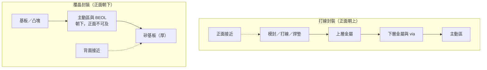

# 02 故障位置藏在哪裡？晶片層次與正背面接近方式

## 開場問題

定位儀器報了一個座標，分析工程師卻說「從這一面進不去」。這不是儀器壞了，是幾何問題：故障可能在封裝裡的打線、凸塊或基板，也可能在晶粒正面的金屬層，或更下面的電晶體。你從哪一面接近，已經決定了你看得到哪一層、會毀掉哪一層。

本章要先把「這顆東西」拆成可以指認的層次，再決定正面、背面或先停在封裝外觀。後續的定位（[第 04 章](04-localization.md)）與電路編修（[第 07 章](07-circuit-edit.md)）都站在這個幾何前提上。

## 工件：封裝不是晶粒，晶粒也不是一層金屬

一顆送到實驗室的樣品，至少要先分成三層來看：

| 層次 | 裡面有什麼 | 常見異常 | 接近方式 |
|---|---|---|---|
| 封裝 | 模封、導線架或基板、打線或凸塊、散熱蓋 | 打線短路、凸塊開路、分層、空洞、異物壓傷 | 外觀、X 光、超音波；多數情況還能保持封裝完整 |
| 晶粒互連（BEOL） | 多層金屬與介電層，負責把電晶體接到焊墊 | 金屬空洞、via 接觸不良、橋接、佈局接錯 | 去封裝後從金屬層側進入，或從矽基板背面往上找 |
| 元件層（FEOL） | 電晶體、閘極、擴散區 | 閘氧漏電、接面漏電、局部製程缺陷 | 通常要穿過互連或從背面穿過矽 |

BEOL 是後段金屬互連，FEOL 是前段元件。兩者的證據由不同方法取得，不能把「看到一層金屬異常」自動讀成「電晶體壞了」，也不能反向推論。

*照片 02-A：打線封裝示意。晶粒正面朝上，金屬線接到導線架；焊墊與上層金屬較容易從正面接近。此圖是功率電晶體封裝的教學素描，不是閎康案件剖面。* [來源與署名](99-image-credits.md#photo-02-wire)

*照片 02-B：覆晶剖面。晶粒正面朝下接到基板，主動區從封裝上方不可及，分析通常改從矽基板背面進入。示意不是任何產品的比例剖面。* [來源與署名](99-image-credits.md#photo-02-flip)

*照片 02-C：開蓋後的打線實物。線、焊墊與晶粒表面都還在；一旦化學去封膠傷到打線，後面就沒有這層證據可看。此圖不是閎康現場。* [來源與署名](99-image-credits.md#photo-02-bond)

封裝形態會改寫這張表。打線封裝把晶粒正面朝上，用金屬線接到導線架或基板，焊墊與上層金屬相對容易從正面接近。覆晶（flip chip）把晶粒正面朝下接到基板，「The top of the die is mounted to the package substrate such that the active region of the flip chip device is inaccessible from the top」（[P24](appendix-sources.md#p24)）。主動區與 BEOL 因此只能從矽基板背面接近。

專利背景裡給了一組例示尺度：基板厚度「may be 700 micrometers (μm), while an active region may be closer to 10 μm」；要從背面探一條線，FIB 必須鑽過這段厚得多的矽，而且「the FIB probe point must be placed very accurately」（[P24](appendix-sources.md#p24)）。700 µm／10 µm 是文中的「may be」，不是所有覆晶產品的規格，只能用來建立數量級：你要穿過的材料，往往比你真正要看的那一層厚一個數量級以上。

## 為什麼正面會越來越難走

金屬層越疊越多，從正面到達下層電路就越難。EAG 把這一點寫成背面編修常態化的理由：「the increased number of metal circuit layers in today's ICs, which makes it harder to reach a lower layer」（[E8](appendix-sources.md#e8)）。同業宜特對 9M+AP 堆疊的對照更具體：正面編修要穿過 AP 到 M5 共 6 層金屬，背面只需穿過一層主動區層（[E4](appendix-sources.md#e4)）。宜特是與閎康各自獨立的上櫃同業，這組數字只作工程說明，不能用來證明閎康的做法。

因此「從哪一面進去」不是風格，是幾何：

- 打線、上層金屬、焊墊：正面較短。
- 覆晶、下層金屬、主動區：背面較短，但要先減薄矽、控制對位。
- 封裝內的打線、凸塊、基板走線：先用 X 光或超音波看，不要一開始就開蓋。

*圖 02-1：兩種封裝的接近路徑示意。箭頭表示結構鄰接，虛線表示分析時的進入方向。本圖為教學整理，不是任何產品的比例剖面；覆晶側的厚度關係見 [P24](appendix-sources.md#p24) 的例示，不能當成通用規格。*

## 先看封裝，還是先開蓋？

標準訓練流程把非破壞檢查放在去封裝之前：若是封裝元件，先用 X 光與超音波掃描看打線、凸塊、空洞或裂縫；「If there is no obvious defect or problem, then the problem most likely lies on the die itself. It makes sense to decapsulate the device」（[P1](appendix-sources.md#p1)）。去封裝之後還要再量一次，確認原來的短路或開路還在——因為製備本身可能改變症狀。

這條順序直接連到[第 05 章](05-sample-preparation.md)：開蓋、去層、切片都會毀掉下一輪還想看的證據。本章只要先記住：**層次判斷錯了，後面所有高解析影像都可能拍在錯誤的面上。**

2.5D／3D 與 HBM 之類的堆疊會再增加一層「你以為在晶粒裡、其實在中介層或微凸塊」的可能。公開的先進封裝檢測文獻指出，X 光可用來檢查堆疊對位與組裝完整性，但越靠近 die 的上層結構越難觀察（[P23](appendix-sources.md#p23)）。本書不把任何堆疊平台寫成閎康的服務範圍；這裡只提醒：接近路徑是工件結構決定的，不是服務清單決定的。

## 閎康的公開證據能支持到哪裡

| 欄位 | 內容 |
|---|---|
| **已確認事實** | 閎康官網在故障分析下列出非破壞性分析（含 SAT、2D／3D X-ray、TDR）與電性故障分析，樣品製備處理下列出去封膠與 FIB 電路修補（[C1](appendix-sources.md#c1)、[C2](appendix-sources.md#c2)、[C12](appendix-sources.md#c12)）。FIB 同時被列為材料分析顯微鏡與電路修補服務（[C3](appendix-sources.md#c3)）。 |
| **合理推論** | 同時列出封裝級非破壞手段與晶粒級 FIB，與本章「先分層次、再選接近面」的閱讀順序相容。電路修補頁把 GDS 導航列為應用，表示公司自述能把圖資對到實體位置（[C2](appendix-sources.md#c2)）。 |
| **尚待查證** | 正面與背面編修實際各做到哪些節點與堆疊；3D X-ray／SAT 的機型與解析條件；任何客戶案件中「從哪一面進去」的紀錄。官網未公開這些，本章也不用同業數字代填。 |

## 推理檢查

1. 為什麼覆晶的主動區不能從「封裝上面」直接看到？
2. 金屬層從四層變成九層以上，對「從正面切到 M1」這件事有什麼影響？
3. X 光沒看到打線異常，能不能直接結論「問題一定在晶粒裡」？
4. 700 µm 的矽與 10 µm 的主動區，這組數字能當成所有覆晶產品的規格嗎？
5. 閎康服務清單同時有 SAT、X-ray 與 FIB，這能證明他們在每個案件都會先做封裝級檢查嗎？

??? note "參考推理"
    1. 因為晶粒正面朝下接到基板，主動區被基板擋住；專利背景把這一點寫成「inaccessible from the top」（[P24](appendix-sources.md#p24)）。
    2. 要穿過的金屬與介電層變多，孔徑、深寬比與誤傷相鄰線的風險都上升，這是背面路徑被選用的結構原因（[E8](appendix-sources.md#e8)、[E4](appendix-sources.md#e4)）。
    3. 不能。傳統 2D X 光對鋁打線、非導電 die attach 與極細特徵可能不可見（[P2](appendix-sources.md#p2)）；沒看到結構異常，也不能排除純電性缺陷。
    4. 不能。那是專利背景的例示（「may be」），只用來說明「要穿過的矽遠厚於要看的那一層」。
    5. 不能。清單證明公司公開提供這些服務項目，不能證明任何案件的實際流程順序或使用比例。

## 來源與待查

層次與接近路徑是本書的教學框架。技術主張見[來源索引](appendix-sources.md)：覆晶必須從背面接近（[P24](appendix-sources.md#p24)）；金屬層數使正面變難（[E8](appendix-sources.md#e8)、[E4](appendix-sources.md#e4)）；非破壞檢查先於去封裝（[P1](appendix-sources.md#p1)、[P2](appendix-sources.md#p2)）；先進封裝觀察限制（[P23](appendix-sources.md#p23)）。公司服務分類見 [C1](appendix-sources.md#c1)–[C3](appendix-sources.md#c3)、[C12](appendix-sources.md#c12)。

尚缺一篇完整比較「哪些證據只能從哪一側取得」的權威綜述；2.5D／3D 在閎康案件中的實際接近路徑也未公開。這兩項列入[待查問題](appendix-open-questions.md)。

---

[← 01 失效之後的三種去向](01-failure-and-disposition.md) ｜ [03 症狀可不可信 →](03-trust-the-symptom.md)
