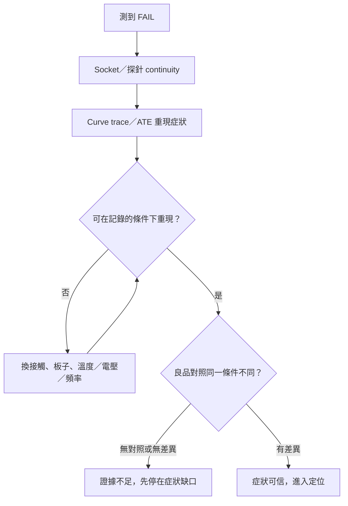

# 03 這個異常可不可信？接觸、條件與對照

## 開場問題

測試程式亮紅燈。有人立刻說「送去做失效分析」。更常見、也更貴的錯誤是：把一次測到的 FAIL，直接當成晶片裡已經有一個缺陷。產業訓練把順序寫反過來：「one must be able to first reproduce the electrical failure mode, and second develop a simplified electrical test」（[S4](appendix-sources.md#s4)）。**先重現，再簡化，才進入定位與切片。**

本章要排除的，不是「晶片不可能壞」，而是三種會讓後面所有影像失去意義的替代原因：接觸沒接上、測試條件不對、以及你拿來比較的基準本身就不一樣。

## 第一步：在 socket 上確認連通，再用 I-V 對上症狀

Curve tracing（I-V）是失效分析初期常用的電性確認：對腳位掃電壓、看電流，用來「confirm the failure symptoms」，例如 IDDQ 或待機電流異常（[S1](appendix-sources.md#s1)）。同一套教材要求：**IC 放進 socket 之後，先檢查腳位 continuity**（[S1](appendix-sources.md#s1)、[S2](appendix-sources.md#s2)）。連通都沒有，後面的「開路」可能只是沒碰到。

*照片 03-A：探針台外觀。接觸、對位與腳位連通都發生在這類平台上；接觸沒接上，後面的「開路」可能只是沒碰到。此圖是 Micromanipulator 機台，不是閎康設備。* [來源與署名](99-image-credits.md#photo-03)

Bench 上的 curve trace 可以補足 ATE，或在沒有 ATE 時暫代（[S2](appendix-sources.md#s2)）。它也常用來當破壞性步驟之後的監視器：每去一層、每開一次蓋，再量一次，看症狀是不是被分析過程改掉了（[S1](appendix-sources.md#s1)）。這與[第 05 章](05-sample-preparation.md)的「去封裝後重測」是同一條紀律。

閎康官網把電性量測寫成故障分析流程的「第一」步，目的是「驗證並量化」I-V、C-V 與關鍵參數，並縮小後續破壞性分析的範圍；並自述提供 chip-level 硬針／軟針與 probe station（[C21](appendix-sources.md#c21)）。這是公司對自己流程起點的陳述，不是「症狀一旦量到就可信」的保證。

## 接觸本身就會製造假失效

生產測試的 socket 是 DUT 與測試機之間最關鍵的連接之一。鍍層氧化與微粒堆積會讓接觸電阻上升，「cause intermittent to full contact failure」；這段串聯電阻還可能在大電流下造成額外損傷（[S7](appendix-sources.md#s7)）。這是測試設備商的維護文獻，**與閎康無關**，場景是產線 socket 而不是 FA 探針台。它能支持的主張只有一層：接觸界面可以讓測試結果不可信，必須被當成候選解釋，而不是默認「紅燈＝晶粒缺陷」。

閎康自己的奈米探針頁把同一類問題寫進實驗室尺度：接觸阻抗、樣品氧化、電子束電荷累積與通道漂移「進而影響量測判讀」；AFM 探針頁並把「元件誤判」與接觸力、氧化並列（[C22](appendix-sources.md#c22)、[C23](appendix-sources.md#c23)）。官網承認誤判機制存在，不能反過來證明閎康案件不會誤判。

探針本身也會傷樣品。「Care must be taken at all times not to damage the IC with the probes.」（[S3](appendix-sources.md#s3)）接觸太重，你量到的可能是你自己造成的開路。

## 實驗室通過、現場卻故障：先換條件，不要先切片

「No trouble found／找不到失效原因」在半導體元件層級有公開討論，不是只有整機保修才會遇到。一份 2014 年的汽車電子供應鏈指引把 NTF 定義為「kein Ausfallgrund gefunden / No-Trouble-Found」，並把「Reproduction of failure on appropriate test bench」列進流程（[S6](appendix-sources.md#s6)）。指引與閎康無關，也不能當閎康 SOP。

其中兩個公開案例足夠說明條件有多關鍵：

| 案例（[S6](appendix-sources.md#s6)） | 標準 ATE／curve trace | 後來改了什麼 | 結案 |
|---|---|---|---|
| 五顆退回件，ATE 與 bench 全過 | Tests good, NTF | 依客戶電路重做測試板，輸出突波其實在 datasheet 內；客戶篩選超出規格 | 零件判定 i.O.（符合規格） |
| 室溫 ATE 與 I-V 無異常 | NTF | 用客戶設定做 125 °C 到 −40 °C 溫度掃描，低溫才見輸出異常 | 零件判定 n.i.O.；根因寫成隨機 fab 缺陷 |

同一份 ATE「全過」，一個結案是客戶條件超出規格，一個結案是低溫才看得到的真實失效。**室溫 curve trace 通過，不能結束調查，也不能開始切片。** 本書未取得晶片 FA 專論的 NTF 比例統計，因此不引用任何百分比。

還有一類「時好時壞」發生在電壓–頻率邊界。設備原廠把 DALS 寫成：在 LSI tester 驅動下，用雷射刺激讓 pass/fail 翻轉，影像指出造成 timing delay 或 marginal defect 的位置；分析是在「boundary」條件下做的（[S14](appendix-sources.md#s14)）。實驗室若只在遠離邊界的條件測，現場的 soft fail 會消失。這與[第 04 章](04-localization.md)的 LADA／SDL 相接：那些方法找的是時序敏感位置，前提仍是症狀能在邊界條件下重現。

## 對照：同一節點、同一電性狀態

判斷一個內部節點是不是「錯的」，常用作法是在同一電性狀態下探良品的同一節點。「If possible, placing the two ICs side by side under the same probe station will help facilitate this process.」（[S3](appendix-sources.md#s3)）第三方實驗室也把 curve tracing 的用途寫成「Comparing failing devices against known-good units」（[S8](appendix-sources.md#s8)）。沒有對照時，你只知道「這顆現在這樣」，不知道「本來應該怎樣」。

## 證據與替代原因

| 候選解釋 | 若為真會看到 | 先做什麼 |
|---|---|---|
| H1：晶粒或封裝真有缺陷 | 固定條件可重現；對照樣品不同 | 才進入[第 04 章](04-localization.md) |
| H2：接觸不良（socket、探針、氧化、腳位） | 重插、換座、continuity 後症狀改變 | 先修接觸，不要開蓋 |
| H3：測試程式、板子、激勵沒進去 | 換板或換程式後症狀改變 | 對照板、對照程式 |
| H4：條件不同（溫度、電壓、頻率、負載） | 只在邊界或客戶條件下出現 | 重建現場條件再量 |
| H5：客戶規格嚴於 datasheet | 供應商測好、客戶測壞，但行為在規格內 | 對規格，而不是對「有沒有缺陷」 |

*圖 03-1：症狀可信度檢查。本圖為教學框架，不是閎康或任何實驗室的 SOP。*

## 閎康的公開證據能支持到哪裡

| 欄位 | 內容 |
|---|---|
| **已確認事實** | 官網將電性量測列為 FA 第一步，並提供 I-V／C-V、probe station 與奈米探針；奈米探針頁明文提到接觸阻抗、氧化、電子束造成誤判的可能，以及 −40 °C 至 150 °C 溫控量測（[C21](appendix-sources.md#c21)–[C23](appendix-sources.md#c23)）。 |
| **合理推論** | 公司把「第一步做電性」與「條件會造成誤判」寫進服務頁，與本章「先重現再破壞」的閱讀順序相容。 |
| **尚待查證** | 閎康如何處理不可重現的案件、NTF 結案標準、curve trace 與 ATE 的實際使用比例。官網未出現 NTF／CND 用語。 |

## 推理檢查

1. 為什麼「ATE 全過」仍可能不是「元件沒問題」的終點？
2. Continuity 沒過時，下一步應該切片還是換接觸？
3. 良品對照缺失時，最誠實的句子是什麼？
4. 閎康官網寫電性量測是第一步，這能證明每個案件都會先做 curve trace 嗎？
5. 把生產測試 socket 氧化的文獻寫進本章，能證明什麼、不能證明什麼？

??? note "參考推理"
    1. 因為測試條件可能與現場不同：客戶板超出 datasheet，或低溫才出現異常（[S6](appendix-sources.md#s6)）。
    2. 換接觸。連通不成立時，開路可能是沒碰到（[S1](appendix-sources.md#s1)、[S7](appendix-sources.md#s7)）。
    3. 「此顆在此條件下測得異常；未知良品同一條件是否亦然。」
    4. 不能。那是服務介紹的流程定位，不是案件紀錄。
    5. 能證明接觸電阻可以讓測試結果不可信；不能證明閎康的 socket 或探針台有此問題，也不能把產線 socket 等同 FA 探針台（[S7](appendix-sources.md#s7)）。

## 來源與待查

重現與 curve trace：[S1](appendix-sources.md#s1)–[S5](appendix-sources.md#s5)、[S8](appendix-sources.md#s8)。元件級 NTF 與溫度／客戶板：[S6](appendix-sources.md#s6)。接觸電阻：[S7](appendix-sources.md#s7)。電壓–頻率邊界：[S14](appendix-sources.md#s14)。閎康電性與奈米探針：[C21](appendix-sources.md#c21)–[C23](appendix-sources.md#c23)。

IEEE ITC 的 ASIC 層級 NTF 全文、ISTFA 的 SDL 全文、JEDEC JEP-134 全文本次未取得，因此不引用其中數字。閎康未公開 NTF 比例。缺口見[待查問題](appendix-open-questions.md)。

---

[← 02 晶片的層次與接近方式](02-chip-access.md) ｜ [04 定位方法與盲點 →](04-localization.md)
