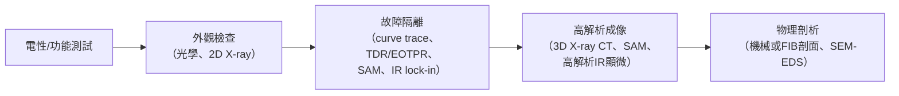

# 04 如何縮小範圍？不同電性定位方法的可見與不可見

## 開場問題

樣品的待機電流（IDDQ）異常升高，或者某個腳位量到不該有的開路、短路。晶片裡有數億顆電晶體，你不可能把每一顆都拆開看一遍。第一步永遠是**電性定位**：在盡量少破壞樣品的前提下，把「可能出問題的位置」從整顆晶片縮小到幾十微米、甚至幾微米的範圍。

但這一章要先破除一個直覺：定位方法不是「有沒有調好」的操作問題，而是**每一種方法天生只能看見特定的物理量**。你選哪一種方法，就已經先決定了你看得到什麼、看不到什麼。搞錯這一點，最常見的後果是：儀器沒有訊號，就被解讀成「這裡沒有缺陷」——但更誠實的說法可能是「這種缺陷這台儀器原理上看不到」。

## 一個共同的骨架

本章逐一檢視的每種方法，都可以拆成四個問題來看：

1. 它量的是**什麼物理量**（光子、電阻變化、時序邊界、聲波、X 光吸收……）？
2. 需要**什麼樣品狀態與偏壓條件**才量得到？
3. 看得到什麼？
4. **盲點**是什麼——哪一類真實存在的缺陷，這個方法原理上就看不到？

前備讀者需要先確認症狀可重現（見[第 03 章](03-trust-the-symptom.md)）、並理解晶片的正背面接近方式（見[第 02 章](02-chip-access.md)），本章才有意義：定位方法找到的位置，最終要交給[第 05 章](05-sample-preparation.md)的製備流程去物理驗證。

## 光輻射顯微：EMMI／PEM

EMMI（Emission Microscopy）量的是**光子**。原理鏈很直接：「Electrically stimulate the IC → A semiconductor structure emits photons → A sensitive optical detector collects the emission.」（[L7](appendix-sources.md#l7)）發光機制分兩類：一類是復合發光（電子電洞在 p-n 接面復合放出能量），另一類是場助發光（高場區載子加速後散射放出光子）（[L7](appendix-sources.md#l7)）。

**矽穿透波長的取捨**：低操作電壓元件發出的光越來越微弱，波長也越長，需要對 900 nm 以上近紅外有高靈敏度的偵測器（[L1](appendix-sources.md#l1)）。要做背面觀測，必須靠近紅外光穿透矽基板，但「optical resolution gets worse at longer wavelengths」（[L1](appendix-sources.md#l1)）——這是一個結構性的取捨，波長越長越能穿透矽，解析度就越差。業界靠**固體浸液鏡頭**（solid immersion lens）局部補償：讓半球形鏡頭直接貼觸矽基板背面，利用矽本身的折射率提高數值孔徑，原廠規格宣稱在特定鏡頭（NA 3.1／3.3）下可做到「sub-micron level of spatial resolution」的背面分析（[L1](appendix-sources.md#l1)）。這是特定機型在特定條件下的規格數字，不代表所有背面 EMMI 系統的通用能力。

**最重要的盲點**：不是每一種失效機制都會發光。第三方失效分析實驗室 iST 的服務頁明確寫出：「Ohmic short and Metal short」不產生光點；「Buried Junctions and Leakage sites under metals」則因為發出的光被上層金屬遮蔽，即使原理上會發光也看不到（[L16](appendix-sources.md#l16)）。也就是說，**純歐姆性短路與金屬短路，EMMI 天生看不到**——這不是機台不夠靈敏，而是這類缺陷根本不涉及載子復合或高場效應，沒有光子可收。

!!! note "關於 iST 的引用"
    iST 宜特科技是與閎康各自獨立的上櫃同業，不是閎康的關係企業。引用其技術文章只作一般工程說明，不能用來推論閎康的能力或做法。

## IR-OBIRCH

OBIRCH（Optical Beam Induced Resistance Change）量的是**雷射局部加熱造成的電阻變化**。標準做法是對元件施加固定電壓，掃描雷射並量測電流變化；CC-OBIRCH 則反過來，施加固定電流、監測電壓變化（[L4](appendix-sources.md#l4)）。「A resistance change is useful only when it affects an electrically active path」，且需要「Optical Access」——雷射照得到的地方才量得到（[L4](appendix-sources.md#l4)）。這代表被上層金屬或封裝結構遮蔽的區域，OBIRCH 原理上碰不到。過高的雷射功率還可能改變或損壞樣品本身（[L4](appendix-sources.md#l4)），是需要控制的條件之一，也是製造假訊號或永久改變樣品狀態的風險來源。

**盲點**：OBIRCH 對「主要依賴內部數位切換、時序或臨界邏輯行為」的缺陷無效（[L4](appendix-sources.md#l4)）——這正是後面 LADA／SDL 存在的理由：兩者互補，不是二選一。

*照片 04-B：SEM 看到的金屬線電遷移失效位置。這類開路／空洞是 OBIRCH 常見的候選對象；影像本身仍只是定位後的物理觀察，還不能單獨當根因。此圖不是閎康案件。* [來源與署名](99-image-credits.md#photo-04-em)

閎康官網的 IR-OBIRCH 頁面自述：「IR-OBIRCH（InfraRed Optical Beam Induced Resistance Change）是透過紅外雷射掃描 IC 表面（或背面），藉由局部加溫引發電阻變化，進而偵測異常導通或漏電位置的非破壞性失效分析技術」，並列出設備平台名稱與波長約 1340 nm（[C8](appendix-sources.md#c8)）。這是公司自述的服務範圍與設備名稱，不能推出成功率或案件量，頁面也未說明門檻與阻值範圍適用於哪些節點（[C8](appendix-sources.md#c8)）。

## 熱式雷射刺激：TIVA

TIVA（Thermally Induced Voltage Alteration）鎖定的是**電氣短路**，操作方式與 OBIRCH 相反：「biased using a constant current source, and the power supply pin voltage is monitored for changes」（[L5](appendix-sources.md#l5)）。雷射局部加熱改變短路點的電阻，進而改變供電腳的電壓——「localized heating occurs. This heating changes the resistance of the short, resulting in a change in power consumption」（[L5](appendix-sources.md#l5)）。

把 OBIRCH 與 TIVA 並排看，偏壓條件的差異就是它們分工的原因：OBIRCH 定壓測電流、對開路類異常（電遷移造成的空洞）敏感，因為「thermal transmission is impeded, resulting in a larger change in resistance」（[L5](appendix-sources.md#l5)）；TIVA 定流測電壓、對短路敏感。同一組雷射熱刺激技術家族裡，還有針對浮接導體的 SEI（Seebeck Effect Imaging）與針對阻抗事件的 XIVA（[L5](appendix-sources.md#l5)），但本書不逐一展開,只需記住:**選哪一種模式,取決於你懷疑的是開路還是短路,以及被測節點是否浮接**。

## 鎖相熱影像：LIT

LIT（Lock-in Thermography）的原理是週期性地對元件施加偏壓，用紅外相機同步量測表面溫度的週期性變化：「Heat is periodically introduced by applying a pulsed bias to the device. The surface temperature is periodically measured with an IR camera.」定位方式是「amplitude for the x-y location and phase to determine the z location」（[L18](appendix-sources.md#l18)）——振幅決定平面位置,相位決定深度,這是 LIT 能做「深度」定位而非只有平面座標的物理基礎。原廠說明鎖相方式相較於非鎖相的穩態熱影像有更好的訊噪比、靈敏度與空間解析度（[L18](appendix-sources.md#l18)),但**未給出具體數字**。

閎康官網的 Thermal EMMI 頁面自述使用高靈敏度 InSb 紅外偵測器搭配鎖定放大技術,設備平台為 Thermo ELITE 與 HAMAMATSU THEMOS mini(合理推論其技術性質屬於鎖相熱影像/紅外熱輻射偵測的家族)([C7](appendix-sources.md#c7))。

!!! warning "本書刻意不採用的數字"
    坊間流傳 LIT 或熱點定位技術可達「低於 1 mK」甚至更細的溫度解析度,包括閎康官網頁面上的類似敘述。但本書查核時,無論是原廠頁面([L18](appendix-sources.md#l18))或公司頁面([C7](appendix-sources.md#c7))都**沒有附上量測條件**——是哪一款相機、多少次疊圖、何種偏壓頻率下量到的數字。缺了條件的靈敏度數字沒有意義,本書因此不採用任何具體的 LIT 溫度或功率靈敏度數字,只描述其原理與相對優勢。這一點在章末會再次說明。

## 電子束式：EBIRCH／EBAC／EBIC

這一組方法把探測手段從光子、雷射換成**電子束**,代價是需要更深的破壞性前處理。「EBIC and EBAC both take advantage of the interaction between the SEM electron beam and the device-under-test」([L9](appendix-sources.md#l9))：

- **EBIC**：奈米探針接觸 p-n 接面,量測電子束在接面誘發的**感應電流**,可用於定量接面特性(如擴散長度)([L9](appendix-sources.md#l9))。
- **EBAC**：電子束掃描時向金屬線下方注入電荷,經探針量測**吸收電流**([L9](appendix-sources.md#l9))。
- **EBIRCH**：電子束局部加熱改變缺陷電阻,「The EBIRCH map displays the change in current as a function of the e-beam position」([L11](appendix-sources.md#l11))。

三者的掃描視野與偵測範圍在兩個獨立來源中互相印證：可掃描 1 mm×1 mm 到縮放至 50 nm×50 nm,可偵測電阻範圍從小於 10 Ω 到大於 50 MΩ([L9](appendix-sources.md#l9)、[L11](appendix-sources.md#l11))。**代價是樣品前處理**：需要去層(delayering)、探針與元件清潔、奈米探針直接物理接觸金屬線兩端([L9](appendix-sources.md#l9)、[L10](appendix-sources.md#l10)、[L11](appendix-sources.md#l11))——這已經不是非破壞方法,而是屬於[第 05 章](05-sample-preparation.md)討論的破壞性前處理範圍。

**EBIRCH 訊號可能不是你以為的那個訊號。** 這是本書「訊號≠根因」最強的一手實驗證據。Imina 的應用筆記針對一顆 180 nm PMOS 電晶體的閘極氧化層漏電案例做了完整的對照實驗：同一個缺陷點,在不同偏壓極性、不同加速電壓、不同溫度下,訊號的位置、形狀甚至正負號都會改變。「the observed spot changed its location, shape, and the current range」;把偏壓從 -1.5 V 掃到 0 再到 1.5 V,「the current at the defect site changes its sign/contrast from white to black corresponding to the bias polarity」;升溫到 150°C,「the defect active area has significantly increased」,而且降溫後可逆,「implies that the observed effects are temperature-driven」([L10](appendix-sources.md#l10))。結論是:單一張影像上的訊號,可能同時混雜 EBIRCH(電阻變化)、EBIC(電子束誘發電流)、EBAC 類的吸收電流對比、Seebeck 效應、功函數溫度效應等至少四種不同物理機制,「data interpretation must be based on a range of bias voltages」才能分辨([L10](appendix-sources.md#l10))。這個實驗只涵蓋單一元件的單一案例,溫度與偏壓的具體數值不可泛化,但它示範的方法論——**不對條件掃描,就無法分辨訊號來源**——適用於所有電子束定位方法。

## LADA／SDL：找的是時序邊界,不是永久缺陷

LADA(Laser-Assisted Device Alteration)與 SDL(Soft Defect Localization)處理的是「時好時壞」的症狀。做法是先把電路操作條件(電壓、頻率)調整到剛好在 pass/fail 交界:「adjusted to place the device into a state which borders on a pass–fail or fail–pass transition」,再用雷射(範例波長 1340 nm)局部照射,觀察哪個位置的照射會讓電路翻轉狀態([L6](appendix-sources.md#l6)、[L13](appendix-sources.md#l13))。

這與 OBIRCH/TIVA 的偏壓邏輯根本不同：OBIRCH/TIVA 找的是**靜態偏壓下持續性的電阻/電流異常**;LADA/SDL 找的是**動態時序邊界上,雷射能推它一把的位置**。而且這個效應是暫態的:「This photocurrent is a temporary effect and only occurs during the time that the laser is stimulating the target region」([L13](appendix-sources.md#l13))。

**這一點必須說清楚**：LADA/SDL 找到的翻轉位置,是「對時序邊界敏感的位置」,不代表該位置本身就是永久性物理缺陷所在——它可能只是時序路徑上恰好接近邊界的正常電晶體([L13](appendix-sources.md#l13))。另外,NMOS 與 PMOS 受光電流影響的方向相反(NMOS 導通、PMOS 降低閾值電壓),判讀翻轉圖之前必須先知道被照射的是哪一種電晶體,否則容易誤判方向([L13](appendix-sources.md#l13))。這條限制會在[第 06 章](06-physical-evidence.md)再次出現:定位到一個訊號,永遠只是因果鏈的一環,不是終點。

## 封裝層級先行手段：TDR、curve trace、X-ray、SAM

在開蓋去層之前,還有一組**不需要接觸晶片本身**的封裝級手段。一份收錄於 ZEISS 技術彙編、原發表於 ICSJ 2022 的失效分析標準流程圖把順序畫得很清楚:

*圖 04-1：業界公開發表的標準工作流程,非破壞手段全部排在物理剖析之前（[L17](appendix-sources.md#l17)）。*

**TDR**（Time Domain Reflectometry）用快速電性步階訊號經電纜、探針、治具送進待測物,量反射訊號的時間延遲與極性:開路對應正極性反射,短路對應負極性反射（[L14](appendix-sources.md#l14)）。常被誤解的一點是解析度公式;實際上「when measuring a single discontinuity, TDR can achieve 1/10 to 1/5 the rise time」,在 FR4 材料上可達「5ps or less than 1mm」等級——但這個數字的條件是**單一已知不連續點、FR4 材料、特定上升時間系統**,不能脫離條件泛化（[L14](appendix-sources.md#l14)）。

**TDR 最重要的限制**：如果封裝走線在中途分支,「the TDR instrument shows the sum of all reflection from all the N legs in the split, but cannot separate which reflection came from which leg」（[L15](appendix-sources.md#l15)）。也就是說,對現代封裝常見的扇出(fan-out)、多顆凸塊並聯結構,TDR 只能告訴你「這一組分支合起來有異常」,無法指出是哪一條分支。它仍能透過與已知良品的波形比對(signature analysis)偵測「軟性失效」(部分短路/部分開路)（[L15](appendix-sources.md#l15)),但分支拓撲的解析限制是原理性的,不會因為換更貴的儀器而消失。

**X-ray** 靠密度與原子序造成的吸收對比成像,可偵測 die-attach 空洞、打線斷裂、焊料空洞/橋接/開路、BGA 界面分離等結構性異常([L8](appendix-sources.md#l8))。傳統 flat-panel micro-CT 解析度約 2–10 µm(依樣品尺寸與材料而定),新一代 3D XRM 系統可達 0.45 µm(特定機型與掃描條件下)([L17](appendix-sources.md#l17));較舊的 2D radiography 標準把可偵測異物尺寸下限訂在約 0.025 mm(25 µm),且明確指出鋁打線、非導電 die attach 介質、極細特徵可能不可見([P2](appendix-sources.md#p2))。

*照片 04-A：電路板 X 光。金屬走線與焊點有對比，有機材料幾乎透明。沒有伴隨結構改變的純電性缺陷，X 光原理上看不到。此圖是 PCB，不是閎康的 IC 案件。* [來源與署名](99-image-credits.md#photo-04-xray)

**X-ray 最重要的限制**：「Electrical Defects Without Structural Change」——沒有伴隨結構改變的純電性缺陷,X-ray 原理上看不到([L8](appendix-sources.md#l8))。這條限制直接呼應本章開頭的提醒:儀器沒訊號,不等於沒缺陷。

**SAM**（Scanning Acoustic Microscopy）靠聲波偵測界面分層、空洞、裂縫,一般引用的缺陷解析度約 5 µm([P3](appendix-sources.md#p3))。**X-ray 與 SAM 是互補而非可互換的關係**：在密集金屬化區,X-ray 對比弱、SAM 較不受影響;但遇到密封空腔,聲波無法穿透、X-ray 卻不受影響([P4](appendix-sources.md#p4))。同一份 ZEISS 彙編裡也有 CSAM 單獨無法判斷缺陷確切界面層、需要搭配 3D XRM 才能釐清的案例([L17](appendix-sources.md#l17))——這其實已經是「定位到異常 ≠ 知道異常確切在哪一層」的封裝級示範,[第 06 章](06-physical-evidence.md)會把這個邏輯延伸到晶片級的根因判定。

## 症狀 → 候選方法 → 盲點

以下矩陣只填有一手來源支持的格子,查不到可靠依據的格子照實寫「待查」,不代替讀者猜答案。

| 觀察到的症狀 | 候選定位方法 | 已知盲點／限制 |
|---|---|---|
| 待機電流異常升高(IDDQ),正面可探針 | EMMI／PEM（[L1](appendix-sources.md#l1)、[L7](appendix-sources.md#l7)、[L16](appendix-sources.md#l16)）;OBIRCH（[L1](appendix-sources.md#l1)、[L4](appendix-sources.md#l4)） | EMMI 對不發光的純歐姆/金屬短路看不到（[L16](appendix-sources.md#l16)）;OBIRCH 需光學可及,雷射功率過高可能損壞樣品（[L4](appendix-sources.md#l4)） |
| 懷疑漏電位置被上層金屬或覆晶基板遮蔽 | 背面 EMMI + 固體浸鏡（[L1](appendix-sources.md#l1)）;背面 IR-OBIRCH（[L1](appendix-sources.md#l1)、[L3](appendix-sources.md#l3)） | 矽穿透波長越長、解析度越差（[L1](appendix-sources.md#l1)、[L7](appendix-sources.md#l7)）;被金屬遮蔽的埋藏接面仍可能偵測不到光（[L16](appendix-sources.md#l16)） |
| 特定頻率/電壓邊界附近時好時壞 | LADA／SDL／DALS（[L1](appendix-sources.md#l1)、[L6](appendix-sources.md#l6)、[L13](appendix-sources.md#l13)） | 找到的是時序敏感位置,不必然是永久物理缺陷;需先知道電晶體類型才能判讀翻轉方向（[L13](appendix-sources.md#l13)） |
| 疑似金屬線電遷移斷路(開路) | 正面 OBIRCH（[L4](appendix-sources.md#l4)、[L5](appendix-sources.md#l5)）;EBAC(需去層+奈米探針)（[L9](appendix-sources.md#l9)、[L11](appendix-sources.md#l11)） | OBIRCH 對純數位時序類缺陷無效（[L4](appendix-sources.md#l4)）;EBAC 需破壞性前處理（[L9](appendix-sources.md#l9)、[L11](appendix-sources.md#l11)） |
| 已知短路,開蓋前先縮小範圍 | TIVA（[L5](appendix-sources.md#l5)）;LIT（[L18](appendix-sources.md#l18)、[C7](appendix-sources.md#c7)）;封裝級 TDR／curve trace（[L14](appendix-sources.md#l14)、[L15](appendix-sources.md#l15)、[L17](appendix-sources.md#l17)） | TDR 對分支走線無法分辨個別分支貢獻（[L15](appendix-sources.md#l15)）;LIT 靈敏度數字未核實量測條件,本書不採用（見上節） |
| 電性異常疑似封裝級問題,尚未確定 wire bond/bump/基板 | curve tracing、TDR/EOTPR、SAM/C-SAM、2D/3D X-ray（[L17](appendix-sources.md#l17)、[L8](appendix-sources.md#l8)、[L14](appendix-sources.md#l14)、[L15](appendix-sources.md#l15)） | X-ray 對純電性、無結構改變的缺陷看不到（[L8](appendix-sources.md#l8)）;C-SAM 可偵測到異常但未必能判斷精確界面層（[L17](appendix-sources.md#l17)） |
| EBIRCH/EBAC 定位出一個訊號點,不確定是否為真缺陷 | 以不同偏壓極性、加速電壓、溫度重複量測比對（[L10](appendix-sources.md#l10)） | 同一位置可能混雜 EBIRCH、EBIC、EBAC、Seebeck 效應、功函數溫度效應等多種訊號,單一張影像無法區分（[L10](appendix-sources.md#l10)） |
| 送修後在實驗室測試「正常」,現場卻回報故障(NTF/CND) | 先重建條件：客戶測試板、溫度掃描、電壓–頻率邊界（見[第 03 章](03-trust-the-symptom.md)、[S6](appendix-sources.md#s6)、[S14](appendix-sources.md#s14)） | 室溫 ATE＋curve trace 通過不能結束調查；本書未取得晶片 FA 的 NTF 比例統計，不引用百分比 |

## 推理檢查

1. EMMI 對某個懷疑漏電的節點完全沒有偵測到光點,可以直接下結論「這裡沒有缺陷」嗎？
2. LADA 讓某個位置的雷射照射造成電路從 fail 翻轉成 pass,這代表那個位置一定有永久性物理缺陷嗎？
3. 為什麼 TDR 量到一組分支走線的阻抗異常,卻不能指出是哪一條分支造成的？
4. EBIRCH 影像上同一個缺陷點,在不同偏壓極性下訊號正負號相反,這代表什麼，又不代表什麼？
5. X-ray 在封裝結構上完全沒看到異常,可以排除封裝內部存在電性缺陷嗎？

??? note "參考推理"
    1. 不行。EMMI 的物理機制要求缺陷發光,純歐姆短路、金屬短路,以及被上層金屬遮蔽的埋藏接面都不發光或看不到光([L16](appendix-sources.md#l16))。沒有訊號時,更誠實的說法是「這種特定缺陷類型,這個方法原理上看不到」,而不是「沒有缺陷」。
    2. 不一定。LADA 的翻轉是暫態光電流把電路推過時序邊界造成的,找到的是「對時序邊界敏感的位置」,可能只是路徑上恰好接近邊界的正常電晶體([L13](appendix-sources.md#l13))。要確認是否為永久缺陷,還需要物理證據佐證(見[第 06 章](06-physical-evidence.md))。
    3. 因為 TDR 儀器量到的是所有分支反射訊號的加總,原理上無法分辨每一條分支各自貢獻多少([L15](appendix-sources.md#l15))。要分辨,得靠額外的電路拓撲資訊或逐一斷開分支重新量測。
    4. 代表電流方向與所施加偏壓的極性有直接關係,這是判斷訊號來源(而非單純判斷「有沒有缺陷」)的重要線索([L10](appendix-sources.md#l10))。但它不能單獨告訴你這是 EBIRCH、EBIC 還是 EBAC 訊號——必須搭配溫度與加速電壓的掃描才能分辨機制。
    5. 不行。X-ray 對沒有伴隨結構改變的純電性缺陷原理上看不到([L8](appendix-sources.md#l8))。沒看到異常影像特徵,只能排除「有明顯結構性異常」,不能排除純電性、無結構改變的缺陷存在。

## 來源與待查

本章的矩陣表與方法分類是本書的編排,技術主張全部帶一手來源:光輻射顯微與矽穿透波長取捨（[L1](appendix-sources.md#l1)、[L7](appendix-sources.md#l7)、[L16](appendix-sources.md#l16)）;OBIRCH（[L4](appendix-sources.md#l4)、[L1](appendix-sources.md#l1)、[C8](appendix-sources.md#c8)）;TIVA 與熱雷射刺激家族（[L5](appendix-sources.md#l5)）;LIT（[L18](appendix-sources.md#l18)、[C7](appendix-sources.md#c7)）;電子束式定位（[L9](appendix-sources.md#l9)、[L10](appendix-sources.md#l10)、[L11](appendix-sources.md#l11)）;LADA／SDL（[L6](appendix-sources.md#l6)、[L13](appendix-sources.md#l13)）;封裝層級先行手段（[L14](appendix-sources.md#l14)、[L15](appendix-sources.md#l15)、[L8](appendix-sources.md#l8)、[P2](appendix-sources.md#p2)、[P3](appendix-sources.md#p3)、[P4](appendix-sources.md#p4)、[L17](appendix-sources.md#l17)）。

一處刻意留白:LIT 與熱點定位的具體溫度/功率靈敏度數字,因原廠頁面與公司頁面都未附上對應的量測條件,本書不採用任何具體數字。NTF／CND 的條件重建改由[第 03 章](03-trust-the-symptom.md)處理（汽車供應鏈元件級案例 [S6](appendix-sources.md#s6)）；IEEE／ISTFA 的晶片 FA 專論全文仍未取得，故本章不引用任何 NTF 百分比。

---

[← 03 異常是否可重現](03-trust-the-symptom.md) ｜ [05 開封、去層、切片會不會破壞證據 →](05-sample-preparation.md)
