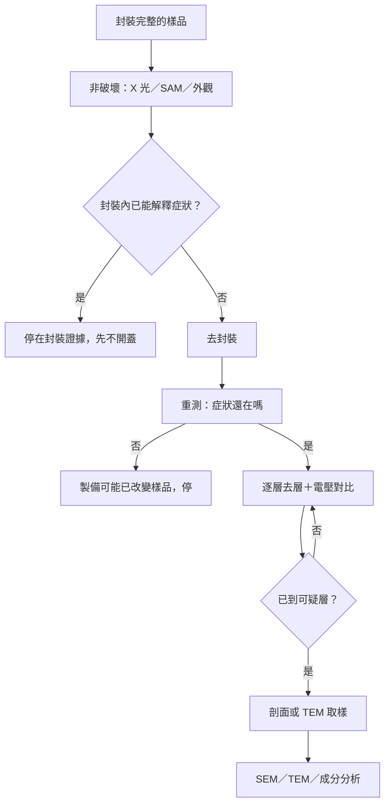

# 05 開封、去層、切片會不會破壞證據？

## 開場問題

定位把可疑範圍縮到幾十微米之後，下一步幾乎總是「做樣品」。去封膠、磨掉一層金屬、切一個剖面、取出一片給 TEM 看——這些動作讓你看見原本看不見的結構，也讓你再也回不到「還沒動過的那顆樣品」。

本章的問題不是「哪一種製備最先進」，而是：**你現在想看的證據，會不會被用來取得它的步驟毀掉？** 若順序錯了，後面的高解析影像可能拍到的是製備留下的假象，不是原來的失效。

## 先不破壞：還有機會回頭

業界訓練教材給出的順序是：封裝還在時先做 X 光與超音波掃描；沒有明顯封裝缺陷，才去封裝；去封裝後再量一次，確認原來的電性症狀還在；然後才進入「去一層、做電壓對比、再決定要不要剖面」的迴圈（[P1](appendix-sources.md#p1)）。商業實驗室的流程描述同樣把非破壞放在前面，破壞性方法用來「reveal the physical defect」（[P21](appendix-sources.md#p21)）。

X 光與超音波不是可以互相取代的兩種「看看內部」的方法。X 光對密度與厚度差異敏感，超音波對分層與空氣間隙敏感；密集金屬化區 X 光對比弱，密封空腔則讓聲波傳不過去（[P4](appendix-sources.md#p4)）。先做哪一種，取決於你懷疑的是金屬結構還是界面空氣，而不是哪一台比較新。

閎康把 SAT、2D／3D X-ray、OM 等列在非破壞性分析底下，把去封膠、TEM 試片製備與 FIB 電路修補列在樣品製備處理底下（[C1](appendix-sources.md#c1)、[C12](appendix-sources.md#c12)、[C11](appendix-sources.md#c11)）。這個分類能支持「公司把不破壞與破壞性製備分開陳列」，不能支持每個案件都會依課本順序執行。

## 去封裝：四種方法毀掉不同的東西

要看到晶粒，通常得先去掉模封。四種常見方法各自傷害不同證據（[P6](appendix-sources.md#p6)）：

| 方法 | 它擅長的 | 它可能毀掉的 |
|---|---|---|
| 化學（酸液） | 快速去掉大量模封 | 打線與焊墊金屬；**若調查的是污染或腐蝕，強蝕刻可能改變待查證據本身** |
| 電漿 | 對銅、鈀塗銅、銀打線與腐蝕／污染證據相對友善 | 仍是加工，不是「完全不改樣品」 |
| 雷射 | 局部去掉模封 | 靠近敏感結構時的熱效應；深度與晶粒位置都要控制 |
| 機械研磨／銑削 | 封裝不均勻時較能配合；強調電路存活率 | 應力造成裂片、打線損傷、切進晶粒而喪失證據 |

商用化學去封裝設備需要額外的銅線保護功能，本身就說明酸液對銅打線不友善（[P7](appendix-sources.md#p7)）。機械法則發展出 tunnel decap 這類技法，因為「It is not possible to uncover the bond wires using a single process」（[P8](appendix-sources.md#p8)）——打線與整體模封無法用同一道工序同時最佳化露出。

閎康官網列出三種子服務：Delayer 乾式蝕刻及研磨去層、雷射蝕刻去封膠、化學蝕刻去封膠（[C12](appendix-sources.md#c12)）。分類頁沒有逐一說明適用材料與風險，因此**不足以支持三種方法的優劣比較**；本書只把它當成「公司公開提供這三個名稱」。

*照片 05-A：去封膠後的 MSP430 晶粒。模封拿掉之後才能看到晶粒與打線，但污染化學態、打線金屬與晶粒完整都可能在這一步被改掉。此圖不是閎康樣品。* [來源與署名](99-image-credits.md#photo-05-decap)

## 去層：你每去掉一層，就少一層可以回頭看

晶粒上的互連是一層層疊起來的。要看某一層，就得把上面的材料拿掉。訓練教材把去層寫成濕蝕刻與乾（電漿）蝕刻為主（[P5](appendix-sources.md#p5)）。先進節點的全晶片背面去層還會碰到結構性的不均勻：去耦合電容等設計特徵的濺射速率不同，「remaining material from the layer above while the surrounding areas are cleanly removed」（[P9](appendix-sources.md#p9)）。看起來像「還沒蝕刻完」的殘留，可能只是電路架構造成的速率差，不是缺陷。

終點控制因此不是可有可無。同一篇 10 nm 案例用 250 nm 與 325 nm 的紫外光分別對氧化層與金屬做終點偵測，並用電子沖流槍抵銷充電假象（[P9](appendix-sources.md#p9)）。這是特定製程在特定節點上的做法，不能當成所有實驗室的標準配方；它證明的是：**去層本身會製造假訊號，必須有方法分辨「還在目標層」與「已經過頭」。**

## 剖面與 TEM 試片：看見截面，也看見假象

要看裂縫是不是貫穿、via 是不是空的，通常得做剖面。機械研磨會留下浮凸、鑽石嵌入、塗抹與彗尾狀溝槽（[P11](appendix-sources.md#p11)）。鎵離子 FIB 則會留下 curtaining、再沉積、離子佈植，以及大約 10 nm（30 kV）的表層非晶化；非晶化會讓 EBSD 繞射圖案直接消失（[P12](appendix-sources.md#p12)、[P14](appendix-sources.md#p14)）。寬離子束（BIB）較適合大面積、低損傷的 EBSD 前處理，FIB 較適合小區域的 TEM 薄片（[P13](appendix-sources.md#p13)）。

TEM 還有一層常被忽略的事實：樣品必須薄到電子束能穿透，閎康官網寫「通常約 100 nm 以下」（[C11](appendix-sources.md#c11)）。超高解析 EDS 的應用資料甚至用約 30 nm 的 lamella（[P15](appendix-sources.md#p15)）。**這片薄片已經是高度加工過的物體，不再代表原始塊材狀態。** 看到的元素分布，必須連同製備條件一起讀。

*照片 05-B：FIB 銑出的 TEM 薄片（SEM 影像）。這片已經被離子束加工過，不再代表原始塊材；表層非晶化與再沉積都可能進畫面。此圖不是閎康試片。* [來源與署名](99-image-credits.md#photo-05-tem)

*圖 05-1：證據保存優先的製備順序，依公開訓練流程整理（[P1](appendix-sources.md#p1)、[P21](appendix-sources.md#p21)）。本圖不是閎康或任何實驗室的 SOP；每一步都可能提前終止。*

## 證據保存與破壞對照

| 想取得的證據 | 必要步驟 | 這一步可能毀掉什麼 |
|---|---|---|
| 打線、凸塊、分層、空洞的位置 | X 光、SAM（[P1](appendix-sources.md#p1)–[P4](appendix-sources.md#p4)） | 不破壞樣品，但解析度與材料對比有盲點 |
| 裸露的晶粒表面 | 去封裝（[P6](appendix-sources.md#p6)） | 污染／腐蝕化學態、打線金屬、晶粒完整 |
| 某一金屬層的結構或電壓對比 | 去層（[P5](appendix-sources.md#p5)、[P9](appendix-sources.md#p9)） | 上層結構、均勻性；殘留可能被誤認為缺陷 |
| 截面形貌 | 機械或 FIB 剖面（[P11](appendix-sources.md#p11)、[P12](appendix-sources.md#p12)） | 真實微結構被假象掩蓋；EBSD 可能因非晶化失效 |
| 奈米級晶格與成分 | TEM lamella（[P14](appendix-sources.md#p14)、[P15](appendix-sources.md#p15)、[C11](appendix-sources.md#c11)） | 塊材狀態；Ga 佈植與厚度梯度 |

## 推理檢查

1. 為什麼去封裝之後要再量一次電性，而不是直接切片？
2. 調查焊墊腐蝕時，為什麼化學去封裝可能是錯誤的第一步？
3. 去層後某區域「還留著上一層材料」，一定代表蝕刻失敗或缺陷嗎？
4. FIB 剖面上看不到 EBSD 圖案，能直接說「這裡沒有晶體結構」嗎？
5. TEM 圖上量到的元素分布，為什麼不能直接當成「晶片裡原本就是這樣」？

??? note "參考推理"
    1. 因為製備可能改變或消除原來的短路／開路；教材要求去封裝後重測，確認症狀還在（[P1](appendix-sources.md#p1)）。
    2. 強蝕刻可能修改待查的污染或腐蝕證據（[P6](appendix-sources.md#p6)）。
    3. 不一定。不同電路結構的濺射速率不同，可能造成局部殘留（[P9](appendix-sources.md#p9)）。
    4. 不能。30 kV 鎵離子可把表層非晶化到約 10 nm，EBSD 是表面敏感技術，圖案消失可能是製備假象（[P12](appendix-sources.md#p12)、[P14](appendix-sources.md#p14)）。
    5. 因為 EDS 定量常用極薄 lamella 與低探針電流，樣品已高度加工（[P15](appendix-sources.md#p15)）。

## 來源與待查

製備順序與假象的出處見[來源索引](appendix-sources.md)物理證據欄（[P1](appendix-sources.md#p1)–[P15](appendix-sources.md#p15)）。閎康去封膠與 TEM 製備為公司自述（[C11](appendix-sources.md#c11)、[C12](appendix-sources.md#c12)）。

化學去封裝的配方、溫度與時間未公開；閎康三種去封膠子頁的適用材料與風險，本次未取得可比較的逐字原文。這兩項列入[待查問題](appendix-open-questions.md)，不在正文填入通用參數。

---

[← 04 定位方法與盲點](04-localization.md) ｜ [06 物理證據與因果判定 →](06-physical-evidence.md)
