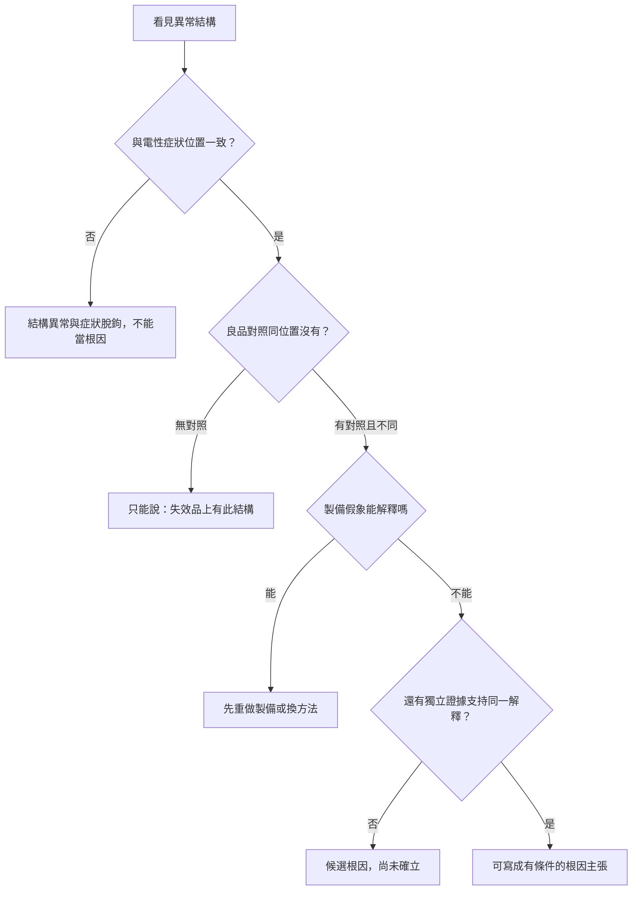

# 06 看見裂縫或異物，如何確認它是原因？

## 開場問題

SEM 照片上有一條裂縫，TEM 照片上有一顆異物。報告寫「根因已找到」。這句話把兩件不同的事壓在一起：

1. **這裡有一個異常結構。**
2. **這個結構造成了當初測到的症狀。**

第一句可以由一張影像支持。第二句不行。產業整理把這條界線寫得很直白：「Finding an abnormal structure does not always explain what it is.」「One unusual feature does not automatically prove root cause.」（[P22](appendix-sources.md#p22)）本章要做的，就是把「看見」還原成必須通過對照與替代解釋的因果主張。

*照片 06-A：去金屬後的晶粒 SEM。畫面能證明「這裡有結構」，不能證明哪一條線造成當初的症狀，也不能排除製備本身改了樣品。此圖是公開的微控制器晶粒，不是閎康案件。* [來源與署名](99-image-credits.md#photo-06-sem)

## 一根因果鏈，至少要接上三節

根因判定需要「物理證據＋電性資料＋元件歷史」互相印證，而不是單獨的物理觀察（[P21](appendix-sources.md#p21)）。拆開來看：

| 證據種類 | 它能回答 | 它不能單獨回答 |
|---|---|---|
| 電性症狀與定位 | 哪裡的行為異常、範圍大概在哪 | 那裡的結構是什麼、是不是製備造成的 |
| 物理影像與成分 | 那個位置有什麼形貌或元素 | 它是否在失效當時就存在、是否造成症狀 |
| 履歷與對照 | 這顆與良品、與同批其他顆有何不同 | 差異是否等於因果 |

最強的結論「come from multiple pieces of evidence that support the same explanation」（[P22](appendix-sources.md#p22)）。單一張「看起來不對勁」的圖，只是候選，不是終點。

良品（known-good）對照在這裡的作用，是區分「這個結構異常」與「這片樣品本來就長這樣」。「A known-good device can be extremely valuable at this stage. Comparing a failing device with a good device can reveal differences.」（[P22](appendix-sources.md#p22)）公開資料沒有規定該取幾顆、同批還是跨批；沒有這個數字，本書就不填。

## 公開案例：表面損傷不是根因

ZEISS 彙編裡有一條完整的公開因果鏈（原發表於同系列技術論文，[L17](appendix-sources.md#l17)）。電性測試是開路。光學與 SEM 先看到「an anomaly, possibly package surface damage」。3D X-ray 才看見表面異常底下有「a cut open Cu trace」。FIB 剖面確認是「a sharp-edged SiO2 piece pressed through the package surface, cutting the Cu trace」。最後對上位置：就在測試座夾持正下方。結論是鬆脫顆粒落在封裝表面，測試座夾緊時壓進封裝，切斷底下的銅線。

這條鏈值得逐格對照本章的標準：

| 步驟 | 當時能支持的 | 若在這裡停下來會誤判成 |
|---|---|---|
| 電性開路 | 有功能失效 | 「晶粒製程不良」 |
| 表面損傷 | 封裝外觀有異常 | 「外觀刮傷就是原因」 |
| 銅線被切斷 | 開路有對應的導體中斷 | 「封裝製程把銅線做斷」 |
| SiO₂ 尖角顆粒＋夾持位置 | 外來顆粒＋測試座機械力 | （這一步才把根因從「晶片」改判到「測試夾具」） |

任何單一步驟的「發現」都不能自動當成根因。CSAM 在同一彙編的其他案例裡也示範了另一種停太早：影像顯示大範圍異常，但「it was not apparent if the observed anomaly was confined to the microbump interface or if it has extended to the C4 bump interface」（[L17](appendix-sources.md#l17)）。有訊號，仍不知道在哪一層。

*照片 06-B：BGA 金相截面。焊球、通孔與銅層都看得見，但「看得見」仍只回答結構在哪，不回答它是否造成電性症狀。此圖不是閎康剖面。* [來源與署名](99-image-credits.md#photo-06-bga)

這是公開研討會案例，用來示範方法，不是閎康的客戶事件，也不能推出所有開路都來自測試座。

## 合成案例：接觸誤判與物理缺陷

以下兩案是本書設計的教學合成，不是閎康或任何客戶的實績。

**案 A：接觸誤判。** 某一腳位量到開路。若直接切片，剖面很可能在焊墊或凸塊上看到「接觸區有壓痕或氧化」。這些結構可以同時相容於「測試接觸不良」與「元件真的開路」。要先用對照板、對照 socket、重測與曲線追蹤，把[第 03 章](03-trust-the-symptom.md)的症狀可信度做完；否則物理影像只會確認你已經相信的故事。

**案 B：物理缺陷。** 定位到某一層金屬有 OBIRCH 訊號，去層後 SEM 看到空洞。仍要問：良品同位置有沒有類似空洞？去層速率差會不會留下假殘留（[第 05 章](05-sample-preparation.md)）？電性開路是否與這個空洞的幾何位置一致？若只有一顆樣品、一次去層、一張圖，結論最多寫到「此位置有空洞，與定位訊號相符」，還不能寫「根因確立」。

*圖 06-1：從「看見異常」到「有條件的根因主張」。本圖為本書判讀框架，不是任何實驗室的放行流程。*

## 因果假設與對照矩陣

| 假設 | 若為真會看到 | 怎樣推翻 |
|---|---|---|
| H1：此結構造成症狀 | 位置與電性定位重合；修掉或避開它之後症狀消失 | 良品也有；或編修／對照後症狀仍在 |
| H2：結構是製備假象 | 只在研磨／FIB 之後出現；換製備方法後消失 | 非破壞影像在製備前已見到 |
| H3：結構真實但與症狀無關 | 位置對不上電性路徑；對照樣品也有 | 多顆失效品重複出現在同一電性節點 |
| H4：真正原因在測試或接觸 | 換治具／條件後症狀改變；物理缺陷解釋不了現場／實驗室差異 | 固定條件下可重現，且物理鏈完整 |

H1 要升級成根因，至少要同時削弱 H2–H4。電路編修（[第 07 章](07-circuit-edit.md)）能對「改掉它之後行為變了」提供強證據，但仍不能自動排除 H2 與單一樣品差異。

## 閎康的公開證據能支持到哪裡

| 欄位 | 內容 |
|---|---|
| **已確認事實** | 閎康公開提供 SEM、TEM、FIB、EDS／EELS 等材料與失效分析項目，以及 TEM 試片三種製備法（[C9](appendix-sources.md#c9)–[C11](appendix-sources.md#c11)、[C1](appendix-sources.md#c1)）。 |
| **合理推論** | 同時具備電性定位與物理觀察手段，具備走完本章因果鏈的工具組合。 |
| **尚待查證** | 任何公開的、帶對照與修改後驗證的閎康客戶案例；實驗室內部如何定義「根因確立」。服務清單不能推出案件的結論強度。 |

## 推理檢查

1. 為什麼「TEM 看到異物」仍不能直接寫成根因？
2. 良品對照缺失時，最誠實的句子該怎麼寫？
3. 測試座顆粒切斷銅線的案例裡，哪一步把「晶片製程問題」這條假設排除掉？
4. 去層殘留被看成缺陷，屬於上面哪一個假設？
5. 若編修後功能恢復，為什麼第 07 章仍不讓你把根因欄一次勾完？

??? note "參考推理"
    1. 異物可能是製備再沉積、可能與電性路徑無關，也可能只是伴隨現象（[P22](appendix-sources.md#p22)、[P12](appendix-sources.md#p12)）。
    2. 「失效品此位置有此結構；未知良品是否亦然。」不要補上未做的對照。
    3. 當剖面顯示 SiO₂ 顆粒從封裝表面壓入、位置對上測試座夾持，因果從晶粒製程轉到測試夾具（[L17](appendix-sources.md#l17)）。
    4. H2：製備假象（[P9](appendix-sources.md#p9)）。
    5. 因為功能恢復仍相容於編修副作用、單一樣品差異，以及「修法有效但不是唯一原因」（[第 07 章](07-circuit-edit.md)）。

## 來源與待查

方法論見 [P21](appendix-sources.md#p21)、[P22](appendix-sources.md#p22)；完整公開案例見 [L17](appendix-sources.md#l17)；製備假象見 [P9](appendix-sources.md#p9)、[P12](appendix-sources.md#p12)。兩則教學案為合成。

良品對照該取幾顆、同批或跨批，本次未找到系統性的一手統計指引。閎康也沒有公開帶對照的客戶根因報告。兩項列入[待查問題](appendix-open-questions.md)。

---

[← 05 樣品製備與證據保存](05-sample-preparation.md) ｜ [07 電路編修能證明什麼 →](07-circuit-edit.md)
