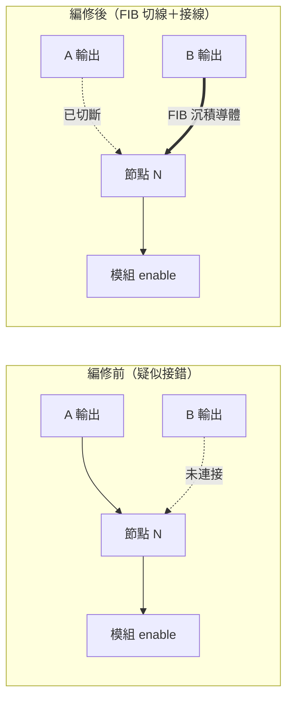
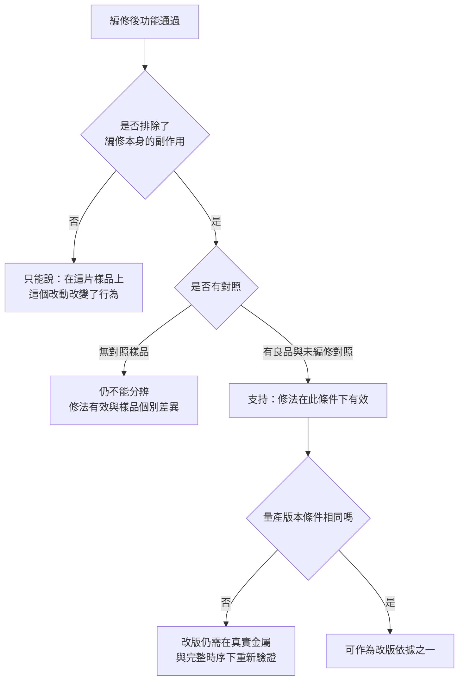

# 07 改一條線，能證明設計已經修好嗎？

## 開場問題

工程樣品送回來，測試程式顯示某個控制訊號永遠停在低電位。有人把佈局圖調出來，指著一條線說：「這裡接錯了，接到隔壁那顆的輸出。」於是下一句話幾乎是自動的——**「那用 FIB 切掉重接，看功能會不會好。」**

這句話裡藏了三個不同的主張，值得先拆開：

1. 這條線確實接錯了（**根因主張**）。
2. 把它改掉，晶片就會正常（**修法有效主張**）。
3. 因此下一版光罩照這樣改就對了（**改版決策主張**）。

FIB 電路編修（circuit edit）能替第 2 點提供很強的證據，對第 1 點只能提供**有條件**的支持，而第 3 點永遠需要額外的東西。本章要做的，是把「改完會動了」這個令人鬆一口氣的結果，還原成它真正證明了什麼。

## 工件與工具：你在對什麼東西動刀

FIB 的基本原理是用聚焦離子束轟擊樣品表面。閎康官網對電路修補的說明寫著：「FIB 是利用金屬鎵作為離子源，利用加在 Extractor 的負電場將鎵原子由針尖端牽引出，形成鎵離子束」，並且「因為鎵原子位於週期表中間的位置，使用它來撞擊其它元素原子所造成的移除效果遠遠大於電子，因此可以利用離子束對試片表面進行特定圖案的加工」（[C2](appendix-sources.md#c2)）。這個技術的出身很能說明它的性格：跨歐洲的 FIB 技術路線圖論文指出，鎵離子 FIB 「was originally intended for photomask repair in the semiconductor industry」（[E12](appendix-sources.md#e12)）——它一開始就是修東西的工具，不是量測工具。

不管服務商怎麼包裝，編修只有兩個基本動作。Thermo Fisher 對 circuit edit 的定義是「cutting and creating connections within the device to correct design issues」（[E7](appendix-sources.md#e7)）：

*照片 07-A：雙束 FIB 的剖面示意。離子束銑出截面，電子束再成像。電路編修用的是同一類離子束加工：切線是銑掉金屬，接線是沉積新導體。此圖不是閎康機台或任何真實佈局。* [來源與署名](99-image-credits.md#photo-07-fib)

| 動作 | 做什麼 | 靠什麼 |
|---|---|---|
| **切線 cut** | 銑掉一段既有金屬連線，讓它斷開 | 離子束銑削，可用氣體輔助蝕刻提高選擇比與速率（[C2](appendix-sources.md#c2)、[E12](appendix-sources.md#e12)） |
| **接線 strap** | 在兩點之間長出一條新的導體 | 氣體前驅物在離子束下分解，沉積白金、鎢或絕緣層（[E9](appendix-sources.md#e9)、[E14](appendix-sources.md#e14)） |

還有第三件事常被忽略：**你得先找得到那條線。** 閎康的電路修補頁把「GDS自動導航線路定位 (Auto-Navigation to Designated Failure Address)」列為分析應用之一（[C2](appendix-sources.md#c2)）；EAG 則說明 FIB 必須「coupled to a navigation system... providing a method to find subsurface features」（[E9](appendix-sources.md#e9)）。沒有設計圖資，離子束只看得到一片金屬，看不到哪一條是 `enable`。

.jpg)

*照片 07-B：雙束 FIB-SEM 機台外觀（ZEISS Crossbeam）。閎康自述提供 Single Beam／Dual Beam／Dual Beam Plasma FIB，但未公開廠牌與型號；此圖只用來認「這類工具長什麼樣子」，不是閎康設備。* [來源與署名](99-image-credits.md#photo-07-tool)

## 合成案例：一個永遠拉不起來的 enable

以下是本書設計的教學案例，不是閎康的客戶事件，也不描述任何公司的內部流程。

一顆工程樣品在特定模式下，某個模組的 enable 訊號量到永遠為低。設計團隊調出佈局，認為 `N` 這個節點被接到了 `A` 的輸出，而依設計意圖應該接到 `B`。

**在動刀之前，先把「這條線接錯」放回一堆候選解釋裡。** 如果跳過這一步，後面所有證據都只會用來確認已經相信的事：

| 候選解釋 | 若為真，會看到什麼 | 怎麼先排除 |
|---|---|---|
| H1：佈局把 `N` 接到 `A`（原始假設） | 圖資與實體連線一致指向 `A`；`N` 隨 `A` 而非 `B` 變化 | 比對 GDS 與實體剖面；量 `N` 與 `A`、`B` 的相關性 |
| H2：設計邏輯本身就錯，連線沒錯 | 實體連線與圖資都指向 `B`，但產生 `B` 的邏輯本身輸出恆低 | 回頭跑模擬；量 `B` 本身 |
| H3：激勵根本沒進去（測試程式、板子、腳位設定） | 換一套測試設定或換一片板子，症狀改變 | 用對照樣品與對照板重現 |
| H4：連線正確，但上游驅動元件有製程缺陷 | 同設計的其他樣品正常；此片有局部異常 | 多片對照；定位方法找異常點 |
| H5：量測本身的問題（探針接觸、偏壓條件） | 換探點、換偏壓條件後症狀消失 | 先重建可重現的失效條件 |

H3 與 H5 屬於[第 03 章](03-trust-the-symptom.md)的範圍：**症狀先要可重現，才值得花錢動樣品。** H4 屬於[第 04 章](04-localization.md)與[第 06 章](06-physical-evidence.md)。只有在這些都站得住之後，編修才是在回答問題，而不是在製造新變數。

## 操作：切哪裡、從哪一面進去

假設 H1 站得住，編修動作是：切斷 `A → N`，並沉積一條 `B → N`。

*圖 07-1：編修前後的連線假設。虛線是本次動作改變的關係。此圖為本書合成案例的示意，不是任何真實設計的佈局。*

**從哪一面進去，不是風格問題，是幾何問題。** 覆晶（flip chip）封裝把正面朝下接到基板，加上現代 IC 的金屬層越疊越多，EAG 直接指出背面編修常是最有效的路徑，原因是「the increased number of metal circuit layers in today's ICs, which makes it harder to reach a lower layer」（[E8](appendix-sources.md#e8)）。同業宜特的一篇技術文章給了一個具體對照：對 9M+AP 這種金屬堆疊，正面編修需要穿過 AP 到 M5 共 6 層金屬，背面只需穿過一層主動區層（[E4](appendix-sources.md#e4)）。

代價則寫在同一批資料裡。背面要先把矽基板減薄、開 trench，並控制 endpoint 以免過蝕；過蝕的後果是「unrecoverable open circuits or exposure of non-essential metal layers」，可能造成金屬層之間的短路與漏電（[E2](appendix-sources.md#e2)）。至於該留多厚的矽，一篇 ISTFA 2016 的摘要給了區間：矽基板厚度約 1–2 μm 時「devices are unaffected」，而薄到 100 nm 等級時，在環形振盪器測試結構上可觀察到可量測的電性效應（[E11](appendix-sources.md#e11)）。這只是摘要層級的一組對照，不是所有節點與元件都適用的安全線。

## 編修一定會留下什麼

這是本章最容易被跳過、卻最影響結論強度的一節。**沉積出來的導體不是製程金屬。** 服務商自陳「FIB導體金屬電阻高於原始值」（[E3](appendix-sources.md#e3)）；同一家公司在另一篇技術文章中舉出量級：傳統白金沉積可達約 6 kΩ、鎢約 2 kΩ（[E1](appendix-sources.md#e1)）。這些數字沒有附上線長、線寬與量測方法，只能當量級參考，不能當成任何服務商的規格。

| 編修引入的東西 | 依據 | 對結論的影響 |
|---|---|---|
| 新導體的串接電阻遠高於原生金屬 | [E1](appendix-sources.md#e1)、[E3](appendix-sources.md#e3) | 時序、驅動能力、壓降都可能與量產版本不同 |
| 銑削造成的再沉積與離子佈植 | [E12](appendix-sources.md#e12) | 非目標區域可能被污染或改性 |
| 過蝕造成不可逆開路或暴露非目標金屬層 | [E2](appendix-sources.md#e2) | 可能製造出原本不存在的短路或漏電 |
| 切割精度在奈米間距下的餘裕極小 | [E4](appendix-sources.md#e4) | 相鄰線路可能被一併傷到 |
| 編修次數累積 | [E3](appendix-sources.md#e3)、[E18](appendix-sources.md#e18) | 同一顆晶片上改越多次，良率越低；操作原則是次數盡量少 |

另外還有一層限制：**不是每個目標都到得了。** EAG 給出設備層級的邊界——目前能做出的最小孔徑約 0.1×0.1 μm、深寬比約 1/20，因此「For most 20nm and 28nm designs, it is impossible to make a small enough hole to reach the target」（[E8](appendix-sources.md#e8)）。這句話寫於 2010 年代中期，工具此後有進展，但它點出的結構性事實沒變：可達性是節點與堆疊決定的，不是想改就能改。[第 08 章](08-editing-limits.md)專門處理這件事。

## 驗證：這次「會動了」到底證明了什麼

編修完成、重跑測試、功能通過。現在把結論分成三欄：

*圖 07-2：從「功能通過」到「可作為改版依據」的條件鏈。本圖為本書的判讀框架，不是任何公司的放行流程。*

具體到本案，通過之後可以寫下的三句話是：

- **已支持**：在這一顆樣品、這一套測試條件下，把 `N` 從 `A` 改接到 `B`，讓 enable 恢復正常。這同時提高了 H1 的可信度，並降低了 H2（設計邏輯錯）與 H3（激勵沒進去）的可信度——因為如果激勵根本沒進去，改連線不會有幫助。
- **尚未驗證**：新連線是 FIB 沉積的高電阻導體，時序餘裕、驅動能力與壓降都不是量產版本的條件；編修本身可能引入的漏電與相鄰線損傷未被獨立量測；只有一顆樣品，沒有排除個別差異；只跑了觸發該症狀的測試項，沒有回歸整套功能與可靠度。
- **不能宣稱**：不能說「根因已完全確立」。功能恢復與根因成立之間隔著一層——[第 06 章](06-physical-evidence.md)會說明，找到一個能解釋症狀的異常，不等於證明它就是唯一原因。一次功能通過，更不能說成量產修復方案。

第二欄才是本章真正的產出。**一份只寫「編修後功能正常」的報告，是把三欄壓成一欄。**

## 為什麼還是要改光罩

FIB 編修從來不是產品的終點。Thermo Fisher 的新聞稿把 Centrios HX 的用途寫成解決「preproduction design flaws」與「fast prototyping」（[E6](appendix-sources.md#e6)）；一篇 2014 年的產業文章把用途分得更細：試產前是「exploring and validating design changes」，量產除錯階段則是把一個修法「duplicated on a handful or tens of devices」供內部與客戶驗證（[E10](appendix-sources.md#e10)）。**幾十顆，和量產規模之間差了好幾個數量級。**

編修的價值因此是**資訊**，不是產品。EAG 說得直接：FIB 驗證過的原型可以「guide one-time modifications to masks, eliminating the need for a trial-and-error approach with successive versions of masks」（[E8](appendix-sources.md#e8)）。換句話說，你付一筆小錢買一個答案，省下的是用光罩去試錯的大錢。至於大錢有多大，公開資料只到量級：一份 2022 年的產業分析估計，mask set 成本從 90–45 nm 的數十萬美元量級，到 28 nm 超過 100 萬美元、7 nm 超過 1,000 萬美元、3 nm 逼近 4,000 萬美元（[E15](appendix-sources.md#e15)）。這是分析師估算，不是晶圓廠或光罩廠的官方揭露。

改版本身也分大小。**只改金屬層的 ECO 之所以可行，前提是設計時就預留了足夠的 spare cell**；備用邏輯不夠，就無法只靠金屬層修好（[E17](appendix-sources.md#e17)）。同一來源給出的片數對照是：完整重新投片約需製作 100 片光罩，metal-only 通常只要重做 2–4 片。這是非機構部落格的概括說法，量級可參考，精確度存疑。[第 09 章](09-validation-and-respin.md)會把這條決策鏈接完。

## 閎康的公開證據能支持到哪裡

| 欄位 | 內容 |
|---|---|
| **已確認事實** | 閎康官網公開提供「FIB 電路修補」服務，並自述「閎康科技目前共有 15 台可以提供 IC 線路修補服務的單粒子束聚焦式離子束 (Single Beam FIB, SB-FIB) 顯微鏡」，以及「閎康擁有多種 FIB 機台 (Single Beam / Dual Beam / Dual Beam Plasma FIB)」；分析應用清單包含 IC線路修補和佈局驗證、GDS自動導航線路定位、故障位置定位用被動電壓反差分析（[C2](appendix-sources.md#c2)）。官網另把 FIB 同時列為材料分析類的顯微鏡技術（[C3](appendix-sources.md#c3)）。 |
| **合理推論** | 同時具備導航、切割、沉積與雙束即時剖面觀測，代表其服務涵蓋本章描述的基本編修流程。把電路修補歸在「樣品製備處理」、把 FIB 顯微鏡歸在「材料分析」，與本章「編修是工程手段、不是量產修復」的定位一致。 |
| **尚待查證** | 15 台的廠牌、型號、所在廠區與稼動狀態；可支援到哪些節點與堆疊結構；背面編修的實際能力邊界；任何客戶案件量、成功率或週轉時間。官網未公開這些，本章也不以他家服務商的數字代填（[C2](appendix-sources.md#c2) 限制欄）。 |

宜特（iST）是與閎康各自獨立的上櫃驗證分析服務商，不是閎康的關係企業；本章引用其技術文章只作一般工程說明，不能用來證明閎康的能力或做法。

## 推理檢查

1. 編修後功能通過，為什麼仍不能直接寫成「根因已確立」？
2. 如果只有一顆樣品，哪些替代解釋仍然活著？
3. FIB 沉積的導體電阻高於原生金屬，這件事會讓哪一類驗證結論失效？
4. 什麼情況下，一個已被 FIB 驗證有效的修法，仍然無法只靠 metal-only 改版實現？
5. 若編修過程中發生過蝕並暴露了非目標金屬層，後續量到的漏電該怎麼歸因？

??? note "參考推理"
    1. 功能恢復同時相容於數個解釋：連線確實接錯、或編修順帶改變了其他條件、或這片樣品本來就與眾不同。要確立根因，還需要物理證據與對照，見[第 06 章](06-physical-evidence.md)。
    2. H4（上游元件的個別製程缺陷）幾乎完全沒被排除——單片樣品無法分辨「設計錯」與「這一片壞」。H2 也只被部分削弱。
    3. 任何依賴時序餘裕、驅動能力或壓降的結論。功能性通過可以保留，但速度、邊界條件與可靠度結論不能從編修樣品外推到量產版本。
    4. 當設計階段預留的 spare cell 不足以表達這個邏輯改動時；此時必須動到金屬以外的層，改版規模與成本都跳一級（[E17](appendix-sources.md#e17)）。
    5. 先分辨漏電是編修引入的還是原本就有：需要編修前的基線量測、未編修的對照樣品，以及漏電位置與編修位置的幾何關係。缺少基線時，最誠實的結論是這項數據已不可用。

## 來源與待查

本章的合成案例、候選解釋表與判讀框架都是本書設計的教學內容。技術主張的出處見[來源索引](appendix-sources.md)：FIB 原理與兩個基本動作（[C2](appendix-sources.md#c2)、[E7](appendix-sources.md#e7)、[E9](appendix-sources.md#e9)、[E12](appendix-sources.md#e12)、[E14](appendix-sources.md#e14)）；正背面取捨與背面製備（[E2](appendix-sources.md#e2)、[E4](appendix-sources.md#e4)、[E8](appendix-sources.md#e8)、[E11](appendix-sources.md#e11)）；副作用與可達性（[E1](appendix-sources.md#e1)、[E3](appendix-sources.md#e3)、[E18](appendix-sources.md#e18)）；用途定位與改版成本（[E6](appendix-sources.md#e6)、[E10](appendix-sources.md#e10)、[E15](appendix-sources.md#e15)、[E17](appendix-sources.md#e17)）。

三項主要缺口記在[待查問題](appendix-open-questions.md)：FIB 沉積金屬的精確電阻率與機制（相關論文本次受付費牆阻擋，未取得全文）；鎵污染在電路編修情境下的漏電與寄生電容量化資料；以及各節點編修成功率——所有已查到的公開來源都只有「良率會下降」「需要高度操作員技巧」這類定性描述，沒有任何一手來源提供百分比。看到有人引用具體成功率時，先問方法學出自哪裡。

---

[← 06 物理證據與因果判定](06-physical-evidence.md) ｜ [08 編修的可達性與副作用 →](08-editing-limits.md)
