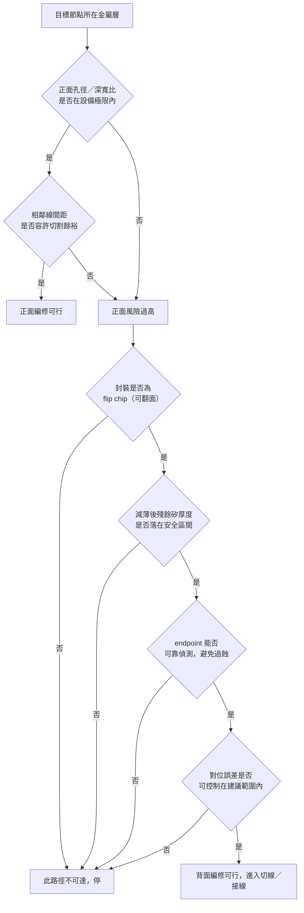

# 08 為什麼某些位置不可達，或修改後引入新問題？

## 開場問題

[第 07 章](07-circuit-edit.md)的合成案例裡，`N` 這個節點順利被找到、順利被切開、順利被接上新的一條線。這是教學案例刻意安排的順利。真實情況常常在更早的地方卡住：目標根本鑽不到，或者鑽到了、也接上了，但樣品多了一個原本沒有的問題。

這兩件事看起來像是同一種「失敗」，其實是兩個完全不同的問題。前者是**幾何與設備的物理極限**——不是技巧不夠，是孔徑、深寬比、間距擺在那裡，鑽不進去就是鑽不進去。後者是**編修動作本身的副作用**——鑽得進去、接得上，但過程留下了原本沒有的電阻、污染或短路路徑。本章把這兩塊分開講清楚，因為它們需要完全不同的因應方式：前者要問「這條路走得通嗎」，後者要問「走完之後，樣品還是不是原來想驗證的那個樣品」。

## 可達性：能不能到

### 設備的物理極限

編修的第一道關卡是純粹的幾何問題。EAG 給出的設備邊界是：目前能鑽出的最小孔徑約 0.1×0.1 μm、深寬比約 1/20，因此「For most 20nm and 28nm designs, it is impossible to make a small enough hole to reach the target」（[E8](appendix-sources.md#e8)）；同一機構作者在另一篇文章重複了同一組數字（[E10](appendix-sources.md#e10)）。這不是操作員能不能更小心的問題，是孔徑與深寬比的比例關係決定了能鑽多深、多細。

材料本身也不配合。多數 28/20 nm 元件是銅製程，EAG 指出銅「features a crystal structure which is very difficult to remove smoothly」（[E8](appendix-sources.md#e8)）——就算孔徑理論上夠，移除的均勻度仍是另一個變數。

### 間距把餘裕壓到接近零

節點越先進，第二道限制越明顯：**旁邊的線離得太近，容不下誤差。** iST 針對 5 nm 節點的說明指出，7／5 nm 製程相鄰金屬線間距可窄至 10 nm 量級，實務上要以約 40×100 nm 的微小矩形切割，確保相鄰兩側線路不受影響（[E4](appendix-sources.md#e4)）。換句話說，切割工具本身的誤差容許範圍，在這個尺度下幾乎被間距吃光。

### 金屬層數決定走哪一條路

金屬層堆疊越厚，從正面到達下層電路越難。EAG 把這一點寫成背面編修常態化的理由：「the increased number of metal circuit layers in today's ICs...makes it harder to reach a lower layer」（[E8](appendix-sources.md#e8)）；AnySilicon 給了同樣的因果關係（[E18](appendix-sources.md#e18)）。iST 的 5 nm 案例給出具體對照：對 9M+AP 這種堆疊，正面編修要穿過 AP 到 M5 共 6 層金屬，背面只需穿過一層主動區層（[E4](appendix-sources.md#e4)）。這也是商用編修系統依節點分級（例如 sub-7nm 與 14nm 以上分屬不同型號）的原因之一（[E7](appendix-sources.md#e7)）。

*照片 08-A：較舊製程的金屬層堆疊（Intel 80486 DX2）。從正面切到下層，要穿過上面每一層；層數越多，孔徑、深寬比與誤傷相鄰線的風險都上升。此圖不是先進節點，也不能當閎康可達性規格。* [來源與署名](99-image-credits.md#photo-08)

### 走背面的前提與步驟

選了背面，代價換成一連串新的前提條件。iST 的說明列出具體流程：先把晶粒從封裝級厚度減薄（例如常見的 31 mil 減到 8–12 mil），再局部薄化到微米級；開 trench 並控制底部平整度與 endpoint，避免過蝕；用紅外線相機四角定位、多點參考對位，建議誤差不超過 20 μm（[E2](appendix-sources.md#e2)）。這一連串步驟本身就是一組要先滿足的前提，缺一項，後面的操作都沒有意義。

矽該留多厚，是一個沒有標準答案、只有區間參考的問題。一篇 ISTFA 2016 摘要給出對照：矽基板厚度約 1–2 μm 時「devices are unaffected」；薄到 100 nm 等級時，在環形振盪器測試結構上可觀察到可量測的電性效應（[E11](appendix-sources.md#e11)）。這只是摘要層級的一組數字，沒有全文的方法學細節，不能當成所有節點與元件類型的安全線。

### 找得到才改得到

以上所有前提都假設你知道要往哪裡鑽。閎康官網把「GDS 自動導航線路定位」列為電路修補的分析應用之一（[C2](appendix-sources.md#c2)）；EAG 說明 FIB 需搭配 CAD／影像導航系統（如 Knights、Camelot、Lavis 之類的商用軟體）才能定位次表面特徵（[E9](appendix-sources.md#e9)）。沒有設計圖資與導航系統，離子束看到的只是一片金屬與矽，分不出哪一條是目標、哪一條是鄰居。

## 副作用與判斷誤差：鑽得到、接得上，然後呢

即使可達性全部滿足，編修動作本身仍會留下痕跡，而這些痕跡會直接侵蝕驗證結論的強度。

**沉積的導體不是原生金屬。** iST 自陳「FIB導體金屬電阻高於原始值」（[E3](appendix-sources.md#e3)），並在另一篇文章舉出量級：傳統白金沉積約 6 kΩ、鎢約 2 kΩ（[E1](appendix-sources.md#e1)）——這組數字沒有附線長、線寬與量測方法，只能當量級參考。

**銑削會把材料濺回不該去的地方。** 跨歐洲的 FIB 技術路線圖論文指出，re-deposition（濺射材料再沉積回樣品表面）是銑削製程中已知、且需要建模處理的現象（[E12](appendix-sources.md#e12)）；離子束本身也伴隨離子佈植。這代表非目標區域可能被污染或改性，而這種改性通常不會出現在測試報告裡。

**過蝕是不可逆的。** iST 明確指出過度蝕刻的後果是「unrecoverable open circuits or exposure of non-essential metal layers」，可能造成金屬層之間的短路與漏電（[E2](appendix-sources.md#e2)）。一旦發生，樣品已經無法乾淨地區分「原始症狀」與「編修造成的新症狀」。

**Endpoint 判斷依賴人，不是機器自動完成的。** EAG 直言 endpoint detection「continues to require a high level of skill」，操作員經驗在更小的幾何尺度下更重要，因為「FIB tools are not entirely automated」（[E8](appendix-sources.md#e8)）。同一目標，不同操作員或不同次的操作，理論上可能得到不同的邊界結果。

**編修次數會累積損傷。** iST 與 AnySilicon 都指出，同一顆晶片上編修次數越多，良率越低，操作原則是次數盡量少（[E3](appendix-sources.md#e3)、[E18](appendix-sources.md#e18)）。多次編修後的樣品，其驗證結果的代表性也隨之削弱。

## 可達性、損傷與驗證對照表

| 限制項目 | 具體內容 | 來源 | 對驗證結論的影響 |
|---|---|---|---|
| 孔徑／深寬比極限 | 最小孔徑約 0.1×0.1 μm，深寬比約 1/20；多數 20／28 nm 設計鑽不出足夠小的孔 | [E8](appendix-sources.md#e8)、[E10](appendix-sources.md#e10) | 目標層鑽不到，是「根本沒改到」，不是「改了沒用」 |
| 銅製程材料難度 | 銅晶粒結構難以平整移除 | [E8](appendix-sources.md#e8) | 孔徑夠也可能移除不均勻 |
| 相鄰線間距 | 7／5 nm 間距可窄至 10 nm 量級，需以約 40×100 nm 矩形切割 | [E4](appendix-sources.md#e4) | 切割餘裕接近零，可能波及未列為目標的線路 |
| 金屬層堆疊 | 9M+AP 堆疊下正面需穿 6 層、背面僅需穿 1 層主動區 | [E4](appendix-sources.md#e4)、[E8](appendix-sources.md#e8)、[E18](appendix-sources.md#e18) | 決定選正面或背面，也決定風險暴露的層數 |
| 背面對位精度 | 紅外線四角定位＋多點參考，建議誤差 ≤20 μm | [E2](appendix-sources.md#e2) | 對位失準會使銑削偏離目標 |
| 矽殘厚 | 1–2 μm 元件不受影響；100 nm 等級環形振盪器出現可量測電性效應（僅摘要層級） | [E11](appendix-sources.md#e11) | 過薄可能引入原本不存在的電性效應，污染驗證結果 |
| 過蝕風險 | 造成不可逆開路，或暴露非目標金屬層導致短路漏電 | [E2](appendix-sources.md#e2) | 樣品無法再區分原始症狀與編修造成的新症狀 |
| 沉積導體電阻 | Pt 約 6 kΩ、W 約 2 kΩ 量級；服務商自陳電阻高於原始值 | [E1](appendix-sources.md#e1)、[E3](appendix-sources.md#e3) | 依賴時序、驅動能力的判讀失效 |
| 操作員依賴 | endpoint 偵測需高度操作員技巧，工具並非全自動 | [E8](appendix-sources.md#e8) | 削弱結果的可重複性 |
| 編修次數累積 | 同一晶片編修次數越多良率越低，原則是次數盡量少 | [E3](appendix-sources.md#e3)、[E18](appendix-sources.md#e18) | 多次編修樣品的代表性更弱 |

## 決策圖：走到哪一步就該停

*圖 08-1：本圖為本書依已核對來源整理的判讀框架，不是任何公司或設備商的公開決策流程。*

## 推理檢查

1. 如果 FIB 連目標孔都鑽不出來，這代表什麼？跟「編修了但沒用」有什麼不同？
2. 為什麼相鄰線間距只有 10 nm 量級時，即使孔徑本身理論上夠小，風險仍然很高？
3. 矽殘厚從 1–2 μm 薄到 100 nm 等級，對驗證結論的可信度有什麼影響？
4. Endpoint 偵測依賴操作員經驗，這對「同一片樣品換人做會不會得到不同結果」有什麼含義？
5. 為什麼「編修次數盡量少」是一條操作原則，而不是可有可無的建議？

??? note "參考推理"
    1. 前者是可達性問題：設備物理極限決定了根本進不去，這是「假設沒被檢驗」，連支持或推翻都談不上。後者是「假設被檢驗過，但結果不支持」，兩者對後續決策的意義完全不同——前者該問的是換路徑或換工具，後者該問的是根因假設是否成立。
    2. 因為切割矩形（如 40×100 nm）與間距（10 nm 量級）幾乎同一個數量級，設備、樣品固定角度誤差或機台漂移都可能讓切割邊界越界，波及原本不是目標的線路，等於在驗證一個假設的同時，可能製造出另一個未被記錄的異常。
    3. 過薄的矽本身可能引入原本不存在的電性效應（如摘要中環形振盪器的例子），這代表驗證結果可能同時混雜「根因假設是否成立」與「基板減薄帶來的新效應」，兩者難以在單一樣品上分開。
    4. 代表 endpoint 判斷不是全自動、可重複的量測，而是帶有操作員技巧成分的過程；同一目標若換人操作或換一次操作，過蝕程度、殘留矽厚度都可能不同，這會削弱「這次編修的結果可以外推」的信心。
    5. 因為每一次編修都會累積損傷風險（過蝕、再沉積、離子佈植），良率隨次數下降是已被服務商自陳的現象；把它當成操作原則而非建議，是承認這是一個會累積的成本，不是可以無限次重來的可逆操作。

## 來源與待查

可達性的設備極限、材料難度與層數限制：[E4](appendix-sources.md#e4)、[E7](appendix-sources.md#e7)、[E8](appendix-sources.md#e8)、[E10](appendix-sources.md#e10)、[E18](appendix-sources.md#e18)。背面路徑的前提與步驟：[E2](appendix-sources.md#e2)、[E11](appendix-sources.md#e11)。導航需求：[E9](appendix-sources.md#e9)、[C2](appendix-sources.md#c2)。副作用與判斷誤差：[E1](appendix-sources.md#e1)、[E2](appendix-sources.md#e2)、[E3](appendix-sources.md#e3)、[E8](appendix-sources.md#e8)、[E12](appendix-sources.md#e12)、[E18](appendix-sources.md#e18)。

三項刻意留白：本書未取得 FIB 沉積金屬的精確電阻率（μΩ·cm）與其機制的一手學術文獻——相關論文本次查核時受付費牆阻擋，未取得全文；也沒有取得鎵污染在電路編修情境下造成漏電或寄生電容的量化資料，理由相同；更沒有任何一手來源提供各節點編修成功率的百分比——所有查到的公開來源都只有「良率會下降」「需要高度操作員技巧」這類定性描述。看到有人引用具體成功率數字時，先問方法學出自哪裡。

---

[← 07 改一條線，能證明設計已經修好嗎？](07-circuit-edit.md) ｜ [09 樣品通過後，如何決定改版及重新投片？ →](09-validation-and-respin.md)
