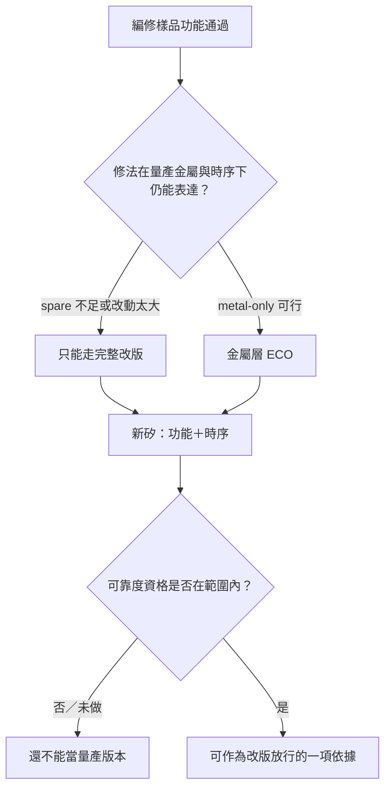

# 09 樣品通過後，如何決定改版及重新投片？

## 開場問題

FIB 編修後，那一顆工程樣品的功能測試過了。會議上的下一句常常是「那我們改光罩吧」。這句話跳過了三個不同的升級：

1. 修法在**這顆樣品、這套條件**下有效（[第 07 章](07-circuit-edit.md)已經能支持到這裡）。
2. 這個改動可以用**金屬層 ECO**做進下一版矽，而不必動電晶體層。
3. 下一版矽在**功能、時序與可靠度**上都站得住，值得當成量產版本。

本章把這三步拆開。FIB 從來不是產品的終點：產業分析把 circuit edit 寫成「physically validate the layout changes that are planned to go into the next stepping」（[R10](appendix-sources.md#r10)）。通過的是驗證，投片的是光罩。

## 先問能不能只改金屬

Metal-only ECO 的工程條件是：**FEOL／base 層凍結，只改金屬連線**（[R3](appendix-sources.md#r3)）。商用 EDA 把 post-mask metal-only 綁在 spare gates 或 gate-array spare 上，而且 mapping 要受時序與 spare 位置約束（[R2](appendix-sources.md#r2)）。傳統做法是在佈局時撒下 BUF、INV、NOR、NAND、MUX、flop 等備用邏輯（[R3](appendix-sources.md#r3)、[R4](appendix-sources.md#r4)）。ST 的公開設計驗證案例把面積量級寫成 spare 約佔總邏輯 3–5%（[R5](appendix-sources.md#r5)）。

沒有足夠、夠近的 spare，metal-only 會失敗。同一份 ST 案例裡，標準流程曾因 spare 不足或過遠而出現長線、大量 max cap／transition 違規與 DRC，結論是「Metal-only ECO not feasible… Full mask set ECO required」；後來改流程、提高單元重用，metal ECO 才重新可行（[R5](appendix-sources.md#r5)）。這是具名公司的設計方法論文，不是閎康案件，也沒有公開產品名以外的客戶機密。

功能 ECO 與時序 ECO 也不一樣。SemiAnalysis 的區分是：functional ECO 重用預插 spare、通常只動低層金屬光罩；timing ECO 可能需要完整 mask set（[R10](appendix-sources.md#r10)）。FIB 沉積導體的電阻高於原生金屬（[第 07 章](07-circuit-edit.md)），因此「編修樣品能跑」更不能直接保證金屬 ECO 後的時序仍收斂。

一份 ISTFA 2020 摘要給了方法鏈，全文未取得，只能用到摘要層級：FIB 修改 FinFET 驅動力之後，「Several of the FIB modified units functioned per the design parameters of a smaller sized device, giving confidence to proceed with the revised mask set」（[R15](appendix-sources.md#r15)）。關鍵詞是 **confidence to proceed**，不是「已經量產」。

## 完整改版與 metal-only：數字互相衝突，必須分口徑

公開數字講的常常不是同一件事。下表**並列、不調和**：

| 數字 | 口徑 | 來源 |
|---|---|---|
| 90–45 nm 數十萬美元；28 nm >100 萬；7 nm >1,000 萬；3 nm 逼近 4,000 萬美元 | 全新**完整 mask set**，分析師估算 | [E15](appendix-sources.md#e15) |
| 7 nm 約 300–600 萬（另標 IBS 可至 1,500 萬）；5 nm 約 600–1,200 萬；3 nm 約 1,000–2,000 萬+ | 完整 mask set 產業彙整區間 | [R7](appendix-sources.md#r7) |
| 複雜邏輯情境 1,000–2,000 萬美元 | 專家口述量級 | [R8](appendix-sources.md#r8) |
| 5／7 nm 約 300–500 萬美元 | 晶圓廠行銷主管口述 | [R9](appendix-sources.md#r9) |
| 先進節點「tens of millions」；tapeout 到第一批矽約 8–12 週 | 分析師敘述；週期指晶圓製造 | [R10](appendix-sources.md#r10) |
| full mask「up to millions」；metal-only「typically … tens of thousands」 | 論文轉引二手區間 | [R5](appendix-sources.md#r5) |
| 時程減半、光罩成本相對省 60% 以上 | 單一客戶新聞稿的相對比例 | [R6](appendix-sources.md#r6) |
| 完整約 100 片 vs metal-only 通常 2–4 片 | 非機構部落格概括 | [E17](appendix-sources.md#e17) |

沒有任何一列是晶圓廠公開的 metal-only 價目表。本書因此**不採用單一「改版要花多少錢」**，只保留：完整 set 與 metal-only 差一個級距；精確金額依節點、層數與合約而定。

*照片 09-A：半導體光罩。FIB 改的是那一顆工程樣品；下一版矽仍要靠光罩把改動做進量產金屬。此圖不是任何一次 respin 的光罩，也不是閎康產品。* [來源與署名](99-image-credits.md#photo-09)

Minor stepping（A0→A1）常被描述成小改金屬堆疊，而改動內容是先前用 FIB 驗證過的；major stepping 通常要完整 mask set（[R10](appendix-sources.md#r10)）。這與[第 07 章](07-circuit-edit.md)「幾十顆樣品 vs 量產」的規模差是同一件事的兩面。

## 功能通過不是可靠度通過

量產前的資格測試仍包含 HTOL、溫度循環、濕熱與 ESD 等組合，TI 公開頁把 HTOL 對到 JESD22-A108（[R12](appendix-sources.md#r12)）。HTOL 是高溫、高電壓、動態操作下的加速壽命實驗，樣本與時程以小時計、以顆計，常見敘述是多 lot、檢查點到 1,000 小時（[R13](appendix-sources.md#r13)）。應力之後，元件仍要通過同一套電性與功能測試（[R14](appendix-sources.md#r14)）。

幾顆 FIB 樣品的功能通過，覆蓋不了這組實驗。編修樣品的導體電阻、離子損傷與未做的回歸測試，已在[第 07 章](07-circuit-edit.md)與[第 08 章](08-editing-limits.md)列為尚未驗證。本章只再加一條：**不要用 ATE 通過代替 HTOL 通過。** 公開資料沒有「ATE 覆蓋率多少等於可靠度通過」的成對數字，本書也不編造。

*圖 09-1：從樣品驗證到改版的條件鏈。本圖為教學框架，不是任何公司的 tapeout 流程。*

## 閎康的公開證據能支持到哪裡

| 欄位 | 內容 |
|---|---|
| **已確認事實** | 閎康公開提供 FIB 電路修補與佈局驗證、GDS 導航（[C2](appendix-sources.md#c2)）。113 年年報營業比重僅列「檢測服務收入」100%，沒有 FA／FIB 分項（[C24](appendix-sources.md#c24)）。 |
| **合理推論** | 電路編修被放在樣品製備處理而非量產封裝服務下，與「驗證下一版、不是出貨修復」一致。 |
| **尚待查證** | 閎康編修案件之後，客戶實際走 metal-only 或 all-layer 的比例；任何改版週期或節省金額。本章成本表全部不是閎康數字。 |

## 推理檢查

1. 為什麼 FIB 通過仍要改光罩？
2. Spare cell 不足時，為什麼不是「再編修一次」就能代替改版？
3. 表裡 7 nm 光罩成本從約 300 萬到超過 1,000 萬美元都有，該採哪一個？
4. 功能測試通過，為什麼還不能宣稱可靠度通過？
5. 閎康年報寫檢測服務收入 100%，能推出 FIB 編修很賺錢嗎？

??? note "參考推理"
    1. 因為編修樣品不是量產金屬，數量也只有少數到幾十顆；下一步 stepping 仍靠光罩（[R10](appendix-sources.md#r10)、[E10](appendix-sources.md#e10)）。
    2. 編修解決的是這一顆的連線，metal-only 需要佈局裡預留的 spare；不足就必須動 FEOL，變成完整改版（[R5](appendix-sources.md#r5)）。
    3. 一個也不當成報價。它們口徑不同（分析師／彙整／口述），必須並列（[E15](appendix-sources.md#e15)、[R7](appendix-sources.md#r7)–[R9](appendix-sources.md#r9)）。
    4. 可靠度是另一組應力實驗與樣本計畫（[R12](appendix-sources.md#r12)–[R14](appendix-sources.md#r14)）。
    5. 不能。100% 只表示沒有拆出 FA／MA／RA，不是每一項都貢獻相同。

## 來源與待查

ECO 條件：[R1](appendix-sources.md#r1)–[R5](appendix-sources.md#r5)、[R10](appendix-sources.md#r10)。成本口徑表見上。可靠度：[R12](appendix-sources.md#r12)–[R14](appendix-sources.md#r14)。FIB 到改版的摘要案例：[R15](appendix-sources.md#r15)。年報：[C24](appendix-sources.md#c24)。

晶圓廠 metal-only 官方價目、ISTFA 全文方法學、ATE 覆蓋率對 HTOL 的成對數據均未取得。列入[待查問題](appendix-open-questions.md)。

---

[← 08 編修的可達性與副作用](08-editing-limits.md) ｜ [10 分析的資訊價值與停止條件 →](10-analysis-economics.md)
