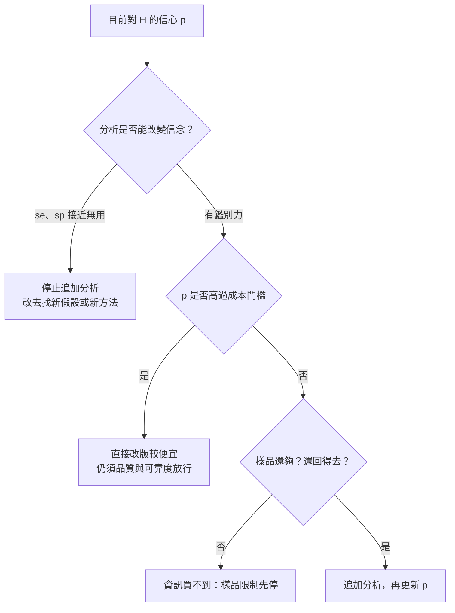

# 10 再做一次分析，值不值得？

## 開場問題

定位已經指向一條可能接錯的線，FIB 編修也讓那一顆樣品的功能恢復了。下一步有人會說「再分析一次更保險」，也有人會說「別再花了，直接改光罩」。這兩句話都把「資訊」和「產品」混在一起。

本章只回答一個比較窄的問題：在一組**明示的教學假設**下，目前對某個根因假設的相信程度要多高，才應該直接改版，而不是再付一次分析的錢與等待時間。模型比較的是期望成本與期望週期，**不能取代品質放行、可靠度判定或合約責任**。全部數字都是本書自訂，不是閎康報價、客戶成本或任何公司的實績。

## 情境：兩個選項，不是無窮追問

工程樣品已經有一個候選根因 H（例如某條連線接錯）。團隊只比較：

| 選項 | 現在付出 | 若 H 其實是錯的 |
|---|---|---|
| A 直接改版投片 | 一次 respin 成本與週期 | 這一版不會好，再付一次分析與一次改版 |
| B 先追加分析 | 分析成本與週期 | 分析若「不支持」，換假設再走一輪 |

分析不是完美的：H 為真時，有敏感度 se 的機率會得到「支持」（真陽性）；H 為假時，有特異度 sp 的機率會正確排除（真陰性）。模型只展開一層後續，不做無窮遞迴——夠回答「現在該不該再分析」。可重算腳本在儲存庫 `plan/matek/analysis_value.py`。

基準假設（成本單位：萬元；時間單位：週）：

| 符號 | 意義 | 基準值 |
|---|---|---|
| p | 目前相信 H 為真根因的機率 | 0.60 |
| c_respin, t_respin | 一次改版的成本與週期 | 300 萬元、12 週 |
| c_fa, t_fa | 追加一輪分析的成本與週期 | 40 萬元、3 週 |
| se, sp | 分析的敏感度與特異度 | 0.90、0.80 |

這些數字刻意選在「分析比改版便宜一個數量級」的區間，用來示範取捨，不是市場調查。光罩成本的公開量級見[第 09 章](09-validation-and-respin.md)引用的分析師估算（[E15](appendix-sources.md#e15)）；那裡的美元數字與這裡的教學單位不要混加。

## 基準算例：先分析比較便宜

執行模型得到：

| 情境 | A 期望成本／週期 | B 期望成本／週期 | 較便宜 | 成本相等的 p |
|---|---|---|---|---|
| 基準 p=0.60 | 436.0 萬元／18.0 週 | 382.4 萬元／17.3 週 | B 先分析 | 0.820 |
| 很有把握 p=0.95 | 317.0 萬元／12.8 週 | 348.8 萬元／15.6 週 | A 直接改版 | 0.820 |
| 分析很貴 c_fa=200 | 500.0 萬元／18.0 週 | 616.0 萬元／17.3 週 | A 直接改版 | 0.154 |
| 分析幾乎無鑑別力 se=0.55, sp=0.50 | 436.0 萬元／18.0 週 | 426.8 萬元／19.4 週 | B 成本略低、時間較長 | 0.655 |

讀這張表時先看口徑：

- **p 高過門檻**，表示你已經夠相信 H，再分析主要是多付錢。基準假設下這個門檻約 0.82。
- **分析變貴**（例如要再做一輪 TEM 與編修），門檻會大幅下降：即使信心只有中等，直接改版的期望成本也可能較低。
- **分析沒有鑑別力**（se + sp 接近 1 的無用檢驗）幾乎不改變信念，只是多付一次錢與時間。表中最後一列成本差很小，週期反而變長——這正是「再做一次看起來很便宜、其實買不到資訊」的情況。

*圖 10-1：教學決策框架。門檻由模型參數決定，不是閎康或任何公司的內部規定。品質放行不在本圖內。*

## 樣品限制比期望成本更硬

模型假設永遠還有下一顆樣品、下一次分析。真實情況常常先碰到：

- 只剩這一顆，再去做層或編修就無法保留對照（[第 05 章](05-sample-preparation.md)、[第 08 章](08-editing-limits.md)）。
- 症狀不可重現，再分析只是對雜訊付費（[第 03 章](03-trust-the-symptom.md)）。
- 目標層鑽不到，分析在可達性上已經失敗（[第 08 章](08-editing-limits.md)）。

這三條是**停止條件**，不是成本公式的輸出。期望成本再低，也不能授權你把最後一顆樣品切掉卻換不回可詮釋的證據。

反過來說，期望成本也不能授權放行。一批貨能不能出、一版光罩能不能投，仍要回到[第 01 章](01-failure-and-disposition.md)的三種對象與[第 09 章](09-validation-and-respin.md)的驗證範圍。本章故意不把「B 比較便宜」寫成「應該再分析到根因百分之百確定」。

## 閎康的公開證據能支持到哪裡

| 欄位 | 內容 |
|---|---|
| **已確認事實** | 閎康自述每月服務件數超過 2000 件、多數項目交期在 24 小時以內（[C13](appendix-sources.md#c13)）；2026 年 1–7 月合併營收有月報（[C14](appendix-sources.md#c14)）。 |
| **合理推論** | 交期與件數的自述，只說明公司把周轉當成公開賣點；不能代入本章的 c_fa 或 t_fa。 |
| **尚待查證** | 任何服務項目的實際報價、案件級週期分布、FA／FIB 的事業別收入。C14 只有總營收，沒有拆分（[第 11 章](11-matek-evidence-map.md)）。本章所有算例因此保持為教學假設。 |

把「24 小時交期」讀成「所以再分析一次很便宜」，是把公司行銷句子偷換成模型參數。交期自述未附服務類型、樣品狀態與是否含定位＋製備＋編修。

## 推理檢查

1. p 從 0.60 升到 0.95，為什麼較便宜的選項會從 B 換成 A？
2. 分析幾乎沒有鑑別力時，為什麼不該因為「反正才 40 萬」就再做一次？
3. 最後一顆樣品還能不能套用本模型的 B 選項？
4. 閎康月營收成長，能不能用來調降本章的 c_fa？
5. 期望週期較短，是否表示可以提早出貨？

??? note "參考推理"
    1. 因為你已經夠相信 H，分析的期望價值低於它的成本；門檻約 0.82。
    2. 因為付出去的錢幾乎不更新 p，只是延後決策；若 se、sp 無鑑別力，應改方法而不是重複同一檢驗。
    3. 不能直接套。B 假設分析後還能改版與再分析；最後一顆樣品先觸發停止條件。
    4. 不能。總營收沒有事業別成本，也不是單件分析價格。
    5. 不能。週期是教學期望值，出貨仍取決於品質與合約，不由期望成本授權。

## 來源與待查

模型與自我檢查見 `plan/matek/analysis_value.py`。光罩成本量級的外部來源見 [E15](appendix-sources.md#e15)，僅供第 09 章閱讀，不代入本表。公司交期與營收見 [C13](appendix-sources.md#c13)、[C14](appendix-sources.md#c14)。

真實分析報價、敏感度與特異度沒有公開一手來源，因此本章不提供「業界平均」。取得特定情境的成本與鑑別力之後，只能替換參數重算，不能把基準列當成預測。

---

[← 09 從樣品驗證到重新投片](09-validation-and-respin.md) ｜ [11 閎康服務證據矩陣 →](11-matek-evidence-map.md)
