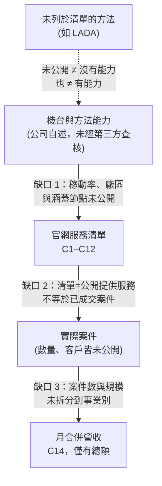

# 11 閎康交付哪些證據與服務？

## 開場問題

把前十章的框架講完之後，很自然會問一句：「那閎康到底做得到什麼？」這個問題本身已經帶了一個容易被忽略的預設——把「公司公開說了什麼」和「公司實際做到了什麼」當成同一件事。

[第 01 章](01-failure-and-disposition.md)已經定調：失效分析服務商交付的是**報告、定位結果、影像與分析數據，不是修好的產品**。[第 07 章](07-circuit-edit.md)進一步收窄：電路編修交付的是**可驗證的工程樣品，不是量產修復方案**。本章要做的，是把這兩條定調套在閎康官網公開的每一項服務上，逐項標出「官網公開說了什麼」「能支持什麼」「不能支持什麼」，讓讀者知道這張清單能撐到哪一層。

## 公司身分：連「掛牌市場」都要分欄查證

在談服務之前，先確認我們在談的是哪家法人。TPEx（證券櫃檯買賣中心）上櫃公司基本資料集列有代號 3587 閎康科技股份有限公司：設立日 2002-05-14、掛牌日 2009-08-18、資料日（2026-09-16）實收資本額新台幣 693,699,880 元、董事長謝詠芬（[C20](appendix-sources.md#c20)）。

這裡有一個現成的「公司自述與主管機關資料需分欄」案例：閎康官網投資人專區頁面文字寫「TWSE: 3587」，但臺灣證券交易所（TWSE，上市）的個股日成交與法說資料集查無 3587，證券櫃檯買賣中心（TPEx，上櫃）的上櫃公司基本資料集則查得（[C20](appendix-sources.md#c20)）。本書依交易所資料集歸屬為上櫃，並把官網「TWSE」用字列入待查——**連公司自己網站上的一個代號標示，都可能與監理機關資料不一致，這正是本章要示範的查證態度：任何一句公司自述，都要問「這句話能不能被獨立資料印證」。**

## 服務分類：閎康官網的七大類

閎康官網「全服務項目」頁把服務分成七大類：RA 可靠度測試、FA 故障分析、MA 材料分析、SA 表面分析、CA 物理化學分析、樣品製備處理、整合性分析（[C1](appendix-sources.md#c1)）。這是一張**分類架構**，證明閎康公開陳列這些子項目確實存在於官網之下，不能反過來證明任一子項目的產能、案件量或客戶。本章聚焦於與前十章技術框架直接相關的項目：FIB 電路修補、FIB 顯微鏡、FA、MA、RA、Thermal EMMI、IR-OBIRCH、SEM、TEM、TEM 試片製備、IC 去封膠。

## 服務／用途／證據矩陣

| 服務項目 | 官網公開說了什麼 | 能支持什麼 | 不能支持什麼 |
|---|---|---|---|
| **FIB 電路修補**（[C2](appendix-sources.md#c2)） | 「閎康科技目前共有 15 台可以提供 IC 線路修補服務的單粒子束聚焦式離子束 (Single Beam FIB, SB-FIB) 顯微鏡」；「閎康擁有多種 FIB 機台 (Single Beam / Dual Beam / Dual Beam Plasma FIB)」；分析應用清單含 GDS自動導航線路定位 (Auto-Navigation to Designated Failure Address)、故障位置定位用被動電壓反差分析 (Passive Voltage Contrast Analysis for Fault Isolation) | 公開提供電路編修服務；自述機台種類與 SB-FIB 台數；自述具備圖資導航與電壓對比定位能力 | 15 台的廠牌、型號、廠區、稼動率；可支援到哪些節點與堆疊結構；任何客戶案件量、成功率或週轉時間（詳見[第 07 章](07-circuit-edit.md)結尾三欄表） |
| **FIB 聚焦離子束顯微鏡**（[C3](appendix-sources.md#c3)） | FIB 同時被列為材料分析類技術；「聚焦離子束顯微鏡是利用高能離子束對材料進行奈米級加工、剖面製備與微結構分析的精密分析技術」，可結合 SEM 形成雙束系統 | FIB 同時定位為材料分析工具與電路修補服務，兩種用途並存 | 未列型號廠牌；無法判斷與 C2 所述 15 台是否重疊或分開計算 |
| **FA 故障分析**（[C4](appendix-sources.md#c4)） | 官方定義失效分析；子服務清單含電性故障分析、非破壞性分析、矽光子分析測試服務 | 官方定義文字與服務清單本身存在 | 市占率、案件量、客戶滿意度；清單存在不等於任一案例確定用了清單上的哪個方法 |
| **MA 材料分析**（[C5](appendix-sources.md#c5)） | 本次查核未取得完整逐字原文，僅確認列出 SEM、TEM、FIB、DB P-FIB、EBSD、EELS 六項子服務品項 | 六項品項清單本身存在於官網分類頁 | 因未取得逐字原文，本書不以引號呈現本頁段落；官網若有「最完整」一類市場地位用語，本次未經人工複查，不能引用 |
| **RA 可靠度測試**（[C6](appendix-sources.md#c6)） | 可靠度定義（含引用 1957 年美國國防部電子設備可靠度顧問小組定義）；子分類含板級、元件、系統、ESD 靜電防護測試與設計、車用元件可靠度服務 | 官方定義文字與子分類清單存在 | 實際執行案例數量、客戶名單；定義性文字不能作為技術能力優劣的證據 |
| **Thermal EMMI 熱點定位**（[C7](appendix-sources.md#c7)） | 使用高靈敏度 InSb 紅外偵測器搭配鎖定放大技術；設備平台名稱 Thermo ELITE、HAMAMATSU THEMOS mini；聲稱可在數秒內達 <1 mK 溫度解析度 | 公開提供熱輻射式熱點定位服務，以及自述偵測器類型與平台名稱 | **頁面未載明技術限制**；解析度數字未附量測條件與樣品前提，不能推論在任何封裝、任何基板厚度下皆成立 |
| **IR-OBIRCH**（[C8](appendix-sources.md#c8)） | 「透過紅外雷射掃描 IC 表面（或背面），藉由局部加溫引發電阻變化」；設備平台 HAMAMATSU uAMOS-200、Meridian S | 公開提供光學式電阻變化定位服務，以及原理與平台名稱 | 阻值門檻與應用範圍未說明適用哪些製程節點；不等於任何案件的實際偵測結果 |
| **SEM**（[C9](appendix-sources.md#c9)） | 技術原理說明；自述設備型號為 Hitachi 系列（S-4800、S-8020、SU-8220 等 FE-SEM） | 技術原理與自述設備型號 | 台數、購置年份、所在廠區；型號清單不能證明特定案例用了哪一台 |
| **TEM**（[C10](appendix-sources.md#c10)） | 技術原理說明；自述設備為 Talos 系統，具場發射電子槍，搭配 EDX/EELS 分析模組 | 技術原理與自述設備 | 同上：台數、購置年份、所在廠區未公開 |
| **TEM 試片製備**（[C11](appendix-sources.md#c11)） | 三種製備法：Pre-Thin（機械研磨後 FIB 減薄）、Lift-out（FIB 切割後靜電吸取）、Omni-probe（FIB 沉積鉑焊接探針取出），並列出各法「典型」耗時 | 三種製備法的名稱與大致流程存在 | 耗時數字為官網對「典型」流程的描述，不適用所有樣品；不能佐證良率或成功率 |
| **IC 去封膠**（[C12](appendix-sources.md#c12)） | 「透過特定技術將積體電路封裝中的環氧樹脂封膠去除」；三種子服務：Delayer 乾式蝕刻及研磨去層、雷射蝕刻去封膠、化學蝕刻去封膠 | 定義文字與三種子服務名稱存在 | 本頁未逐一說明各方法適用材料與風險，不足以支持三種方法的優劣比較 |

*表 11-1：服務／用途／證據矩陣。每一列的「不能支持什麼」欄，是本書刻意留白、不代填數字的地方。*

*照片 11-A：SEM 機台外觀（JEOL JSM-6340F，劍橋大學）。閎康自述為 Hitachi 系列，此圖只用來認「SEM 是什麼樣子的儀器」，不是閎康設備，也不能證明台數或廠區。* [來源與署名](99-image-credits.md#photo-11-sem)

*照片 11-B：TEM 機台外觀。閎康自述為 Talos 系統；此圖同樣只認儀器類型，不是閎康機台，也不能推出案件量。* [來源與署名](99-image-credits.md#photo-11-tem)

## 公司規模自述：交期與件數是自述，不是查核結果

公司簡介頁自述 2002 年成立、取得經濟部工業局專函核准提供研發服務和智慧財產權服務，定位為知識經濟產業；並列出台灣（新竹、竹北、台南）、中國大陸（上海、廈門、深圳、蘇州）、日本（熊本、名古屋、北海道）多國據點，以及 ISO-9001、IECQ-17025、ISO-27001 等品質認證（[C13](appendix-sources.md#c13)）。

同一頁自述「每月服務件數超過2000件，多數服務項目的交期都在24小時以內」（[C13](appendix-sources.md#c13)）。這句話能支持的是「公司如此宣稱」，不能支持「經第三方查核的產能數字」——本書沒有任何機制能驗證這個件數與交期是否對所有服務類型、所有廠區都成立。

## 營收：只有總額，看不到事業別

每月營收報告頁揭露 2026 年 1–7 月各月合併營收與年增率：1 月 454,787 仟元（+17%）、2 月 431,471 仟元（+6%）、3 月 538,162 仟元（+21%）、4 月 540,737 仟元（+23%）、5 月 544,461 仟元（+27%）、6 月 558,424 仟元（+11%）、7 月 563,117 仟元（+19%），累計 3,631,159 仟元（[C14](appendix-sources.md#c14)）。

這份資料的邊界很明確：**只有營收，沒有損益，也未揭露 FA／MA／RA／FIB 的事業別組成**（[C14](appendix-sources.md#c14)）。113 年年報把這條邊界寫得更死：營業比重表只有「檢測服務收入」100%（[C24](appendix-sources.md#c24)）。換句話說，即使月營收持續正成長，也不能推論是哪一項服務貢獻了成長，更不能用總營收反推電路編修業務的規模——這是把「總量在漲」偷換成「我關心的那條線在漲」的典型錯誤，[第 10 章](10-analysis-economics.md)談過類似的推論陷阱。

## 對照前十章：清單上沒有，不等於沒有能力

[第 04 章](04-localization.md)討論過的電性定位方法裡，Thermal EMMI（[C7](appendix-sources.md#c7)）、IR-OBIRCH（[C8](appendix-sources.md#c8)）以及後來補查的 EBIRCH、EBAC、EBIC（[C29](appendix-sources.md#c29)、[C30](appendix-sources.md#c30)）都有官網詳細頁。LADA（雷射輔助元件改變）則完全沒有出現在官網服務清單的任何一層。

這兩種狀態要分開讀：**有名稱且有詳細頁**（Thermal EMMI、OBIRCH、EBIRCH、EBAC、EBIC）、**清單上完全沒有這個名稱**（LADA）。第二種不能直接讀成「閎康沒有這個能力」——服務清單是公司選擇公開的子集，不是公司實際設備清單的完整鏡像；但也不能反過來讀成「閎康一定有這個能力只是沒寫」。有詳細頁也不等於有與第 04 章一手文獻相同的量測條件。誠實的寫法只有一種：**未公開，不代填；已公開的，只寫到原文支持的那一層。**

*圖 11-1：從能力到收入之間有三道未揭露的缺口；虛線表示「清單外」這件事本身無法定性。*

## 推理檢查

1. 官網投資人頁寫「TWSE: 3587」，交易所資料集卻查不到，這件事本身能不能用來否定閎康是上櫃公司？
2. C29／C30 現在有 EBIRCH、EBAC、EBIC 的詳細頁，這能不能證明閎康具備與第 04 章一手文獻相同水準的定位能力？
3. 月營收累計 3,631,159 仟元，年增率也逐月為正，這能不能支持「FIB 電路修補業務正在成長」？
4. C2 自述 15 台 SB-FIB 機台，這個數字最多能支持到哪一層結論？
5. 為什麼「公司自述」與「主管機關資料」的分欄做法，值得在每一項服務矩陣裡重複做一次，而不是只在公司身分那一節做一次？

??? note "參考推理"
    1. 不能。這只能證明官網用字與交易所資料集之間有一個未解釋的落差；閎康是否上櫃需要看交易所自己的資料集（[C20](appendix-sources.md#c20)），而不是看官網怎麼寫自己的股票代號歸屬。兩者是不同層級的證據。
    2. 不能。詳細頁證明公司自述了原理與應用分類；亮點面積等數字未附量測條件，仍不能等同第 04 章設備原廠或實驗論文的能力邊界。
    3. 不能。C14 只揭露總營收與年增率，沒有拆分到 FA／MA／RA／FIB 任一事業別；把總量成長歸因到其中一項服務，是本章反覆警告的推論斷點。
    4. 最多支持「公司自述在查閱當下擁有這個數量與種類的機台」。不能支持廠牌、型號、稼動率、可達節點，更不能支持任何案件的成功率或客戶採用情形。
    5. 因為每一項服務都有自己的「自述—查證」落差：機台數量、耗時、交期、營收成長，都是公司選擇公開的敘述。把分欄檢查只做一次、然後假設其餘服務項目都同樣可信，等於把單一案例的查證結果泛化到整張清單，這正是本章要避免的錯誤。

## 來源與待查

本章主張的出處：公司身分與掛牌市場（[C20](appendix-sources.md#c20)）；服務分類架構（[C1](appendix-sources.md#c1)）；FIB 電路修補（[C2](appendix-sources.md#c2)）；FIB 顯微鏡（[C3](appendix-sources.md#c3)）；FA（[C4](appendix-sources.md#c4)）；MA（[C5](appendix-sources.md#c5)）；RA（[C6](appendix-sources.md#c6)）；Thermal EMMI（[C7](appendix-sources.md#c7)）；IR-OBIRCH（[C8](appendix-sources.md#c8)）；SEM（[C9](appendix-sources.md#c9)）；TEM（[C10](appendix-sources.md#c10)）；TEM 試片製備（[C11](appendix-sources.md#c11)）；IC 去封膠（[C12](appendix-sources.md#c12)）；公司規模自述（[C13](appendix-sources.md#c13)）；月營收（[C14](appendix-sources.md#c14)）。

待查記在[待查問題](appendix-open-questions.md)：官網「TWSE: 3587」用字與交易所歸屬不一致的原因；事業別收入；上海處分兩套數字的口徑。MA 頁已確認原文為「國內規模最為齊全的材料分析電子電機實驗室」（[C5](appendix-sources.md#c5)），屬公司自述。EBIRCH／EBAC／EBIC 詳細頁見 [C29](appendix-sources.md#c29)、[C30](appendix-sources.md#c30)。

宜特（iST）是與閎康各自獨立的上櫃同業，不是閎康的關係企業；本章未引用其資料。

---

[← 10 分析的資訊價值與停止條件](10-analysis-economics.md) ｜ [12 消息判讀與改判條件 →](12-reading-company-news.md)
