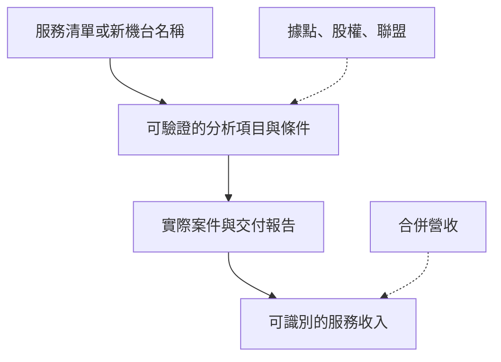

# 12 一則閎康消息能證明到哪一步？

## 開場問題

看到「擴點」「加入聯盟」「營收年增」，先不要把它讀成「失效分析訂單在成長」。把消息改寫成：哪個法人、哪一天、對什麼服務或據點做了什麼、目前到哪個階段，以及什麼後續資料會讓你改判。

本章用實際公開文件練習。來源明述、作者推論與未知分開；公司自述與主管機關資料分欄。三則主案例都發生在 2026 年 7 月至 9 月查閱窗口內。

## 結構：能力、案件與收入之間沒有自動箭頭

*圖 12-1：證據階梯是判讀框架。虛線表示可能提供背景，不能跳過中間證據。合併營收也未必拆出 FA／FIB。*

## 案例一：出售上海子公司——兩套數字不要私自調和

**來源明述。** 2026-07-31 的重大訊息轉載（中央社／Yahoo 欄位，本次未直接打開 MOPS 表單頁）寫：出售閎康技術檢測（上海）**78.4658%** 股權，交易總金額人民幣 **1,202,443,700** 元（約新台幣 56.39 億），交割後持股 **21.5342%**，董事會決議日 115/07/31，交割完成後喪失控制力、不再列入合併報表（[C25](appendix-sources.md#c25)）。官網新聞於 2026-08-03 寫：處分 **80%** 股權，「處分價值約人民幣 15.2 億元，折合新台幣約 72.69 億元」，保留 20%，預計 2026 年底前交割（[C16](appendix-sources.md#c16)）。

兩套數字並列如下，**不調和**：

| 項目 | 重大訊息轉載（2026-07-31） | 官網新聞（2026-08-03） |
|---|---|---|
| 處分比例 | 78.4658% | 80% |
| 金額 | 人民幣約 12.02 億（約新台幣 56.39 億） | 「處分價值」約人民幣 15.2 億（約新台幣 72.69 億） |
| 保留持股 | 21.5342% | 20% |
| 交割 | 完成後喪失控制力；未寫已交割 | 預計年底前完成 |

**作者推論。** 可以確定的是：公司已就中國子公司控制權提出一筆可追溯的董事會決議與對外說明。若交割完成，合併範圍與中國據點的歸屬會變。不能從「出售實驗室」推出「台灣 FA／FIB 產能增加」或「已收到對價」。

**未知。** 截至 2026-09-17 是否已交割；兩套百分比與金額為何不同（全數股權價值 vs 本次交易總價、四捨五入，或其他口徑）；對上海、蘇州、廈門、深圳服務產能的影響。113 年年報刊印時尚列上海 100% 持股，時點早於本案（[C24](appendix-sources.md#c24)），不能用來描述 2026 年 8 月之後的控制權。

**改判條件。** 取得 MOPS 原件或交割完成公告，應先更新比例、金額與控制權；若後續財報把中國收入拆出或停止合併，才能談合併營收口徑改變。在此之前，兩套數字並存，引用時必須標來源，不可各取一個「比較圓」的數字。

## 案例二：加入 TASA iSPARK 星創基地

**來源明述。** 官網 2026-08-05 新聞寫，閎康加入 TASA iSPARK，並稱「為太空產業鏈夥伴提供材料分析、失效分析、可靠度驗證與技術支援服務」（[C17](appendix-sources.md#c17)）。活動相關日期見該頁（內文提及 2026-07-31）。

**作者推論。** 這支持「公司公開把既有分析能力對準太空產業」的定位陳述。若後續出現可識別的太空相關認證、設備或收入科目，才有機會往「新業務」走一階。

**未知。** 具名客戶、訂單、專屬設備、營收貢獻。加入聯盟不是採購單。

**改判條件。** 正式揭露太空相關認證、持續案件或收入科目，可上修「已形成交付」；若只有重複的聯盟消息與用途敘述，維持「公開表態」。若年報風險或事業說明從未出現太空，不要用新聞標題補一條事業線。

## 案例三：月營收、遠端上機，與「檢測收入 100%」

**來源明述。** 官網 2026-09-16 公布 8 月合併營收 5.65 億元、月增 0.38%、年增 17.78%，1–8 月累計 41.96 億（[C26](appendix-sources.md#c26)）。同一頁對照表出現「2025 7月」字樣與 MOM 數字並列，語意可疑，引用時照錄並註記，不私自改成「2026 7月」。2026-09-04 另公告遠端上機適用 InGaAs、OBIRCH、ThermoELITE、SEM，廠區矽導、竹北、台南（[C27](appendix-sources.md#c27)）。113 年年報營業比重表只有「檢測服務收入」100%，沒有 FA／MA／RA 分列；當年合併營收 5,110,392 仟元（[C24](appendix-sources.md#c24)）。

**作者推論。** 月營收正成長與公司整體營運相容，但不能識別是哪一項服務在成長。遠端上機證明公司公開把四種機台做成遠端操作選項，不能推出 FIB／TEM／奈米探針也能遠端，更不能推出分析品質等同現場。年報的 100% 檢測收入，反而強化[第 11 章](11-matek-evidence-map.md)的缺口：總額看得到，事業別看不到。

**未知。** 8 月營收有多少來自 FA、FIB、中國據點或日本；遠端案件量；毛利。媒體轉載稱「規模最大」「日本成長近 50%」（[C28](appendix-sources.md#c28)）是媒體敘述，不能當獨立市占證據，也不可與年報 51.10 億逕自調和成年份相同的數字。

**改判條件。** 若之後公布可比的服務別收入或地區別拆分，才能把成長歸因到某一條線。若只有總額，保留多種解釋。遠端若擴及 FIB 並附案件與品質說明，才能擴大「遠端可做什麼」的範圍。

## 操作：自己完成一則未來消息

| 欄位 | 填寫要求 |
|---|---|
| 事件與日期 | 區分董事會決議、新聞發布、交割、查閱日 |
| 工件與角色 | 寫的是分析報告、機台、據點股權，還是聯盟名義 |
| 直接事實 | 用來源真正明述的範圍；兩套數字就並列 |
| 推論與成立條件 | 列出能力→案件→收入之間缺的環節 |
| 替代解釋 | 至少一個同樣符合目前資料的原因 |
| 改判條件 | 什麼文件出現時，目前判讀應被推翻 |

## 推理檢查

1. 為什麼不能把官網「80%／15.2 億」改寫成重大訊息裡的數字，讓它「看起來一致」？
2. 加入太空聯盟，缺哪一層證據就不能寫「已打入太空供應鏈」？
3. 8 月營收年增 17.78%，為什麼不能寫成「FIB 電路修補需求上升」？
4. 年報寫檢測服務 100%，對讀新聞有什麼幫助？
5. 遠端上機列出 SEM 與 OBIRCH，能推出 TEM 電路編修也可以遠端做嗎？

??? note "參考推理"
    1. 因為口徑可能不同，且本次未取得 MOPS 原件；私自調和會消滅真正的待查問題（[C16](appendix-sources.md#c16)、[C25](appendix-sources.md#c25)）。
    2. 缺具名客戶、認證、持續交付與收入科目（[C17](appendix-sources.md#c17)）。
    3. 總額沒有事業別（[C26](appendix-sources.md#c26)、[C24](appendix-sources.md#c24)）。
    4. 它事先警告你：任何「某項服務很賺」的新聞，都無法被這份年報直接證實。
    5. 不能。適用機台名單是封閉清單，未列即未主張（[C27](appendix-sources.md#c27)）。

## 來源與待查

上海處分：[C16](appendix-sources.md#c16)、[C25](appendix-sources.md#c25)。聯盟：[C17](appendix-sources.md#c17)。營收與遠端：[C26](appendix-sources.md#c26)、[C27](appendix-sources.md#c27)。年報：[C24](appendix-sources.md#c24)。媒體轉載：[C28](appendix-sources.md#c28)。

MOPS 原始公告頁、交割完成文件、114／115 年報精讀、事業別收入均未取得。見[待查問題](appendix-open-questions.md)。

---

[← 11 閎康服務證據矩陣](11-matek-evidence-map.md) ｜ [來源索引 →](appendix-sources.md)
