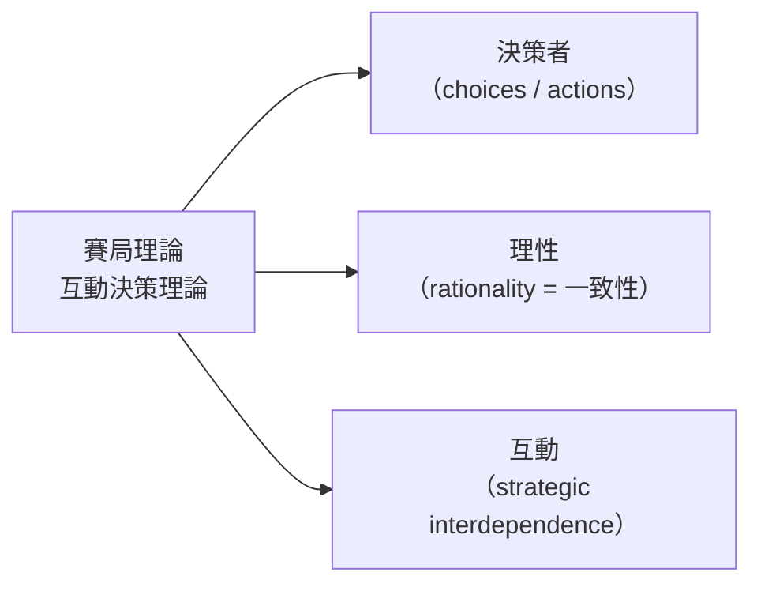
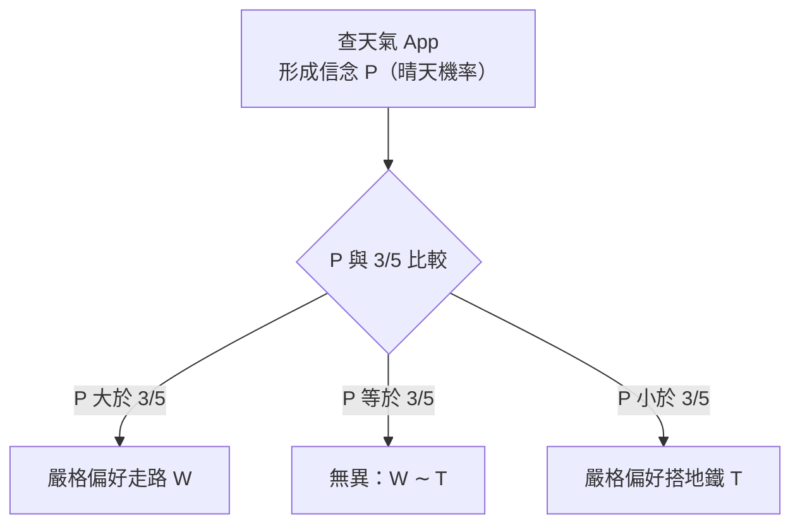

# 第 01 章：個體決策導論

> 本章對應 MIT 14.12 Lecture 1（Introduction to Individual Decision-Making）。閱讀筆記見 [notes/lecture-01-individual-decision-making.md](notes/lecture-01-individual-decision-making.md)。

## 導讀

這一章要回答兩個層次的問題。

第一，**什麼是賽局理論（game theory）？** 講者引兩位諾貝爾獎得主的定義：Roger Myerson 說它是「研究智慧、理性的決策者之間衝突與合作的數學模型」；Robert Aumann 給了更精簡的版本——「互動決策理論（interactive decision theory）」，也就是「當人們的決策彼此互動時，人們如何做決策」。全課的主軸就藏在「互動」二字。

第二，既然要研究「互動」的決策，為什麼第一講反而**拿掉互動、只研究單一決策者**？因為在理解理性的人彼此互動之前，得先理解一個理性的人「獨自」時如何選擇。個體決策（individual decision-making）是後面所有賽局分析的地基。

讀完本章，你應該能：用「操作性」觀點理解偏好（preferences）、分辨序數效用（ordinal utility）與基數效用（cardinal utility）、在不確定下用信念與期望效用（expected utility）做選擇、寫下彩券（lottery）的形式化框架，並理解風險趨避（risk aversion）為何等於效用函數的「凹性」。

## 核心內容

### 拆解賽局理論的定義

講者把「研究互動的理性決策者」逐詞拆開，由易到難：

- **決策者（decision makers）**：研究的是「做選擇（choices）／採取行動（actions）」的人。賽局理論極為抽象、通用，可套用到猜一個數字、要不要上 MIT、公司訂什麼價、選什麼工作、每週工作幾小時、政黨的選舉綱領、投票給誰……正是這種抽象性讓它應用面極廣，主要在經濟學，也延伸到政治學與政治議價。

- **理性（rationality）＝一致性（consistency）**：這是最容易被誤解的詞。賽局理論裡的「理性」不同於日常用語。**偏好本身不能被說成不理性**——你喜歡巧克力、朋友喜歡香草，都沒有對錯。能被判定為不理性的是「給定偏好下的選擇」：如果朋友明明偏好巧克力卻選了香草，那個「選擇」才叫不理性，因為他沒有在最大化自己的目標。所以理性談的其實是「一致地朝自己的偏好行動」。一致性也有適用範圍——一個人 20 歲與 2 歲的偏好差很多，但今天與明天大致穩定。

- **互動（interacting）**：這是賽局理論與其他決策問題的分水嶺。很多情境裡大家都在做決定，但決策之間沒有互動、不必顧慮別人。賽局理論關心的是**當我要做選擇時，必須把別人會怎麼做納入考量，因為別人的行動會影響我的偏好**。這稱為**策略互賴（strategic interdependence）**：對我最好的行動，取決於別人怎麼做。經典例子是罰球或網球發球——射左或射右並無先天好壞，全看守門員往哪撲、接發球者打算怎麼接。

講者最後補充一點「行動者是誰」的彈性：賽局理論的 agent 不限個人，也可以是演化中的物種、公司、政府、委員會，甚至 LLM／演算法。有一種漸成主流（但可辯論）的看法是：在 AI 世界裡，賽局理論的理性假設反而更貼切。

**本講的取捨**：今天暫時把「互動」拿掉，只研究單一理性決策者，作為基準；互動留給之後 24 講。

### 從一個課堂遊戲看「互動」

上任何形式材料之前，講者用 MobLab 平台帶全班玩了一個遊戲，讓大家親身體會「互動決策」。

**規則**：每人被隨機指派 1 到 100 的整數（均勻分布），只有自己知道；每人再猜一個 1 到 100 的數。贏家是猜得**最接近「全班猜測值平均的 2/3」**的人（只有榮譽、沒有獎品）。要注意判準用的是「大家猜的數」的平均，不是「大家被指派的數」的平均。

| 輪次 | 猜測平均 | 得勝猜測（≈ 平均的 2/3） |
|---|---|---|
| 第一輪 | 約 36 | 約 24 |
| 第二輪 | 21 | 14 |

第二輪整體明顯下移。講者藉此帶出幾個關鍵直覺：

- **無窮遞迴（infinite regress）**：要猜得好，我得想別人拿到什麼數、別人會怎麼猜；但別人也在想我怎麼猜，而他們想我時又在想「我怎麼想他們」……歷史上一度有人認為這種遞迴無解，而賽局理論正是把這種推理形式化的工具。若一直玩下去，猜測會逼近 0（但總有人故意出 100）。
- **偏好建模的重要性**：每年討論後都有人「跳到 100」搗蛋。如果你假設所有人的目標是「贏」，但有人的目標其實是弄亂結果或逗朋友笑，你的預測就會錯。**建模時必須正確寫下人們真正的偏好**。
- **賭注（stakes）會改變偏好**：課堂只賭榮譽，才有人搗蛋；若贏 $10、$100,000，搗蛋的人會越來越少。把實驗室結果外推到現實時，賭注是關鍵變數。

這個遊戲常被稱為 **Keynesian beauty contest（凱因斯選美賽局）**。（問題集會有一個「會給你數字」的變體。）

## 形式化與定義

### 偏好：操作性的定義

考慮一個簡單選擇問題：在咖啡店三選一——咖啡（C）、濃縮咖啡（E）、茶（T）（先不談價格）。決策者的偏好是這些選項上的一個排序：

$$C \succ E \succ T$$

即偏好咖啡勝過濃縮咖啡、濃縮咖啡勝過茶。這樣寫隱含**遞移性（transitivity）**：若 C≻E 且 E≻T，則必然 C≻T。

「偏好 C 勝過 E」到底是什麼意思？經濟學不糾結於哲學或神經科學，而採**操作性／決策式（operational / decision-based）的定義**：

> 「我偏好咖啡勝過濃縮咖啡」的意思，就是「當我面對咖啡與濃縮咖啡的選擇時，我選咖啡」。

偏好是**成對（pairwise）**的物件：對任兩個選項，指出偏好哪一個；再由此推廣到更豐富的選單。比較兩物時只有三種可能：嚴格偏好其一、嚴格偏好另一，或**無異（indifferent，記 ∼）**。

!!! note "課堂澄清：選項要窮盡"
    寫選擇問題時必須**涵蓋每一個可能選項**，且只能選一個。若「什麼都不喝」也是選項，就得列為第三項並指定效用；若可以「同時點咖啡和濃縮咖啡」，那個組合是另一個獨立選項。少列選項，模型就抓不住真正的選擇問題。

### 序數效用：只有次序有意義

一堆兩兩不等式很難處理，於是改用**效用函數（utility function）** u 來表示偏好。例如：

$$u_1(C)=5,\quad u_1(E)=4,\quad u_1(T)=1$$

因為指派給 C 的值大於 E、E 大於 T，這組數值就「表示」了偏好 C≻E≻T，並自動滿足遞移性（數字的大小本身遞移）。

但這只是一種**表示**。換另一組數值 $u_2$（只要保持同樣的大小順序）表示的是**同一組偏好**。這就是**序數效用（ordinal utility）**的意思：

- **只有次序（order）有意義**；同一偏好有無限多種效用表示。
- **數值與單位沒有實質意義**。效用的單位有時戲稱「utils」，但你不能因為某表示裡 C 的數字比較大，就說「這個世界我更喜歡 C」。數值只是方便的數學外衣。

### 不確定下的決策：信念與貝氏觀點

賽局裡常要在**不確定（uncertainty）**下做決策——做選擇時不知道後果（買股票不知漲跌）。此時人不是直接選結果，而是面對「結果上的機率分布」。

以「怎麼回家」為例：走路（W）或搭地鐵（T）。天氣可能晴（機率 P）或雨（機率 1−P）。若確定天氣就很好辦（晴天走路、雨天搭地鐵）；難處在於不確定。

面對不確定，你做的事是**形成信念（form beliefs）**。賽局理論採**貝氏（Bayesian）**世界觀：用機率 P 表示「晴天」的信念，1−P 表示「雨天」。查天氣 App，就是在形成（並可能調整）這個信念。

!!! warning "期望效用是一個假設，不是顯然"
    給定信念後怎麼選？本課**假設期望效用最大化**，但講者強調這並非唯一選項：樂觀者可能用「最好情況最大化」，悲觀者可能用「最壞情況最大化」。賽局理論的立場是把樂觀/悲觀反映在**信念**裡，行為上一律採期望效用。它有**公理化基礎**（線上講義附錄討論），本課直接把它當作給定。

    期望效用是兩步驟：**先形成信念，再對每個選擇計算期望效用**。此假設在簡單問題（看天氣）很合理，在極複雜問題（「10 代後的子孫會不會缺錢」）就未必站得住——本課只套用在合理的情境。

### 基數效用：von Neumann-Morgenstern 效用

進入不確定的世界後，「數值無意義」的說法**整個反過來**。因為算期望效用時要把數值代進去——把 7 改成 700 會改變結果。所以此處效用是**基數的（cardinal）**：大小本身有意義。這種效用函數稱為 **von Neumann-Morgenstern（VNM）效用函數**。

務必分清兩個層次的效用：

| 記號 | 名稱 | 定義域 | 意義 |
|---|---|---|---|
| 小寫 $u$ | VNM 效用 | 結果 $Z$ | 每個「結果」給我的效用（如晴天走路） |
| 大寫 $U$ | 期望效用 | 彩券 $\Delta(Z)$ | 每個「彩券／選擇」給我的期望效用 |

給走路例子填上 VNM 效用「7 2 5 5」：

| $u$（VNM 效用） | 晴天 Sunny（機率 P） | 雨天 Rainy（機率 1−P） |
|---|---|---|
| 走路 W | 7 | 2 |
| 搭地鐵 T | 5 | 5 |

> 上表數值由講者口述重建（依口語重建），數值明確。晴天偏好走路、雨天偏好搭地鐵。

計算兩個選擇的期望效用：

$$U(W) = 7P + 2(1-P) = 2 + 5P$$

$$U(T) = 5P + 5(1-P) = 5$$

決策法則：走路 ⇔ $2+5P \ge 5$ ⇔ $P \ge 3/5$。

直覺：天氣夠可能晴（此例臨界 **60%**）才值得走路。臨界值 3/5 完全由基數數值決定——若把 7 改成 700，幾乎總會走路（除非近乎確定下雨）。這再次說明：**在不確定下，效用的基數數值會直接影響決策**。

### 一般框架：結果、彩券、期望效用

把上面的例子抽象化（本課方法論：簡單例子 → 一般抽象模型 → 具體應用）。

**結果／後果集合（outcomes / consequences）**：

$$Z = \{Z_1, Z_2, \ldots, Z_M\}$$

結果必須**涵蓋情境中所有相關的事**。走路例子其實有四個結果（晴天走路、雨天走路、晴天地鐵、雨天地鐵），不是兩個。人不直接選結果，而是選「結果上的彩券」。

**VNM 效用函數**：$u: Z \to \mathbb{R}$，對每個結果給一個基數效用 $u(Z)$。（函數記法 `u: Z → ℝ`——字母後接冒號表示「對前一集合每個元素，指派後一集合中的一個值」。）

**彩券（lottery）**：$\Delta(Z)$ 是 Z 上所有彩券的集合。一張彩券是機率向量

$$P = (P_1, \ldots, P_M),\quad P_i \ge 0,\quad \sum_i P_i = 1$$

意思是「以機率 $P_i$ 得到結果 $Z_i$」。（econ 的「lottery」是抽象用法，不是真的買彩券。）

**期望效用函數**：$U: \Delta(Z) \to \mathbb{R}$，

$$U(P) = P_1 \, u(Z_1) + P_2 \, u(Z_2) + \cdots + P_M \, u(Z_M)$$

在走路例子中，「走路」對應的彩券是 $(P,\,1-P,\,0,\,0)$——後兩個結果（搭地鐵的兩種天氣）機率為 0，因為選了走路就不可能落到地鐵的結果。代入即得 $U = P\cdot 7 + (1-P)\cdot 2$，與前面一致。

!!! note "偏好 vs 選擇：函數對所有彩券有定義"
    $U$ 是**函數**，對「每一張」彩券都有定義——即使某些彩券你在特定情境裡根本選不到。這是**偏好與選擇的區別**：我心裡可以比較「永遠賺 1000% 的股票 vs 永遠賠 1000% 的股票」（偏好），但市場上未必有這種標的可買。現實中你面對的是**有限的選單（menu）**，在其中做選擇。走路例子的選單只有兩張彩券。

!!! note "外生 vs 內生的不確定性"
    在**個體**決策中，所有不確定性都是**外生（exogenous）**的：你透過內省（introspection）對「自然（nature）」形成信念。之後進入**互動**決策時，你得對「別人的選擇」形成信念，就必須對這些信念施加更多結構——這是個體決策與互動決策的重要分界。

### 貨幣彩券與風險趨避

一個特別重要的特例是**貨幣彩券（money lotteries）**：結果集就是金額，$Z = \mathbb{R}$（此處允許 Z 無窮）。比較兩張彩券：

| 彩券 | 內容 | 期望金額（EV） |
|---|---|---|
| $L_1$（較安全） | 0.99 機率得 \$10；0.01 機率得 \$0 | \$9.90 |
| $L_2$ | 0.01 機率得 \$1,000；0.99 機率得 \$0 | \$10 |

$L_2$ 的期望金額較高（\$10 > \$9.90），但多數人偏好較安全的 $L_1$。原因是**人最大化的不是期望金額，而是期望效用**——透過 VNM 效用 $u$（把「金錢」映成「效用」）評估彩券。

當 $u$ 是**凹函數（concave）**時，這個人就是**風險趨避（risk-averse）**的。正式定義：

> 風險趨避者**總是偏好「以確定方式拿到彩券的期望值」勝過該彩券本身**（彩券需非退化 non-degenerate 才是嚴格偏好）。

例如面對 $L_2$，風險趨避者寧可確定拿 \$10，也不要一個期望值 \$10 的賭局。這正呼應一個回溯到 1700 年代的老謎題——「為何有人選期望值較低的彩券？」答案是：**效用函數不等於金錢**，人最大化的是期望效用，而有些人的效用對金錢是凹的。

## 例子與應用

本章出現的幾個小例子各自示範一個重點，可作為後續章節的計算範式：

| 例子 | 示範重點 | 關鍵結論 |
|---|---|---|
| 咖啡 / 濃縮 / 茶 | 偏好與序數效用 | 只有次序有意義；同偏好有多種表示 |
| 走路 vs 地鐵 | 不確定下的期望效用 | $P \ge 3/5$ 才走路；基數數值決定臨界 |
| 兩張貨幣彩券 | 風險趨避 | 期望值≠期望效用；凹效用＝風險趨避 |
| 選美賽局（MobLab） | 互動決策與遞迴推理 | 偏好與賭注的建模至關重要 |

在經濟學外，講者也提到罰球/網球發球（策略互賴）、買股票（不確定下決策）等直覺例子。

## 常見誤解

- **「賽局理論假設人自私又精明」**：不是。這裡的理性只是**一致性**——朝自己（無論什麼）的偏好一致地行動。偏好本身無所謂理性不理性。
- **「偏好可以不理性」**：不行。能被判定為不理性的只有「給定偏好下的選擇」（喜歡巧克力卻選香草）。
- **「效用數值本身有意義」**：序數世界裡沒有；但一進入不確定/期望效用，數值（基數）立刻有意義。兩者不可混用。
- **「最大化期望金額」**：錯。人最大化的是**期望效用**；期望值與期望效用的背離正是風險態度的來源。
- **「人直接選結果」**：不是。人選的是**結果上的彩券**；一個選擇對應一個彩券，而 outcome 必須涵蓋所有相關資訊。
- **「課堂遊戲的結果就是真實世界會發生的事」**：要小心。**賭注**與**參與者真正的偏好**（有人只是想搗蛋）都會左右結果。

## 小結

- 賽局理論是**互動決策理論**：研究理性決策者在決策彼此互賴時如何選擇。
- 定義的三個關鍵詞：**決策者**（選擇/行動）、**理性**（一致性）、**互動**（策略互賴）。
- 研究互動前，先立個體決策的基準：**理性＝一致地最大化偏好**。
- 偏好採**操作性定義**（偏好即選擇），是成對物件，隱含**遞移性**。
- **序數效用**只有次序有意義，同一偏好有多種表示，數值無實質意義。
- 不確定下要**形成信念**（貝氏觀點），並假設**期望效用最大化**（先信念、再算期望效用）。
- 不確定下效用是**基數的（VNM 效用）**，數值大小會影響決策；小寫 $u$（對結果）與大寫 $U$（對彩券）須分清。
- 一般框架：結果集 $Z$、彩券 $\Delta(Z)$、$u:Z\to\mathbb{R}$、$U:\Delta(Z)\to\mathbb{R}$ 且 $U(P)=\sum_i P_i u(Z_i)$。
- **偏好對所有彩券有定義，選擇只在有限選單內**；個體決策的不確定性是外生的。
- **風險趨避＝凹效用函數**：偏好確定的期望值勝過彩券本身；人最大化期望效用而非期望金額。

## 跨章連結

- 前置章節：無（全書起點）。
- 後續章節：[賽局的表示法](02-representation-of-games.md)。本章的期望效用最大化是後續所有解概念的個體理性基準，延伸到 [優勢](03-dominance.md)、[可理性化](04-rationalizability.md)、[Nash 均衡](05-nash-equilibrium.md)；貝氏信念延伸到 [貝氏賽局](16-bayesian-games.md)。
- 待補材料：講者姓名與開課學期（`待查`，逐字稿未自報）；期望效用公理化附錄與問題集（`待補`，不在本地檔案）；序數例的 $u_2$ 具體數值（`待查`，板書未逐一口述）。
