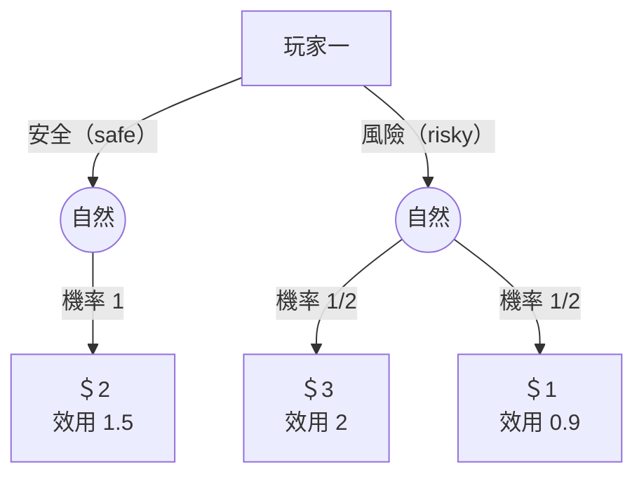
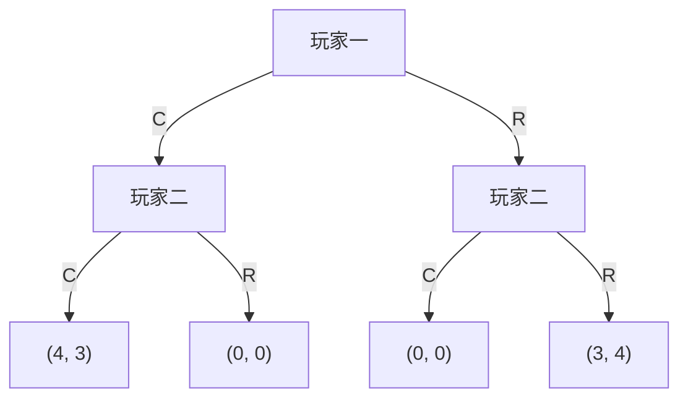
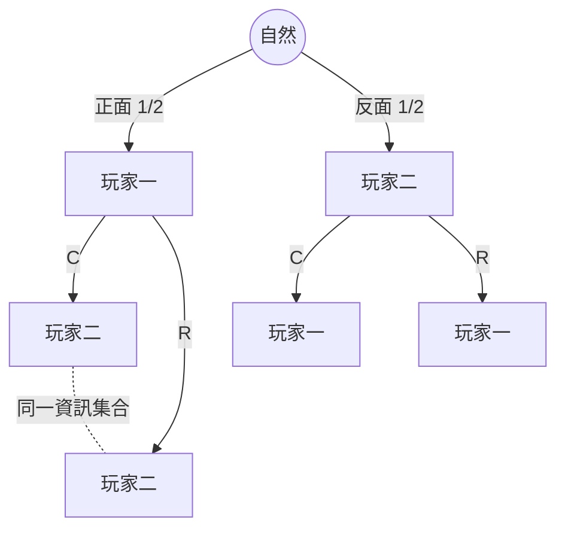

# 第 02 章：賽局的表示法

## 導讀

上一章談的是單人決策問題：一個人面對後果集合、用 von Neumann–Morgenstern（vNM）效用評價各種結果，並以期望效用比較樂透。這一章跨進賽局理論本身——當有多位參與者、而且每個人的最適選擇都取決於別人的選擇時，我們稱這樣的多人決策問題為「賽局（game）」。

本章要回答一個看似基礎、卻決定後面一切分析成敗的問題：**如何把一個策略互動嚴謹地寫下來？** 講者給出兩種表示法，並用一個貫穿全課程的定義把它們連起來：

- **展開式賽局（extensive form game）**：像一棵樹，鉅細靡遺記錄「誰、在什麼時候、面對什麼選擇、看得到什麼、最後得到多少效用」。
- **策略式賽局（strategic form game）**：展開式的摘要，抽掉時間與觀察細節，只留策略分析所需的元素。
- **策略（strategy）**：由展開式跳到策略式的橋樑。講者明言這是「全課程最重要的定義」，考試失分多半源於沒把策略想清楚。

讀完本章，你應能畫出並讀懂賽局樹、理解資訊集合如何模型化「一個人到底觀察到什麼」、正確寫出一個玩家的策略集合，並把展開式賽局化約成策略式賽局。

## 核心內容

### 從個體決策到互動決策

賽局就是「多人版的決策問題」。上一章單一決策者面對的不確定來自運氣；本章的關鍵新意在於：你面對的不確定，有一部分來自**其他有理性、會盤算的人**。因此我們需要一套語言，同時表達「行動的先後」「誰看得到誰的行動」「每個人最後得到多少效用」。

講者在正式定義前先用兩個小例子建立直覺，因為「先講一般理論只會是一堆記號、不夠具體」。

### 例子一：投資賽局（一位策略玩家＋自然）

賽局不一定要有多位玩家。第一個例子只有一位玩家一（player 1），要在**安全投資（safe）**與**風險投資（risky）**間選擇：

- 安全：確定拿到 \$2。
- 風險：可能拿到 \$3，也可能拿到 \$1，機率各半。

這裡出現一位特別的參與者——**自然（nature）**。自然不是策略玩家，它只是「機械地依給定機率抽籤」，用來表達賽局裡的運氣成分。風險投資下由自然以各 1/2 的機率決定報酬 \$3 或 \$1；安全投資可視為自然以機率 1 給 \$2。

但講者強調：**光有金錢報酬並不是完整的賽局設定**。缺的是**偏好**。不能想當然地假設玩家只想最大化期望金錢，因為有人風險趨避、有人風險愛好。要補上的是玩家對每個後果的效用。本例取（僅為示範值）：

$$u(\$2)=1.5,\quad u(\$3)=2,\quad u(\$1)=0.9$$

這帶出一個容易混淆、卻很關鍵的區分：**後果（consequence）以美元計，效用（utility）以 utils 計，兩者不同**。當後果本身就是錢時最容易搞混，但賽局真正用來比較的永遠是效用，而非金錢。這裡的 $u$ 就是上一章的 vNM 效用。

> 圖為依講者口語重建；效用 1.5、2、0.9 為其舉例值。空心圓代表自然的節點。

### 例子二：BOS 賽局（兩位策略玩家與「觀察」的威力）

第二個例子有兩位玩家。它歷史上叫 battle of the sexes（性別之戰），講者刻意避開這個舊稱，改叫 **BOS**，可想成 Boston。故事是：兩位好友要在兩項活動間選擇——一起去看塞爾提克（Celtics，記為 C）球賽，或一起去看紅襪（Red Sox，記為 R）球賽（此處的 game 指球賽，不是賽局）。兩人若各去各的都不開心；都想在一起，但玩家一較想一起看塞爾提克，玩家二較想一起看紅襪。

這個賽局之所以重要，是因為它同時含有：

- **利益衝突（conflict）**：一個想去塞爾提克、一個想去紅襪。
- **協調（coordination）**：兩人都希望到同一個地方。

講者用的報酬設定（玩家一在前、玩家二在後）：

| | 玩家二選 C | 玩家二選 R |
|---|---|---|
| **玩家一選 C** | (4, 3) | (0, 0) |
| **玩家一選 R** | (0, 0) | (3, 4) |

兩人一起看塞爾提克是 (4,3)、一起看紅襪是 (3,4)；只要不一致就各自落單、無聊到「連誰上場都不重要」，報酬 (0,0)。

結構上，玩家一先在 C、R 間選，玩家二再選。課堂問答點出一個決定性的細節：學生說想當「先選」的玩家一，但講者補充——**真正的力量不只來自先動，而是玩家二觀察得到玩家一的選擇**。玩家一去了塞爾提克並讓對方知道，玩家二不想落單就只好跟去。若玩家二看不到玩家一的行動，這就變成完全不同的賽局（實質上是同時行動）。這個「看不看得到」的差別，正是本章形式化的核心，稍後由資訊集合處理。

> 圖為玩家二能觀察玩家一選擇的版本，依講者口語重建。

## 形式化與定義

### 展開式賽局與 PAPI 四要素

前面畫的決策樹，形式上叫**有根樹（rooted tree）**：有一個起點叫**根（root）**，而且從任一節點回到根都只有唯一一條路徑——不能有迴圈或兩條路徑通到同一點。原因很實際：樹上每個節點都要唯一對應一段「歷史（history）」，若有兩條路徑到同一節點，就無法說清楚「我是怎麼走到這裡的」。根也隱含了時間的起點，往前推進即在樹上前進。

一個**展開式賽局**就是一棵有根樹，外加四樣東西。講者用口訣 **PAPI** 記憶：

- **P**layers（參與者）
- **A**ctions（行動）
- **P**ayoffs（報酬）
- **I**nformation（資訊）

這四樣在圖上的呈現方式如下。

**參與者（Players）** 以節點上的標籤指定，而且每個節點恰好屬於一位玩家。但不是每個節點都標玩家——樹末端的**終端節點（terminal nodes）**標的是後果與效用；中間的**決策節點（decision nodes）**才輪到玩家選行動。

我們把所有節點的集合記為 $H$（取自 history，因為每個節點都唯一給出走到該點的行動歷史）。根節點的歷史是「什麼都還沒發生」；某節點的歷史是「玩家一選 C」；再下一個是「玩家一選 C、玩家二選 R」。終端節點的集合記為 $Z \subseteq H$，其餘的決策節點就是 $H \setminus Z$。以剛才畫的 BOS 樹為例，共有 7 個節點，其中 4 個是終端節點（在 $Z$ 中），另外 3 個是決策節點。玩家標為 $i = 1, \dots, N$（可以只有一位），有需要時再加入自然。

**行動（Actions，等同 moves／decisions）** 標在樹的**邊（edges）**上：玩家在某節點有幾個選擇就從該節點畫幾條邊，每條邊標上對應的行動名稱。講者特別提醒：這些行動標籤並非任意可換，之後（後續章節）會用到，標籤是根本的。

**報酬（Payoffs，等同 utilities）** 用 $N$ 個效用函數表示：

$$u_i : Z \to \mathbb{R}, \quad i = 1, \dots, N$$

每個 $u_i$ 給玩家 $i$ 對所有後果的 vNM 效用。可以按玩家分組來看（$u_i$ 掃過所有後果），也可以按後果分組來看——樹上某終端節點寫成 $\big(u_1(\text{該節點}),\, u_2(\text{該節點})\big)$，這正是 BOS 樹上像 $(4,3)$ 那樣的一對數字。一個關鍵約定：**payoffs 永遠指效用，不是金錢**；只要沒特別說 monetary，談的就是效用，因為真正驅動選擇的是效用。

### 資訊集合（information set）

四要素中最需要小心的是資訊。對每位（策略）玩家 $i$，把「輪到 $i$ 行動」的所有決策節點做一次**分割（partition）**，分出來的每一組就是一個**資訊集合（information set）**。分割的意思很單純：把一堆東西分成若干組，每個東西恰好在一組、不能同屬兩組、也不能不屬任何組；一個東西自成一組也可以。

它的詮釋是核心：**玩家只知道自己落在哪個資訊集合，卻不知道在該集合裡的哪一個節點**。若某資訊集合只有一個節點（稱**單點／singleton**），玩家就等於精確知道自己在哪。

回到 BOS：如果玩家二在「玩家一選 C 之後」與「玩家一選 R 之後」的兩個節點屬於**同一個**資訊集合，玩家二就只知道「玩家一選了某項」卻不知是哪項——這正是「看不到對方選擇」的模型；若這兩個節點分屬**各自的單點**資訊集合，玩家二就觀察得到玩家一的選擇。圖上可用一個圈把同組節點圈起來，或（兩節點時）在其間畫一條**虛線**，兩種畫法意思相同。

這裡有兩個常被追問、講者也澄清過的重點。其一，**同時行動一律用資訊集合來表達**，絕不會讓一個節點同時屬於兩位玩家——每個節點永遠恰好一位玩家；技術上一位先動、一位後動，但後動者看不到前者，效果就等同同時出手。其二，若一位玩家能觀察到一切，他的分割就全是單點。

資訊集合要能自洽，必須滿足兩個條件：

1. **同一資訊集合內的所有節點，玩家必須擁有相同的可行行動。** 否則玩家光憑「某個行動能不能選」就能分辨出自己在哪個節點，這就矛盾了。例如玩家二在兩個節點都只能在 C、R 間選，可以放進同一資訊集合；但若某個節點多出「待在家（H）」這個選項，玩家一旦看到能不能待在家，就知道自己在哪個節點了，這兩個節點就不能同組。對單點資訊集合而言此條件自動成立（空洞為真），只有多節點時才有實質約束。
2. **根（初始節點）必須是單點資訊集合。** 如果連賽局從哪裡開始都不確定，代表前面有一步你沒觀察到的行動，那就應該把它顯式畫出來——通常做法是讓自然先動、決定賽局的起點。

### 自然（nature）的特殊規則

自然雖然常被當成「一位玩家」畫在樹上，但它和策略玩家有系統性的差異：

- 自然在**邊上給的是機率，不是行動**。它不具策略性，機率是賽局給定的（像輪盤），自然只是機械地依機率抽一條邊。策略玩家不同——你不能假設對方「固定以某機率去某處」，那正是要分析的東西。
- 自然**沒有報酬**：終端節點只標策略玩家 $1, \dots, N$ 的效用。
- 自然**沒有資訊集合**（或說它每個資訊集合都是單點）。
- 自然**沒有策略**。
- 畫法上，策略玩家用**實心圓**、自然用**空心圓**區別。

### 策略（strategy）：完整的條件計畫

這是全章、乃至全課程最重要的定義。把自己想成在賽局開始前就坐下來規劃的人：你看遍每一個可能輪到你行動的地方，事先決定在那裡要做什麼。**策略就是一份完整（complete）、條件式（contingent）的行動計畫。**

- **完整**：每一個可能出現的情境都要指定行動。講者的經驗談——學生老是問「這個情境真的也要指定嗎？」答案永遠是「要」。當你不確定，就指定（when in doubt, specify），而且每個地方都要指定，即使你以為用不到。
- **條件式**：反映你會在過程中學到資訊。策略不會只說「我去塞爾提克」，而會說「朋友去塞爾提克我就去塞爾提克，朋友去紅襪我就去紅襪」。

形式上：**策略在每一個資訊集合指定一個行動**。因此可以把策略寫成一排格子，一格對應一個資訊集合，每格填入該資訊集合上的一個可行行動；資訊集合有幾個由展開式結構決定。這裡也解答了一個疑問：「可行」明明是節點的性質，怎能說某行動「在資訊集合可行」？正因為條件 1 保證同一資訊集合各節點的可行行動相同，談「資訊集合上的可行行動」才有意義。

### 策略式賽局（strategic form game）

有了策略的概念，就能把複雜的展開式賽局大幅簡化：每位玩家其實只是選一份完整條件計畫，據此就能推算賽局結果。**策略式賽局**只指定三樣東西：

- **參與者**：與展開式相同。
- **策略集合** $S_1, \dots, S_N$：大寫 $S_i$ 是玩家 $i$ 的所有策略之集合，小寫 $s_i \in S_i$ 是其中一個策略。把各玩家的策略搭在一起得到**策略輪廓（strategy profile）**：

$$S = S_1 \times \cdots \times S_N, \qquad s = (s_1, \dots, s_N) \in S$$

$S$ 是所有策略輪廓的集合，也就是「每位玩家各挑一個策略」的所有組合。

- **報酬**：

$$u_i : S \to \mathbb{R}, \quad i = 1, \dots, N$$

注意定義域是**整個 $S$**，而不是 $S_i$。講者特別強調這點：若寫成 $u_i : S_i \to \mathbb{R}$，就代表玩家 $i$ 的報酬只取決於自己的策略——那不過是個體決策問題，根本不需要賽局理論。賽局有趣正因為我的報酬同時取決於我做什麼和別人做什麼。

### 由展開式化約到策略式

拿到一個展開式賽局後，把它轉成策略式有一步簡單、兩步困難：

- **參與者**（簡單）：直接照抄。
- **困難步驟一：定出策略集合。** 必須把每位玩家的所有資訊集合、以及每個資訊集合上可選的所有行動都列對，策略集合才會正確。
- **困難步驟二：算出報酬函數** $u_i : S \to \mathbb{R}$。難點在於：展開式只告訴我們每位玩家在某個**後果（終端節點）** 的效用，但策略式要的是每位玩家在某個**策略輪廓**的報酬，兩者不是同一回事。

橋接兩者的關鍵機制是：**一個策略輪廓 $s$ 會在展開式裡誘發一個「終端節點上的樂透」** $Z(s)$。一旦知道這個後果上的機率分布，因為我們早已定義了對後果的效用，就能算出每位玩家的期望效用——那就是要指派給該策略輪廓的報酬。這一步正好把上一章的期望效用工具接了回來。

## 例子與應用

### 加入自然的 Boston 賽局：一次完整的化約示範

講者用一個刻意設計的例子把上述機制走一遍。規則是先由自然擲一枚公正硬幣決定行動順序：

- **正面**：玩家一先選 C 或 R，且玩家二**看不到**（虛線）。
- **反面**：玩家二先選 C 或 R，玩家一**觀察到後**再選。

報酬與前面的 BOS 相同（一起塞爾提克 (4,3)、一起紅襪 (3,4)、不一致 (0,0)），為免圖面雜亂沒有標在樹上。

> 圖為依講者口語重建。正面分支下玩家二的兩個節點在同一資訊集合（虛線相連，看不到玩家一的選擇）；反面分支下玩家一的兩個節點各自為單點資訊集合（觀察得到玩家二）。報酬未標於圖上。

寫策略前，講者建議的第一個問題永遠是：**每位玩家有幾個資訊集合？** 因為策略出錯多半是資訊集合數錯了。

- **玩家一**有 3 個資訊集合，皆為單點：正面分支先動的那個節點，加上反面分支下觀察玩家二後的兩個節點。
- **玩家二**有 2 個資訊集合：正面分支下看不到玩家一的那個（兩節點合成一組），加上反面分支先動的那個單點。

由此數策略。每個資訊集合有 2 個選項，所以：

- 玩家一：$2^3 = 8$ 個策略。
- 玩家二：$2^2 = 4$ 個策略。
- 合計 $8 \times 4 = 32$ 個策略輪廓；每個輪廓要標兩個報酬，故要填 **64 個數字**——在這麼小的賽局都如此。講者藉此類比西洋棋：策略數呈組合式的指數爆炸，遠遠超過宇宙的原子數。

**算一格報酬示範。** 取玩家一策略 $(C, R, R)$（依三個資訊集合排列）、玩家二策略「$RC$」。逐一在每個玩家的資訊集合把選到的邊標出；特別注意玩家二在正面那個雙節點資訊集合，必須在兩個節點填**同一個**行動——因為她根本分不出自己在哪個節點。接著追蹤誘發的樂透：

- 自然正面（機率 $1/2$）→ 玩家一選 C → 玩家二選 C → 後果「兩人都看塞爾提克」。
- 自然反面（機率 $1/2$）→ 玩家二選 R → 玩家一選 R → 後果「兩人都看紅襪」。

於是這個策略輪廓誘發的樂透是「$1/2$ 機率到 CC、$1/2$ 機率到 RR」。期望報酬為

$$\tfrac{1}{2}\,u\big(\text{CC}\big) + \tfrac{1}{2}\,u\big(\text{RR}\big),$$

沿用 BOS 報酬即 $\tfrac{1}{2}(4,3) + \tfrac{1}{2}(3,4) = (3.5,\, 3.5)$。這樣就填好 64 格中的 2 格，其餘 62 格原則上同法可得。

> 上述策略標籤與最終數字 (3.5, 3.5) 為依口語重建：講者僅示範算法、逐字稿中資訊集合命名有轉寫雜訊，且他未明確唸出最終數值。

### 自然如何表達真實世界的隨機性

講者澄清這個加了硬幣的賽局是**全新的展開式賽局**，與前面的 BOS 不同，只為示範概念。他也說明引入自然的實務意義：真實賽局充滿隨機性，都可用自然來捕捉。例如你把加油站油價定好之後，中東爆發戰爭使油價變動；或你定價後競爭對手被反托拉斯起訴——這些你無法預期、只能對其形成信念的事件，都表示成自然的一步。

## 常見誤解

- **把金錢當效用。** 後果（美元）和效用（utils）是兩回事；後果本身是錢時最容易混淆。賽局比較的永遠是效用。
- **報酬函數寫成 $u_i : S_i \to \mathbb{R}$。** 這會把賽局退化成個體決策。玩家 $i$ 的報酬取決於**整個**策略輪廓，定義域必須是 $S$。
- **策略只寫「會走到的那條路」。** 策略是**完整**計畫，要涵蓋每一個資訊集合，包含你以為用不到的情境。當不確定，就指定。
- **把同時行動畫成「一個節點兩位玩家」。** 不允許；同時性一律用資訊集合（看不到對方的行動）來表達，每個節點永遠恰一位玩家。
- **在同一資訊集合放進可行行動不同的節點。** 違反條件 1——玩家會因某行動可不可行而分辨出自己在哪個節點。
- **對報酬不確定時直接在後果上「加機率」。** 正確做法是把它拆成不同的後果；後果永遠精確定住效用。對別人的報酬不確定亦然。
- **把資訊集合數算錯。** 這是寫策略最常見的錯源；寫策略前先數清楚每位玩家有幾個資訊集合。
- **忽略「先動」與「先動且被觀察」的差別。** BOS 中玩家一的優勢來自後者，不只是先動。

另有一個進階提醒：本課預設**完美回憶（perfect recall）**——玩家不會忘記先前知道的事。這點雖未被兩個條件顯式排除，但除了可能的最後一堂課之外，本課研究的賽局都假設完美回憶；否則會出現奇怪的現象。

## 小結

1. 賽局是多人決策問題：每個人的最適選擇取決於別人的選擇。
2. **展開式賽局**是一棵有根樹，透過 **PAPI**（參與者、行動、報酬、資訊）記錄賽局的全部細節。
3. 樹的每個節點對應唯一的**歷史**；終端節點集合 $Z$ 上以 vNM 效用 $u_i : Z \to \mathbb{R}$ 定義報酬，且報酬一律指效用而非金錢。
4. **自然**是非策略玩家：在邊上給機率、無報酬、無資訊集合、無策略，用來表達運氣；以空心圓表示。
5. **資訊集合**是決策節點的分割，模型化「玩家知道自己在哪個集合、卻不知在集合內哪個節點」；同時行動與可觀察性都靠它表達。
6. 資訊集合須滿足兩條件：同集合內各節點可行行動相同；根為單點資訊集合。
7. **策略是完整而條件式的計畫**，在每個資訊集合指定一個可行行動——這是全課程最重要的定義。
8. **策略式賽局**指定參與者、策略集合 $S_1,\dots,S_N$ 與報酬 $u_i : S \to \mathbb{R}$；報酬取決於整個策略輪廓。
9. 由展開式化約到策略式的關鍵：一個策略輪廓誘發終端節點上的**樂透** $Z(s)$，再取期望效用即得策略式報酬。
10. 策略數隨資訊集合與行動呈指數成長（$2^3=8$、$2^2=4$，本例 32 個輪廓、64 個報酬），這正是複雜賽局難以窮舉的根源。

## 跨章連結

- 前置：[第 01 章 個體決策導論](01-individual-decision-making.md)——後果集合 $Z$、vNM 效用、期望效用與樂透皆沿用。
- 後續：[第 03 章 優勢](03-dominance.md)、[第 04 章 可理性化](04-rationalizability.md)——選美賽局「所有人都猜 0」的正式論證在此線上展開；[第 05 章 Nash 均衡](05-nash-equilibrium.md) 直接使用策略輪廓與策略式報酬；[第 08 章 逆向歸納](08-backward-induction.md) 起的動態賽局大量倚賴展開式賽局、資訊集合與可觀察性。
