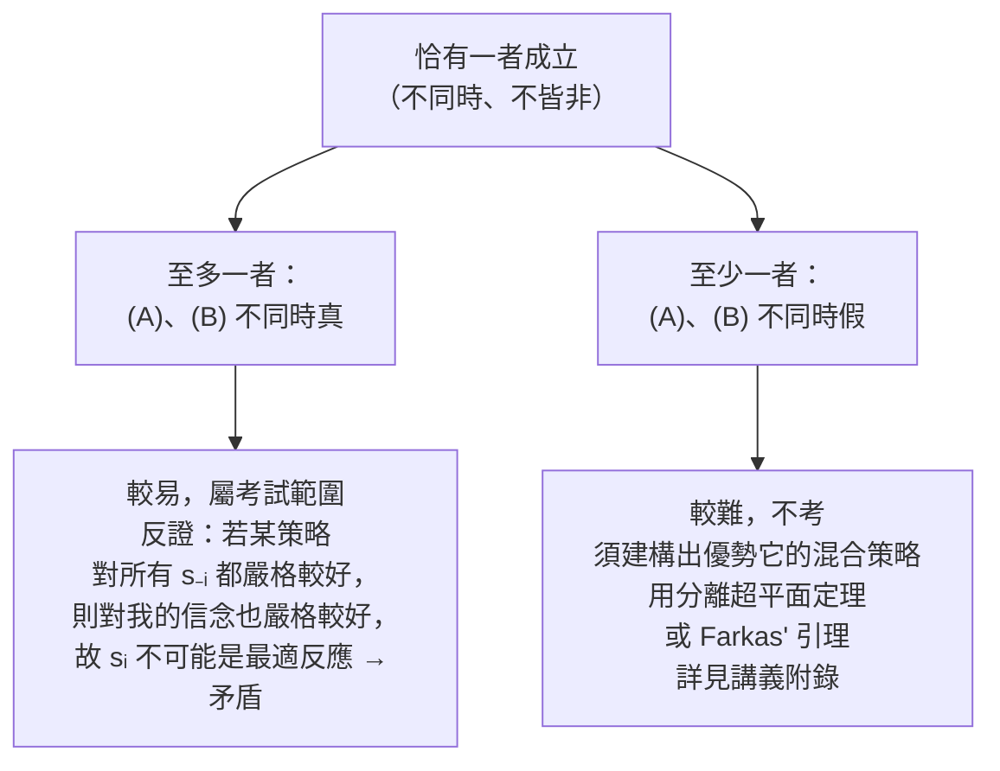

# 第 03 章：優勢

## 導讀

從本章開始，我們真正「分析（analyze）」賽局。前兩章分別學會了設定單人決策問題與用[展開式與策略式表示法](02-representation-of-games.md)描述賽局；本章要問一個更根本的問題：**給定一個賽局，我們該如何預測、或建議玩家會怎麼玩？**

課程一貫的取徑是：先有一段非正式的策略情境描述，寫下展開式表示法（extensive form，最細節的版本），再化約成策略式表示法（strategic form）。本章（對應 MIT 14.12 Lecture 3）所有分析都在策略式表示法上進行——起點直接假設「已給定一個策略式賽局」，背景上可想像它是從某個展開式化約而來。

本章的主角是**優勢（dominance）**：一種只需要「最小行為假設」的解概念。我們會先用最著名的賽局——囚徒困境——建立「無論對手怎麼做，某策略都比較好」的直覺，再把它形式化成嚴格優勢與弱優勢，導出第一個均衡概念（優勢策略均衡）。接著面對沒有優勢策略的賽局，引入賽局理論最核心的兩個觀念——**信念（belief）**與**最適反應（best response）**，並用一個定理把「正向地找最適反應」與「反向地排除被嚴格優勢的策略」漂亮地連起來。讀完本章，你會理解解概念精煉鏈（優勢 → 可理性化 → Nash → …）的最起點是怎麼奠定的。

## 核心內容

### 分析賽局的目標：預測還是建議？

分析賽局時，我們其實在問：理性玩家「會怎麼玩（will play）」或「該怎麼玩（should play）」？這對應兩種解讀：

- **正面／描述性分析（positive / descriptive analysis）**：目標是「預測（prediction）」。觀察一個賽局，預測理性玩家的選擇。只有在我們寫下的效用函數與理性假設可信時，這個預測才有效。
- **規範／指示性分析（normative / prescriptive analysis）**：把自己當成顧問（advisor）。有人問「我該怎麼玩？」，你給出「建議（recommendation）」。講者舉例：企業有時真的會雇用賽局理論家，建議自己在拍賣中該怎麼出價。

兩種解讀是背景心態的差異；當我們形式化地「求解均衡」時，答案並不會因為你採哪種解讀而不同。

### 方法論：從最小假設出發，逐步加強

本章刻意從**最小（最弱）的行為假設**開始。假設越弱，我們對其推論就越有信心。代價是：很多賽局無法只靠最小假設就得到鋭利的預測，有時甚至只能說「什麼都可能發生」，這不是有用的預測。整門課的方向，就是**逐步加強**對行為的假設——可能損失一些對準確度的信心，但換得更鋭利、更精煉的預測。優勢，就是這條路上最基本的第一站。

### 囚徒困境：理性可能導致無效率

囚徒困境（prisoner's dilemma）是賽局理論最著名的賽局。兩名囚徒被分開關押，各有兩個選項：**M（保持沉默，stay mum）**與 **F（招供／告發對方，fink / tattle）**。檢察官開價：願意作證指控同夥者可獲減刑，但另一人會被判更重的刑。

我們用一個 **bi-matrix**（雙人報酬矩陣）表示。慣例：玩家一選列（row），玩家二選欄（column）；每格先寫玩家一的效用、後寫玩家二的效用。

| 玩家一 ＼ 玩家二 | M（沉默） | F（招供） |
|---|---|---|
| **M（沉默）** | 2, 2 | −1, 3 |
| **F（招供）** | 3, −1 | 0, 0 |

講者強調「真正重要的是排序」：對我而言，招供且對方沉默＝3（最高）> 兩人沉默＝2 > 兩人招供＝0 > 我沉默但對方招供＝−1（最差）。

**依情況分別推理（case-by-case）**：我不知道對方會沉默還是招供，那就分兩種情況各自比較——

- 若對方沉默：我沉默得 2、招供得 3 → 招供較好。
- 若對方招供：我沉默得 −1、招供得 0 → 招供較好。

**兩種情況下，招供都嚴格較好。** 這正是囚徒困境好分析的原因：雖然是互動問題，但「我最好的做法與對手無關」——沒有[前章](02-representation-of-games.md)所說的策略互賴（strategic interdependence）。

**為什麼叫「困境」？** 兩人都招供各得 0，但若兩人都沉默各得 2，兩人都會嚴格更好。他們是不是搞錯了？學生給出關鍵回答：每位玩家既不知道、也**無法影響**對方的選擇，只能各自極大化自身效用；「我們都想到上面那格，但我控制不了對方。」講者的結論是本章第一個深刻教訓：

> **在賽局中，理性行為可能導致無效率，甚至讓所有人都比另一種可行的做法更糟。** 這是互動決策特有的現象——在單人決策裡，我只要做對自己最好的事就得到最好的結果，永遠不會發生這種事。

## 形式化與定義

### 符號：策略組合的分解

策略式賽局有玩家 $I = 1,\dots,n$、各自的策略集合 $S_1,\dots,S_n$，以及報酬 $U_i : S \to \mathbb{R}$，其中 $S = S_1 \times \cdots \times S_n$ 是策略組合（profile）的集合。

分析優勢時，我們常只想改變「一位玩家」的策略，因此把 profile 分解寫成：

$$s = (s_i,\, s_{-i}),$$

其中 $s_i$ 是玩家 $i$ 自己的策略，$s_{-i}$ 是「其他所有人」的策略。這裡的「$-$」讀作「**非（not）**」而非負號：以三人為例，$s = (s_1,s_2,s_3)$ 可依關注對象寫成 $(s_1,s_{-1})$、$(s_2,s_{-2})$ 或 $(s_3,s_{-3})$，其中 $s_{-1}=(s_2,s_3)$。講者特別澄清：$s_{-1}$ 只是把其他人的策略一起寫的**省寫符號**，不代表他們一起決定或有任何行為假設，他們仍各自獨立選擇。對應的集合是 $s_i \in S_i$、$s_{-i} \in S_{-i}$，其中 $S_{-i}$ 是「除玩家 $i$ 外每人各一策略」的部分組合集合。

### 嚴格優勢與弱優勢

對玩家 $i$ 的兩個策略 $s_i, s_i'$：

- **嚴格優勢（strictly dominates）**：
  $$s_i \text{ 嚴格優勢 } s_i' \iff U_i(s_i, s_{-i}) > U_i(s_i', s_{-i}) \quad \forall\, s_{-i} \in S_{-i}.$$
  關鍵在於：$s_{-i}$ 可取任意值，但不等式兩邊代入的是**同一個** $s_{-i}$。因為對手的玩法在我控制之外，所以「無論對手怎麼玩」這條式子都要成立。

- **弱優勢（weakly dominates）**：把嚴格改成弱不等式，並要求「至少有一處嚴格」：
  $$U_i(s_i, s_{-i}) \ge U_i(s_i', s_{-i}) \ \ \forall\, s_{-i}; \qquad \text{且} \quad U_i(s_i, s_{-i}) > U_i(s_i', s_{-i}) \ \text{對某個 } s_{-i}.$$
  若只要求弱不等式會太弱（兩策略可能永遠一樣好），所以要加上「對某個 $s_{-i}$ 嚴格」。一個直接的推論是：**沒有策略能弱優勢自己**（把 $s_i=s_i'$ 代入永遠得不到嚴格不等式）。

課堂上有學生追問「嚴格」是什麼意思。講者的說法很清楚：把每個 $s_{-i}$ 對應的不等式逐條列出（假設有 10 條），弱優勢要求**不能每一條都取等號**，至少要有一條嚴格；其餘全取等號也沒關係。

### 弱優勢策略與優勢策略均衡（DSE）

上面是「兩兩比較」。但玩家最終只需選一個策略，所以我們想知道某策略是否「勝過其他一切」：

- **弱優勢策略（weakly dominant strategy）**：$s_i$ 弱優勢玩家 $i$ 的每一個其他策略 $s_i' \ne s_i$（必須排除自己）。若某玩家有弱優勢策略，那對「他會怎麼玩」是相當安全的預測。

- **優勢策略均衡（dominant strategy equilibrium, DSE）**：一個 profile $(s_1^\ast,\dots,s_n^\ast)$，若對每位玩家 $i$，其策略 $s_i^\ast$ 都是該玩家的弱優勢策略。講者指出更精確的名稱是「弱優勢策略均衡」，但通常簡稱 dominant，縮寫 **DSE**。

這是本課第一個均衡概念。要留意：對賽局做預測**不能只預測一位玩家**，必須對每位玩家都做預測，也就是一個完整的 profile。囚徒困境中，F 對每位玩家都是（嚴格，因而也是弱）優勢策略，故 $(F,F)$ 是優勢策略均衡。

!!! note "問答：可能有多個弱優勢策略嗎？"
    不可能。假設 $S_A$ 與 $S_B$ 都是弱優勢策略，那麼 $S_A$ 弱優勢 $S_B$、$S_B$ 也弱優勢 $S_A$。但弱優勢要求「對某個 $s_{-i}$ 嚴格較好」——若 $S_B$ 有時嚴格優於 $S_A$，$S_A$ 就不可能弱優勢 $S_B$，矛盾。這正是定義中堅持「某個 $s_{-i}$ 嚴格」的動機之一。

### 沒有優勢時：信念與最適反應

現實中多數賽局不像囚徒困境。考慮下面這個只填了玩家一報酬的 3×2 賽局（玩家一選 Top / Middle / Bottom，玩家二選 Left / Right；玩家二報酬講者刻意省略以聚焦）：

| 玩家一 ＼ 玩家二 | Left | Right |
|---|---|---|
| **Top (T)** | 2 | −1 |
| **Middle (M)** | 0 | 0 |
| **Bottom (B)** | −1 | 2 |

逐一比較會發現**沒有任何優勢關係**：T 對 M 在 L 時較好（2>0）卻在 R 時較差（−1<0）；M 對 B 在 L 時較好（0>−1）卻在 R 時較差（0<2）。此時我最好的做法「取決於對手」，於是必須對對手的玩法**形成信念（form beliefs）**——正如[第一章](01-individual-decision-making.md)裡，你是走路還是搭車，取決於你認為下雨的機率。

**信念（belief）** 就是玩家 $i$ 對「他人策略」的機率分佈：

$$\beta_{-i} : S_{-i} \to [0,1], \qquad \sum_{s_{-i} \in S_{-i}} \beta_{-i}(s_{-i}) = 1.$$

原本 $U_i$ 只對確定的 profile 定義。經學生多次追問後，講者把它**延伸（extend）** 到「策略＋信念」，取期望效用：

$$U_i(s_i, \beta_{-i}) = \sum_{s_{-i} \in S_{-i}} \beta_{-i}(s_{-i})\, U_i(s_i, s_{-i}).$$

這是刻意的「符號擴張」：若 $\beta_{-i}$ 把機率 1 全放在某個 $s_{-i}$ 上，除該項外全為 0，就退回原本的 $U_i$——原效用只是「信念確定」的特例。

有了期望效用，就能定義賽局理論最核心的觀念之一。互動決策分兩步：**先對對手形成信念，再選在該信念下最好的策略。**

- **最適反應（best response）**：對玩家 $i$，$s_i$ 是對信念 $\beta_{-i}$ 的最適反應，若
  $$U_i(s_i, \beta_{-i}) \ge U_i(s_i', \beta_{-i}) \quad \forall\, s_i'.$$
  最適反應可以有多個（兩策略對該信念期望效用相同即可）。若唯一，稱 **strict best response（嚴格最適反應）**；本課一般用弱義。

### 用圖看最適反應

把玩家一對玩家二的信念用「玩 R 的機率 $P$」表示（橫軸 0 到 1，由左至右較直觀）。期望效用對信念**永遠是線性的**，所以每個策略在圖上是一條直線，只要兩端點就決定整條線：

- $U_1(T,P)$：$P=0$（確定 L）為 2，$P=1$（確定 R）為 −1，下斜。
- $U_1(B,P)$：$P=0$ 為 −1，$P=1$ 為 2，上斜。
- $U_1(M,P)$：無論對手怎麼玩都得 0，是水平線。

T、B 兩線交於 $P=\tfrac12$。沿橫軸每個信念畫垂直線，最高的那條曲線就是最適反應——這條「最高者」的軌跡稱為**上包絡線（upper envelope）**：

| 信念 $P$（玩 R 的機率） | 最適反應 |
|---|---|
| $0 \le P < \tfrac12$ | T（唯一，strict） |
| $P = \tfrac12$ | T 與 B 都是（端點含在內） |
| $\tfrac12 < P \le 1$ | B（唯一，strict） |

直覺很清楚：對手越可能玩 L 就選 T，越可能玩 R 就選 B。但注意——**M 對任何信念都不是最適反應**。

### M 的悖論：被混合策略嚴格優勢

M 落入一個怪異的中間地帶：它不是任何信念的最適反應（看似很爛），卻不被任何**純策略**優勢。有學生說「非常不確定時、為了保險可以選 M」，講者更正：那描述的是**模糊趨避（ambiguity aversion）**，本課不談；在期望效用框架下（信念已明確界定），單純的風險趨避並不會讓你選 M。

真正的解答是：M 被一個**混合策略**嚴格優勢。**混合策略（mixed strategy）** 是對「自己」策略的機率分佈（信念則是對「別人」策略的分佈），記為

$$\sigma_i : S_i \to [0,1], \qquad \sum_{s_i} \sigma_i(s_i) = 1.$$

純策略用 $s_i$、混合策略用 $\sigma_i$（$\sigma$ 是 $s$ 的希臘字母版）。考慮丟硬幣的策略 $\tfrac12 T + \tfrac12 B$：

- 對手玩 L：$\tfrac12(2) + \tfrac12(-1) = \tfrac12 > 0$。
- 對手玩 R：$\tfrac12(-1) + \tfrac12(2) = \tfrac12 > 0$。

對任何信念，$U_1(\tfrac12 T + \tfrac12 B, P)$ 恆為 $\tfrac12$（一條水平線），永遠高於 M 的 0。於是 **M 雖不被任何純策略優勢，卻被這個混合策略嚴格優勢**——悖論就此化解。

!!! note "人真的會玩混合策略嗎？"
    多數經濟情境不常見，但有兩個關鍵領域：剪刀石頭布，以及職業撲克（poker）。講者說職業撲克選手會刻意訓練精確隨機化；人天生不擅長隨機化。20 年前教這門課很難舉出真實的混合策略例子，如今「現實追上了賽局理論」——隨機化得越精準的人賺越多。

### 定理：最適反應 vs 嚴格優勢

面對一個賽局，玩家一有兩種思路，正好一正一反：

- **正向**：只考慮「合理（reasonable）」策略，即對某信念是最適反應者。上例中是 T、B。
- **反向**：丟掉「不合理（unreasonable）」策略，即被某策略（可為混合）嚴格優勢者。上例中丟掉 M。

兩種思路在上例給出**相同答案**（好的：T、B；壞的：M）。這是巧合嗎？講者給出本課第一個定理：

> **定理（最適反應與嚴格優勢的等價）**：在有限（finite）策略式賽局中（每位玩家策略集合有限、玩家人數有限），對每位玩家 $i$ 與每個策略 $s_i$，下列**恰有一者**成立：
>
> - **(A)** $s_i$ 是對某個「對 $S_{-i}$ 的信念」的最適反應；
> - **(B)** $s_i$ 被某個混合策略嚴格優勢。
>
> 「恰有一者」意即：不同時成立，也不同時不成立。

必須允許**混合策略**：只用純策略定理會失效——M 正是「從不是最適反應、卻不被任何純策略優勢」的反例。註記一個常被混淆的點：每個純策略都是混合策略（把機率 1 放在單一策略上），所以「某混合策略」已涵蓋純策略；若要特別排除純策略，才會說 properly mixed / 非純混合策略。

這個定理的意義是：正向想「什麼是最適反應」與反向想「什麼被嚴格優勢」，兩種自然直覺竟然把策略分成**完全相同**的好、壞兩堆。

#### 證明思路（講者標明考試範圍）

證「恰有一者」＝證「至多一者為真」＋「至少一者為真」。

- **至多一者（較易，講者說可以考）**：反證。若 (A)(B) 同時成立，(B) 表示存在某策略「無論對手怎麼玩都嚴格較好」，那它在「我的信念」下也嚴格較好，於是 $s_i$ 不可能是最適反應，矛盾。講者建議在家把代數推完。
- **至少一者（較難，不考）**：需要「建構」——若 $s_i$ 不是任何信念的最適反應，得反過來造出優勢它的混合策略。這用到**分離超平面定理（separating hyperplane theorem）** 或講者偏好的 **Farkas' 引理（Farkas' lemma）**；完整證明見講義附錄（本 repo 無該附錄，`待補`）。

## 賽局實例與應用

- **囚徒困境**：本章唯一有雙方報酬的具體賽局。它示範了優勢策略均衡（$(F,F)$），也承載了「理性導致無效率」這個貫穿賽局理論的教訓，日後在寡占、[重複賽局](13-infinitely-repeated-games.md)與隱性卡特爾等主題會反覆出現同構的張力。
- **3×2 無優勢賽局**：示範了當優勢無法決定時，如何靠信念與最適反應分析；也揭示「純策略優勢」不足、必須引入混合策略的必要性。
- **混合策略的真實例子**：剪刀石頭布、職業撲克，是講者用來說明「混合策略確實會發生」的實例。

> 提醒：以上兩個報酬矩陣為板書內容，依講者口語與圖形描述重建（囚徒困境數值講者明確口述；3×2 賽局玩家二報酬講者刻意未填，標為省略）。`data/mit14-12/` 無板書照片。

## 常見誤解

- **「囚徒理性所以結果會好」**：恰恰相反。雙方都理性、都選嚴格優勢的 F，反而落到 $(0,0)$，比都沉默的 $(2,2)$ 更糟。理性不保證集體效率。
- **把 $s_{-i}$ 的「$-$」當成負號**：它讀作「非 $i$」，$s_{-i}$ 是「除 $i$ 外所有人」的策略；也不代表那些人會協同決定，他們仍各自獨立選擇。
- **以為弱優勢只要「不比較差」**：弱優勢還要求「至少有一個 $s_{-i}$ 嚴格較好」，否則兩個永遠等值的策略會互相弱優勢——正因如此，不會有多個弱優勢策略。
- **把信念和混合策略搞混**：信念 $\beta_{-i}$ 是對「別人」策略的機率分佈；混合策略 $\sigma_i$ 是對「自己」策略的機率分佈。兩者數學形式像，意義不同。
- **「不是最適反應」等於「被優勢」？** 只在允許混合策略、且賽局有限時，兩者才等價。M 不被任何純策略優勢，卻不是任何信念的最適反應——必須用混合策略才能顯示它被嚴格優勢。
- **風險趨避會讓人選保險的 M？** 講者澄清：在期望效用下不會；會這麼做的是模糊趨避（ambiguity aversion），本課不涉及。
- **把迭代刪除（IDSDS）算進本章**：本講**沒有**進入「反覆刪除劣勢策略」的求解程序，只停在單輪的優勢／最適反應與上述等價定理。迭代刪除與可理性化屬於[下一章](04-rationalizability.md)，此處不預先杜撰（`待補`）。

## 小結

- 分析賽局是在問「玩家會怎麼玩／該怎麼玩」，對應描述性的**預測**與規範性的**建議**兩種解讀；形式求解不因解讀而異。
- 方法論主軸：從**最小行為假設**出發（結論可信但可能很弱），再逐步加強假設換取更鋭利的預測。優勢是這條路的第一站。
- **囚徒困境**用嚴格優勢說明「無論對手怎麼做，招供都較好」，並帶出核心教訓：**理性行為可能導致無效率**，這是互動決策特有、單人決策不會有的現象。
- **嚴格優勢**要求對所有 $s_{-i}$ 嚴格較好；**弱優勢**要求對所有 $s_{-i}$ 弱較好、且對某個 $s_{-i}$ 嚴格較好。沒有策略能弱優勢自己，也不會有多個弱優勢策略。
- **弱優勢策略**弱優勢一切其他策略；每人都採其弱優勢策略的 profile 構成**優勢策略均衡（DSE）**——本課第一個均衡概念。預測必須涵蓋每一位玩家。
- 當賽局沒有優勢時，玩家對對手玩法形成**信念 $\beta_{-i}$**，把效用延伸為期望效用，再選**最適反應**；最適反應可有多個，唯一者為 strict best response。
- 期望效用對信念是**線性**的，故可用直線圖與上包絡線讀出各信念下的最適反應。
- **混合策略 $\sigma_i$** 是對自己策略的隨機化；有些策略（如例中的 M）不被任何純策略優勢，卻被混合策略嚴格優勢。剪刀石頭布與職業撲克是真實例子。
- **等價定理**：有限賽局中，每個策略「恰好」落入「對某信念的最適反應」或「被某混合策略嚴格優勢」二者之一。「至多一者」較易（可考），「至少一者」較難（用分離超平面定理／Farkas' 引理，不考）。
- 優勢位於解概念精煉鏈的**最起點**；本章引入的信念與最適反應，正是通往[可理性化](04-rationalizability.md)與[Nash 均衡](05-nash-equilibrium.md)的橋樑。

## 跨章連結

- 前置：[第 01 章 個體決策](01-individual-decision-making.md)（lottery、期望效用、下雨例子）、[第 02 章 賽局的表示法](02-representation-of-games.md)（策略式／展開式、profile 與 $U_i$）。
- 後續：[第 04 章 可理性化](04-rationalizability.md)（把最適反應與嚴格優勢反覆迭代，即本講未展開的 IDSDS 方向）、[第 05 章 Nash 均衡](05-nash-equilibrium.md)（信念與最適反應概念的延續）。
- 本章筆記：[`notes/lecture-03-dominance.md`](notes/lecture-03-dominance.md)。
