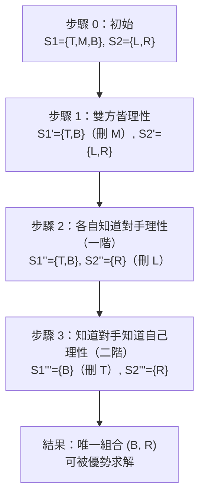
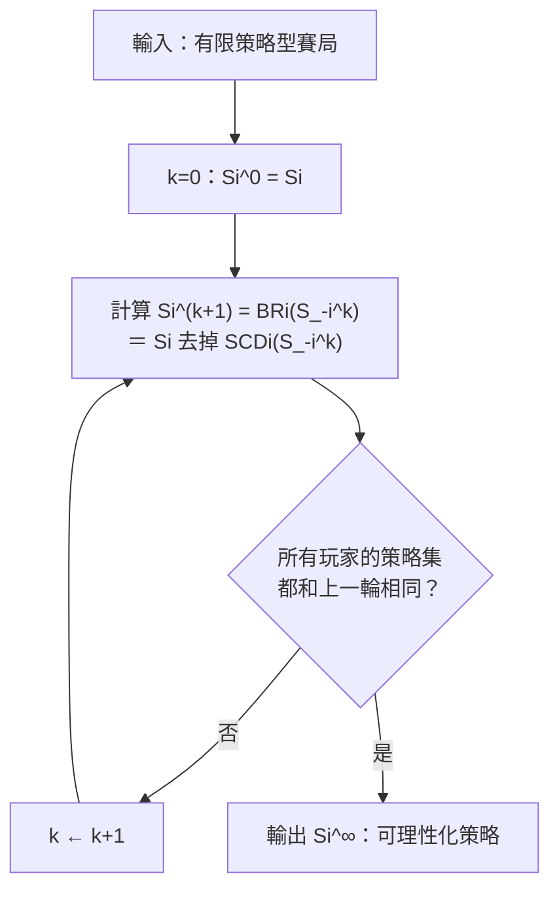

# 第 04 章：可理性化

## 導讀

上一章關於[優勢](03-dominance.md)，我們建立了兩個互為表裡的判準：一個策略若是對「某個關於對手的信念（belief）」的**最佳反應（best response）**，就算是「合理」的；反過來，一個策略若被某個混合策略**嚴格優勢（strictly dominated）**，就算是「不合理」的。上一章的關鍵定理告訴我們：每個策略恰好落在這兩類之一。

但那裡的「理性」只約束了玩家自己：只要我的策略是對「某個」信念的最佳反應就行，而那個信念可以任意離譜。本章要往前推一步問：如果我不只自己理性，還**知道**對手也理性；而且知道對手知道我理性；甚至知道對手知道我知道對手理性……這一連串**高階理性知識（higher order knowledge of rationality）**，會不會讓我們對「賽局裡到底會出現哪些策略」做出更銳利的預測？

答案是會。把這種層層遞進的推理形式化，就得到本章的解概念——**可理性化（rationalizability）**，以及執行它的程序——**嚴格劣勢策略的反覆刪除（iterated elimination of strictly dominated strategies, IESDS）**。讀完本章，你會知道如何把一個賽局的策略集逐輪「削」到只剩經得起無限層理性推理的策略，也會知道為什麼有些賽局能被削到唯一結果、有些卻一動也不能動。

> 本章符號沿用課程慣例：從本章起一律以小寫 $u$ 表示效用；當涉及信念或混合策略時，$u$ 理解為期望效用。策略型賽局寫成 $u:S_1\times\cdots\times S_N\to\mathbb{R}^N$，把策略組合 $s$ 映到 payoff 向量 $u(s)=(u_1(s),\dots,u_N(s))$。

## 核心內容

### 從「理性」到「知道對方理性」

先把上一章的結論收束成一句定義：**玩家 I 是理性的（rational）**，意思是她所選的策略是對「某個關於其他玩家策略的信念」的最佳反應。這裡要留意兩件事：

1. 有約束力的是「最佳反應」這件事——它排除了永遠不是最佳反應的策略。
2. **對信念本身沒有任何約束**。因此「玩家 I 理性」單獨看是很弱的假設：它完全不管玩家 I 對別人形成的信念合不合理，也完全沒說別的玩家理不理性。

現在加一層：假設玩家 I 不但自己理性，還**知道對手也理性**。這會改變什麼？改變的是她的信念。既然對手是理性的，對手就不會去玩那些「理性玩家根本不會玩」的策略，那麼玩家 I 就不該把正機率放在這種策略上。換句話說，「知道對手理性」這件事**限制了玩家 I 可以合理形成的信念**。

而這顯然可以繼續：我是不是也知道「對手知道我理性」？如果對手知道我理性，這會影響對手對我的信念、進而影響對手怎麼玩、再進而影響我對對手形成的信念……層數可以無限疊上去：

- 一階：我知道對手理性。
- 二階：我知道對手知道我理性。
- 三階：我知道對手知道我知道對手理性。
- ……

每加一層，可能被玩的策略就可能再縮小一圈。用文字寫很快就變得纏繞不清，所以本章的任務就是把這套推理變成一個乾淨的演算法。

### 逐步刪除：一個 3×2 的示範

先用一個具體賽局把直覺跑一遍。玩家一選列 $\{T,M,B\}$、玩家二選欄 $\{L,R\}$，每格內「玩家一, 玩家二」：

|  | L | R |
|---|---|---|
| **T** | 2, 0 | −1, 1 |
| **M** | 0, 10 | 0, 0 |
| **B** | −1, −6 | 2, 0 |

> 此矩陣依課堂口語重建：玩家一的 payoff 沿用上一章的同一組數字，玩家二的 payoff 由講者逐格口述（對 T 選 R、對 M 選 L、對 B 選 R）補齊，數值明確且自洽。

**先找最佳反應（劃線法）。** 站在玩家一：若對手出 L，$T$ 得 2 最高（劃線）；若對手出 R，$B$ 得 2 最高（劃線）。$M$ 對 L、對 R 都不是最佳反應——而且我們在上一章驗證過，$M$ 被混合策略 $\tfrac12 T+\tfrac12 B$ 嚴格優勢（對 L：$0.5>0$；對 R：$0.5>0$），所以 $M$ 對**任何**信念都不是最佳反應。站在玩家二：對 T 出 R（$1>0$）、對 M 出 L（$10>0$）、對 B 出 R（$0>-6$）。

現在把高階知識一層一層加上去：

- **步驟 1（雙方理性）**：玩家一刪掉 $M$，剩 $\{T,B\}$。玩家二兩個策略都是某純策略的最佳反應，一個都刪不掉，剩 $\{L,R\}$。這裡有個重點：理性**不一定**會刪掉任何策略。
- **步驟 2（一階知識）**：玩家一知道玩家二理性，但玩家二本來就沒被削，所以玩家一這邊沒有新資訊，仍是 $\{T,B\}$。反過來，玩家二知道玩家一只會出 $T$ 或 $B$；而 $R$ 對 $T$、對 $B$ 都嚴格優於 $L$（對兩者的任何混合也是），於是刪掉 $L$，剩 $\{R\}$。
- **步驟 3（二階知識）**：玩家一現在知道玩家二只會出 $R$，而 $B$ 是對 $R$ 的最佳反應，於是刪掉 $T$，剩 $\{B\}$。

最後只剩唯一組合 $(B,R)$，而且這一格玩家一、玩家二的 payoff 都被劃線——$B$ 是對 $R$ 的最佳反應、$R$ 是對 $B$ 的最佳反應，彼此吻合。像這樣反覆刪除後每位玩家只剩一個策略、給出唯一預測的賽局，稱為**可被優勢求解（dominant solvable）**。

講者特別點出這裡的「交叉（crisscross）」結構：定義玩家一第 $k+1$ 輪能玩什麼，靠的是玩家二第 $k$ 輪剩下的策略集；反之亦然。每一步都回頭看上一步——上一步釘住了對手怎麼玩，多加一層知識讓我確信對手會那樣玩，於是我又能再削掉一些自己的策略。

## 形式化與定義

要把上面的手算變成通用演算法，需要兩個記號。設玩家 I，給定對手策略組合的任意子集 $S'_{-i}\subseteq S_{-i}$（$S_{-i}$ 是所有「除我以外」玩家的策略組合集合）。

**（一）限制信念的最佳反應集合。**

$$
BR_i(S'_{-i})=\Big\{\,s_i\in S_i \;:\; s_i \text{ 是對某信念 } \beta_{-i} \text{ 的最佳反應，且 } \beta_{-i}(S'_{-i})=1 \,\Big\}
$$

用 set-builder 記號讀：所有滿足「是對某信念 $\beta_{-i}$ 的最佳反應」且「該信念把全部機率放在 $S'_{-i}$ 內、$S'_{-i}$ 以外一律零機率」的玩家 I 策略。直覺是：**如果我知道對手只會玩 $S'_{-i}$ 裡的策略，我有哪些合理的回應？**

**（二）條件式嚴格優勢集合。**

$$
SCD_i(S'_{-i})=\Big\{\,s_i\in S_i \;:\; s_i \text{ 在 } S'_{-i} \text{ 條件下被某混合策略 } \sigma_i \text{ 嚴格條件式優勢} \,\Big\}
$$

其中「$s_i$ 被 $\sigma_i$ 嚴格條件式優勢」定義為：

$$
u_i(\sigma_i,\,s_{-i}) \;>\; u_i(s_i,\,s_{-i}) \quad \text{對所有 } s_{-i}\in S'_{-i}.
$$

跟一般嚴格優勢的差別只在「範圍」：不要求 $\sigma_i$ 在對手**所有**可能策略下都較優，只要求在**受限集合 $S'_{-i}$** 內都較優。要特別小心：優勢關係永遠是**同一玩家自己策略之間**的比較（$\sigma_i$ 優勢 $s_i$），信念才是關於對手的。

**（三）二分定理（推廣版）。** 上一章的定理在新記號下極為簡潔，而且對任意子集都成立：

$$
S_i \;=\; BR_i(S'_{-i}) \,\cup\, SCD_i(S'_{-i}), \qquad BR_i(S'_{-i}) \,\cap\, SCD_i(S'_{-i}) \;=\; \varnothing.
$$

也就是每個策略**恰好**落在兩者之一：不是對某（受限）信念的最佳反應，就是被某混合策略嚴格（條件式）優勢。上一章的定理正是 $S'_{-i}=S_{-i}$ 的特例（此時 $\beta_{-i}(S_{-i})=1$ 對任何信念都成立，等於沒有限制）。

**單調性。** 當 $S'_{-i}$ **變小**：可用的信念變少 → $BR_i$ **變小**；要通過的嚴格不等式變少、更容易被優勢 → $SCD_i$ **變大**。因為兩者的聯集恆等於 $S_i$，所以一縮一脹剛好互補。

**單元素特例。** 若 $S'_{-i}=\{s_{-i}\}$ 只含一個對手策略：$BR_i$ 就退回「對這單一策略的最佳反應集」；而 $SCD_i$ 就是「不是最佳反應」的策略集——單一對手策略下，「非最佳反應」等價於「存在別的策略嚴格較優」，正好就是條件式嚴格優勢。

### 演算法：IESDS

輸入是一個**有限**策略型賽局 $u:S\to\mathbb{R}^N$（強調有限是為了保證後面的收斂與二分定理不出病態反例；連續策略賽局仍可套用，只是不做形式化保證）。以 $i$ 標玩家、$k$ 標輪數：

$$
\textbf{基底：}\quad S_i^0 = S_i \quad (\forall i)
$$

$$
\textbf{遞迴：}\quad S_i^{k+1} \;=\; BR_i\!\big(S_{-i}^{k}\big) \;=\; S_i \setminus SCD_i\!\big(S_{-i}^{k}\big), \qquad S_{-i}^{k}=\prod_{j\ne i} S_j^{k}
$$

$$
\textbf{輸出：}\quad S_i^{\infty} \;=\; \bigcap_{k=0}^{\infty} S_i^{k}
$$

由二分定理，「保留最佳反應」（$BR$）與「刪掉條件式劣勢」（$S_i\setminus SCD$）這兩種寫法給出完全相同的結果：前者呼應「反覆保留最佳反應」的精神，後者正是「反覆刪除嚴格劣勢策略」的字面意義。$S_i^{\infty}$ 的元素稱為**玩家 I 的可理性化策略（rationalizable strategies）**。

嚴格說，IESDS 是一個「程序」，可理性化是「一個策略是否具備通過每一輪而不被刪」的「性質」；兩者一體兩面，考試通常不苛究這個區分。

**收斂性。** 表面上要跑無限多輪，但在有限賽局中，策略只有有限多個、每輪只刪不增、而且不會「刪掉又放回」（無循環），所以必在某個有限步 $K$ 之後靜止：

$$
\exists K:\quad S_i^{K}=S_i^{K+1}=S_i^{K+2}=\cdots \quad (\forall i).
$$

**判斷結束的準則要小心：** 演算法結束**不等於**每人只剩一個策略（那是 dominant solvable 的特例）；結束的定義是「連續一輪，所有玩家的策略集都沒變」。只要**任何一位**玩家的策略集還在縮，就得繼續跑。前面 3×2 例中，步驟 1→2 玩家一沒變，但玩家二變了，所以還沒結束，非得再跑一輪不可。

### 解題技巧：過程用刪除、末端用最佳反應

講者給了一個很實用的建議，根源於單調性。因為集合一路只縮不脹，**一旦你錯刪了不該刪的策略，就再也救不回來**；但若你漏刪了某個該刪的策略，下一輪還有機會補刪。所以要「寧可多留」：

- **演算法進行中**：用 $SCD$（找嚴格劣勢的來刪）。萬一漏抓一個，下一輪再刪即可，安全。
- **到你以為結束的那一輪**：改用 $BR$ 檢查——確認剩下的每個策略都真的是對某個信念的最佳反應，把「留太久」的策略揪出來。

## 賽局實例與應用

### 囚犯困境：一步到位

以 Cooperate（與另一名囚犯合作，即不出賣）／Defect 為策略。講者提醒 cooperate 指「與另一囚犯合作」而非與當局合作，別搞反。本講未給出具體 payoff 數字（`待補`），但結論是：無論對手 C 還是 D，Defect 都嚴格較優，故 $D$ 嚴格優勢 $C$。第一輪就刪掉 $C$，$S_i^1=\{D\}$。末端用最佳反應檢查：$D$ 對 $D$ 確為最佳反應。每人只剩一策略，收斂於 $(D,D)$，此賽局可被優勢求解。

### 一個「一動也不能動」的 2×2

不是每個賽局都能削出東西。講者舉了一個策略為 $T/B$ 對 $L/R$ 的 2×2 例（本講未給具體數值，`待補`），其最佳反應結構為：玩家一對 $L$ 偏好 $T$、對 $R$ 則在 $T$ 與 $B$ 間無異；玩家二對 $T$ 偏好 $L$、對 $B$ 則在 $L$ 與 $R$ 間無異。逐格劃線後會發現：$T$ 是對 $L$（及 $R$）的最佳反應、$B$ 是對 $R$ 的最佳反應、$L$ 是對 $T$、$B$ 的最佳反應、$R$ 是對 $B$ 的最佳反應——每個策略都是某信念的最佳反應，一個都刪不掉。$S_1^1=\{T,B\}$、$S_2^1=\{L,R\}$，第一輪即靜止。

這個例子的教訓：可理性化有時給出極強預測（唯一結果），有時卻**完全無法排除任何策略**。它也示範了一個常犯的手誤——**當某策略有多個最佳反應時，務必全部劃線**，因為它們都是合理的回應。

### 選美賽局：連續策略也能求解

最後一個較實質的例子是課堂第一（二）天玩過的 **α-選美賽局（α-beauty contest）**，本章回頭把它形式化解掉。

- **設定**：玩家 $i=1,\dots,N$，各選實數 $x_i\in[0,100]$（放寬為任意實數，不限整數）。給定參數 $\alpha\in(0,1)$，課堂玩的是 $\alpha=2/3$。
- **Payoff（二次損失 quadratic loss）**：

$$
u_i \;=\; -\Big(x_i - \alpha\cdot\tfrac{x_1+\cdots+x_N}{N}\Big)^2.
$$

你的目標是讓自己的猜測貼近「$\alpha\times$ 全班平均」；猜得剛好 payoff 為 0，離得越遠 payoff 越負。微妙之處在於：**你自己的 $x_i$ 也計入全班平均**。

把 $x_i$ 提出來整理（$\bar{x}_{-i}$ 表示「除我以外」的平均）：

$$
u_i \;=\; -\Big(\big(1-\tfrac{\alpha}{N}\big)x_i - \alpha\tfrac{N-1}{N}\,\bar{x}_{-i}\Big)^2.
$$

令括號為零、對 $x_i$ 求解，得到**最佳反應**：

$$
x_i \;=\; \underbrace{\frac{\alpha(N-1)}{\,N-\alpha\,}}_{\displaystyle \alpha_N}\;\bar{x}_{-i}.
$$

**直覺**：本來你可能以為最佳猜測就是「$\alpha\times$ 別人的平均」，但係數 $\alpha_N=\dfrac{\alpha(N-1)}{N-\alpha}$ 其實**嚴格小於 1**（分子減了 1，分母只減了更小的 $\alpha$）。原因是——你自己的猜測會把全班平均往下拉：如果你猜了 $\alpha\bar{x}_{-i}$，這個數本身比平均小，會使實際平均再降一點，於是你想猜得再低一些。當 $N\to\infty$，你對平均的影響趨近於零，$\alpha_N\to\alpha$。

**反覆刪除**（利用 $\alpha_N<1$）：

$$
S_i^0=[0,100],\quad S_i^1=[0,100\,\alpha_N],\quad \dots,\quad S_i^{k}=[0,\,100\,\alpha_N^{\,k}].
$$

若我知道對手最多猜到 $100\alpha_N^{\,k}$，我的最佳猜測上限就是把它再乘一次 $\alpha_N$。因 $\alpha_N<1$，區間逐輪收縮，極限

$$
S_i^{\infty}=\{0\}\quad(\forall i).
$$

所以 α-選美賽局**可被優勢求解**，每位玩家唯一的可理性化策略就是猜 **0**。講者提到此賽局的一個變體出現在作業，所以課堂只快速帶過。

## 常見誤解

- **「理性」很強？** 恰恰相反。單獨的理性只要求「是對某信念的最佳反應」，對信念毫無約束，是很弱的假設。銳利的預測來自「知道對手理性」等高階知識，一層一層疊出來。
- **理性一定會刪掉策略？** 不。3×2 例中玩家二在步驟 1 一個策略都刪不掉；2×2 例更是全程無可刪。
- **演算法結束＝每人剩一個策略？** 不。結束的定義是「連續一輪所有玩家都沒被刪」。只要有任一玩家還在縮，就得繼續。dominant solvable（每人剩一個）只是特例。
- **多個最佳反應只劃一個？** 錯。有多個最佳反應時必須全部劃線，否則會把合理策略誤刪。
- **過程與末端用同一判準？** 建議不要。過程用 $SCD$（漏刪可補、寧可多留），末端用 $BR$ 檢查（避免留太多）。因為錯刪不可逆、漏刪可補救。
- **會不會刪掉又放回、陷入循環？** 不會。集合每輪只縮不脹、無循環，這也是有限賽局必然收斂的原因。
- **連續策略賽局不能算？** 可以照樣套用（選美賽局即是），只是課程不對無限情形做形式化保證。考試若要求算可理性化策略，不能以「非有限賽局」為由拒答。
- **big U 還是 little u？** 本章起一律用小寫 $u$；涉及信念或混合策略時理解為期望效用。概念上的 vN–M 效用 vs 期望效用區分仍在，只是記號統一。

## 小結

- **理性**＝玩家所選策略是對某個關於對手的信念的最佳反應；對信念本身無限制，故單獨看很弱。
- 疊加**高階理性知識**（我知道你理性、我知道你知道我理性……）會逐層限縮可合理形成的信念，進而縮小可能被玩的策略。
- 兩個核心記號：$BR_i(S'_{-i})$（對「只放機率在 $S'_{-i}$」的信念的最佳反應）與 $SCD_i(S'_{-i})$（在 $S'_{-i}$ 條件下被混合策略嚴格優勢）。二分定理：每策略恰屬其一；$S'_{-i}$ 變小則 $BR$ 縮、$SCD$ 脹。
- **IESDS 演算法**：$S_i^0=S_i$；$S_i^{k+1}=BR_i(S_{-i}^k)=S_i\setminus SCD_i(S_{-i}^k)$；輸出 $S_i^\infty=\bigcap_k S_i^k$，其元素即**可理性化策略**。
- 有限賽局中，集合只縮不脹、無循環，演算法必在有限步後靜止；**結束＝所有玩家連一輪都不再被刪**。
- **可被優勢求解（dominant solvable）**：反覆刪除後每人只剩唯一策略。3×2 主例（唯一 $(B,R)$）、囚犯困境（唯一 $(D,D)$）、選美賽局（每人猜 0）皆是；2×2 例則完全無可刪。
- 解題訣竅：過程用刪除（寧可多留）、末端用最佳反應驗證（避免留太多）。
- 選美賽局的最佳反應係數 $\alpha_N=\dfrac{\alpha(N-1)}{N-\alpha}<1$，因自己的猜測會拉低全班平均；$N\to\infty$ 時趨近 $\alpha$。
- 在解概念鏈上，可理性化介於[優勢](03-dominance.md)與 [Nash 均衡](05-nash-equilibrium.md)之間：它把「不玩嚴格劣勢策略」反覆施行到無限層，比單輪優勢更精煉，一般仍比 Nash 均衡寬鬆。

## 跨章連結

- 前置章節：[第 03 章：優勢](03-dominance.md)——最佳反應與嚴格優勢的二分定理是本章 IESDS 的基石；本章把它推廣到受限信念（條件式優勢）。
- 後續章節：[第 05 章：Nash 均衡](05-nash-equilibrium.md)——dominant solvable 賽局中「兩格互為最佳反應」的觀察，預告了 Nash 均衡「彼此都是對方最佳反應」的定義。
- 解概念鏈定位：優勢 → **可理性化** → Nash → SPNE → BNE → PBE。
- 需回頭補充的符號：小寫 $u$ 的統一慣例、信念 $\beta_{-i}$、混合策略 $\sigma_i$、策略組合 $S_{-i}$ 與其子集記法。
- 需要新增的圖表：本章已含 IESDS 逐步刪除流程圖與演算法流程圖；主例 bi-matrix 為依口語重建。
