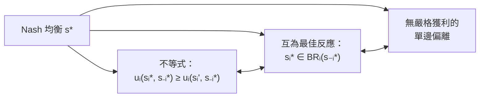
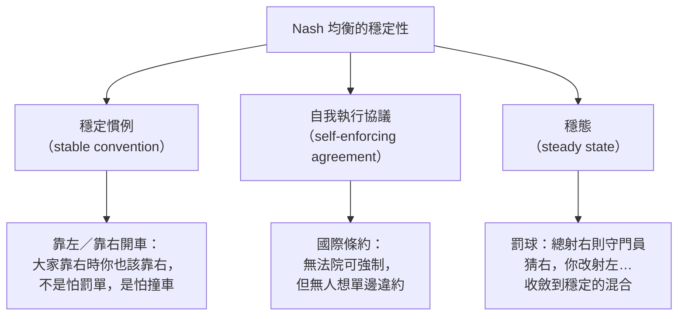

# 第 05 章：Nash 均衡

## 導讀

上一章的[可理性化](04-rationalizability.md)把「不玩嚴格劣勢策略」加上層層疊起的**高階理性知識（higher order knowledge of rationality）**反覆施行，削出了策略集 $S^\infty$。但它常常削不乾淨——本章一開場的**波士頓賽局（Boston game, BoS）**就是這樣：四個策略組合竟然全部可理性化，等於幾乎沒給出預測。

問題出在哪？可理性化只要求玩家對自己的玩法**有一套能無限深入的解釋**：我去 Red Sox，是因為我相信朋友也去 Red Sox；我這樣相信，是因為我相信朋友相信我去 Red Sox……這條「為什麼？」的鎖鏈可以無限延伸而不矛盾。可理性化保證這套解釋**存在**，卻**不保證它正確**。於是會出現「兩人各自落單、都在懊惱」卻仍算可理性化的怪結果——因為我對朋友的信念根本錯了。

本章的主角 **Nash 均衡（Nash equilibrium）**，正是在可理性化之上再加一刀：不只要求你有解釋，還要求**這套解釋（信念）正確**，精準描述對手實際怎麼玩。這一步稱為**信念一致性（consistency of beliefs）**。讀完本章，你會掌握 Nash 均衡的三種等價講法、用「劃線法」找純策略均衡、用「無異法」解混合策略均衡，並理解為什麼每個有限賽局都保證至少有一個均衡，以及解概念鏈 $DSE\subseteq NE\subseteq S^\infty$ 為什麼成立。

> 符號沿用前三章：效用一律小寫 $u_i$（涉及信念或混合策略時為期望效用）；純策略 $s_i\in S_i$、對手組合 $s_{-i}\in S_{-i}$、信念 $\beta_{-i}$、最佳反應 $BR_i$。本章新增：混合策略 $\sigma_i$、其集合 $\Sigma_i$。均衡以星號標記 $s^*,\sigma^*$。

## 核心內容

### 從「有解釋」到「解釋正確」

先把可理性化與 Nash 的差別講透，這是全章的樞紐。

**可理性化**只要求：玩家的每個策略都是對「某個信念」的最佳反應，而那個信念可以再被更深一層的信念解釋，如此無限。它像面對一個不停追問「為什麼？」的小孩——你總能再給一層理由，鎖鏈永不斷裂。若賽局不可理性化，這條鎖鏈遲早會撞上矛盾。所以：

> 可理性化＝你對自己的玩法**有一套能無限深入的解釋**。問題是，這套解釋**未必符合對手實際的玩法**。

**Nash 均衡**多要求一件事：這套解釋（信念）不但存在，而且**正確**——它精確描述了對手真正在做什麼。用波士頓賽局裡「兩人落單」那格來說，我去 Red Sox 的理由是「我相信朋友也去 Red Sox」，但朋友其實去了 Celtics，我的信念是錯的。Nash 均衡把這種「信念與現實不符」的組合排除掉。

正因為要求信念正確，Nash 均衡的定義裡「看不到信念」——因為信念被要求等於實際玩法，兩者合而為一。這就是信念一致性。

### 均衡是一個「策略組合」

在寫下定義前，講者反覆強調一個常被考倒的重點：

> **Nash 均衡是一個策略組合（strategy profile），不是一組 payoff。**

均衡是「對玩家會怎麼玩的預測或建議」，所以答案必須指名每位玩家各選什麼策略——$s^*=(s_1^*,\dots,s_N^*)$。考試要你「給出一個均衡」，若你回答的是玩家在該均衡下拿到的報酬數字，就答錯了。

### 三種等價的講法

Nash 均衡有三種等價表述，交替使用會讓不同題目都好處理。

**（一）不等式定義。** 策略組合 $s^*$ 是 Nash 均衡，若對每位玩家 $i$ 與其所有策略 $s_i'\in S_i$：

$$u_i(s_i^*,\,s_{-i}^*)\;\ge\;u_i(s_i',\,s_{-i}^*).$$

站在玩家 $i$ 的位置讀：把對手的玩法固定成 $s_{-i}^*$（我控制不了別人），只在「我自己」的策略上比較——我照均衡選 $s_i^*$，要弱優於改選任何 $s_i'$。$s_i'=s_i^*$ 時兩邊相等，自動滿足。

**（二）互為最佳反應。** 上式恰好說：$s_i^*$ 是對 $s_{-i}^*$ 的**最佳反應**。更嚴謹地說，是對「把機率 1 全押在 $s_{-i}^*$ 的信念 $\beta_{-i}$」的最佳反應（$\beta_{-i}(s_{-i}^*)=1$）。於是每位玩家的策略都是對其他人策略的最佳反應——「彼此都是對方的最佳反應」。這正呼應[可理性化](04-rationalizability.md)章末 dominant solvable 賽局裡「唯一那格兩數互相劃線」的觀察。

**（三）沒有嚴格獲利的單邊偏離。** 最不數學、最好記的版本：

> 沒有任何玩家能靠**單邊偏離（unilateral deviation）**嚴格獲利。

「偏離」＝改選與均衡策略不同的策略；「單邊」＝只有我一人改，別人不動。這是 Nash 最核心的洞見：推理別人時，把他們的策略當成**固定**，因為我無法直接控制別人。注意不等式兩邊對手玩法都是 $s_{-i}^*$，唯一的差別只在我這一邊。允許有「payoff 打平」的偏離，但不能有「payoff 嚴格更高」的偏離；「獲利」指效用（期望效用）而非金錢。

### 劃線法：找純策略均衡的演算法

在雙人矩陣賽局裡，(二)「互為最佳反應」直接給出一套機械化程序：

1. **劃線**：對玩家一，逐欄找出並劃線他所有的最佳反應報酬；再對玩家二，逐列劃線他所有的最佳反應報酬。務必**兩位玩家都劃、所有最佳反應都劃**（有並列最佳時全部劃）。
2. **找格**：看哪一格（＝一個策略組合）裡**兩個數字都被劃線**。

若某格玩家一的數字劃線，代表玩家一對玩家二的策略最佳反應；玩家二的數字也劃線，代表玩家二也在最佳反應。兩者同時成立，正是雙人賽局裡 Nash 均衡的定義。

## 形式化與定義

### 解概念的包含鏈

課程至此有三個「策略組合的集合」，都是 $S$ 的子集：

- $S^\infty$：可理性化策略組合（[上一章](04-rationalizability.md)的 IESDS 輸出）。
- $NE$：Nash 均衡策略組合。
- $DSE$：優勢策略均衡（[第 03 章](03-dominance.md)），即每位玩家的策略都是其**弱優勢策略**的組合。

它們之間有一條乾淨的包含鏈：

$$DSE\;\subseteq\;NE\;\subseteq\;S^\infty\;\subseteq\;S.$$

$$
\underbrace{DSE}_{\text{最苛}}\;\subseteq\;NE\;\subseteq\;\underbrace{S^\infty}_{\text{可理性化}}\;\subseteq\;S
$$

讀法：每個優勢策略均衡**必是** Nash 均衡；每個 Nash 均衡**必**可理性化。反向未必成立——可能是 Nash 均衡卻非 DSE，也可能可理性化卻非 Nash 均衡。越往左假設越強、預測越苛、集合越小。（$S^\infty\subseteq S$ 是定義自明，不需證。）

### 證明一：$DSE\subseteq NE$

設 $s^*=(s_1^*,\dots,s_N^*)$ 是優勢策略均衡，要證它是 Nash 均衡，即證無人有獲利的單邊偏離。取任一玩家 $i$、任一偏離 $s_i'$：

因為 $s^*$ 是 DSE，$s_i^*$ 是玩家 $i$ 的**弱優勢策略**，故它弱優勢玩家 $i$ 的每個其他策略，特別弱優勢 $s_i'$——這裡我們刻意「丟掉多餘資訊」，只保留與 $s_i'$ 的比較。弱優勢意味著

$$u_i(s_i^*,\,s_{-i})\;\ge\;u_i(s_i',\,s_{-i})\quad\text{對所有 }s_{-i}\text{ 成立}.$$

既然對**所有** $s_{-i}$ 都成立，對特定的 $s_{-i}^*$ 當然成立。於是 $s_i^*$ 是對 $s_{-i}^*$ 的最佳反應。對每位玩家重複同樣推理，得 $s^*$ 是 Nash 均衡。$\blacksquare$

一句話直覺：**若我的做法無論對手怎麼玩都最好，那在對手特定的玩法下當然也最好。** 注意此證明只說「若有 DSE 就必是 NE」，**不保證** DSE 存在（波士頓賽局就沒有 DSE）。

### 證明二：$NE\subseteq S^\infty$（歸納法）

設 $s^*$ 是 Nash 均衡，要證它可理性化，即 $s^*\in S^\infty$。直接證很難，但 $S^\infty$ 是逐輪刪除的極限，所以

$$s^*\in S^\infty\quad\Longleftrightarrow\quad s^*\in S^K\ \text{對所有 }K.$$

也就是要證 $s^*$「通過每一輪刪除、永不被踢出」。既然要對所有 $K$ 成立，用**歸納法**（$S^\infty$ 本就是歸納定義，用歸納最自然）。

- **基底 $K=0$**：$s^*\in S^0$？$S^0$ 是全體策略組合，$s^*$ 當然在內。自明。
- **歸納步**：要證「若 $s^*\in S^K$ 則 $s^*\in S^{K+1}$」。

歸納步是關鍵，也有個誘人的陷阱：**不能**逐玩家各自推理。原因是「玩家 $i$ 哪些策略能活到第 $K+1$ 輪」取決於「對手哪些策略活到第 $K$ 輪」，必須對所有玩家同時推理。

所以我們用的是歸納假設中「對手的部分」：$s_{-i}^*\in S_{-i}^K$。而依定義，

$$S_i^{K+1}=BR_i\!\big(S_{-i}^K\big)=\{\,s_i:\ s_i \text{ 是對某個「機率全落在 }S_{-i}^K\text{」的信念的最佳反應}\,\}.$$

由 Nash 定義（表述二），$s_i^*$ 是對 $s_{-i}^*$ 的最佳反應；又由歸納假設 $s_{-i}^*\in S_{-i}^K$。把機率 1 全押在 $s_{-i}^*$ 的信念，恰是「機率全落在 $S_{-i}^K$」的信念，故 $s_i^*\in S_i^{K+1}$。對每位玩家皆然，歸納完成。$\blacksquare$

### Nash 存在定理

前面的捉迷藏會示範「沒有純策略均衡」的賽局。會不會有更怪的賽局，連混合策略均衡都沒有？那將是理論的大麻煩——我們就沒有預測了。Nash 的關鍵結果保證這不會發生：

> **Nash 存在定理（1948）**：每個**有限**策略型賽局，至少存在一個混合策略 Nash 均衡（把純策略視為機率退化的混合策略，也涵蓋在內）。

「至少一個」——可能唯一、可能兩三個、甚至無限多，但保證不會是零。講者指出這是全課數學上最深的結果，證明用到**固定點定理（fixed point theorem）**（有時歸於 Brouwer、有時 Kakutani，其中之一約 1944 年證出，Nash 1948 據以完成此定理）。課程不證，只請讀者記住這個保證；完整證明在課程講義中（本 repo 無該講義，`待補`）。

### 混合策略 Nash 均衡

**混合策略（mixed strategy）** $\sigma_i$ 是玩家對自己純策略的隨機化（[第 03 章](03-dominance.md)已引入）。把 Nash 定義中的 $s$ 換成 $\sigma$：

> 混合策略組合 $\sigma^*=(\sigma_1^*,\dots,\sigma_N^*)$ 是 Nash 均衡，若對每位玩家 $i$：
> $$u_i(\sigma_i^*,\,\sigma_{-i}^*)\;\ge\;u_i(\sigma_i',\,\sigma_{-i}^*)\quad\text{對所有 }\sigma_i'\in\Sigma_i.$$

這裡 $\Sigma_i$ 是玩家 $i$ 所有混合策略的集合。四層記號一次記清：小寫 $s$＝純策略、大寫 $S$＝純策略集、小寫 $\sigma$＝混合策略、大寫 $\Sigma$＝混合策略集。

定義看似棘手：可偏離的混合策略有無限多個（機率可取 $[0,1]$ 間任意值）。但有個關鍵簡化：

> **檢查偏離時，只需檢查純策略偏離。** 即上式等價於只對所有 $s_i'\in S_i$ 成立。

直覺：混合策略的 payoff 是它所混合的純策略 payoff 的加權平均；若每個純策略偏離都弱較差，任何把它們平均起來的混合偏離也弱較差。**特別注意這裡的不對稱**：均衡策略本身**可以是混合的**，但要否決它，只需檢查純策略偏離就夠。

### 為什麼願意混合？無異原理

我為什麼願意丟硬幣，有時 A、有時 B？如果 A 比較好，我不就該一直 A 嗎？答案是：

> **只有在你對所混合的純策略「無異（indifferent）」時，你才願意混合。**

若我嚴格偏好 A，我根本不會給 B 任何正機率。所以願意在 A、B 間混合 $\Rightarrow$ 我對 A、B 無異。而讓我無異的，正是**對手在混合**——這把兩位玩家的混合綁在一起。

但無異只是**必要、非充分**。更精確的說法是：

> 只會在**純最佳反應**之間混合。

反例：若給定對手玩法，A、B、C 的 payoff 分別是 1、1、2。雖然我對 A、B 無異，但我不會混 A、B，因為 C 嚴格更好。若再加一個 D＝2，我才會在 C、D（兩個並列最佳反應）之間混合。把因果搞反——「我無異所以我願意混」——是常見錯誤：無異還不夠，所混合的必須是最佳反應。

**求解程序（無異法）：** 於是解混合均衡的標準手法，是找出讓對手「無異」的混合機率。且有個容易被當成筆誤的關鍵——**使對手無異的，是我方的混合機率**，因為我的混合決定了對手對我的信念。

## 賽局實例與應用

### 波士頓賽局（BoS）：純與混合均衡並存

兩位朋友都想作伴，但玩家一偏好 Celtics、玩家二偏好 Red Sox；一起去比分開好。以下 payoff 依講者口語重建（後段明確口述「2 1 1 2 0 0 0 0」），每格「玩家一, 玩家二」：

| 玩家一 ＼ 玩家二 | C（Celtics） | R（Red Sox） |
|---|---|---|
| **C（Celtics）** | **2**, **1** | 0, 0 |
| **R（Red Sox）** | 0, 0 | **1**, **2** |

> 依口語重建：講者說「這次用稍微不同的數字」，並在計算混合均衡時逐格口述上表數值；對角線兩格自洽（同去有正報酬、偏好者較高，分開皆 0）。

**最佳反應與純均衡。** 雙方對稱：對手去 C 我就去 C、對手去 R 我就去 R。劃線後 (C,C) 與 (R,R) 兩格皆兩數劃線 → **兩個純策略 Nash 均衡**。直覺：同去 Celtics 時，我單邊改就落單，更差；同去 Red Sox 亦然。注意——我雖偏好一起去 Celtics，但「從 (R,R) 移到 (C,C)」不是單邊偏離（我只能改自己去哪，不能拉對方）。

**與可理性化、DSE 對照。** 這賽局四個組合 $\{CC,CR,RC,RR\}$ 全部可理性化（$S^\infty$ 有四元素），可理性化幾乎沒篩掉東西。DSE 則是**空集**：玩家一的 C 不弱優勢 R（對手出 R 時 C 得 0 < R 得 1），R 也不弱優勢 C，故無弱優勢策略。於是此例正好見證 $DSE\subsetneq NE\subsetneq S^\infty$——$CC,RR$ 是 NE 非 DSE；$CR,RC$ 可理性化非 NE。其中 $RC$ 就是導讀說的「兩人落單、像犯錯」的可理性化組合。

**混合均衡。** 除了兩個純均衡，還有一個真正混合的均衡。設玩家一以機率 $P_1$ 出 C、玩家二以機率 $P_2$ 出 C，要求 $0<P_1,P_2<1$。用無異法，記住「使對手無異的是我方機率」：

- **讓玩家二無異的是 $P_1$**：玩家二出 C 得 $P_1\cdot 1+(1-P_1)\cdot 0=P_1$；出 R 得 $(1-P_1)\cdot 2$。令相等：
$$P_1=2(1-P_1)\ \Rightarrow\ P_1=\tfrac{2}{3}.$$
- **讓玩家一無異的是 $P_2$**：玩家一出 C 得 $2P_2$；出 R 得 $(1-P_2)$。令相等：
$$2P_2=1-P_2\ \Rightarrow\ P_2=\tfrac{1}{3}.$$

得混合均衡：玩家一 $\tfrac23 C+\tfrac13 R$、玩家二 $\tfrac13 C+\tfrac23 R$。

**關鍵解讀（別被直覺騙）。** 常見誤解是「玩家一常去 Celtics（$P_1=\tfrac23$）因為他更愛 Celtics」。錯。真正原因是**玩家二較不愛 Celtics**：玩家一的混合必須讓玩家二無異，而玩家二不太愛 Celtics，只有相信玩家一**很常**去 Celtics 才肯陪去。反向亦然——玩家二常去 Red Sox（$1-P_2=\tfrac23$），是為了讓偏好 Celtics 的玩家一願意去 Red Sox。**每位玩家的混合機率是在「照顧對手的無異」，而非反映自己的偏好強度。**

> **未竟的哲學問題**：我既然無異，為何要恰好用讓對手無異的機率去混合？講者坦言這是 Nash 均衡最不牢靠的一點，留待課程後段，並給兩種說法：(1) 混合常是**重複／動態過程**的故事——你不想落下「總是射某邊」的名聲讓對手更新；(2)「混合」未必是字面隨機，而是依對手觀察不到的訊號（天氣決定的穿著、罰球員臨場的體感方向）做決定，外人看來才像隨機。

### 捉迷藏：沒有純策略均衡

躲藏者（玩家一，兩處 A、B）對搜尋者（玩家二）。搜尋者猜中躲藏處就贏——這是**純粹利益衝突**的零和賽局，也可講成罰球員 vs. 守門員、逃稅者 vs. 國稅局。依口語重建（同格＝被抓，異格＝逃脫），每格「玩家一, 玩家二」：

| 玩家一 ＼ 玩家二 | A | B |
|---|---|---|
| **A** | −1, 1 | 1, −1 |
| **B** | 1, −1 | −1, 1 |

> 依口語重建：講者口述「同一格則躲者被抓（−1）、搜者贏（+1）；不同格則躲者逃脫（+1）、搜者輸（−1）」，數值明確且自洽。

**最佳反應。** 躲者想與對手**不同**格（對手 A→我 B、對手 B→我 A）；搜者想與對手**相同**格（對手 A→A、對手 B→B）。劃線後**沒有任何一格兩數皆劃線** → **沒有純策略 Nash 均衡**。直覺：同格時躲者想偏離、異格時搜者想偏離，總有一個「輸家」想改變。

**混合均衡（半半）。** 直覺告訴我們該 50/50——不要可預測（世界盃罰球資料大致如此）。驗證：若玩家一混 $\tfrac12 A+\tfrac12 B$，則玩家二出 A 得 $\tfrac12(1)+\tfrac12(-1)=0$、出 B 也得 $0$，兩者無異且皆為最佳反應，故玩家二混半半是最佳反應；由對稱，另一方向亦然。所以 $\big(\tfrac12 A+\tfrac12 B,\ \tfrac12 A+\tfrac12 B\big)$ 是混合策略 Nash 均衡——呼應存在定理：即使沒有純均衡，混合均衡仍在。

### Nash 均衡的三種詮釋

講者最後給了三個「為什麼 Nash 均衡是合理預測」的角度，核心都是**穩定性**：給定大家的行為，沒人想偏離。

- **穩定慣例**：為何美國靠右、英國靠左開車？不是因為罰單，而是若大家靠右，你靠右才不會被撞；兩種都是穩定的慣例，各自是 Nash 均衡。
- **自我執行協議**：多邊國際條約沒有法院能強制，卻常被遵守，因為設計得當時無人有單邊違約的誘因。
- **穩態**：若你罰球總射右，守門員會學會猜右，你便改射左，動態最終停在一個誰也不想偏離的穩態。動態是否真的收斂較微妙，但 Nash 均衡一旦達到就「不動」。

講者也誠實提醒：Nash 均衡假設更強、預測更銳利，但**正當性未必比可理性化更有說服力**——這是值得記住的保留。考試若要你解 Nash 均衡，仍必須照解，不能以「我不相信 Nash 均衡」作答。

## 常見誤解

- **均衡是 payoff？** 錯。Nash 均衡是**策略組合**，要指名每位玩家選什麼；給報酬數字是常見的失分點。
- **定義裡沒有信念，是不是不管信念？** 相反——信念被要求**正確**（$\beta_{-i}$ 對準真實 $s_{-i}^*$），所以與實際玩法合而為一，才「看不到」。這正是 Nash 比可理性化多的一刀。
- **從 (R,R) 想到 (C,C) 算偏離嗎？** 不算單邊偏離。單邊偏離只能改「我自己」的策略，我沒法把對手也拉過去。
- **均衡策略只能是純的？** 不。均衡策略可以是混合的；只是**檢查偏離時**只需檢查純策略偏離就夠。兩者不對稱，別混淆。
- **無異就會混合？** 因果別搞反。無異是願意混合的**必要非充分**條件；所混合的還必須是**純最佳反應**（payoff 1,1,2 時不會混那兩個 1）。
- **混合機率反映自己的偏好強度？** 不。$P_1=\tfrac23$ 不是因為玩家一更愛 Celtics，而是要讓**對手**無異；使對手無異的是**我方**的混合機率。
- **有多個最佳反應只劃一個？** 錯。劃線法要對雙方、對所有並列最佳反應全部劃線，否則會漏掉均衡。
- **會不會有賽局連均衡都沒有？** 有限賽局不會：Nash 存在定理保證至少一個混合策略均衡（純為特例）。捉迷藏沒有純均衡，但仍有混合均衡。
- **Nash 均衡一定唯一？** 不。可能唯一、可能多個（波士頓賽局有兩純一混共三個）、甚至無限多。

## 小結

- **Nash 均衡**在[可理性化](04-rationalizability.md)之上多要求**信念正確（一致）**：不只要有能無限深入的解釋，解釋還得符合對手實際玩法。
- 均衡是**策略組合**（$s^*$），不是 payoff——這是最常見的失分點。
- 三種等價講法：不等式定義、**互為最佳反應**、**無嚴格獲利的單邊偏離**；「把對手玩法視為固定」是 Nash 的核心洞見。
- **劃線法**找純策略均衡：對雙方所有最佳反應劃線，找兩數皆劃線的格（＝策略組合）。
- 解概念鏈 $DSE\subseteq NE\subseteq S^\infty\subseteq S$：$DSE\subseteq NE$ 直接可證，$NE\subseteq S^\infty$ 以歸納法證（Nash 均衡通過每一輪刪除）。
- **混合策略 Nash 均衡**：把 $s$ 換 $\sigma$；均衡策略可混合，但檢查偏離只需純策略偏離。
- **無異原理**：願意混合 $\Rightarrow$ 對所混合者無異，且它們須是純最佳反應（無異為必要非充分）；求解時找讓**對手**無異的**我方**機率。
- **波士頓賽局**：兩純均衡（CC、RR）＋一混合均衡（$\tfrac23 C+\tfrac13 R,\ \tfrac13 C+\tfrac23 R$）；混合機率反映的是「照顧對手無異」，非自己偏好強度；DSE 為空、$S^\infty$ 為全體，見證嚴格包含。
- **捉迷藏**（零和）無純策略均衡，但有半半混合均衡——呼應**Nash 存在定理**：每個有限賽局至少有一個混合策略均衡（固定點定理，課程不證）。
- Nash 均衡的三種詮釋（穩定慣例、自我執行協議、穩態）都繫於**穩定性**；但其正當性未必勝過可理性化，是值得保留的一點。

## 跨章連結

- 前置章節：[第 03 章 優勢](03-dominance.md)（DSE、弱優勢、信念與最佳反應）、[第 04 章 可理性化](04-rationalizability.md)（$S^\infty$、IESDS、dominant solvable 中「互為最佳反應」的預告）。
- 後續章節：[第 06 章 不完全競爭](06-imperfect-competition.md)——把 Nash 均衡用到寡占（Cournot／Bertrand）等經濟場景，是 Nash 的第一個大型應用。
- 解概念鏈定位：優勢 → 可理性化 → **Nash 均衡** → SPNE → BNE → PBE。本章是靜態賽局解概念的收束，後續各章多在特定情境（動態、重複、不完全訊息）精煉 Nash。
- 待補材料：Nash 存在定理完整證明（在課程講義，本 repo 無）；波士頓、捉迷藏兩矩陣為依口語重建（波士頓數值講者後段明確口述）。
- 本章筆記：[`notes/lecture-05-nash-equilibrium.md`](notes/lecture-05-nash-equilibrium.md)。
