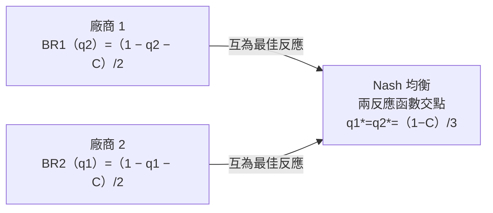

# 第 06 章：不完全競爭

> **對應**：MIT 14.12 Lecture 6（Imperfect Competition）。本章把 [Nash 均衡](05-nash-equilibrium.md) 從有限矩陣搬到**連續策略空間**，導出 Cournot 與 Bertrand 兩個古典寡占模型。

## 導讀

前幾講在有限的策略型賽局（strategic form game）裡建立解概念：反覆剔除嚴格劣勢策略、可理性化（rationalizability）、以及 [Nash 均衡](05-nash-equilibrium.md)。本章是這套理論的第一個實質經濟應用——**不完全競爭（imperfect competition）**，也就是**寡占（oligopoly）**。

這裡的關鍵轉變是：廠商的策略不再是矩陣中的一格，而是一個實數（產量或價格）。於是「最佳反應（best response）」變成一條連續的**反應函數（reaction function）**，而 Nash 均衡就是兩條反應函數的交點。讀完本章，你會知道：

- 完全競爭、獨占、不完全競爭三種市場結構如何構成一條光譜；
- 如何從消費者估值建構需求曲線 $Q(P)$ 與逆需求 $P(Q)$；
- 獨占者如何選價、為何會有加成（markup）；
- Cournot（選數量）與 Bertrand（選價格）兩個模型如何用反應函數求解，且為何給出截然不同的答案。

## 核心內容

### 三種市場結構

不完全競爭最好理解成落在兩個極端之間：

| 結構 | 廠商數 | 廠商角色 | 特徵 |
|---|---|---|---|
| 完全競爭（perfect competition） | 許多小廠 | 價格接受者（price taker） | 同質商品；單一廠商無法影響市場價 |
| 不完全競爭／寡占（oligopoly） | 少數大廠 | 有市場力量（market power） | 生產決策會影響市場價 |
| 獨占（monopoly） | 單一廠商 | 極端市場力量 | 唯一供給者 |

**價格接受者**指自己的產量無法影響市場價，例如全球玉米市場中的單一小農。**市場力量**是它的反面：自己的生產決策能影響市場價（如某產油國大幅增產會壓低油價）。

市場力量的三個來源：

1. **少數大廠**：有人大量倒貨即可壓低價格；
2. **地理與運輸成本**：MIT 旁只有幾家咖啡店，因為咖啡不能長途運送；
3. **產品差異化（product differentiation）**：即使很多家做手機，iPhone 與 Samsung 各有死忠客群，故各有訂價彈性；玉米則相反，幾乎無差異。

課堂上舉的獨占／近似獨占例子：地鐵（MBTA）、地方公用事業（電、網路）、專利藥（政府給予一段排他期以誘導研發投資）、職業運動聯盟（NFL/MLB 靠反壟斷豁免才能合法舉辦選秀）、美國郵政（部分獨占）。是否算獨占，取決於「近似替代品」如何界定——這也是廠商上法院時爭論的焦點：他們總主張自己身處更廣、更競爭的市場。（煤礦鎮唯一雇主的例子其實是**買方獨占 monopsony**，只有一個買方。）

### 從估值到需求曲線

需求 $Q(P)$ 回答：在價格 $P$ 下市場願意買多少單位。以一個只有三名消費者、商品為蘋果（不可分割，只能買整數）的小市場為例：

| 消費者 | 第 1 顆估值 | 第 2 顆估值 |
|---|---|---|
| 消費者 1 | \$1 | \$0 |
| 消費者 2 | \$2 | \$0 |
| 消費者 3 | \$3 | \$1 |

把三人加總得**市場需求（market demand）**，是一條階梯：

| 價格 | 市場需求量 | 發生什麼 |
|---|---|---|
| $\ge 4$ | 0 | 連估值最高者都不願買 |
| $=3$ | 1 | 消費者 3 買第 1 顆 |
| $=2$ | 2 | 消費者 2、3 各買 1 顆 |
| $\le 1$ | 4 | 消費者 1 進場，且消費者 3 加買第 2 顆 |

價格降到 1 時需求跳增有**兩個原因同時發生**：新消費者進場、且原有消費者買更多。消費者一多，階梯會平滑成連續的需求函數 $Q(P)$。把 $Q(P)$ 反過來看（給定想達成的數量，該訂什麼價），就是**逆需求函數（inverse demand）** $P(Q)$，兩者是同一對應的兩種寫法。

（依經濟學慣例，需求圖縱軸畫價格、橫軸畫數量，和數學的習慣相反。）

## 形式化與推導

### 獨占定價

獨占不需要賽局理論，先當熱身。假設：

- 常數邊際成本（constant marginal cost）$C$，且 $0<C<1$：生產 $Q$ 單位的成本為 $C\cdot Q$；
- 線性需求（linear demand）$Q(P)=\max(1-P,\,0)$。

求解時常「忽略 $\max$」，事後檢查解落在 $P<1$ 即無妨。對合理範圍 $0<P<1$，利潤為每單位利潤乘上銷量：

$$\pi(P) = (P-C)\,Q(P) = (P-C)(1-P).$$

其中「價格 × 銷量」的整個矩形是收益（revenue），扣掉成本那一條下緣即得利潤矩形（利潤 = 收益 − 成本）。極端情形都不划算：$P=1$ 無人買（利潤 0）、$P=C$ 每單位不賺（利潤 0）、$P<C$ 反而虧損，所以最適價落在 $C$ 與 $1$ 之間。

用乘積法則求一階條件（$\pi$ 為凹函數，令導數為零即得最大值）：

$$
\pi'(P) = (1)(1-P) + (P-C)(-1) = 1 + C - 2P = 0.
$$

$$
\boxed{P^\* = \frac{1+C}{2}}, \qquad Q^\* = 1 - \frac{1+C}{2} = \frac{1-C}{2}.
$$

$\frac{1+C}{2}$ 恰是 $1$ 與 $C$ 的中點；因為 $(P-C)+(1-P)=1-C$ 是常數（固定周長），利潤矩形在最適時成為正方形（固定周長下面積最大者為正方形）。

把最適價分解：

$$
P^\* = C + \underbrace{\frac{1-C}{2}}_{\text{加成 markup}}.
$$

**加成（markup）**是價格高於邊際成本的部分。獨占者不會把價格訂在成本，而是加上一段加成，剝削其市場力量。$P^\*$ 隨成本 $C$ 遞增，符合直覺。

### Cournot 數量競爭（1838）

現在有多家廠商。第一個模型由 Cournot（1838，靈感來自兩家坐擁泉水的賣水商）提出，稱**數量競爭**：廠商各自選產量，市場再依總量定價。設定：

- 兩廠商 1、2，皆有常數邊際成本 $C\in(0,1)$；
- 逆需求 $P(Q)=1-Q$（等價於前面的 $Q=1-P$）；
- **市場總量** $Q=q_1+q_2$（大寫 $Q$ 是市場量、小寫 $q_i$ 是個別廠商產量）；
- 廠商最大化利潤，即**風險中立（risk neutral）**——vNM 效用 $u$ 對金錢為線性。

廠商 1 的利潤（銷量 × 每單位利潤，價格由市場總量決定）：

$$
\pi_1(q_1,q_2) = q_1\big(P(q_1+q_2)-C\big) = q_1\,(1 - q_1 - q_2 - C).
$$

這正是賽局：我的報酬取決於對手 $q_2$（透過市場價）。因此不談「最適產量」，而談**最佳反應** $BR_1(q_2)$。

用一個好用的小技巧：最大化 $x(A-x)$（$A>0$）得 $x=A/2$。此處 $q_1$ 可控、$q_2$ 為常數，令 $A=1-q_2-C$：

$$
BR_1(q_2) = \frac{1 - q_2 - C}{2}, \qquad BR_2(q_1) = \frac{1 - q_1 - C}{2}.
$$

兩條反應函數皆隨成本 $C$ 遞減（成本高需高價才划算，故少產）、隨對手產量遞減（對手多產壓低價，我就少產）。

Nash 均衡是兩條反應函數的交點（互為最佳反應），解線性方程組：

$$
\boxed{q_1^\* = q_2^\* = \frac{1-C}{3}}, \qquad P = 1 - \tfrac{2}{3}(1-C) = C + \frac{1-C}{3}.
$$

反應函數與交點的結構：

**$n$ 廠一般化**（對稱均衡）：

$$
q_i^\* = \frac{1-C}{n+1}, \quad
Q^\* = \frac{n}{n+1}(1-C), \quad
P = C + \frac{1-C}{n+1}.
$$

隨 $n$ 增加：每廠產量遞減、市場總量遞增、價格遞減、加成遞減。極限 $n\to\infty$ 時 $Q^\*\to 1-C$、$P\to C$、加成 $\to 0$——這正是**完全競爭與效率**。

為何 $1-C$ 是「效率量」？因為 $Q(P)$ 就是「估值至少為 $P$ 的單位數」，故 $Q(C)=1-C$ 是估值 $\ge$ 成本的單位數。效率配置正是「估值高於生產成本者才取得商品」，恰為 $1-C$。廠商愈多，競爭愈激烈，最終價格壓到成本、產量達到效率。

### Bertrand 價格競爭（1883）

Bertrand（1883）反駁 Cournot：廠商選的是價格，不是數量。設定幾乎相同，只改成各廠商選價格 $P_i$，且**低價者通吃整個市場，同價則平分**。廠商 1 的利潤分三段：

$$
\pi_1(P_1,P_2) =
\begin{cases}
(P_1-C)(1-P_1) & P_1 < P_2 \quad(\text{通吃}) \\[4pt]
\tfrac{1}{2}(P_1-C)(1-P_1) & P_1 = P_2 \quad(\text{平分}) \\[4pt]
0 & P_1 > P_2 \quad(\text{賣不出}) \\
\end{cases}
$$

這與 Cournot 對偶：這裡直接選價格，數量隨對手而定。廠商 1 對 $P_2$ 的最佳反應要分段討論：

| 對手價格 $P_2$ | 廠商 1 最佳反應 | 直覺 |
|---|---|---|
| $P_2 < C$ | 任何 $P_1\in(P_2,\infty)$ | 唯一能賣的方式是賠錢，故寧可訂高不賣（須嚴格高於 $P_2$，等於它會平分而虧損） |
| $P_2 = C$ | 任何 $P_1\in[C,\infty)$ | 訂 $C$ 也可，平分市場但每單位不賺不賠 |
| $C < P_2 \le \frac{1+C}{2}$ | **不存在** | 想剛好低一點通吃，但總能再低一點，無最大值 |
| $P_2 > \frac{1+C}{2}$ | $P_1 = \frac{1+C}{2}$（獨占價） | 對手訂得比獨占價還高，殺價論證失效，直接訂獨占價通吃並拿獨占利潤 |

「無最佳反應」看似是實數／極限的怪象；但若價格限定在有限格點（如以「分」計），結論基本不變，故不必擔心。

雖然某些對手價格下最佳反應不存在，整個賽局仍有**唯一均衡**：

$$
\boxed{P_1^\* = P_2^\* = C}.
$$

驗證容易：對手訂 $C$，我也願訂 $C$（唯一性的完整證明講者未展開）。

## 賽局實例與應用

三種結構在同一線性需求、常數邊際成本 $C$ 下的均衡對照：

| 模型 | 廠商選什麼 | 均衡價格 | 加成 | 效率 |
|---|---|---|---|---|
| 獨占 | 價格（或數量，結果相同） | $\frac{1+C}{2}$ | $\frac{1-C}{2}$ | 最不效率 |
| Cournot（$n$ 廠） | 數量 $q_i$ | $C+\frac{1-C}{n+1}$ | $\frac{1-C}{n+1}$ | 隨 $n$ 趨向效率 |
| Cournot（$n\to\infty$） | 數量 | $C$ | 0 | 效率 |
| Bertrand（2 廠） | 價格 $P_i$ | $C$ | 0 | 效率 |

**最重要的對比**：Cournot 要靠不斷增加廠商，價格才逐步逼近效率價 $C$；Bertrand 只要有兩家，殺價動機就強到立刻把價格壓到 $P=$ 邊際成本 $C$。同樣是「兩家廠商」，選量與選價給出天差地別的結果。

哪個模型對？講者強調兩者都合理，選擇是經濟學家的判斷：農夫把蘋果運到市場、產油國增產壓低油價，較像 Cournot；兩家並排的店各自掛牌標價、消費者挑低價者買，較像 Bertrand。沒有唯一正確答案，端看情境。

## 常見誤解

- **大寫 $Q$ 與小寫 $q_i$ 不同**：$Q$ 是市場總量，$q_i$ 是個別廠商產量，$Q=\sum_i q_i$。
- **Cournot 沒有「個別廠商價格」**：廠商只選量，市場只有一個價格；不要問「廠商 1 訂什麼價」。
- **忽略 $\max(\cdot,0)$ 只是便利**：解完務必檢查價格落在合理範圍（$P<1$），否則需重新處理。
- **需求圖軸向**：縱軸價格、橫軸數量，是經濟學慣例，別套用數學的 $y=f(x)$ 直覺。
- **Bertrand「無最佳反應」不代表無均衡**：某些對手價格下個別最佳反應是空集合，但賽局整體仍有唯一 Nash 均衡 $P^\*=C$。
- **獨占選價或選量結果相同**（$n=1$），但多廠時選價（Bertrand）與選量（Cournot）結果大不相同——這正是本章的重點。

## 小結

1. 不完全競爭（寡占）介於完全競爭與獨占之間：少數具**市場力量**的大廠，其生產決策會影響市場價。
2. 市場力量來自少數大廠、地理與運輸成本、或產品差異化。
3. 需求 $Q(P)$ 由消費者估值加總而成；逆需求 $P(Q)$ 是其反函數，兩者等價。
4. 獨占者最大化 $(P-C)(1-P)$，得 $P^\*=\frac{1+C}{2}$、$Q^\*=\frac{1-C}{2}$，並收取加成 $\frac{1-C}{2}$。
5. Cournot（1838）：廠商選數量、市場定價；報酬取決於對手產量，故用**反應函數**。
6. Cournot 均衡是反應函數交點，兩廠時 $q_i^\*=\frac{1-C}{3}$；$n$ 廠時 $q_i^\*=\frac{1-C}{n+1}$。
7. Cournot 隨 $n\to\infty$ 收斂到 $P=C$、產量 $1-C$，即完全競爭與效率。
8. Bertrand（1883）：廠商選價格、低價通吃；殺價動機使唯一均衡為 $P^\*=C$。
9. 根本差異：Cournot 靠增加廠商才逐步逼近效率，Bertrand 只要兩家即達效率。
10. 選 Cournot 或 Bertrand 是建模判斷，沒有唯一正確答案，端看情境。

## 跨章連結

- 前置：[第 05 章 Nash 均衡](05-nash-equilibrium.md)——本章是其在連續策略空間的第一個大應用；「最佳反應」「互為最佳反應」等概念直接沿用。
- 後續：[第 07 章 零和賽局](07-zero-sum-games.md)——另一類靜態賽局應用。
- 解概念鏈：本章仍屬靜態賽局的 Nash 均衡；後續章節將進入動態賽局與子賽局完美等進一步精煉。
