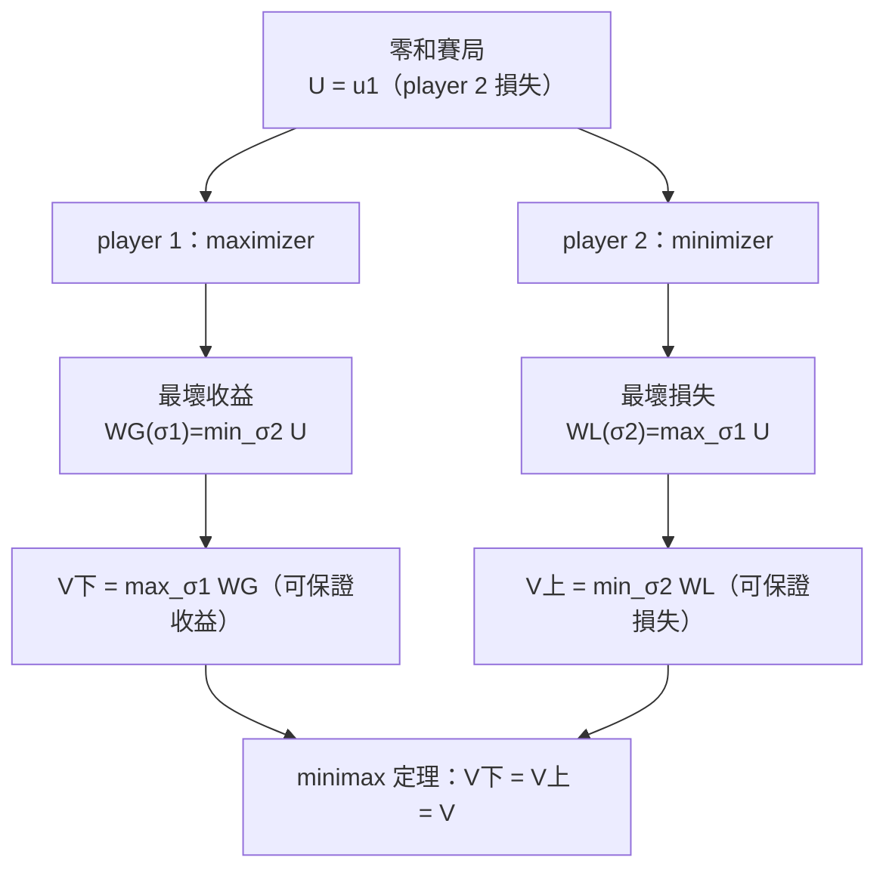
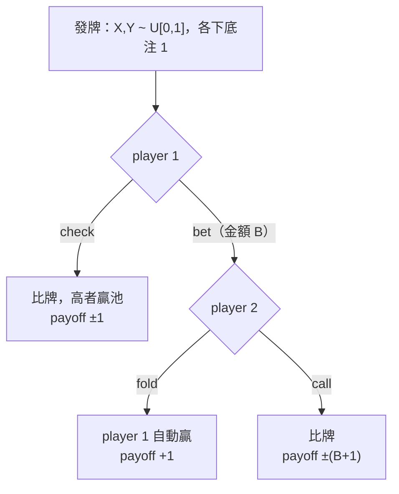

# 第 07 章：零和賽局

## 導讀

本章處理利益「完全對立」的策略互動：一方之所得，恰為另一方之所失。這類**零和賽局（zero-sum game）**——或更精確地說「strictly competitive game（嚴格競爭賽局）」——是賽局理論最早被研究的對象，代表例子是西洋棋、跳棋與撲克。

讀完本章，你會理解：

- 零和的精確意義（是效用之和為零，不是金錢之和為零）；
- 如何用「最壞情況推理」定義**安全策略（security strategy）**，以及玩家能保證的收益 $\underline{V}$ 與能保證的損失 $\overline{V}$；
- von Neumann 的**極大極小定理（minimax theorem）**如何證明 $\underline{V}=\overline{V}$，並賦予賽局一個客觀的**價值（value of the game）**；
- 為何在零和賽局中，安全策略與 [Nash 均衡](05-nash-equilibrium.md) 完全等價；
- 這套理論如何用簡化撲克解釋「bluff（詐唬）」竟是理性行為。

本章是靜態解概念鏈上的一個特例：Nash 均衡在零和情境退化為 maximin/minimax，與安全策略重合。它承接 [第 06 章 不完全競爭](06-imperfect-competition.md) 的靜態應用，並為後續動態賽局中的「先後手」直覺埋下伏筆。

> 講者特別提醒：本講數學不算全課最難，卻是**最容易搞混**的一講，因為「誰在 max、誰在 min」反覆切換。閱讀時請時時確認你站在哪個玩家的立場。

## 核心內容

### 什麼是零和賽局

零和賽局刻畫「完全利益衝突（complete conflict of interest）」：一名玩家的效用之得，就是另一名玩家的效用之失。務必注意——這裡談的是**效用（utility）**，不是金錢。

- **parlor games（桌上遊戲）**：西洋棋、跳棋。若玩家只在乎輸贏，勝者得 $+1$、敗者得 $-1$、和局雙方得 $0$，雙方 payoff 恆和為零。
- **金錢交易**：討價還價「我給你多少／你給我多少」也可以是零和，但需要**兩個條件**：
  1. 沒有錢流進或流出賽局（若旁人突然給雙方錢，就不再零和）；
  2. 玩家**風險中立（risk-neutral）**。否則即使錢守恆，效用未必守恆——若雙方都風險趨避，一場「擲硬幣決定誰大贏大輸」的賭局，對雙方的期望效用可能都是壞事。

> **風險中立的形式定義**（課堂問答）：vNM 效用函數對金錢是線性函數。例如你對「確定得 \$10」與「½ 機率得 0、½ 機率得 20 的彩券」無差異。

講者也提醒歷史脈絡：零和賽局是賽局理論最早研究的對象（數學家受棋類啟發）；但經濟情境**多半不是零和**，政治上常說「this is not a zero-sum game」，存在讓雙方都變好的安排。賽局理論因此走向 [Nash 均衡](05-nash-equilibrium.md) 以涵蓋非零和賽局。零和理論的價值在於：數學優雅，且對「接近完全競爭」的情境是有用的 benchmark。

### 形式化與單一收益函數的慣例

本章聚焦 **finite 兩人 strategic form 賽局**。「finite」是技術假設（多數結果可放寬）；「兩人」則是本質——超過兩人的對立賽局行為截然不同。棋類雖是延展形（extensive form）賽局，但都假設已轉成 strategic form。

兩人賽局有兩個收益函數 $u_1(s_1,s_2)$ 與 $u_2(s_1,s_2)$。零和條件是：

$$u_1(s)+u_2(s)=0 \quad \text{對每一個策略組合 } s=(s_1,s_2).$$

這看似一條方程式，其實是「每一組策略各一條」的多條方程式。由此立得 $u_2(s)=-u_1(s)$：一旦知道一方效用，另一方效用必為其負值。因此零和賽局其實只有**一個**函數。

**慣例**：令 $U=u_1$（player 1 的收益），隱含 $u_2=-U$。於是：

- $U$ 同時代表 **player 1 的收益（gain）**與 **player 2 的損失（loss）**；
- **player 1 是 maximizer**（最大化 $U$），**player 2 是 minimizer**（最小化 $U$）。

在零和賽局矩陣中，每格只寫**一個**數字，而非兩個，但賽局仍被完整指定。

### 最壞情況推理與安全策略

面對利益對立的對手，一種保守、穩健的思路是：「不論對手怎麼玩，我能保證多好？」

- **player 1 的最壞收益（worst gain）**：
  $$WG(\sigma_1)=\min_{\sigma_2\in\Sigma_2}U(\sigma_1,\sigma_2)=\min_{s_2\in S_2}U(\sigma_1,s_2).$$
  固定我方 $\sigma_1$，對手挑讓我收益最小的策略。內層取 min 時，**只檢查純策略即可**——因為固定一方策略後，$U$ 對另一方是線性函數。
- **player 2 的最壞損失（worst loss）**：
  $$WL(\sigma_2)=\max_{\sigma_1\in\Sigma_1}U(\sigma_1,\sigma_2)=\max_{s_1\in S_1}U(s_1,\sigma_2).$$
  player 2 的損失由對手決定，最壞情況是對手把損失推到最大。

> **課堂問答（重要一般結果）**：「固定一方策略、對另一方取極值必可由純策略達成」是一般結論。$n$ 人賽局中固定其他 $n-1$ 人策略後，最後一人的 payoff 對其策略是線性的，最大／最小必有純策略達成。但**外層**（挑選安全策略）不成立，因為 $WG$ 是「多個線性函數取 min」，是**凹函數（concave）**，不是線性——這正是外層必須允許混合策略的原因。

據此定義**安全策略**：

- $\sigma_1^\*$ 為 player 1 安全策略 $\iff WG(\sigma_1^\*)\ge WG(\sigma_1)$ 對所有 $\sigma_1$；
- $\sigma_2^\*$ 為 player 2 安全策略 $\iff WL(\sigma_2^\*)\le WL(\sigma_2)$ 對所有 $\sigma_2$。

以及雙方各自能保證的量：

$$\underline{V}=\max_{\sigma_1}WG(\sigma_1),\qquad \overline{V}=\min_{\sigma_2}WL(\sigma_2).$$

$\underline{V}$ 是 player 1 玩安全策略時能保證的最好最壞收益；$\overline{V}$ 是 player 2 能保證的最好（最小）最壞損失。

## 形式化與定理

### 弱不等式 $\underline{V}\le\overline{V}$

先不靠 minimax 定理，就能證明 player 1 可保證的收益不超過 player 2 可保證的損失。取任意安全策略對 $(\sigma_1^\*,\sigma_2^\*)$，考慮實際結果 $U(\sigma_1^\*,\sigma_2^\*)$：

$$\underline{V}=WG(\sigma_1^\*)\;\le\; U(\sigma_1^\*,\sigma_2^\*)\;\le\; WL(\sigma_2^\*)=\overline{V}.$$

- 右不等式：這是 player 2 在 $\sigma_2^\*$ 下的損失，依定義不超過其最壞損失 $WL(\sigma_2^\*)$。
- 左不等式：這是 player 1 在 $\sigma_1^\*$ 下的收益，依定義不低於其最壞收益 $WG(\sigma_1^\*)$。

中間兩個不等式**只用到** worst gain/loss 的定義；外側等式才用到「是安全策略」。直覺上，若雙方都玩安全策略，結果必落在 $[\underline{V},\overline{V}]$ 的方框內。

**先後手詮釋**：$\underline{V}$ 相當於「player 1 先動且策略被觀察」——對手看穿後把我收益壓到最低，我事先預期並最佳化；$\overline{V}$ 相當於「player 2 先動且被觀察」。因此 $\underline{V}\le\overline{V}$ 表達一個直覺：**在利益對立下，先動且被看穿至少是弱劣勢**（對手看到你的策略只會利用你）。

### 極大極小定理（minimax theorem）

> **定理（von Neumann, 1928）**：在任何 finite 兩人零和賽局中，
> $$\underline{V}=\max_{\sigma_1}\min_{\sigma_2}U(\sigma_1,\sigma_2)=\min_{\sigma_2}\max_{\sigma_1}U(\sigma_1,\sigma_2)=\overline{V}.$$

這個共同值稱為賽局的**價值（value of the game）**，記為 $V$。

講者強調時序：von Neumann 1928 早於 Nash 1950。零和賽局理論在 Nash 之前已經成熟；Nash 常被稱為賽局理論奠基者，但他真正的貢獻是把理論從零和推廣到**非零和**。定理的意義是——原本「先動弱劣勢」的方框（$\underline{V}<\overline{V}$）其實會**塌縮成一點**：若雙方最佳化，先動一點也不吃虧，和後動一樣好。

**賽局價值的意義**：$V$ 是對雙方「相對優勢／公平性」的**客觀量測**。在 von Neumann 之前，人們認為棋類誰佔優「要看誰比較強」，沒有客觀數字。定理告訴我們：若雙方都最佳化，存在一個客觀數字說明誰該贏、贏多少。

> **西洋棋有 value**：假設只在乎輸贏，chess 是 finite 兩人零和賽局，故有 value，且 $V\in\{+1,-1,0\}$：$+1$ 表先手（白）必勝、$-1$ 表後手（黑）必勝、$0$ 表雙方可保和。value **存在但未知**——不是理論限制，而是策略數比宇宙原子還多，最佳化問題算不動。

### 安全策略與 Nash 均衡的等價

Nash 均衡刻畫**穩定性**（無人可單方偏離而嚴格變好）；安全策略刻畫**安全性**（不論對手怎麼玩，我都做得不錯）。兩者概念不同，但在零和賽局中一致。

> **定理**：在任何 finite 兩人零和賽局中，對任意混合策略組合 $(\sigma_1,\sigma_2)$：
> $$(\sigma_1,\sigma_2)\text{ 是 Nash 均衡} \iff \sigma_1\text{ 是 player 1 安全策略且 }\sigma_2\text{ 是 player 2 安全策略}.$$

注意：安全策略只在兩人零和賽局有意義，Nash 均衡則普遍適用；此等價僅在 finite 兩人零和賽局成立。

**（⇒ 方向：安全 ⇒ Nash）** 設 $\sigma_1^\*,\sigma_2^\*$ 各為安全策略。由 minimax 定理 $WG(\sigma_1^\*)=WL(\sigma_2^\*)=V$。

- player 2 偏離到 $\sigma_2'$：$U(\sigma_1^\*,\sigma_2')\ge WG(\sigma_1^\*)=V$。損失變大（或不變），不划算。
- player 1 偏離到 $\sigma_1'$：$U(\sigma_1',\sigma_2^\*)\le WL(\sigma_2^\*)=V$。收益變小（或不變），不划算。

無人可獲利偏離，故為 Nash 均衡。關鍵在於：一般只有弱不等式，是 minimax 定理把中間串成等號。

**（⇐ 方向：Nash ⇒ 安全，反證法）** 設 $\sigma_1$ **非** player 1 安全策略，欲證 $(\sigma_1,\sigma_2)$ 非 Nash。由 $U(\sigma_1,\sigma_2)\ge WG(\sigma_1)$，分兩情況：

- **情況一：$U(\sigma_1,\sigma_2)=WG(\sigma_1)$。** 因 $\sigma_1$ 非安全策略，$WG(\sigma_1)<WG(\sigma_1^\*)\le U(\sigma_1^\*,\sigma_2)$（$\sigma_1^\*$ 為安全策略）。故 player 1 偏離到 $\sigma_1^\*$ **嚴格獲利**。
- **情況二：$U(\sigma_1,\sigma_2)>WG(\sigma_1)=\min_{\sigma_2'}U(\sigma_1,\sigma_2')$。** 存在 $\sigma_2'$ 達到此 min，使 $U(\sigma_1,\sigma_2')<U(\sigma_1,\sigma_2)$——player 2 偏離到 $\sigma_2'$ 損失**嚴格變小**，獲利。

兩情況皆有人可獲利偏離，故非 Nash。（注意：此 $\sigma_2'$ 是對「怪異的」$\sigma_1$ 的最佳反應，未必是 player 2 的安全策略，偏離後未必立刻是均衡。）

> **計算意涵**：要找零和賽局的 Nash 均衡，可**分別**對兩玩家各解一個最佳化（各找安全策略）再組合。一般 Nash 均衡的困難在於「什麼對我最好取決於對手」，這裡卻能把相依拆成兩個獨立最佳化。對電腦這是很好的解法；講者坦言對人類在考試上不見得更快。

## 賽局實例與應用

### 剪刀石頭布（rock-paper-scissors）

經典零和賽局，每格只填 player 1 收益（依講者口語重建）：

| P1 ＼ P2 | Rock | Paper | Scissors |
|---|---|---|---|
| **Rock** | 0 | −1 | 1 |
| **Paper** | 1 | 0 | −1 |
| **Scissors** | −1 | 1 | 0 |

對角線平手為 0；scissors 勝 paper、paper 勝 rock、rock 勝 scissors 各記 $+1$，其餘 $-1$。若只用純策略，任一步的最壞收益都是 $-1$（對手恰好出剋制我的一手）。但混合策略 $(\tfrac13,\tfrac13,\tfrac13)$——各以 $\tfrac13$ 出——不論對手怎麼玩，都是「贏 $\tfrac13$、輸 $\tfrac13$、和 $\tfrac13$」，期望收益恆為 $0$。數學上就是把三列各取 $\tfrac13$ 相加，得到一整列的 0。這是安全策略，$V=0$。

### 兩個「相同 value」的範例

**範例 A（結構優勢）** — 依口語重建（講者給「1 1 −4 −8」）：

| P1 ＼ P2 | Left | Right |
|---|---|---|
| **Top** | 1 | 1 |
| **Bottom** | −4 | −8 |

乍看有 $-4,-8$ 這種大負值，好像對 player 2 有利。但 player 1 玩 **Top** 就保證得 1（$\min(1,1)=1$），玩別的都保證不到 1。而 player 2 的 $WL(L)=\max(1,-4)=1$、$WL(R)=\max(1,-8)=1$，故**任何策略都是 player 2 的安全策略**。$V=1$。教訓：不能只看數字大小，**結構**決定優勢；這仍是零和（$-4$ 代表 player 2 贏 4）。

**範例 B（全正數）** — 依口語重建（講者把數字全改成正的，口語提到損失 23、8、1）：

| P1 ＼ P2 | Left | Right |
|---|---|---|
| **Top** | 1 | 23 |
| **Bottom** | 1 | 8 |

player 2 玩 R 會損失 23 或 8，玩 L 則不論對手都只損失 1，故 **L** 是安全策略，$V=1$。

把範例 A、B 並排：範例 B 幾乎每一格數字都比範例 A 大（對 player 1 更好看），但**兩局 value 相同**（皆為 1）。這正是 minimax 定理的深意——value 是客觀相對優勢，不能靠逐格比大小判斷。附註：value 相同的前提是雙方都理性最佳化；若對手會犯錯，你或許偏好數字更大的那局。

### 配對錢幣型 2×2

講者稱「a game we studied before」，value 為 0（依口語重建，典型 matching pennies 結構）：

| P1 ＼ P2 | Left | Right |
|---|---|---|
| **Top** | 1 | −1 |
| **Bottom** | −1 | 1 |

player 1 玩 T 最壞得 $-1$（對手玩 R）、玩 B 最壞得 $-1$（對手玩 L）；但 $50/50$ 混合保證恰得 0。雙方**唯一**安全策略皆為 $(\tfrac12,\tfrac12)$，$V=0$。

> **課堂問答**：有人問「若沒有嚴格優勢策略，value 是否必為 0？」——**否**。上述範例只有弱優勢，一般可有更複雜的賽局；甚至一方有嚴格優勢策略卻仍大輸。

### von Neumann poker（詐唬的數學解釋）

完整撲克太難，von Neumann 提出一個簡化版展示理論威力：

- player 1 得手牌 $X\sim U[0,1]$，player 2 得手牌 $Y\sim U[0,1]$，數字越大越好；
- 雙方各下底注（ante）\$1；
- player 1 選 **bet**（固定金額 $B$）或 **check**（不下注）；
- 若 player 1 bet，player 2 可 **call**（跟注）或 **fold**（蓋牌）；
- 假設風險中立。

**結論**：$V>0$，**player 1 佔優勢**。原因很微妙——player 1 check 後 player 2 **無權**下注。標準撲克裡後手可在對手 check 後下注，通常後手有利；此簡化版反而先手有利。

**punchline**：player 1 的安全策略中**有時會 bluff（詐唬）**——手牌很差時仍下注。過去人們以為詐唬是超越數學的心理博弈；minimax 定理卻直接解釋了詐唬為何理性。至於精確的 value 與安全策略，講者留作習題（`待補`：習題解答）。

## 常見誤解

- **零和是「金錢」之和為零？** 不是，是**效用**之和為零。金錢交易要再加「錢不進出」＋「風險中立」才是零和。
- **損失方向搞錯**：player 2 玩 rock、對手玩 paper，其「最壞損失」是 $+1$（損失 1），**不是** $-1$。矩陣裡的數字對 player 2 是損失，越大越糟。
- **大負值＝對 player 2 有利？** 否。結構決定優勢，範例 A 中滿是大負值卻 $V=1$（對 player 1 有利）。
- **內層 min/max 用純策略即可 ⇒ 外層也用純策略即可？** 否。固定一方時 $U$ 線性、純策略達極值；但挑安全策略時 $WG$ 是凹函數，混合策略可能嚴格更好（剪刀石頭布就是明證）。
- **$\underline{V}\le\overline{V}$ 是嚴格不等式？** 否，是弱不等式；minimax 定理保證等號。
- **value 相同就完全等價？** 只在雙方都理性最佳化的假設下成立；面對會犯錯的對手，數字更大的那局可能更划算。

## 小結

1. 零和賽局刻畫「完全利益對立」：$u_1(s)+u_2(s)=0$，故 $u_2=-u_1$，只需單一函數 $U=u_1$。
2. 談的是**效用**零和，不是金錢；金錢交易須加「錢不進出」＋「風險中立」兩條件。
3. 慣例：player 1 是 maximizer、player 2 是 minimizer；矩陣每格只填一個數（player 1 收益＝player 2 損失）。
4. **安全策略**由最壞情況推理定義：player 1 最大化最壞收益 $WG$，player 2 最小化最壞損失 $WL$。
5. 內層固定一方取極值只需純策略；外層挑安全策略須允許混合策略（$WG$ 為凹函數）。
6. 一般有弱不等式 $\underline{V}\le\overline{V}$（先動被看穿是弱劣勢）。
7. **minimax 定理（von Neumann, 1928）**：finite 兩人零和賽局中 $\underline{V}=\overline{V}=V$，$V$ 是賽局的客觀價值；此結果早於 Nash 1950。
8. 西洋棋有 value 且 $V\in\{+1,-1,0\}$，但因太複雜而未知。
9. finite 兩人零和賽局中，**安全策略與 Nash 均衡等價**，可把求 Nash 拆成兩個獨立最佳化。
10. von Neumann poker 顯示 $V>0$（先手有利）且理性玩家**有時會詐唬**——minimax 定理解釋了 bluffing。

## 跨章連結

- **前置**：[第 05 章 Nash 均衡](05-nash-equilibrium.md)（本章為其零和特例，Nash 在此退化為 maximin/minimax）、[第 06 章 不完全競爭](06-imperfect-competition.md)（同屬靜態賽局應用）。
- **後續**：動態賽局（逆向歸納、子賽局完美）——本章「先動被觀察是弱劣勢」的直覺會在此延伸與對照。
