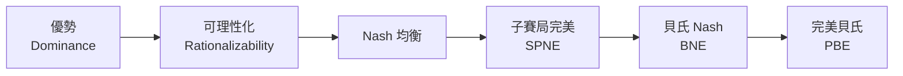

# MIT 14.12《Economic Applications of Game Theory 賽局理論的經濟應用》

本書根據 MIT 14.12 課程逐字稿整理，是一本以繁體中文撰寫的賽局理論入門書，特別著重經濟應用。課程共 25 講，從個體決策出發，逐步建立靜態與動態賽局的解概念，再進入重複賽局、不完全訊息賽局、拍賣理論、訊號傳遞與共同知識。

> **講者與學期**：本課程主要來源為 MIT OpenCourseWare 14.12 Economic Applications of Game Theory（Fall 2012），由 Muhamet Yildiz 教授講授。

## 讀者對象

本書適合對經濟學、策略互動或決策科學有興趣，想系統學習賽局理論並看到經濟應用的讀者。假設讀者具備基本微積分與機率常識，但不預設經濟學背景。

## 課程主線

賽局理論的核心是一條**逐步精煉的解概念鏈**：從最弱的「不玩劣勢策略」，一路收斂到能處理動態與不完全訊息的均衡概念。本書希望讀者看見這條鏈，而不是 25 個孤立主題。

## 篇章架構

| 篇章 | 主題 | 對應章節 |
|---|---|---|
| 第一篇 | 導論與個體決策 | 第 1 講 |
| 第二篇 | 靜態賽局與解概念：表示法、優勢、可理性化、Nash 均衡 | 第 2–5 講 |
| 第三篇 | 靜態應用：不完全競爭、零和賽局 | 第 6–7 講 |
| 第四篇 | 動態賽局：逆向歸納、談判、子賽局完美、一次偏離與議價 | 第 8–11 講 |
| 第五篇 | 重複賽局：有限、無限、Folk 定理、隱性卡特爾 | 第 12–15 講 |
| 第六篇 | 不完全訊息靜態：貝氏賽局與應用 | 第 16–17 講 |
| 第七篇 | 拍賣：拍賣形式、收益等價、廣告拍賣 | 第 18–20 講 |
| 第八篇 | 不完全訊息動態：完美貝氏、訊號傳遞、議價、cheap talk | 第 21–24 講 |
| 第九篇 | 共同知識 | 第 25 講 |

## 使用說明

- 每章末尾有**小結**與**跨章連結**，可快速查閱概念之間的關係。
- [術語表](glossary.md) 統一全書的中英文對照翻譯與數學符號。
- [參考資料](references.md) 記錄本書使用的外部資源（待外部補充階段補入）。

## 建構狀態

本書正在持續撰寫中，部分章節尚為骨架或待補狀態。各章建構進度詳見 `plan/mit14-12/mit14-12-game-theory-transcript-tracker.md`。

> **注意**：本書目前只有 transcripts，尚無官方投影片、syllabus、reading list 或習題。逐字稿提到的板書賽局矩陣與賽局樹依口語重建並標明；無法重建者標 `待補`。若您有相關官方資料，歡迎提供。
