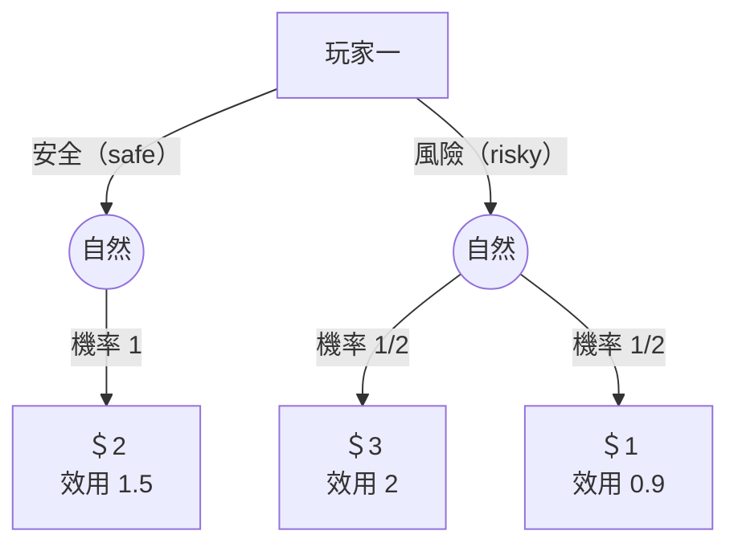
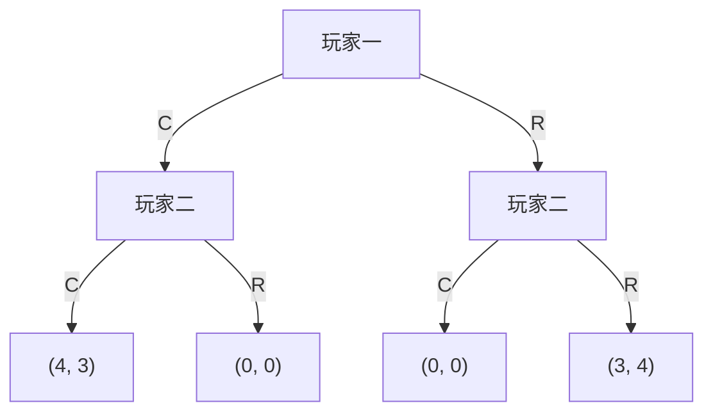

# Lecture 2 閱讀筆記：賽局的表示法（Representation of Games）

## 基本資料

- 章節編號：02
- 章節標題：賽局的表示法（Representation of Games）
- 對應逐字稿（`data/mit14-12/clean/`）：`02 - Lecture 2： Representation of Games.txt`（檔名含全形冒號「：」，路徑照抄）
- 檔案大小（bytes）：63228
- 完整閱讀日期：2026-07-09
- 閱讀者：章節 worker agent
- 狀態：已成章

## 逐字稿完整閱讀紀錄

閱讀範圍確認（逐字稿為單行含標點純文字）：

- 檔案大小（bytes）：63228
- 是否從頭到尾完整閱讀：是，從第一句到最後一句逐段讀完。
- 第一句：「Okay, so I wanted to start by playing the beauty contest again.」
- 最後一句：「Okay, so let me stop there, and I'll see everyone on Thursday.」
- 跳過段落：無。
- 是否回查 `raw/*.vtt`：否。逐字稿可讀，僅少數口語標籤（資訊集合命名）有明顯轉寫雜訊，於下方標明「依口語重建」，不影響概念完整性。

## 本講主問題

這一講回答「如何把多人策略互動嚴謹地寫下來」。講者先重玩選美賽局（beauty contest）承接上一講的個體決策，再引入兩種賽局表示法：展開式賽局（extensive form game，鉅細靡遺記錄樹狀結構）與策略式賽局（strategic form game，抽掉細節、只留策略分析所需元素）。連接兩者的關鍵是「策略（strategy）」的定義——講者稱這是全課程最重要的定義。整講圍繞展開式賽局四要素 PAPI（players、actions、payoffs、information）、資訊集合（information set）如何模型化「觀察到什麼」，以及如何把展開式賽局化約成策略式賽局。

## 核心概念

| 概念 | 說明 | 書稿處理方式 |
|---|---|---|
| 賽局＝多人決策問題 | 上一講是單人決策問題；多人且彼此最適決策相依即為賽局 | 導讀點出，銜接第 01 章 |
| 展開式賽局（extensive form game） | 以有根樹（rooted tree）記錄賽局全部細節，指定 PAPI 四要素 | 核心內容＋形式化 |
| PAPI 四要素 | Players（參與者）、Actions（行動）、Payoffs（報酬／效用）、Information（資訊） | 以列表與樹圖呈現 |
| 有根樹（rooted tree） | 任一節點回到根有唯一路徑；無迴圈；根＝賽局起點、隱含時間 | 形式化說明 |
| 歷史（history）與節點集合 H | 每個節點唯一對應一段行動歷史；H 為所有節點，Z⊆H 為終端節點，H\Z 為決策節點 | 形式化定義 |
| 自然（nature） | 非策略玩家；在邊上給機率而非行動；無報酬、無資訊集合、無策略；空心圓表示 | 專節說明 |
| 資訊集合（information set） | 玩家決策節點的分割（partition）；玩家只知在哪個資訊集合，不知在集合內哪個節點 | 核心內容＋樹圖（虛線／圈） |
| 資訊集合兩條件 | 同一資訊集合各節點須有相同可行行動；根必為單點資訊集合 | 形式化＋常見誤解 |
| 策略（strategy）＝完整條件計畫 | 對每個資訊集合指定一個行動的完整、條件式計畫；全課程最重要定義 | 專節強調 |
| 策略式賽局（strategic form game） | 指定 players、策略集合 S₁…Sₙ、報酬 uᵢ:S→ℝ | 形式化＋表格 |
| 展開式→策略式的化約 | 策略輪廓 s 在展開式中誘發終端節點上的樂透 Z(s)，再算期望效用得策略式報酬 | 例子逐步示範 |

## 重要細節

### 開場：選美賽局重玩（MobLab）

- 規則：每人猜 1 到 100 的整數，電腦算全班平均，最接近平均 2/3 者獲勝。
- 講者說明上週把「實際玩的版本」和他另一門課玩的「較複雜版本」講混了，這次要「更正紀錄」並看結果是否改變。
- 本次結果：平均選擇 18，獲勝選擇 12。上週獲勝約 25（講者用「maybe 25」語氣，非精確）。
- 講者觀察：選擇在往下移，但沒移動到他預期那麼多；沒人接近 0；仍有少數人猜 100（講者認為不是好主意）。
- 若「超級理性」，有論證所有人都該猜 0；「正式論證會在課程後面看到」（本講未給）。若不確定別人是否理性，往上一些是合理表現。

### 上一講回顧（個體決策）

- 有一組後果／結果集合 Z（consequences／outcomes，兩詞互換使用）。
- von Neumann–Morgenstern（vNM）效用 u：對每個後果指派一個實數。
- 大寫 U＝期望效用（expected utility）：對每個後果上的樂透（lottery）指派其期望效用。
- 樂透：若有 M 個後果，樂透是一個向量 P，含 M 個和為 1 的機率；P₁…P_M 分別是第 1…第 M 個後果實現的機率。
- 記號澄清：大寫向量 P（可加帽 P̂）與其分量的小寫 p（機率）不同；講者自承上週把 P 同時當機率與向量使用。

### 今日三主題

1. 展開式賽局（詳細表示）。
2. 策略式賽局（展開式的摘要，只留策略分析要素）。
3. 策略——由展開式跳到策略式的關鍵；「全課程最重要的定義」。講者強調考試失分多半源於沒想清楚策略的正確定義。

### 例子一：投資賽局（單一策略玩家＋自然）

- 玩家一（player 1）選擇安全（safe）或風險（risky）投資，用決策樹表示。
- 安全：自然（nature）必定給 \$2（機率 1）。
- 風險：自然選擇報酬 \$3 或 \$1，各半（half–half）。
- 講者指出光有金錢報酬「不是完整的賽局設定」，缺的是偏好（preferences）——不能假設只最大化期望金錢，因為有人風險趨避、有人風險愛好。
- 需寫下各後果的效用：u(\$2)=1.5、u(\$3)=2、u(\$1)=0.9（講者標明「這只是一個例子」）。
- 關鍵區分：後果（以美元計）與效用（以 utils 計）不同；金錢報酬時特別容易混淆。此處效用即 vNM 效用。

投資賽局樹（依口語重建；效用數值為講者舉例值）：

### 例子二：BOS 賽局（兩位策略玩家）

- 歷史上稱 battle of the sexes（性別之戰）；講者刻意避開此稱呼，改叫 BOS，可想成 Boston。
- 版本設定：兩位好友在兩項活動間選擇——去看塞爾提克（Celtics）球賽或紅襪（Red Sox）球賽（此處 game 指球賽，不是賽局意義）。分開去都不開心，都想在一起；但玩家一較想一起去看塞爾提克，玩家二較想一起去看紅襪。
- 講者強調此賽局同時有利益衝突（conflict）與協調（coordination／講者說 coordination 比 cooperation 更貼切）。
- 結構：玩家一先在 C、R 間選；玩家二再在 C、R 間選。
- 報酬慣例：玩家一報酬寫在前、玩家二在後；更多玩家就繼續加逗號與數字。
- 報酬設定：
  - 兩人都去塞爾提克（CC）：(4, 3)
  - 兩人都去紅襪（RR）：(3, 4)
  - 其餘不一致（CR、RC）：(0, 0)（自己一個人去，「連誰上場都不重要」）
- 問答：「你想當哪位玩家？」學生答玩家一，理由「他先選」。講者補充關鍵：不只先選，還在於玩家二觀察得到玩家一的選擇。玩家一想去塞爾提克並讓對方知道，玩家二不想落單就會跟去塞爾提克，因此「先動且被觀察」給玩家一選擇結局的力量。
- 若玩家二看不到玩家一的行動，就是不同的賽局（實質同時行動）。以節點間的虛線（dotted line）表示「玩家二不觀察玩家一的行動」。

BOS 賽局樹（玩家二觀察玩家一；依口語重建）：

### 展開式賽局的一般定義

- 先命名決策樹：形式上叫有根樹（rooted tree）。根（root）是起點；樹可畫直式或橫式。
- 有根樹性質：任一節點回到根有唯一路徑；不允許有兩條路徑到同一節點（會產生迴圈／cycle），因為那樣「歷史」就無法唯一界定。根隱含時間起點，往前推進即在樹上移動。
- 一個展開式賽局＝一棵有根樹，指定四件事，講者用口訣 PAPI 記憶：
  - **P**layers（參與者）
  - **A**ctions（行動）
  - **P**ayoffs（報酬）
  - **I**nformation（資訊）
- 問答（是否要求有限樹）：入門課會在形式定義時假設有限以避免技術問題，之後會看無限的例子，但只考慮「行為良好（well-behaved）」的無限賽局，不正式定義何謂良好。例：選美賽局若可選 0 到 100 的實數（而非整數），就成了無限賽局，也可能是有用的模型。

### PAPI 四要素在圖上的呈現

- **Players（參與者）**：以節點上的標籤指定；每個節點恰有一位玩家。並非每個節點都有玩家標籤——終端節點標的是效用。
  - 決策節點（decision nodes）：玩家在此選行動／移動／決策。
  - 終端節點（terminal nodes）：賽局結束，標的是後果。
  - 節點集合記為 H（H 取自 history／歷史，每個節點唯一給出到該點的行動歷史）。根節點歷史為「無」；某節點歷史為「玩家一選 C」；再下一節點為「玩家一選 C、玩家二選 R」。
  - Z⊆H 為終端節點；H\Z（H 去掉 Z）為決策節點。BOS 賽局共 7 個節點，4 個終端節點（在 Z 中），3 個決策節點。
  - 玩家標為 i＝1…N（可為單人、雙人賽局），有時再加自然（nature）。
- **Actions／moves／decisions（行動）**：標在樹的邊（edges）上；玩家在某節點有幾個選擇就畫幾條邊，各邊標對應行動。講者提醒行動的標籤不是任意的，之後（後續章節）會用到，標籤是根本的。
- **Payoffs／utilities（報酬）**：N 個效用函數 uᵢ：Z→ℝ（i＝1…N），對每位玩家 i 指定其對所有後果的 vNM 效用。
  - 兩種分組：按玩家分組（uᵢ 給玩家 i 對每個後果的效用）；按後果分組（樹上某節點寫成 u₁(節點), u₂(節點)）。同義詞澄清：action＝moves；payoffs＝utilities，且 payoffs 一律指效用而非金錢（未寫 monetary 就一律指效用），因為真正重要的是效用。

### 資訊集合（information set）

- 對每位（策略）玩家 i：把「輪到 i 行動」的決策節點分割（partition）成若干資訊集合。命名 N 位玩家時，也把每個節點指派給某位玩家。
- 分割的規則：把一堆東西分成幾組；沒有東西同屬兩組，也沒有東西不屬任何組；每個東西恰在一組，單獨一個成一組也可以（講者以地上一堆糖果推成幾堆比喻）。
- 詮釋：玩家只能分辨自己在哪個資訊集合，不知道在該集合內的哪個節點。單點（singleton）資訊集合＝可觀察到確切節點。
- BOS 應用：若玩家二的兩個節點在同一資訊集合，玩家二知道玩家一選了某項但不知選哪項；若在不同（各自單點）資訊集合，玩家二觀察得到玩家一的選擇——這是「可觀察性」的形式化模型。
- 畫法：可在多節點外圈一個圈，或（兩節點時）在其間畫虛線，較不凌亂；虛線與圈意義相同。
- 問答重點：
  - 同時行動一律用資訊集合模型化，不會讓一個節點屬於兩位玩家；每個節點永遠恰一位玩家。
  - 若玩家可觀察一切，其分割全為單點（singleton），每個資訊集合只含一個節點。
  - 關於報酬不確定：若不確定自己的效用，應把它拆成不同後果（consequences 永遠精確定住效用）。對別人的報酬不確定同理，拆成別人得不同報酬的兩個後果。此框架因此比初看更一般。

### 資訊集合的兩條件

1. 同一資訊集合內所有節點，玩家 i 須有「相同的可行行動」。否則玩家可由「某行動可不可行」分辨自己在哪個節點。例：玩家二兩節點皆在 C、R 間選可放同一資訊集合；若一節點多出「待在家（H）」，玩家就能分辨節點，故不可同組。對單點資訊集合此條件恆成立（空洞為真／vacuously true），但多節點時才有實質約束。
2. 根（初始節點）必為單點資訊集合。若連賽局從哪開始都不知道，代表有未觀察的前置行動，應顯式模型化——通常讓自然先動決定起點；此時自然有一個開局節點。

### 自然（nature）與其他玩家的差異

- 自然在邊上給的是機率（probabilities）而非行動；因為不具策略性，機率是賽局給定的（像輪盤），機械地依機率抽一條邊。策略玩家不能假設固定機率去某處，那正是要分析的。
- 自然沒有報酬（終端只標策略玩家 1…N 的報酬）。
- 自然沒有資訊集合（或說每個資訊集合都是單點）；為與「根須單點」一致，可說自然有單點資訊集合，但那只是約定，允許自然開局。
- 自然也沒有策略。
- 畫法：策略玩家用實心圓，自然用空心（hollow／empty）圓。

### 策略（strategy）——完整條件計畫

- 直覺：在賽局開始前，你（局中人或旁觀評估者）看遍所有可能輪到你行動的地方，事先規劃每個節點要採取的行動。是完整（complete）計畫，須指定每個可能情境（contingency）的行動。
- 講者強調：學生常在 section／office hour 問「這個情境真的要指定嗎？」答案一律是「要」——當不確定時就指定（when in doubt, specify），且到處都要（everywhere），即使你以為不需要。
- 條件式（contingent）：反映你會在賽局過程中學到資訊。若玩家二的兩節點在不同資訊集合，計畫會像「朋友去塞爾提克我就去塞爾提克，朋友去紅襪我就去紅襪」，而非單純「我去某處」。
- 形式定義：策略在每個資訊集合指定一個行動。可把策略寫成一列格子，一格對應一個資訊集合，每格填該資訊集合上的一個可行行動。資訊集合數由展開式結構決定；寫下展開式後即可列出某玩家所有資訊集合並逐格填入。
- 問答：某資訊集合有多個節點，「可行」是節點性質，如何說「在資訊集合可行」？因為條件一保證同資訊集合各節點可行行動相同，故談「資訊集合上的可行行動」是有意義的。

### 策略式賽局（strategic form game）

- 直覺：每位玩家選一個策略（完整條件計畫），據此可算出賽局會發生什麼；策略式即把賽局化約到策略成分。
- 指定：
  - Players：同展開式。
  - 策略集合 S₁…Sₙ：大寫 Sᵢ 是玩家 i 的策略集合（所有策略放一起），小寫 sᵢ 是集合內某一策略。
  - 策略輪廓（strategy profile）：S＝S₁×…×Sₙ 為所有策略輪廓（tuple）之集；元素 s＝(s₁,…,sₙ)∈S，sₙ 是輪廓 s 中玩家 N 的策略。問答確認：這個乘積就是「每位玩家各選一個策略的所有組合」。
  - 報酬：uᵢ：S→ℝ（i＝1…N）。講者強調定義域是整個 S 而非 Sᵢ——若寫成 Sᵢ→ℝ，代表玩家 i 報酬只依自己策略，那就退化成個體決策問題、不需要賽局理論了。玩家 i 的報酬取決於整個策略輪廓（我做什麼＋別人做什麼）。

### 由展開式化約到策略式

- 玩家：相同，容易。
- 兩個困難步驟：
  1. 定義策略集合：須把所有資訊集合、以及各資訊集合上可選的所有行動都寫對。策略集合會是「像某種向量的集合」。
  2. 計算報酬函數 uᵢ：S→ℝ。展開式只給每位玩家「在某後果／終端節點」的報酬，但現在要算「在某策略輪廓」的報酬——兩者不同。
- 關鍵機制：一個策略輪廓 s 會在展開式中誘發終端節點（後果）上的一個樂透，記為 Z(s)。算出這個後果上的樂透後，因為已對後果定義效用，即可算每位玩家對此樂透的期望效用——這就是指派給該策略輪廓的新報酬。

### 收尾例子：加入自然的 Boston 賽局（新的展開式賽局）

- 設定（講者說有點刻意、只為示範）：先由自然擲硬幣（half–half）決定行動順序。
  - 正面（heads）：玩家一先動，其行動不被玩家二觀察（虛線）。
  - 反面（tails）：玩家二先動，玩家一觀察到後再動。
- 報酬未寫在此樹上（會太亂），但與前面 BOS 相同（CC=(4,3)、RR=(3,4)、不一致=(0,0)）。
- 資訊集合：
  - 玩家二有 2 個資訊集合：正面分支下（看不到玩家一，兩節點同一資訊集合）＋反面分支下先動的單點節點。問答確認：玩家二在正面分支知道自然擲了正面（知道不在反面那節點），但不知玩家一選 C 或 R。
  - 玩家一有 3 個資訊集合，皆為單點：正面分支先動的節點＋反面分支下觀察玩家二選擇後的兩個節點。講者說明未畫出的單點不代表不存在。
- 策略計數：問「每位玩家有幾個資訊集合」是寫策略的第一步。
  - 玩家一：3 個資訊集合、每格 2 選項 → 2³＝8 個策略。
  - 玩家二：2 個資訊集合 → 2²＝4 個策略。
  - 合計 8×4＝32 個策略輪廓；每輪廓要 2 個數字（兩位玩家報酬）→ 共 64 個數字，即使在這麼小的賽局也如此。
  - 講者以西洋棋類比：策略數呈組合／指數爆炸，遠大於宇宙原子數（「原子數的原子數次方」誇飾語）。
- 逐步算報酬的示範（策略標籤在逐字稿為口語、命名有明顯轉寫雜訊，以下為依口語重建）：
  - 取玩家一策略 (C, R, R)（三個資訊集合依序），玩家二策略「RC」（兩個資訊集合）。講者對每位玩家在各資訊集合把選到的邊標出；並強調玩家二在正面那個多節點資訊集合，須在集合內兩節點填同一行動（因為看不出在哪個節點）。
  - 追蹤誘發樂透：自然正面（機率 1/2）→ 玩家一選 C → 玩家二選 C → 得後果「兩人都看塞爾提克（CC）」；自然反面（機率 1/2）→ 玩家二選 R → 玩家一選 R → 得後果「兩人都看紅襪（RR）」。
  - 誘發樂透＝以 1/2 機率到 CC、1/2 機率到 RR。期望報酬＝ 1/2×payoff(CC) ＋ 1/2×payoff(RR)。講者未唸出最終數字；若沿用 BOS 報酬則為 1/2×(4,3)＋1/2×(3,4)=(3.5, 3.5)（依口語重建，講者僅示範算法、未明確報出此數）。這樣填了 64 格中的 2 格。
- 收尾問答：
  - 這是一個「新的」展開式賽局，與前面的 BOS 不同，只為示範概念。
  - 引入自然的意義：真實賽局常含隨機性，用自然捕捉。舉例：我把加油站油價定好後，中東爆發戰爭使油價變動；或我定價後競爭對手被反托拉斯起訴——這些我無法預期、只能形成信念的事件，用自然的行動表示。
  - 問答：若要讓玩家不知道誰先選 → 可把各節點放進同一資訊集合，在此賽局合法（仍滿足「有單點根」與「同資訊集合可行行動相同」兩條件）。
  - 完美回憶（perfect recall）：玩家不忘記先前知道的事。本課未顯式排除不完美回憶，但除了可能的最後一堂課外，所有要研究的賽局都有完美回憶；不然會出現怪現象。講者也提到完美回憶是否為好假設可討論（人未必記得小時候的事），由建模者取捨。

## 解概念與均衡分析

本講不引入具體解概念或均衡（優勢、Nash 等在後續章節）。本講建立的是「表示法」基礎：展開式賽局、策略式賽局、以及連接兩者的策略定義。這是整條解概念鏈（優勢 → 可理性化 → Nash → SPNE → BNE → PBE）之前的共同語言與記號基礎。講者僅預告：選美賽局「所有人都猜 0」的正式論證會在課程後面出現（對應可理性化／迭代刪除優勢的內容，本講未展開）。

## 書稿章節草稿

見同批次輸出的 `docs/mit14-12-game-theory/02-representation-of-games.md`。

## 跨章連結

- 前置章節：第 01 章（個體決策）——後果集合 Z、vNM 效用 u、期望效用 U、樂透向量 P 皆沿用。
- 後續章節：第 03 章（[優勢](../03-dominance.md)）、第 04 章（[可理性化](../04-rationalizability.md)）——選美賽局「猜 0」的正式論證在此線上；第 05 章（[Nash 均衡](../05-nash-equilibrium.md)）用到策略輪廓與策略式報酬；第 08–10 章（逆向歸納、子賽局完美）大量使用展開式賽局、資訊集合與可觀察性。
- 需要主控 agent 注意的術語：extensive form＝展開式賽局；strategic form＝策略式賽局；information set＝資訊集合；strategy＝策略／完整條件計畫；strategy profile＝策略輪廓；nature＝自然；rooted tree＝有根樹；PAPI 口訣。以上宜納入全書術語表統一。
- 需要新增的圖表：投資賽局樹、BOS 賽局樹、加入自然的 Boston 賽局樹（皆已在本章以 Mermaid 重建，標明依口語重建）。

## 相關材料

- Slides / 板書：待補（`data/mit14-12/` 只有逐字稿與字幕；講者多次「畫在板上」的樹與資訊集合圖無圖檔）。
- Syllabus / reading：待補。
- 習題：待補（講者多次提到 problem set 與 section，但無題目檔）。
- 講者姓名與開課學期：逐字稿未自報，待查（留待第 6 階段由 OCW 確認）。

## 外部補充

> 外部搜尋僅在第 6 階段（全部逐字稿初稿完成後）進行。初稿階段本節留白。

| 來源 | URL | 存取日期 | 補充內容摘要 |
|---|---|---|---|
| 待補 | 待補 | 待補 | 待補 |
